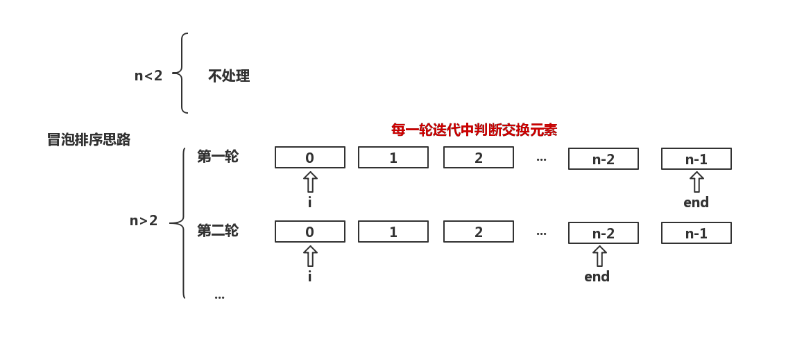

## 冒泡排序
冒泡排序是一种交换排序，基本思想是：两两比较**相邻**记录的关键字，如果是反序则交换，一趟比较下来，有一个元素一定是已经排序好的元素。

## 初级冒泡排序
1. 从第一个元素开始与后续元素逐个进行比较，比较过程中，如果反序就进行交换，这一趟，确定了第一个位置是排好序的
2. 从第二个元素开始与后续元素逐个进行比较...
3. 知道第n-1个元素，它与第n个元素进行比较

评价：
* 其实是不满足冒泡排序的相邻记录的约束，只是一个最简单的交换排序
* 这一趟比较过程中，并没有对其它记录的排序起到帮助

## 冒泡排序
* 用end指示未排序元素末端
* 从第一个元素到未排序的元素末端（end）之间进行两两相邻交换，如果反序就进行交换，一趟下来，未排序元素末端（end）是排好序的，所以end-1
* 依次类推，直到end指向第一个元素前完全排好序

评价：
* 每次的迭代中，都有可能将元素放到更接近最后排序的位置

## 冒泡排序的优化
有时候，当确定了一个位置是有序后，其实序列已经是有序的，但是仍然不知道序列已经有序，所以可以设置一个`flag`用于判断序列是否有序，**如果在比较过程中没有发生交换，就是有序的**。

## 思路图
