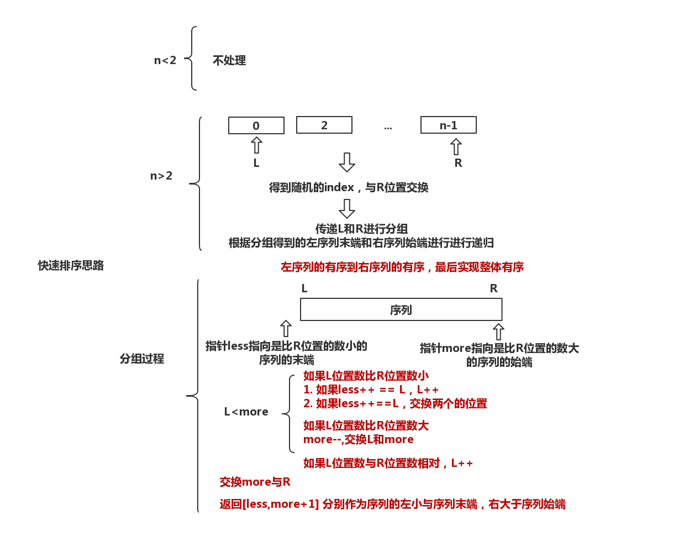

## 快速排序
快速排序是分而自治的算法：
* 在序列中选择一个记录作为基准（pivot），将比它小的值放在左边，比它大的值放到右边。
* 然后分别对pivot左部分和右部分都进行以上操作。

具体过程可以是：
* 首先进行分组：
    * 选择最后一个元素作为pivot
    * 指定一个i，指定序列最后一个更小指的位置，初始为low-1
    * 指定一个j，迭代low -> high-1 的序列
        * 如果过程中j指定的元素比pivot要小，那么就使用i++（得到一个更大值的位置）位置的值与j位置值交换
        * 其他情况（j指定元素大于或者等于pivot不进行操作）
    * 最后使用i++（得到一个更大值的位置）位置的值与最后一个元素交换
    * 返回i+1 作为新的pivot
* 左序列递归
* 右序列递归

## 快速排序思路图

