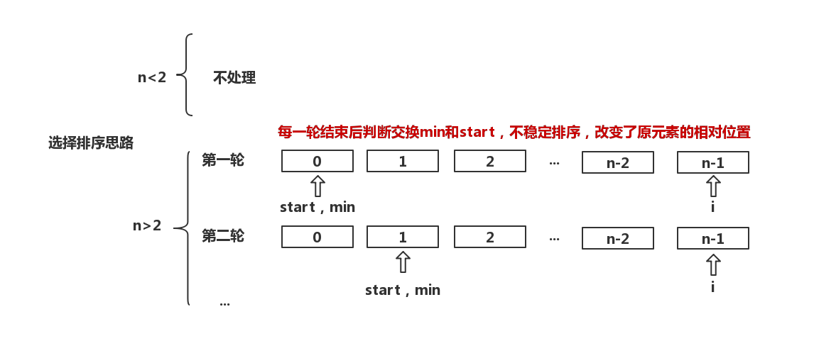

## 选择排序
基本过程：
* 用i指示每次迭代需要确定最后排序正确的位置
* 用min指向i位置
* 对i位置后的n-i个元素分别与min位置元素比较，过程中，如果元素比min位置元素要小，则min位置改为该位置
* 如果min指示的位置不是i，那么就交换两个位置的值
* 依次类推，直到i到达序列末端前，排序完成

评价： 
* 交换移动的次数小了，比较次数与冒泡排序一样

## 选择排序复杂度分析
* 时间复杂度：
    * 最好情况和最坏都需要比较(n-1 + n-2 + ... 1 = n(n+1)/2)
    * 最好交换次数最小为0次，最差交换n-1次
    * 排序时间是交换与比较之和，所以时间复杂度最好最差都是O(n^2)

* 空间复杂度O(1)

虽然与冒泡排序都是O(n^2) 但是性能上还是要优于冒泡排序。

## 选择排序思路图

