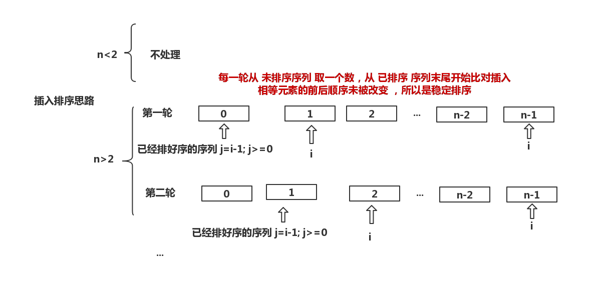

## 直接插入排序
直接插入排序的基本思想是将一个记录插入到已经排好序的序列中。如果将序列第一个元素视为已经排好序的序列，后面的序列式未排好序的序列，具体过程：
* 假设第一个元素已经排好的序列，对后面的元素需要依次插入到有序序列中
* 如何插入到有序序列：对于已经排序好的序列，从末端开始与后面的元素依次比较，反序则交换，不反序则退出
* 直到把最后一个元素插入到有序序列中，排序完成

## 直接插入排序复杂度分析
* 时间复杂度
    * 最好情况是已经排好序，那就只比较了n-1次，不需要交换，所以为O(n)
    * 最坏情况下是逆序，O(n^2)

插入排序比冒泡排序和选择排序要好一些

## 直接插入排序思路图

