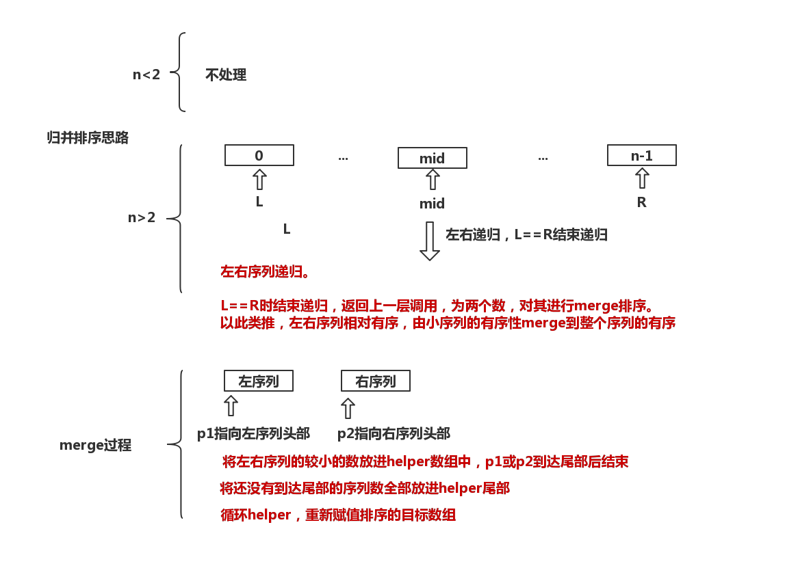

## 归并排序
与快速排序思维一样，归并排序也是分而自治的思想。基本思想是将序列递归地分为两半进行排序，合并起来就是有序的序列，具体而言，归并排序过程:
* 将一个序列划分为两部分
* 对左部分递归这个过程
* 对右部分递归这个过程
* 合并
  * 建立一个辅助数组
  * 用p1指向左部分始端，用p2指向右部分始端
  * 迭代比较p1和p2，将其中的较小值放到辅助数组中，并将相应的p1或者p2向前移动，迭代到p1或者p2其中之一到达末端
  * 分别判断p1或p2是否达到末端，如果没有达到末端，把其余的元素放到辅助数组中
  * 将辅助数组的值替换相应序列中的值，完成两个序列的排序合并
  
## 归并排序思路图

