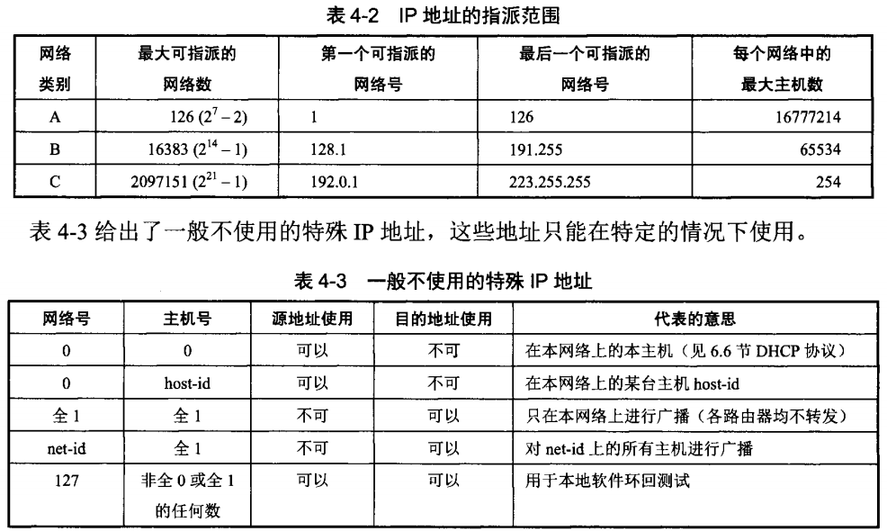

网络层负责在不同网络间提供灵活的，无连接，尽最大努力交付的数据报的服务。网络层不提供服务质量的承诺

## 网际协议IP
与IP协议配套使用的协议:
ARP -> IP -> ICMP & IGMP
  

1. 地址解析协议ARP（RARP基本被淘汰不使用）
2. 互联网控制报文协议ICMP
3. 互联网组管理协议IGMP

## IP地址的分类
IP地址 = 网络号 + 主机号

1. A，B，C类地址网络号分别为1个，2个和3个字节长，其网络号前面具有**类别位**， 分别为0， 10和110；其主机号分为为3个，2个和1个字节长；都是4个字节长
2. D类地址，网络号前4位为1110，用于多播（一对多的通信），而A，B，C类地址用于单播（一对一通信）
3. E类地址，网络号前4位为1111，为保留地址

> IP地址全0表示这个(this), 网络号字段全为0的IP地址是保留地址，表示本网络

> 网络号为127(01111111)表示 本地软件环回测试本主机进程之间的通信

> 全1的主机号表示网络上的所有主机

## IP地址与硬件地址
物理地址是数据链路层和物理层使用的地址，IP地址网络层和以上层次使用的地址，是逻辑地址

## 划分子网和构造子网
IP地址与子网掩码互 & 可以得到网络号

## 互联网路由协议的选择