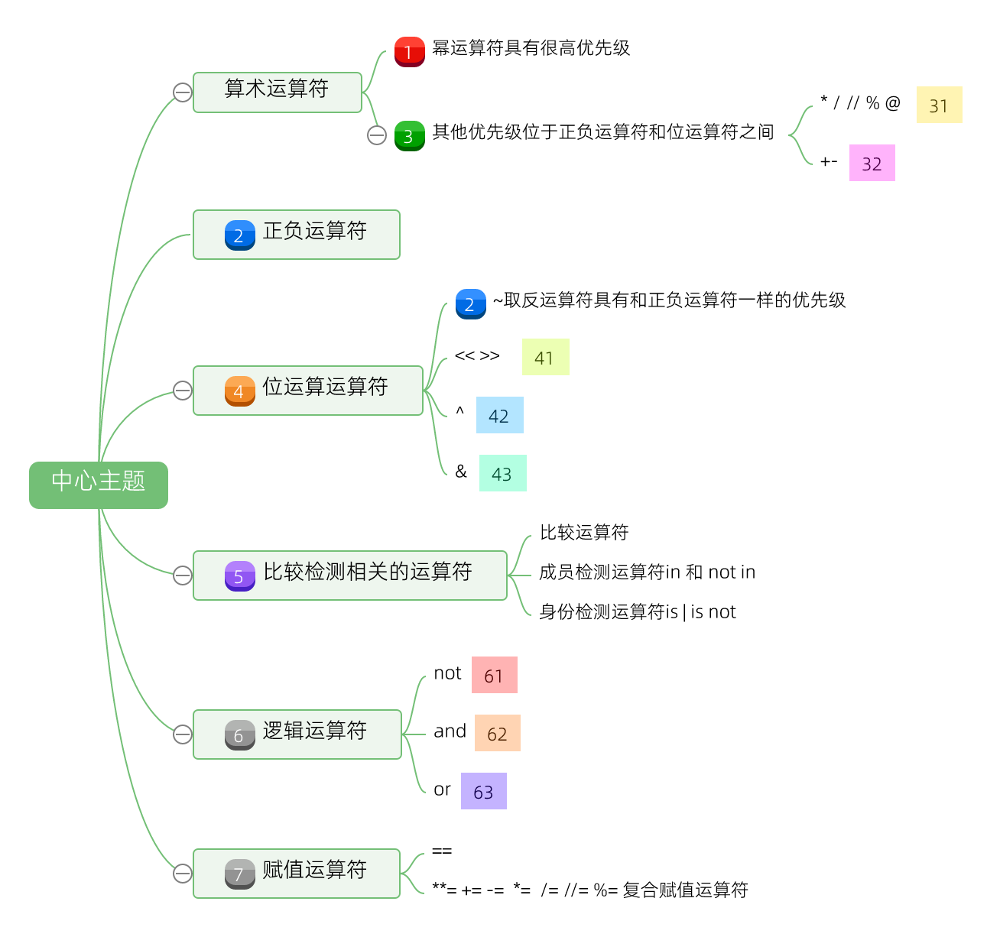
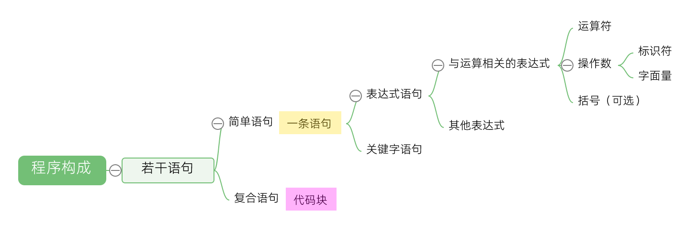
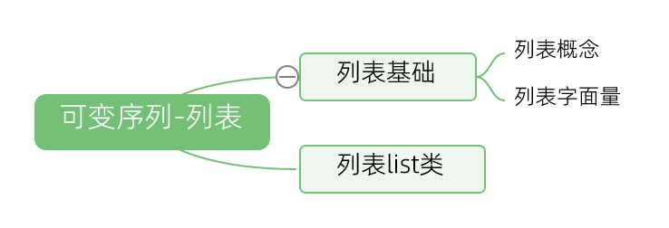
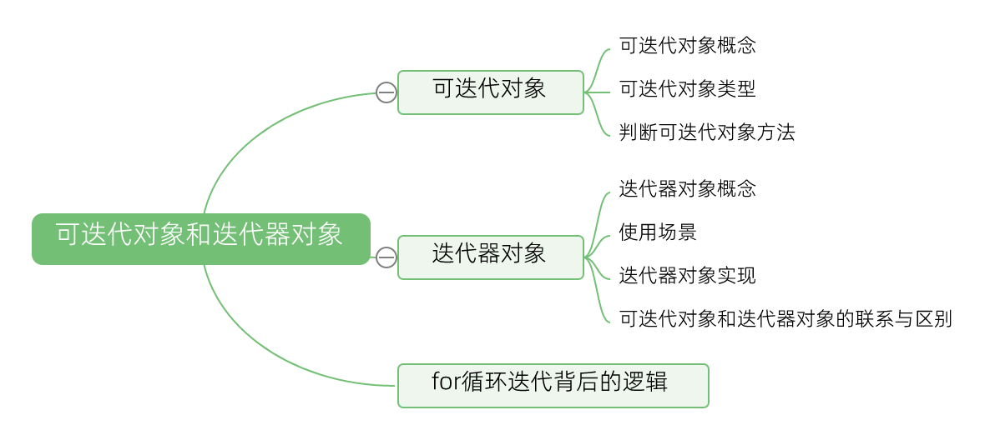

# python_docs
1. [python简介](#python简介)
2. [安装和使用python解释器](#安装和使用python解释器)
3. [基本语法](#基本语法)
    1. [行结构](#行结构)
    2. [标识符和关键字](#标识符和关键字)
    3. [字面值](#字面值)
    4. [变量和常量](#变量和常量)
    5. [运算符](#运算符)
    6. [表达式](#表达式)
        1. [表达式概念](#表达式概念)
        2. [表达式类型-运算返回结果的表达式](#表达式类型-运算返回结果的表达式)
        3. [表达式类型-括号创建数据结构的表达式](#表达式类型-括号创建数据结构的表达式)
        4. [表达式类型-抽取元素的表达式](#表达式类型-抽取元素的表达式)
        5. [表达式类型-切片表达式](#表达式类型-切片表达式)
        6. [表达式类型-调用有关的表达式](#表达式类型-调用有关的表达式)
        7. [表达式类型-属性访问表达式](#表达式类型-属性访问表达式)
        8. [表达式类型-其他产生结果的表达式](#表达式类型-其他产生结果的表达式)
        9. [表达式求值顺序](#表达式求值顺序)
    7. [语句](#语句)
        1. [语句基础](#语句基础)
        2. [简单语句-表达式语句](#简单语句-表达式语句)
        3. [简单语句-关键字语句](#简单语句-关键字语句)
        4. [复合语句-条件语句](#复合语句-条件语句)
        5. [复合语句-循环语句](#复合语句-循环语句)
        6. [复合语句-with语句](#复合语句-with语句)
    8. [程序构成](#程序构成)
4. [内置数据类型](#内置数据类型)
    1. [数字](#数字)
        1. [数字基础](#数字基础)
        2. [整数int类](#整数int类)
            1. [整数构造方法](#整数构造方法)
            2. [整数其他方法](#整数其他方法)
        3. [布尔bool类](#布尔bool类)
            1. [布尔构造方法](#布尔构造方法)
            2. [布尔值其他方法](#布尔值其他方法)
        4. [浮点数float类](#浮点数float类)
            1. [浮点数构造方法](#浮点数构造方法)
            2. [浮点数其他方法](#浮点数其他方法)
        5. [复数conplex类](#复数conplex类)
            1. [复数构造方法](#复数构造方法)
            2. [复数其他方法](#复数其他方法)
    2. [序列](#序列)
        1. [序列基础](#序列基础)
        2. [不可变序列-字符串](#不可变序列-字符串)
            1. [字符串基础](#字符串基础)
            2. [字符串str类](#字符串str类)
                1. [字符串构造方法](#字符串构造方法)
                2. [字符串判断数据类型方法](#字符串判断数据类型方法)
                3. [字符串转换大小写方法](#字符串转换大小写方法)
                4. [字符串查找子字符串方法](#字符串查找子字符串方法)
                5. [字符串删除字符方法](#字符串删除字符方法)
                6. [字符串填充字符方法](#字符串填充字符方法)
                7. [字符串拆分方法](#字符串拆分方法)
                8. [字符串替换方法](#字符串替换方法)
                9. [字符串格式化方法](#字符串格式化方法)
                10. [字符串其他方法](#字符串其他方法)
        3. [不可变序列-元组](#不可变序列-元组)
            1. [元组基础](#元组基础)
            2. [元组tuple类](#元组tuple类)
                1. [元组构造方法](#元组构造方法)
                2. [元组其他方法](#元组其他方法)
        4. [不可变序列-range](#不可变序列-range)
            1. [range基础](#range基础)
            2. [范围range类](#范围range类)
                1. [range构造方法](#range构造方法)
                2. [range其他方法](#range其他方法)
        5. [不可变序列-字节串](#不可变序列-字节串)
            1. [字节串基础](#字节串基础)
            2. [字节串类bytes](#字节串类bytes)
                1. [字节串构造方法](#字节串构造方法)
                2. [字节串其他方法](#字节串其他方法)
        6. [可变序列-列表](#可变序列-列表)
            1. [列表基础](#列表基础)
            2. [列表list类](#列表list类)
                1. [列表构造方法](#列表构造方法)
                2. [列表增加元素方法](#列表增加元素方法)
                3. [列表删除元素方法](#列表删除元素方法)
                4. [列表排序方法](#列表排序方法)
                5. [列表查找元素方法](#列表查找元素方法)
                6. [列表其他方法](#列表其他方法)
        7. [可变序列-字节数组](#可变序列-字节数组)
            1. [字节数组基础](#字节数组基础)
            2. [字节数组bytearray类](#字节数组bytearray类)
                1. [字节数组构造方法](#字节数组构造方法)
                2. [字节数组其他方法](#字节数组其他方法)
    3. [集合](#集合)
        1. [集合基础](#集合基础)
        2. [集合set类](#集合set类)
            1. [集合构造方法](#集合构造方法)
            2. [集合关系判断方法](#集合关系判断方法)
            3. [集合运算方法](#集合运算方法)
            4. [集合运算更新集合方法](#集合运算更新集合方法)
            5. [集合增删元素方法](#集合增删元素方法)
            6. [集合其他方法](#集合其他方法)
        3. [冰冻集合frozenset类](#冰冻集合frozenset类)
            1. [冰冻集合构造方法](#冰冻集合构造方法)
            2. [冰冻集合其他方法](#冰冻集合其他方法)
    4. [字典](#字典)
        1. [字典基础](#字典基础)
        2. [字典dict类](#字典dict类)
            1. [字典构造方法](#字典构造方法)
            2. [字典删除元素方法](#字典删除元素方法)
            3. [字典循环方法](#字典循环方法)
            4. [字典其他方法](#字典其他方法)
5. [解包](#解包)
6. [函数](#函数)
    1. [函数基础](#函数基础)
    2. [函数参数](#函数参数)
7. [类](#类)
    1. [类基础](#类基础)
    2. [继承](#继承)
    3. [多态](#多态)
    4. [封装](#封装)
    5. [类中特殊的属性](#类中特殊的属性)
    6. [类中特殊的方法](#类中特殊的方法)
        1. [__new__()方法](#new方法)
        2. [__str__()方法](#str方法)
        3. [__eq__()方法](#eq方法)
        4. [__len__()方法](#len方法)
        5. [__getitem__()和 __setitem__()方法](#getitem和-setitem方法)
        6. [__getattr__()方法：](#getattr方法)
        7. [__iter__()方法和\_\_next\_\_()方法](#iter方法和__next__方法)
        8. [__call__()方法](#call方法)
8. [模块](#模块)
    1. [模块基础](#模块基础)
    2. [模块包管理](#模块包管理)
9. [迭代器和生成器](#迭代器和生成器)
    1. [可迭代对象和迭代器对象](#可迭代对象和迭代器对象)
    2. [生成器](#生成器)
10. [异常](#异常)
         1. [异常基础](#异常基础)
         2. [异常类型](#异常类型)
11. [io系统](#io系统)
     1. [简单输入输出](#简单输入输出)
         1. [input()函数](#input函数)
         2. [print()函数](#print函数)
     2. [文件输入输出](#文件输入输出)
         1. [文件输入输出基础](#文件输入输出基础)
         2. [open()函数](#open函数)
     3. [io模块](#io模块)
         1. [io模块基础](#io模块基础)
         2. [IoBase类](#iobase类)
         3. [TextIOBase类](#textiobase类)
         4. [RawIOBase类](#rawiobase类)
         5. [BufferedIOBase类](#bufferediobase类)
12. [json模块](#json模块)
13. [re模块](#re模块)
14. [python标准库](#python标准库)
     1. [内置函数](#内置函数)
     2. [数学相关模块](#数学相关模块)
         1. [math模块](#math模块)
         2. [Random](#random)
     3. [日期时间相关模块](#日期时间相关模块)
         1. [time模块](#time模块)
         2. [datetime模块](#datetime模块)
             1. [date类](#date类)
             2. [time类](#time类)
             3. [datetime类](#datetime类)
             4. [timedelta类](#timedelta类)
             5. [timezone类](#timezone类)
     4. [request模块](#request模块)
     5. [response模块](#response模块)
     6. [deque模块](#deque模块)
15. [代码风格指南](#代码风格指南)


## python简介


python简介：
1. python的语言特点：   
    * 解释型语言：不需要编译和链接，解释器可以直接运行
    * 动态语言：
        * 变量的动态性：不需要事先声明变量类型，变量的类型在赋值时确定，也可以通过赋值动态改变
        * 函数参数的动态性：函数参数接受不同的类型和可变数量，函数内部根据不同参数情况执行不同的行为
        * 类和对象的动态性：类和对象可以动态添加，修改属性和方法
        * 模块的动态性：可以在程序运行过程中，根据需求加载需要的模块，而不是在程序一开始就加载所有可能用到的模块。其中python的importlib模块提供了动态导入模块的功能，可以使用`importlib.import_module()`函数来加载指定名称的模块

        ```python
        # 变量动态性
        dog = "这是一只小狗的名字"
        print(dog)
        dog = 5  # 变量类型从字符串变为整数
        print(dog)


        # 函数参数动态性
        def describe_dog(*args):
            if len(args) == 1:
                print(f"This is a dog named {args[0]}.")
            elif len(args) == 2:
                print(f"This dog named {args[0]} is {args[1]} years old.")

        describe_dog("小白")
        describe_dog("小黑", 3)

        # 类和对象的动态性
        class Dog:
            pass

        # 动态添加类属性表示具体品种
        Dog.breed = "金毛寻回犬"

        def make_sound(self):
            print(f"{self.breed}：汪汪！")
        # 动态添加类方法
        Dog.bark = make_sound

        my_dog = Dog()
        my_dog.bark()


        # 模块动态性
        # dog_info_module.py
        def get_dog_breed():
            return "金毛寻回犬"

        # 主文件
        user_input = input("你想了解狗吗？（回答是或否）")

        if user_input == "是":
            import importlib
            module_name = "dog_info_module"
            dog_module = importlib.import_module(module_name)
            breed = dog_module.get_dog_breed()
            print(f"狗的品种是：{breed}")
        else:
            print("不加载狗的模块。")
        ```
    * 面向对象的语言：（具体见类部分）
        * 拥有类和对象，类是对象的模板，对象是类的实例。
        * 每个对象的方法用于定义行为，对象的属性用于保存状态信息
        * 支持继承，多态和和封装
       
        ```python
        # 定义了一个 Dog 类，它具有属性 name 和方法 bark
        class Dog:
            def __init__(self, name):
                self.name = name

            def bark(self):
                print(f"{self.name} is barking.")

        # 创建了一个名为Fido的Dog对象my_dog
        my_dog = Dog("Fido")
        # 调用方法
        my_dog.bark()
        ```
    * 简洁易读：
        * 丰富的模块支持
        * 简洁的语法：
            * 缩进：缩进组成代码块，而不是`{}`
            * 变量和函数参数动态性
            * 表达式：有推导式
            * 语句：多重赋值语句；语句结束不需要分号结束
            * 其他

        ```python
        # 丰富的模块支持
        import math

        # 变量动态性，不需要类型声明
        dog_ages = [4, 9, 16]

        # 函数参数动态性
        # 缩进表示代码块
        def describe_dog(*args, **kwargs):
            if args:
                print("Positional arguments:", args)
            if kwargs:
                print("Keyword arguments:", kwargs)

        # 推导式
        new_dog_ages = [math.sqrt(age) for age in dog_ages]
        print(new_dog_ages)

        # 多重赋值
        # 语句不用;结束
        dog_name, dog_age = "Buddy", 4

        describe_dog(dog_name, dog_age)  
        describe_dog(name="Fido", age=3)
        ```

1. python应用场景：
    * 编程入门：语法简洁易懂，易于上手实践，是一门非常流行的编程语言
    * 自动化脚本：执行重复任务
    * 爬虫：爬取网页信息
    * 科学计算：进行数值计算和模拟，科研领域、工程领域、金融领域等使用
    * 数据处理和分析
        * 自然语言处理：如NLTK、SpaCy等库进行自然语言处理，如文本整理，分析，翻译等
        * 图像处理：用 OpenCV、PIL 等库进行图像处理
        * 数据可视化：用 matplotlib、seaborn、plotly 等库进行数据可视化
    * 人工智能和机器学习：用 TensorFlow、PyTorch、 Scikit-learn等库进行机器学习，人工智能模型训练
    * 其他应用场景（相比于其他语言在处理高并发、大规模数据传输有差距，所以一般不是第一选择）
        * web编程：Django 和 Flask 这样的框架构建web程序
        * 游戏编程：Pygame 等库创建简单的游戏
        * 用户界面编程：Tkinter（ Python 标准库的一部分）和PyQt库等进行用户界面编程


[回到顶部](#python_docs)<div style="text-align:center"><br><br>⭐⭐⭐⭐⭐⭐⭐<br><br><br></div>


## 安装和使用python解释器


1. windows下，安装python解释器
    * windows store下载安装python解释器
    * [python官网下载安装python解释器](https://www.python.org/downloads/windows)
 
2. windows下，配置python环境变量
    * 使用安装包安装，一般自动配置好环境变量，可以命令行下输入相关python命令判断
    * 如果没有配置好环境变量，需要进行手动配置
    * win键打开开始面板，输入“环境变量”，依次进入环境变量界面
    * 在 “系统变量” 部分，找到 “Path” 变量，点击 “编辑”（用户部分的path同样可以）
    * 将安装的路径，加入到环境变量中

3. 命令行下，python解释器常用命令
    * windows平台`win + r`，输入cmd打开命令行
    * 命令行输入 `python --version`查看当前解释器版
    * 命令行输入 `python`进入解析器的交互模式（interactive mode）,`>>>`是提示符，用来输入代码
    * 命令行输入 `python <script_name>.py [arguments]`，运行指定的 Python 脚本，并可以传递参数
    * 命令行输入 `python -c "<command>"` ：直接执行指定的 Python 命令字符串
    * 命令行输入 `python -m <module_name>` ：运行指定的模块，例如 python -m http.server 可以启动一个简单的 HTTP 服务器
    * 上次输出的可以使用`_`表示
    * `ctrl + z 快捷键 | quit() | exit()` 退出解释器环境

4. vscode下，配置python运行环境
    * 安装扩展：搜索并安装 “Python” 扩展
    * 配置解释器：Ctrl + Shift + P 打开命令面板，输入 “Python: Select Interpreter” ，选择合适的python解释器
    * 运行：源文件中，右击选择run python运行

5. python解释器解释源代码过程（扩展内容）
    * 词法分析（Lexical analysis）：将源代码转换成词法单元（token），如关键字、标识符、运算符、常量等
    * 语法分析（Syntax Analysis）：将token转换为抽象语法树（Abstract Syntax Tree，AST），同时检验语法是否错误
    * 编译（Compilation）：将抽象语法树转换为字节码，因为字节码比原始代码更快
    * 解释执行：Python 解释器逐使用一个称为 “虚拟机”（Virtual Machine）的机制来执行字节码

[回到顶部](#python_docs)<div style="text-align:center"><br><br>⭐⭐⭐⭐⭐⭐⭐<br><br><br></div>


## 基本语法


[回到顶部](#python_docs)<div style="text-align:center"><br><br>⭐⭐⭐⭐⭐⭐⭐<br><br><br></div>


### 行结构


1. 物理行和逻辑行：
    * 物理行：源代码中看到的一行，系统通过行尾序列符（End-Of-Line sequence）结束一行，不同系统下的EOF
        * windows平台下是回车换行`\r\n，ASCII 字符序列是CRLF`
        * Unix/Linux系统中，是`\n，ASCII 字符是LF`
        * 传入python api的源码字符串遵从c标准换行符`\n`
    * 逻辑行：python解释器认为一条有逻辑的语句；在词法分析阶段，Python 解释器会使用 NEWLINE 来识别逻辑行的结束
    * 物理行和逻辑行关系：一个逻辑行可能由多个物理行组成；一个物理行也可能由多个逻辑行组成
    * 物理行拼接逻辑行：逻辑行太长，可以通过显式或者隐式的行拼接规则(line joining rule)，将不同的物理行拼接成逻辑行
        * 显式拼接：两个及两个以上的物理行可用反斜杠`\`拼接为一个逻辑行
        * 隐式拼接：圆括号`()`、方括号`[]`、花括号`{}`内的表达式可以分成多个物理行，不必使用反斜杠

    ```python
    # 多个物理行组成一个逻辑行，通过\显式拼接
    result = 10 + 20 \
            + 30

    # 多个物理行组成一个逻辑行，隐式拼接
    my_list = [1, 2, 
            3, 4]

    # 一个物理行包含多个逻辑行（用分号分隔）
    print("这是第一个逻辑行"); print("这是第二个逻辑行")
    ```

2. 注释：
    * 注释用途：解释代码逻辑，提高代码可读性
    * 注释方式：
        * 单行注释：`# `开头
        * 多行注释：三个单引号 ''' 或者三个双引号 """ 来包裹注释内容

    ```python
    # 这是一个单行注释
    print("Hello, World!")

    '''
    这是一个多行注释，
    可以跨越多行。
    '''

    """
    这也是一个多行注释，
    同样可以跨越多行。
    """
    print("Hello, World!")
    ```
 

3. 缩进：
    * 缩进用途：python用缩进定义代码块
    * 缩进方式：逻辑行开头的空白符进行缩进，一般使用 4 个空格或者制表符（Tab）进行缩进。制表符tab如果不自行设置，一般制表符（从左至右）被替换为一至八个空格，为了保持一致性，一般是通过编辑器修改tab为四个空格
    * 缩进异常：缩进不正确，Python 解释器会抛出 IndentationError（缩进错误）异常


[回到顶部](#python_docs)<div style="text-align:center"><br><br>⭐⭐⭐⭐⭐⭐⭐<br><br><br></div>


### 标识符和关键字


标识符：
1. 标识符(Identifiers | names)概念：用于给变量，函数，类等命名

2. 标识符命名规则：
    * 由大小写字母（A 至 Z）、数字（0 至 9）以及下划线 _ 组成
    * 严格区分大小写
    * 不能以数字开头，必须以字母或下划线开头
    * 不能是python中的关键字

3. 标识符命名习惯：
    * 分隔风格：使用`_`分隔单词
    * 变量：小写字母开头
    * 常量：通常采用全大写形式
    * 含有多个元素的数据类型，如列表等，命名一般是复数的名称（如letters 、digits 或names）
    * 类的命名习惯:
        * 类名：首字母大写，采用CamelCase命名法
        * 类属性和实例属性：遵循常规的标识符命名规则
        * 类方法、实例方法和静态方法：遵循常规的标识符命名规则 
        * 私有属性：属性名前添加双下划线 __ 来实现的
        * 私有方法：在方法名前添加双下划线 __ 来定义


```python
# 变量命名，小写字母开头
dog_name = "Buddy"
dog_age = 5
# 1invalid_variable = 20  # 不能以数字开头
# for = 30  # 不能是关键字

# 常量，全大写
MAX_DOG_WEIGHT = 50

# 包含多个元素的数据类型（列表），复数形式
dogs_list = ["Rex", "Lassie", "Snoopy"]


# 类名首字母大写
class Dog:
    # 类属性
    species = "Canine"  

    def __init__(self, name, age):
        # 私有属性
        self.__weight = 10  
        # 实例属性
        self.name = name  
        self.age = age  

    # 私有方法
    def __private_method(self):
        print("This is a private method for dog")

    # 实例方法
    def bark(self):
        print(f"{self.name} is barking!")  

    # 类方法
    @classmethod
    def get_species(cls):
        return cls.species  

    # 静态方法
    @staticmethod
    def static_info():
        print("This is static information about dogs")
```


[回到顶部](#python_docs)<div style="text-align:center"><br><br>⭐⭐⭐⭐⭐⭐⭐<br><br><br></div>


### 字面值


字面值（literal）：
1. 字面值概念：特定数据类型的固定值(fixed value)

2. 字面值的用途：
    * 初始化
        * 初始化变量：字面值作为变量赋予初始值，如 x = 10
        * 初始化常量：字面值作为常量赋予初始值，如 PI = 3.14
    * 表达式计算：字面值配合运算符，参与表达式计算，如 2 + 3
    * 函数
        * 函数参数传递：作为函数的参数传递固定的值
        * 函数返回值：作为函数的返回值


3. 字面值的类型（具体使用会在内置数据类型中涉及）：
    * 基本字面值：
        * 整数字面值
        * 布尔字面值：True或者False
        * 浮点数字面值
        * 复数字面值
        * 字符串字面值
        * `None`：表示空值或无值，通常用于表示变量尚未赋值或函数没有返回值
    * 组合字面值：
        * 元组字面值
        * 列表字面值
        * 集合字面值
        * 字典字面值

    ```python
    # 整数字面值
    int_literal = 10

    # 布尔字面值
    bool_literal = True
    
    # 浮点数字面值
    float_literal = 3.14

    # 字符串字面值
    string_literal = "hello"

    # 复数字面值
    complex_value = 2 + 3j

    # None 字面值
    none_literal = None


    # 元组字面值
    tuple_literal = (4, 5, 6)

    # 列表字面值
    list_literal = [1, 2, 3]

    # 集合字面值
    set_value = {1, 2, 3}

    # 字典字面值
    dict_literal = {"key1": "value1", "key2": "value2"}
    ```


[回到顶部](#python_docs)<div style="text-align:center"><br><br>⭐⭐⭐⭐⭐⭐⭐<br><br><br></div>


### 变量和常量


变量：
1. 变量概念：存储数据的标识符，运行过程中值可以改变
2. 变量命名规则：遵循标识符命名规则
3. 变量声明和赋值：
    * 不需要显式声明变量的数据类型
    * 通过`=`赋值
    * 根据赋值的内容动态推断变量的数据类型
    * 对于不可变类型的赋值，赋值时表现得更像是 “值赋值”；对于列表、字典、集合等可变类型，赋值更像是 “引用赋值”

    ```python
    x = 5

    # 多个变量赋值
    a, b, c = 1, "two", [3]

    # 多个变量赋相同的值
    d = e = f = 0

    # 复合赋值
    j += 3  # 相当于 j = j + 3
    ```


4. 变量的数据类型：见内置数据类型章节部分
5. 变量作用域:
    * 全局作用域：在函数外部定义，全局可以访问
    * 函数作用域（局部作用域）：在函数内部定义，只能在该函数内部访问
    * global 语句：
        * 在函数内部使用，用于声明使用全局作用域变量
        * 限制：同一个代码块内，当前作用域的标识符（包括函数形参），不能再用global声明
        * 为了提高代码可读性和降低维护难度，global声明的变量不应该过度使用
    * nonlocal 语句：用于在嵌套函数中，从外层非全局作用域查找指定标识符

    ```python
    def scope_test():
        def do_local():
            spam = "do_local spam"


        def do_nonlocal():
            # 引用外部的scope_test函数作用域的spam，
            # 加入到do_nonlocal函数作用域中
            nonlocal spam
            spam = "do_nonlocal spam"

        def do_global():
            # 引用全局作用域的spam，全局没有则在全局创建一个spam，
            # 加入到do_global函数作用域中
            global spam
            spam = "do_global spam"


        spam = "scope_test spam"


        do_local()
        # 调用do_local函数后
        # => 在局部赋值后: scope_test spam
        print("在局部赋值后:", spam)
    
        do_nonlocal()
        # 调用do_nonlocal函数后
        # => 在非局部赋值后: do_nonlocal spam
        print("在非局部赋值后:", spam)
        
        do_global()
        # 调用do_global函数后
        # => 在全局赋值后: do_nonlocal spam
        print("在全局赋值后:", spam)

    scope_test()
    # 调用scope_test函数后
    # => 在全局作用域中: do_global spam
    print("在全局作用域中:", spam)


    # global的限制
    x = 10  # 全局变量

    def my_function():
        x = 5  # 这是一个局部变量
        global x  # 错误！不能在这里将已经声明为局部的 x 再声明为全局
        x = 20  # 会引发错误

    my_function()
    


    # nonlocal是用于在嵌套函数内部
    # 向外层（非全局）的作用域查找指定标识符
    x = "global"
    def func():
        # 错误，无法通过 nonlocal 访问全局变量 
        nonlocal x

    func()
    ```

6. 常量：Python 中，没有严格意义上的常量，通常约定，将全大写字母命名的变量视为常量，表示其值在程序运行过程中不能被修改

    ```python
    PI = 3.14159  # 通常视为常量
    ```


[回到顶部](#python_docs)<div style="text-align:center"><br><br>⭐⭐⭐⭐⭐⭐⭐<br><br><br></div>


### 运算符


1. 运算符概念：用于对操作数进行运算的符号或者关键字
2. 运算符类型及其优先级
    
    * 算术运算符
        * `**`（幂运算）：计算一个数的指定次幂
        * `+`（加法）：用于将两个数相加。
        * `-`（减法）：用于从一个数中减去另一个数。
        * `*`（乘法）：用于两个数的乘法运算。
        * `/`（除法）：执行浮点数除法
        * `//`（整除）：返回商的整数部分，其结果总是向下取整
        * `%`（取模）：返回除法的余数
        * `/`, `//`, `%`右操作数为0引发ZeroDivisionError异常
    * 位运算符
        * `~`：按位取反
        * `<<`：位左移，高位溢出截去，低位补0，移动一位相当于乘上2
        * `>>`：位右移，低位溢出截去，高位根据符号补充，对于正数，正数高位补 0，负数高位补 1，移动一位相当于除以 2 取整
        * `&`：按位与，对应位都是1，结果才为1，否则为 0
        * `^`：按位异或，对应位不相同，结果为1，相同时为 0
        * `|`: 按位或，对应数位都是0，结果才为0，否则为 1
    * 比较检测相关的运算符
        * 比较运算符
            * `==`（等于）：检查两个值是否相等。
            * `!=`（不等于）：检查两个值是否不相等。
            * `>`（大于）：判断左边的值是否大于右边的值。
            * `<`（小于）：判断左边的值是否小于右边的值。
            * `>=`（大于等于）：左边的值大于或等于右边的值时为真。
            * `<=`（小于等于）：左边的值小于或等于右边的值时为真
            * 比较运算符可以串联：如`x < y <= z`相当于` x < y and y <= z`
        * 成员检测运算符：`in 和 not in`检查某个元素是否存在于（或不存在于）指定的序列中
        * 身份检测运算符:`is | is not`判断两个对象是否是同一个对象（内存地址是否相同）
    * 逻辑运算符
        * and（与）：当两个操作数都为真时，结果为真。
        * or（或）：只要其中一个操作数为真，结果为真。
        * not（非）：对操作数的逻辑值取反
    * 赋值运算符
        * `=`
        * 与算术运算符结合的`**= += -=  *=  /= //= %=`的复合赋值运算符


    ```python
    # 位运算符例子

    a = 10  # 二进制为 1010
    b = 3   # 二进制为 0011

    # 按位取反
    # 10 的二进制 1010 取反后为 0101，即-11
    result1 = ~a 
    

    # 右移
    # 1010 右移 1 位变为 0101，即 5
    result2 = a >> 1  
   

    # 左移
    # 1010 左移 1 位变为 10100，即 20
    result3 = a << 1  

    # 按位与
    # 1010 与 0011 进行按位与操作得到 0010，即 2
    result4 = a & b  

    # 按位异或
    # 1010 与 0011 进行按位异或操作得到 1001，即 9
    result5 = a ^ b  

    # 按位或
    # 1010 与 0011 进行按位或操作得到 1011，即 11
    result6 = a | b  
    ```
3. 与其他编程语言运算符的主要区别：
    * python没有++（Increment），--（Decrement）运算符
    * python没有与位运算符结合的`<<=, >>=, ^= , |=, &=`复合赋值运算符
    * python有**运算符运算符，用于计算幂运算
    * Python 中使用`and or not`进行逻辑判断，而不是`&& || !`
4. 运算符方法重载：改变运算符在操作类的对象时的行为，可以通过类中运算符方法重载来实现（更多见类中的特殊方法）：
    * `__add__` ：用于实现加法运算符 + 的重载
    * `__sub__` ：用于实现减法运算符 - 的重载
    * `__mul__` ：用于实现乘法运算符 * 的重载
    * `__truediv__` ：用于实现真除法运算符 / 的重载
    * `__floordiv__` ：用于实现整除运算符 // 的重载
    * `__mod__` ：用于实现取模运算符 % 的重载
    * `__eq__` ：用于实现等于运算符 == 的重载
    * `__lt__` ：用于实现小于运算符 < 的重载
    * `__gt__` ：用于实现大于运算符 > 的重载：
    
    ```python
    class SpecialNumber:
        def __init__(self, num):
            self.num = num

        def __pos__(self):
            # 这里可以自定义取正的逻辑，比如将数字加 10
            return SpecialNumber(self.num + 10)

    sn = SpecialNumber(5)
    # 对sn对象使用正号运算符
    # 触发 SpecialNumber 类中定义的 __pos__ 方法
    # 来执行相应的自定义操作
    # 返回一个新的 SpecialNumber 实例给result
    result = +sn
    print(result.num) 
    ```   


[回到顶部](#python_docs)<div style="text-align:center"><br><br>⭐⭐⭐⭐⭐⭐⭐<br><br><br></div>


### 表达式


<div style="text-align:center"><br><br>⭐⭐⭐⭐⭐⭐⭐<br><br><br></div>


#### 表达式概念

1. 表达式概念：产生一个结果（值）的代码片段

2. 根据产生结果不同的方式，表达式类型可分为：
    * 运算返回结果的表达式
    * 括号创建数据结构的表达式
    * 抽取元素的表达式
    * 调用有关的表达式
    * 属性访问的表达式 
    * 其他产生结果的表达式

<div style="text-align:center"><br><br>⭐⭐⭐⭐⭐⭐⭐<br><br><br></div>

#### 表达式类型-运算返回结果的表达式

1. 运算返回结果的表达式构成：
    * 操作数（Operand）：参与运算的对象，是字面量或者标识符
    * 运算符（Operator）：
    * 可选的括号（enclosure）：
        * 括号内的表达式会被首先计算，用于明确表达式的计算顺序或者变运算符的优先级
        * `()`Parentheses：小括号又称为圆括号 
        * `[]`Brackets：方括号
        * `{}`Braces：花括号
2. 运算符表达式类型：（不再列举，参考运算符部分）
    * 算术表达式
    * 正负运算表达式
    * 位运算表达式
    * 比较检测相关的表达式  
    * 逻辑运算符
    * 赋值运算符

[回到顶部](#python_docs)<div style="text-align:center"><br><br>⭐⭐⭐⭐⭐⭐⭐<br><br><br></div>

#### 表达式类型-括号创建数据结构的表达式

括号创建数据结构的表达式（详细见内置数据类型部分），类型有
1. 通过`() `圆括号（Parentheses）， `[]`方括号（Brackets），`{}`花括号（Braces）可以用于创建数据结构

2. 使用括号创建数据结构的表达式，类型有：
    * 元组表达式：`(expressions...)`，通过`() `圆括号（Parentheses）创建元组对象
    * 列表表达式：`[expressions...]`，通过`[]`方括号（Brackets）创建列表对象
    * 集合表达式：`{expressions...}`，通过`{}`花括号（Braces）创建集合对象
    * 字典表达式：`{key:value}`，通过`{}`花括号（Braces）创建字典对象
    * 推导式：列表，集合，字典还可以使用推导式创建
    * 元组推导式生成的是生成器对象，所以叫做生成器表达式（细见迭代器和生成器部分）

    ```python
    # 元组表达式
    tuple1 = (1, 2, 3)
    # 元组推导式（实际生成的是生成器对象，需要通过tuple()转换为元组）
    tuple2 = tuple(i for i in range(5))

    # 列表表达式
    list1 = [1, 2, 3]
    # 列表推导式
    list2 = [i for i in range(5)]

    # 集合表达式
    set1 = {1, 2, 3}
    # 集合推导式
    set2 = {i for i in range(5)}


    # 字典表达式
    dict1 = {'a': 1, 'b': 2}
    # 字典推导式
    dict2 = {f'key_{i}': i for i in range(5)}
    ```

[回到顶部](#python_docs)<div style="text-align:center"><br><br>⭐⭐⭐⭐⭐⭐⭐<br><br><br></div>


#### 表达式类型-抽取元素的表达式

1. 抽取元素的表达式：`obj[expression_list]`的方式，从对象中抽取元素，对象需要支持通过 `__getitem__()` 执行抽取操作
2. 内置对象的元素抽取：有两种类型的对象支持元素抽取
    * 序列索引表达式：`x[index]`用于获取序列中指定位置的元素
    * 字典索引表达式：`dict_name[key_name]`通过指定的键 key_name 从字典 dict_name 中获取对应的值


[回到顶部](#python_docs)<div style="text-align:center"><br><br>⭐⭐⭐⭐⭐⭐⭐<br><br><br></div>


#### 表达式类型-切片表达式

切片表达式：`x[index:index]`：用于从序列中提取一部分连续的元素


#### 表达式类型-调用有关的表达式

调用有关的表达式：
1. 函数调用表达式`x(arguments...)`：调用函数，并获取函数返回的结果
2. 对象方法调用表达式：`x.method()`
[回到顶部](#python_docs)<div style="text-align:center"><br><br>⭐⭐⭐⭐⭐⭐⭐<br><br><br></div>


#### 表达式类型-属性访问表达式

对象属性访问表达式：`x.attr`

[回到顶部](#python_docs)<div style="text-align:center"><br><br>⭐⭐⭐⭐⭐⭐⭐<br><br><br></div>

#### 表达式类型-其他产生结果的表达式

其他产生结果的表达式：
1. 条件表达式：`value_if_true if condition else value_if_false`，而不是`?:`
2. Lambda表达式：创建匿名函数的方式，详细见函数部分
3. yield表达式：详细见迭代器和生成器部分
4. await表达式：等待一个异步操作的结果，所以是表达式，这个值是等待计算出来的，所以是表达式

[回到顶部](#python_docs)<div style="text-align:center"><br><br>⭐⭐⭐⭐⭐⭐⭐<br><br><br></div>


#### 表达式求值顺序


1. 首先计算括号内的表达式
2. 然后按照运算符的优先级进行计算
3. 对于具有相同优先级的运算符，根据运算符与操作数的结合性来确定计算顺序，如大多数算术运算符是左结合的，即从左到右计算
4. 逻辑运算符的求值顺序通常是短路的：在逻辑与（and）运算中，如果第一个操作数为假，就不再计算第二个操作数；在逻辑或（or）运算中，如果第一个操作数为真，就不再计算第二个操作数 

```python
# 下列表达式将按其后缀次序求值
expr1, expr2, expr3, expr4
(expr1, expr2, expr3, expr4)
{expr1: expr2, expr3: expr4}
expr1 + expr2 * (expr3 - expr4)
expr1(expr2, expr3, *expr4, **expr5)
expr3, expr4 = expr1, expr2


# 先计算乘法 3 * 4 = 12，然后计算加法 2 + 12 = 14
result = 2 + 3 * 4 
print(result)  

# 先计算括号内的加法 2 + 3 = 5，然后计算乘法 5 * 4 = 20
result = (2 + 3) * 4  
print(result) 


# 相同优先级的运算符结合性
# 除法和乘法优先级相同，从左到右计算
# 10 / 2 得到 5，然后 5 * 5 得到 25
result = 10 / 2 * 5
print(result)


# 逻辑与（and）短路求值
condition1 = False
condition2 = True

# 由于 condition1 为 False，不会再判断 condition2
if condition1 and condition2:  
    print("不会执行到这里")
else:
    print("因为 condition1 为 False，短路了，所以执行这里")


# 逻辑或（or）短路求值
condition3 = True
condition4 = False

if condition3 or condition4:  # 由于 condition3 为 True，不会再判断 condition4
    print("因为 condition3 为 True，短路了，所以执行这里")
else:
    print("不会执行到这里")
```

[回到顶部](#python_docs)<div style="text-align:center"><br><br>⭐⭐⭐⭐⭐⭐⭐<br><br><br></div>


### 语句


<div style="text-align:center"><br><br>⭐⭐⭐⭐⭐⭐⭐<br><br><br></div>


#### 语句基础

1. 语句概念：表示执行特定操作，组成程序的基本部分
2. 语句类型
    * 简单语句：
        * 简单语句概念：一条单独的语句（或者说一行逻辑行语句），用于执行特定的操作，如赋值、函数调用、条件判断等
        * 简单语句分类：表达式语句和关键字语句
    * 复合语句：
        * 复合语句概念：若干语句组成的语句结构，是一个代码块
        * 复合语句分类：
            * 控制程序结构：条件语句、循环语句
            * 封装功能：函数定义（见函数部分）、类定义（见类部分）
            * 其他功能：try语句（见异常部分）、with语句等


[回到顶部](#python_docs)<div style="text-align:center"><br><br>⭐⭐⭐⭐⭐⭐⭐<br><br><br></div>


#### 简单语句-表达式语句

表达式语句：表达式被执行时，它会产生某种效果，例如修改变量的值、执行函数产生输出等


<div style="text-align:center"><br><br>⭐⭐⭐⭐⭐⭐⭐<br><br><br></div>


#### 简单语句-关键字语句


关键字语句(通过关键字指定完成某些操作的语句)：
1. gloabl 和 nonlocal语句：变量部分已经介绍

2. del语句：删除变量、对象或对象的某些元素
    * 删除列表，列表的删除将从左至右递归地删除每一个目标；
    * 名称的删除将从局部或全局命名空间中移除该名称的绑定；
    * 索引访问，切片访问，属性访问的删除会被传递给相应的原型对象;
    * 删除一个切片基本等价于切片赋值为一个空切片
    
    ```python
    # del语句
    my_list = [1, 2, 3, 4, 5]
    del my_list[0]  # 删除列表中索引为 0 的元素

    var = 10
    del var  # 从命名空间中删除变量

    my_list = [1, 2, 3, 4, 5, 6, 7, 8, 9, 10]
    # 删除索引 2 到 4（不包括 4）的元素
    del my_list[2:4]
    print(my_list)  # [1, 2, 5, 6, 7, 8, 9, 10]
    del my_list[:] # 删除整个列表元素，del s 也可以做到

    # 删除切片可以这样做
    my_list[2:6] = []
    print(my_list)  
    # 输出：[1, 2, 7, 8, 9]
    ```

3. break和continue语句：在复合语句中的循环语句部分介绍

       
4. return语句（函数相关语句）：结束当前函数返回表达式列表的值，没有值返回则返回`None`，详细见函数部分

5. import语句（模块相关语句）：详细见模块部分

6. raise语句（异常处理相关语句）：强制异常发生，见异常部分

7.  assert语句：程序中插入调试性断言，`assert expression, wrong_output`，当条件表达式为真时，程序正常执行；如果条件表达式为假，就会触发 AssertionError 异常
    ```python
    # assert语句
    # 当尝试用 0 作为除数时，assert 条件不满足，
    # 就会抛出 AssertionError 并显示指定的错误信息
    def divide(a, b):
        assert b!= 0, "除数不能为 0"
        return a / b

    print(divide(10, 2))  
    print(divide(10, 0))  
    ```

8.  pass语句：表示空操作或者占位


[回到顶部](#python_docs)<div style="text-align:center"><br><br>⭐⭐⭐⭐⭐⭐⭐<br><br><br></div>


#### 复合语句-条件语句

1. 条件语句：根据条件表达式（condition expressoin）的true或false值决定执行哪个语句块，语法表达如下
    
    ```python
    if condition:  # condition 是一个条件表达式
        # 当condition为真时执行的代码块
    elif condition2:  # 可选的，可以添加多个 elif 分支
        # 当 condition 不满足但 condition2 满足时执行的代码块
    elif condition3:
        # 以此类推
    else:
        # 当所有条件都不满足时执行的代码块
    ```

2. 常见条件表达式：
    * 关系比较表达式
    * 成员检测表达式
    * 身份比较表达式
    * 逻辑运算表达式

<br>
<br>
<br>

```python
# 例子
score = 70

if score < 60:
    print('bad')
elif score < 80:
    print('not good')  # => not good
else:
    print('good')
```


[回到顶部](#python_docs)<div style="text-align:center"><br><br>⭐⭐⭐⭐⭐⭐⭐<br><br><br></div>


#### 复合语句-循环语句


1. 循环语句：
    * while循环语句
    * for循环语句
    * while循环和for循环都是为了实现代码的重复执行，让程序能够多次执行特定的任务，在很多情况下，while 循环和 for 循环可以相互转换来实现相同的功能
    * 不同
        * for循环通常用于遍历一个可迭代对象，循环次数通常是由可迭代对象的长度决定的；适用于已知循环次数或者需要遍历一个可迭代对象的情况
        * while循环根据一个条件来决定是否继续循环，适用于不确定循环次数，只根据某个条件来决定是否继续循环的情况

2. while循环语句：`while condition [else]`，表达式结果为真时重复执行
    * condition 是一个条件表达式
    * else语句：可选的语句，while 循环的条件为假时，执行该子句；break 语句终止循环时，不执行该子句

    ```python
    while condition:  # condition 是一个条件表达式
        # 循环体中执行的代码
        
    # while例子
    current_value = 1
    while current_value <= 5:
        print(current_value)
        current_value += 1
    ```


3. for循环语句：`for varable in iterable [else]`，依次取到可迭代对象中的每个元素放到变量中
    * iterable是可迭代对象
    * else语句：可选的，for 循环中，可迭代对象中的元素全部迭代完毕执行该语句。break 语句终止循环时，不执行该语句
    * for循环背后的逻辑见 可迭代对象和迭代器部分
    
    ```python   
    # for循环例子
    words = ['cat', 'window']
    for w in words:
        print(w, len(w))
    # => cat 3
    # => window 6
    ```

4. break语句：
    * 出现于 for 或 while 循环中，终结最近的外层循环；
    * 如果循环有可选的 else 子句，也会跳过该子句；
    * 当 break 将控制流传出一个带有 finally 子句的 try 语句时，该 finally 子句会先被执行然后再真正离开该循环

    ```python
    # break语句
    for i in range(10):
        if i == 5:
            break
        print(i)

    print("循环结束")

    try:
        while True:
            j = int(input("请输入一个数字（输入 0 退出）："))
            if j == 0:
                break
    except ValueError:
        print("输入错误")
    finally:
        print("这是 finally 子句")
    ```

5. continue语句：for 或 while 循环中，立刻执行下一轮次的循环；当 continue 将控制流传出一个带有 finally 子句的 try 语句时，该 finally 子句会先被执行然后再真正开始循环的下一个轮次

    ```python
    # continue语句
    for i in range(5):
        try:
            if i == 3:
                continue
            print(i)
        except:
            pass
        finally:
            print('这是finally子句')
    ```


[回到顶部](#python_docs)<div style="text-align:center"><br><br>⭐⭐⭐⭐⭐⭐⭐<br><br><br></div>


#### 复合语句-with语句


1. 用途：用于创建一个上下文管理器，确保在代码块执行完毕后，相关的资源能够被正确地清理或者释放，常用语文件操作，数据库连接，网络连接，多线程锁等进行管理的场景
2. 在 with 语句中，as 用于为通过上下文管理器创建的资源指定一个别名，以便在 with 代码块中使用这个别名来操作资源
3. 工作原理：进入 with 代码块之前，会调用上下文管理器对象的 `__enter__()` 方法；在离开 with 代码块时（无论是正常结束还是因为异常），都会调用上下文管理器对象的 `__exit__()` 方法

```python
# with 语句进行文件操作管理
with open('example.txt', 'r') as file:
    content = file.read()
    print(content)

```


[回到顶部](#python_docs)<div style="text-align:center"><br><br>⭐⭐⭐⭐⭐⭐⭐<br><br><br></div>

### 程序构成



1. 程序构成：
    * 程序是由若干语句构成的
    * 简单语句可以分为关键字语句和表达式语句
    * 表达式语句里与运算相关的表达式由运算符和操作数，可选的括号构成
    * 操作数是标识符或者字面量

2. 运算符，表达式，语句的联系与区别：
    * 运算符对操作数参与运算的符号或者关键字
    * 运算符可以组成表达式，表达式不一定有由算符构成
    * 表达式是产生一个结果的代码片段
    * 表达式可以组成语句，语句不一定是由表达式构成
    * 语句用来执行特定的操作


[回到顶部](#python_docs)<div style="text-align:center"><br><br>⭐⭐⭐⭐⭐⭐⭐<br><br><br></div>


## 内置数据类型


数据类型可以分为可变和不可变的数据类型
1. 不可变类型是指创建后不能再修改的对象类型：
2. 可变类型是指可以在其创建后进行修改的对象类型：
    * 可以在对象创建后修改其内容，而不会创建一个全新的对象
    * 当多个变量引用同一个可变对象时，对该对象的修改会影响所有引用它的变量
    * 可变类型通常提供了一系列方法来修改其内容
3. 可变类型的注意事项
    * 副作用：在函数中传递可变类型的参数时，要注意函数内部对参数的修改可能会影响到外部的变量，这可能会导致意外的副作用
    * 对于可变类型，使用 == 进行相等性判断时，是比较它们的内容是否相同。而 is 操作符是比较两个对象是否是同一个对象。


[回到顶部](#python_docs)<div style="text-align:center"><br><br>⭐⭐⭐⭐⭐⭐⭐<br><br><br></div>

<br>
<br>
<br>

### 数字


[回到顶部](#python_docs)<div style="text-align:center"><br><br>⭐⭐⭐⭐⭐⭐⭐<br><br><br></div>


#### 数字基础

number：
1. 数字类型分类： 
    * 整数类型int：整数值
    * 布尔类型bool：只有两个值，True 和 False，实际上可以将 True 视为 1，False 视为 0
    * 浮点数类型float：python的浮点数双精度浮点数（在c中是double类型）
    * 复数类型complex：用于表示复数，一个复数由实部和虚部组成

2. 不同数字类型的字面值
    * 整数字面值：可以是十进制（如 10、25）、二进制（以 `0b` 开头，如 0b1010）、八进制（以 `0o` 开头，如 0o17）、十六进制（以 `0x` 开头，如 0xf）等形式
    * 布尔字面值：只有两个值，True 和 False
    * 浮点数字面值：普通的小数形式（如 3.14）或科学计数法形式（如 1.2e3）
    * 复数字面值：由实部和虚部组成，实部和虚部都是数字，虚部用后缀`j 或 J`表示

    ```python
    # 十进制整数
    int_dec = 123
    # 二进制整数
    int_bin = 0b1010
    # 八进制整数
    int_oct = 0o17
    # 十六进制整数
    int_hex = 0xf

    # 浮点数
    float_normal = 3.14
    # 科学计数法表示的浮点数
    float_scientific = 1.2e3


    # 复数
    z = 3 + 4j
    # 获取实部和虚部
    real_part = z.real
    imag_part = z.imag
    print("实部：", real_part)
    print("虚部：", imag_part)
    ```

3. 数字类型常用运算符：
    * 算术运算符
    * 位运算符
    * 比较运算符

4. 数字类型之间的算术转换
    * 如果任一操作数是复数，另一个操作数都会转换为复数
    * 否则，如果任一参数为浮点数，另一参数将被转换为浮点数
    * 否则，两者都为整数，不需要进行转换
    * 另外，除法运算，即便这两个操作数都是整数且能整除，返回float浮点数
    * 使用 // 运算符进行整除运时候，会向下取整，得到一个不大于除法结果的最大整数

    ```python
    # 复数与整数
    complex_num = 3 + 4j
    int_num = 5
    result = complex_num + int_num
    print(result)  # 5 被转换为 5+0j 后计算

    # 浮点数与整数
    float_num = 3.5
    int_num = 5
    result = float_num + int_num
    print(result)  # 5 被转换为 5.0 后计算

    # 两个整数
    int_num1 = 3
    int_num2 = 6
    result = int_num1 + int_num2
    print(result)  # 无需转换

    # 除法运算
    div_result = 5 / 2
    print(div_result)  # 结果为 2.5，是浮点数

    # 整除运算//
    print(5 // 2)  # 输出 2
    print(-5 // 2)  # 输出 -3
    ```

5. `_`提高数字可读性：书写很大的数时，可使用`_`将其中的数字分组，使其更清晰易读，如`14_000_000_000`


[回到顶部](#python_docs)<div style="text-align:center"><br><br>⭐⭐⭐⭐⭐⭐⭐<br><br><br></div>


#### 整数int类


[回到顶部](#python_docs)<div style="text-align:center"><br><br>⭐⭐⭐⭐⭐⭐⭐<br><br><br></div>


##### 整数构造方法

```python
# 创建int类的新实例
# 根据给定的参数创建一个新的int实例
# 参数：
# - x (ConvertibleToInt, 可选)：可转换为整数的对象，默认为...
# - x (str | bytes | bytearray, 可选)：字符串、字节或字节数组
# - base (SupportsIndex, 可选)：基数
# 返回值：新创建的int实例
@overload
def __new__(cls, x: ConvertibleToInt =..., /) -> Self:
    pass

@overload
def __new__(cls, x: str | bytes | bytearray, /, base: SupportsIndex) -> Self:
    pass

```

[回到顶部](#python_docs)<div style="text-align:center"><br><br>⭐⭐⭐⭐⭐⭐⭐<br><br><br></div>


##### 整数其他方法

```python


# 返回整数的分数形式
# 返回一个元组，其中包含该整数的分子和分母（分母始终为1）
# 参数：无
# 返回值：表示整数的分数形式的元组
def as_integer_ratio(self) -> tuple[int, Literal[1]]:
    pass

# 返回整数的实部
# 返回整数的实部，即整数本身
# 参数：无
# 返回值：整数本身
@property
def real(self) -> int:
    pass

# 返回整数的虚部
# 返回整数的虚部，始终为0
# 参数：无
# 返回值：始终为0
@property
def imag(self) -> Literal[0]:
    pass

# 返回整数的分子
# 返回整数的分子，即整数本身
# 参数：无
# 返回值：整数本身
@property
def numerator(self) -> int:
    pass

# 返回整数的分母
# 返回整数的分母，始终为1
# 参数：无
# 返回值：始终为1
@property
def denominator(self) -> Literal[1]:
    pass

# 返回整数的共轭
# 返回整数的共轭，即整数本身
# 参数：无
# 返回值：整数本身
def conjugate(self) -> int:
    pass

# 返回整数的二进制表示的位数
# 返回整数的二进制表示的位数
# 参数：无
# 返回值：整数的二进制表示的位数
def bit_length(self) -> int:
    pass

# （仅在Python 3.10及以上版本可用）返回整数中二进制位为1的个数
# 返回整数中二进制位为1的个数
# 参数：无
# 返回值：整数中二进制位为1的个数
if sys.version_info >= (3, 10):
    def bit_count(self) -> int:
        pass

# 将整数转换为指定长度、字节序和是否有符号的字节序列
# 参数：
# - length (SupportsIndex, 可选)：字节序列的长度，默认为1
# - byteorder (Literal["little", "big"], 可选)：字节序，可选"little"（小端序）或"big"（大端序），默认为"big"
# - signed (bool, 可选)：是否有符号，默认为False
# 返回值：转换后的字节序列
if sys.version_info >= (3, 11):
    def to_bytes(
        self, length: SupportsIndex = 1, byteorder: Literal["little", "big"] = "big", *, signed: bool = False
    ) -> bytes:
        pass
else:
    def to_bytes(self, length: SupportsIndex, byteorder: Literal["little", "big"], *, signed: bool = False) -> bytes:
        pass

# 根据给定的字节序列、字节序和是否有符号创建一个新的int实例
# 参数：
# - bytes (Iterable[SupportsIndex] | SupportsBytes | ReadableBuffer)：字节序列
# - byteorder (Literal["little", "big"], 可选)：字节序，可选"little"（小端序）或"big"（大端序），默认为"big"
# - signed (bool, 可选)：是否有符号，默认为False
# 返回值：新创建的int实例
if sys.version_info >= (3, 11):
    @classmethod
    def from_bytes(
        cls,
        bytes: Iterable[SupportsIndex] | SupportsBytes | ReadableBuffer,
        byteorder: Literal["little", "big"] = "big",
        *,
        signed: bool = False,
    ) -> Self:
        pass
else:
    @classmethod
    def from_bytes(
        cls,
        bytes: Iterable[SupportsIndex] | SupportsBytes | ReadableBuffer,
        byteorder: Literal["little", "big"],
        *,
        signed: bool = False,
    ) -> Self:
        pass

# 执行整数的加法运算
# 参数：
# - value (int)：要相加的整数
# 返回值：两个整数相加的结果
def __add__(self, value: int, /) -> int:
    pass

# 执行整数的减法运算
# 参数：
# - value (int)：要减去的整数
# 返回值：两个整数相减的结果
def __sub__(self, value: int, /) -> int:
    pass

# 执行整数的乘法运算
# 参数：
# - value (int)：要相乘的整数
# 返回值：两个整数相乘的结果
def __mul__(self, value: int, /) -> int:
    pass

# 执行整数的地板除法运算
# 参数：
# - value (int)：除数
# 返回值：两个整数进行地板除法的结果
def __floordiv__(self, value: int, /) -> int:
    pass

# 执行整数的真除法运算
# 参数：
# - value (int)：除数
# 返回值：两个整数进行真除法的结果，返回浮点数
def __truediv__(self, value: int, /) -> float:
    pass

# 执行整数的取模运算
# 参数：
# - value (int)：除数
# 返回值：两个整数进行取模的结果
def __mod__(self, value: int, /) -> int:
    pass

# 执行整数的除法和取模运算
# 参数：
# - value (int)：除数
# 返回值：一个包含商和余数的元组
def __divmod__(self, value: int, /) -> tuple[int, int]:
    pass

# 执行整数的右加法运算
# 参数：
# - value (int)：要相加的整数
# 返回值：两个整数进行右加法的结果
def __radd__(self, value: int, /) -> int:
    pass

# 执行整数的右减法运算
# 参数：
# - value (int)：要减去的整数
# 返回值：两个整数进行右减法的结果
def __rsub__(self, value: int, /) -> int:
    pass

# 执行整数的右乘法运算
# 参数：
# - value (int)：要相乘的整数
# 返回值：两个整数进行右乘法的结果
def __rmul__(self, value: int, /) -> int:
    pass

# 执行整数的右地板除法运算
# 参数：
# - value (int)：除数
# 返回值：两个整数进行右地板除法的结果
def __rfloordiv__(self, value: int, /) -> int:
    pass

# 执行整数的右真除法运算
# 参数：
# - value (int)：除数
# 返回值：两个整数进行右真除法的结果，返回浮点数
def __rtruediv__(self, value: int, /) -> float:
    pass

# 执行整数的右取模运算
# 参数：
# - value (int)：除数
# 返回值：两个整数进行右取模的结果
def __rmod__(self, value: int, /) -> int:
    pass

# 执行整数的右除法和取模运算
# 参数：
# - value (int)：除数
# 返回值：一个包含商和余数的元组
def __rdivmod__(self, value: int, /) -> tuple[int, int]:
    pass

# 执行整数的幂运算
# 参数：
# - x (Literal[0])：指数为 0
# - value (Literal[0], 可选)：指数为 0 时的可选参数，默认为 None
# - value (_PositiveInteger, 可选)：正整数指数，默认为 None
# - value (_NegativeInteger, 可选)：负整数指数，默认为 None
# - value (int, 可选)：整数指数，默认为 None
# - mod (None, 可选)：取模运算的模数，默认为 None
# 返回值：幂运算的结果，根据指数的正负和是否有模数，结果可能为整数或浮点数
@overload
def __pow__(self, x: Literal[0], /) -> Literal[1]:
    pass

@overload
def __pow__(self, value: Literal[0], mod: None, /) -> Literal[1]:
    pass

@overload
def __pow__(self, value: _PositiveInteger, mod: None = None, /) -> int:
    pass

@overload
def __pow__(self, value: _NegativeInteger, mod: None = None, /) -> float:
    pass

# 正整数指数 -> 整数；负整数指数 -> 浮点数
# 返回类型必须为 Any，因为 `int | float` 会导致太多误报错误
@overload
def __pow__(self, value: int, mod: None = None, /) -> Any:
    pass

@overload
def __pow__(self, value: int, mod: int, /) -> int:
    pass

# 执行整数的右幂运算
# 参数：
# - value (int)：指数
# - mod (int | None, 可选)：取模运算的模数，默认为 None
# 返回值：右幂运算的结果，根据指数的情况，结果可能为整数、浮点数或复数
def __rpow__(self, value: int, mod: int | None = None, /) -> Any:
    pass

# 执行整数的按位与运算
# 参数：
# - value (int)：要进行与运算的整数
# 返回值：两个整数进行按位与运算的结果
def __and__(self, value: int, /) -> int:
    pass

# 执行整数的按位或运算
# 参数：
# - value (int)：要进行或运算的整数
# 返回值：两个整数进行按位或运算的结果
def __or__(self, value: int, /) -> int:
    pass

# 执行整数的按位异或运算
# 参数：
# - value (int)：要进行异或运算的整数
# 返回值：两个整数进行按位异或运算的结果
def __xor__(self, value: int, /) -> int:
    pass

# 执行整数的左移运算
# 参数：
# - value (int)：要左移的位数
# 返回值：左移后的整数结果
def __lshift__(self, value: int, /) -> int:
    pass

# 执行整数的右移运算
# 参数：
# - value (int)：要右移的位数
# 返回值：右移后的整数结果
def __rshift__(self, value: int, /) -> int:
    pass

# 执行整数的右按位与运算
# 参数：
# - value (int)：要进行与运算的整数
# 返回值：两个整数进行右按位与运算的结果
def __rand__(self, value: int, /) -> int:
    pass

# 执行整数的右按位或运算
# 参数：
# - value (int)：要进行或运算的整数
# 返回值：两个整数进行右按位或运算的结果
def __ror__(self, value: int, /) -> int:
    pass

# 执行整数的右按位异或运算
# 参数：
# - value (int)：要进行异或运算的整数
# 返回值：两个整数进行右按位异或运算的结果
def __rxor__(self, value: int, /) -> int:
    pass

# 执行整数的右左移运算
# 参数：
# - value (int)：要左移的位数
# 返回值：右左移后的整数结果
def __rlshift__(self, value: int, /) -> int:
    pass

# 执行整数的右右移运算
# 参数：
# - value (int)：要右移的位数
# 返回值：右右移后的整数结果
def __rrshift__(self, value: int, /) -> int:
    pass

# 执行整数的取负运算
# 参数：无
# 返回值：取负后的整数结果
def __neg__(self) -> int:
    pass

# 执行整数的取正运算
# 参数：无
# 返回值：取正后的整数结果
def __pos__(self) -> int:
    pass

# 执行整数的按位取反运算
# 参数：无
# 返回值：按位取反后的整数结果
def __invert__(self) -> int:
    pass

# 执行整数的截断操作
# 参数：无
# 返回值：截断后的整数结果
def __trunc__(self) -> int:
    pass

# 执行整数的向上取整操作
# 参数：无
# 返回值：向上取整后的整数结果
def __ceil__(self) -> int:
    pass

# 执行整数的向下取整操作
# 参数：无
# 返回值：向下取整后的整数结果
def __floor__(self) -> int:
    pass

# 执行整数的四舍五入操作
# 参数：
# - ndigits (SupportsIndex, 可选)：要保留的小数位数，默认为...
# 返回值：四舍五入后的整数结果
def __round__(self, ndigits: SupportsIndex =..., /) -> int:
    pass

# 获取创建整数实例的新参数
# 参数：无
# 返回值：一个包含整数的元组
def __getnewargs__(self) -> tuple[int]:
    pass

# 执行整数的相等比较运算
# 参数：
# - value (object)：要比较的对象
# 返回值：如果两个整数相等，返回 True，否则返回 False
def __eq__(self, value: object, /) -> bool:
    pass

# 执行整数的不相等比较运算
# 参数：
# - value (object)：要比较的对象
# 返回值：如果两个整数不相等，返回 True，否则返回 False
def __ne__(self, value: object, /) -> bool:
    pass

# 执行整数的小于比较运算
# 参数：
# - value (int)：要比较的整数
# 返回值：如果当前整数小于给定整数，返回 True，否则返回 False
def __lt__(self, value: int, /) -> bool:
    pass

# 执行整数的小于等于比较运算
# 参数：
# - value (int)：要比较的整数
# 返回值：如果当前整数小于等于给定整数，返回 True，否则返回 False
def __le__(self, value: int, /) -> bool:
    pass

# 执行整数的大于比较运算
# 参数：
# - value (int)：要比较的整数
# 返回值：如果当前整数大于给定整数，返回 True，否则返回 False
def __gt__(self, value: int, /) -> bool:
    pass

# 执行整数的大于等于比较运算
# 参数：
# - value (int)：要比较的整数
# 返回值：如果当前整数大于等于给定整数，返回 True，否则返回 False
def __ge__(self, value: int, /) -> bool:
    pass

# 将整数转换为浮点数
# 参数：无
# 返回值：转换后的浮点数结果
def __float__(self) -> float:
    pass

# 将整数转换为整数（本身）
# 参数：无
# 返回值：整数本身
def __int__(self) -> int:
    pass

# 计算整数的绝对值
# 参数：无
# 返回值：整数的绝对值
def __abs__(self) -> int:
    pass

# 计算整数的哈希值
# 参数：无
# 返回值：整数的哈希值
def __hash__(self) -> int


# 将整数转换为布尔值
# 如果整数不为 0，返回 True，否则返回 False
# 参数：无
# 返回值：布尔值
def __bool__(self) -> bool:
    pass

# 将整数用于索引操作
# 参数：无
# 返回值：整数本身，用于索引操作
def __index__(self) -> int:
    pass
```

[回到顶部](#python_docs)<div style="text-align:center"><br><br>⭐⭐⭐⭐⭐⭐⭐<br><br><br></div>


#### 布尔bool类


[回到顶部](#python_docs)<div style="text-align:center"><br><br>⭐⭐⭐⭐⭐⭐⭐<br><br><br></div>


##### 布尔构造方法


```python
# __new__() 方法
# 创建 bool 类的实例
# 参数：
# - o：对象，默认为 None
# 返回值：bool 类的实例
def __new__(cls, o: object =..., /) -> Self:
    pass
```

[回到顶部](#python_docs)<div style="text-align:center"><br><br>⭐⭐⭐⭐⭐⭐⭐<br><br><br></div>


##### 布尔值其他方法

```python
# bool类的方法


# __and__() 方法
# 执行与操作
# 参数：
# - value：与操作的对象，可以是 bool 或 int
# 返回值：根据与操作的结果返回 bool 或 int
@overload
def __and__(self, value: bool, /) -> bool:
    pass

@overload
def __and__(self, value: int, /) -> int:
    pass

# __or__() 方法
# 执行或操作
# 参数：
# - value：或操作的对象，可以是 bool 或 int
# 返回值：根据或操作的结果返回 bool 或 int
@overload
def __or__(self, value: bool, /) -> bool:
    pass

@overload
def __or__(self, value: int, /) -> int:
    pass

# __xor__() 方法
# 执行异或操作
# 参数：
# - value：异或操作的对象，可以是 bool 或 int
# 返回值：根据异或操作的结果返回 bool 或 int
@overload
def __xor__(self, value: bool, /) -> bool:
    pass

@overload
def __xor__(self, value: int, /) -> int:
    pass

# __rand__() 方法
# 执行反向与操作
# 参数：
# - value：反向与操作的对象，可以是 bool 或 int
# 返回值：根据反向与操作的结果返回 bool 或 int
@overload
def __rand__(self, value: bool, /) -> bool:
    pass

@overload
def __rand__(self, value: int, /) -> int:
    pass

# __ror__() 方法
# 执行反向或操作
# 参数：
# - value：反向或操作的对象，可以是 bool 或 int
# 返回值：根据反向或操作的结果返回 bool 或 int
@overload
def __ror__(self, value: bool, /) -> bool:
    pass

@overload
def __ror__(self, value: int, /) -> int:
    pass

# __rxor__() 方法
# 执行反向异或操作
# 参数：
# - value：反向异或操作的对象，可以是 bool 或 int
# 返回值：根据反向异或操作的结果返回 bool 或 int
@overload
def __rxor__(self, value: bool, /) -> bool:
    pass

@overload
def __rxor__(self, value: int, /) -> int:
    pass

# __getnewargs__() 方法
# 获取用于创建新实例的参数
# 参数：无
# 返回值：元组，包含创建新实例所需的参数
def __getnewargs__(self) -> tuple[int]:
    pass

# __invert__() 方法（已弃用）
# 执行逻辑非操作（在 Python 3.14 中将抛出错误）
# 参数：无
# 返回值：在弃用前，返回逻辑非操作的结果（int 类型）
@deprecated("Will throw an error in Python 3.14. Use `not` for logical negation of bools instead.")
def __invert__(self) -> int:
    pass
```

[回到顶部](#python_docs)<div style="text-align:center"><br><br>⭐⭐⭐⭐⭐⭐⭐<br><br><br></div>


#### 浮点数float类


[回到顶部](#python_docs)<div style="text-align:center"><br><br>⭐⭐⭐⭐⭐⭐⭐<br><br><br></div>

##### 浮点数构造方法

```python
# 创建float类的新实例
# 根据给定的参数创建一个新的float实例
# 参数：
# - x (ConvertibleToFloat, 可选)：可转换为浮点数的对象，默认为...
# 返回值：新创建的float实例
def __new__(cls, x: ConvertibleToFloat =..., /) -> Self:
    pass
```

[回到顶部](#python_docs)<div style="text-align:center"><br><br>⭐⭐⭐⭐⭐⭐⭐<br><br><br></div>


##### 浮点数其他方法
```python


# 返回浮点数的分数形式
# 返回一个元组，其中包含该浮点数的分子和分母
# 参数：无
# 返回值：表示浮点数的分数形式的元组
def as_integer_ratio(self) -> tuple[int, int]:
    pass

# 将浮点数转换为十六进制字符串
# 参数：无
# 返回值：浮点数的十六进制字符串表示
def hex(self) -> str:
    pass

# 判断浮点数是否为整数
# 参数：无
# 返回值：如果浮点数是整数，返回 True，否则返回 False
def is_integer(self) -> bool:
    pass

# 从十六进制字符串创建浮点数
# 参数：
# - string (str)：十六进制字符串
# 返回值：从十六进制字符串创建的浮点数
@classmethod
def fromhex(cls, string: str, /) -> Self:
    pass

# 返回浮点数的实部
# 返回浮点数的实部，即浮点数本身
# 参数：无
# 返回值：浮点数本身
@property
def real(self) -> float:
    pass

# 返回浮点数的虚部
# 返回浮点数的虚部，即浮点数本身
# 参数：无
# 返回值：浮点数本身
@property
def imag(self) -> float:
    pass

# 返回浮点数的共轭
# 返回浮点数的共轭，即浮点数本身
# 参数：无
# 返回值：浮点数本身
def conjugate(self) -> float:
    pass

# 执行浮点数的加法运算
# 参数：
# - value (float)：要相加的浮点数
# 返回值：两个浮点数相加的结果
def __add__(self, value: float, /) -> float:
    pass

# 执行浮点数的减法运算
# 参数：
# - value (float)：要减去的浮点数
# 返回值：两个浮点数相减的结果
def __sub__(self, value: float, /) -> float:
    pass

# 执行浮点数的乘法运算
# 参数：
# - value (float)：要相乘的浮点数
# 返回值：两个浮点数相乘的结果
def __mul__(self, value: float, /) -> float:
    pass

# 执行浮点数的地板除法运算
# 参数：
# - value (float)：除数
# 返回值：两个浮点数进行地板除法的结果
def __floordiv__(self, value: float, /) -> float:
    pass

# 执行浮点数的真除法运算
# 参数：
# - value (float)：除数
# 返回值：两个浮点数进行真除法的结果
def __truediv__(self, value: float, /) -> float:
    pass

# 执行浮点数的取模运算
# 参数：
# - value (float)：除数
# 返回值：两个浮点数进行取模的结果
def __mod__(self, value: float, /) -> float:
    pass

# 执行浮点数的除法和取模运算
# 参数：
# - value (float)：除数
# 返回值：一个包含商和余数的元组
def __divmod__(self, value: float, /) -> tuple[float, float]:
    pass

# 执行浮点数的幂运算
# 参数：
# - value (int)：指数
# - mod (None, 可选)：取模运算的模数，默认为 None
# 返回值：浮点数的幂运算结果
@overload
def __pow__(self, value: int, mod: None = None, /) -> float:
    pass

# 正整数指数 -> 浮点数；负整数指数 -> 复数
# 返回类型必须为 Any，因为 `float | complex` 会导致太多误报错误
@overload
def __pow__(self, value: float, mod: None = None, /) -> Any:
    pass

# 执行浮点数的右幂运算
# 参数：
# - value (_PositiveInteger, 可选)：正整数指数
# - value (_NegativeInteger, 可选)：负整数指数
# - value (float, 可选)：浮点数指数
# - mod (None, 可选)：取模运算的模数，默认为 None
# 返回值：右幂运算的结果，根据指数的情况，结果可能为浮点数或复数
@overload
def __rpow__(self, value: _PositiveInteger, mod: None = None, /) -> float:
    pass

@overload
def __rpow__(self, value: _NegativeInteger, mod: None = None, /) -> complex:
    pass

# 返回类型必须为 Any，因为 `complex` 对于一般情况会导致太多误报错误
@overload
def __rpow__(self, value: float, mod: None = None, /) -> Any:
    pass

# 获取创建浮点数实例的新参数
# 参数：无
# 返回值：一个包含浮点数的元组
def __getnewargs__(self) -> tuple[float]:
    pass

# 执行浮点数的截断操作
# 参数：无
# 返回值：截断后的整数结果
def __trunc__(self) -> int:
    pass

# （仅在Python 3.9及以上版本可用）执行浮点数的向上取整操作
# 参数：无
# 返回值：向上取整后的整数结果
if sys.version_info >= (3, 9):
    def __ceil__(self) -> int:
        pass

# （仅在Python 3.9及以上版本可用）执行浮点数的向下取整操作
# 参数：无
# 返回值：向下取整后的整数结果
if sys.version_info >= (3, 9):
    def __floor__(self) -> int:
        pass

# 执行浮点数的四舍五入操作
# 参数：
# - ndigits (None, 可选)：要保留的小数位数，默认为 None
# - ndigits (SupportsIndex, 可选)：要保留的小数位数
# 返回值：四舍五入后的结果，如果 ndigits 为 None，则返回整数；否则返回浮点数
@overload
def __round__(self, ndigits: None = None, /) -> int:
    pass

@overload
def __round__(self, ndigits: SupportsIndex, /) -> float:
    pass

# 执行浮点数的相等比较运算
# 参数：
# - value (object)：要比较的对象
# 返回值：如果两个浮点数相等，返回 True，否则返回 False
def __eq__(self, value: object, /) -> bool:
    pass

# 执行浮点数的不相等比较运算
# 参数：
# - value (object)：要比较的对象
# 返回值：如果两个浮点数不相等，返回 True，否则返回 False
def __ne__(self, value: object, /) -> bool:
    pass

# 执行浮点数的小于比较运算
# 参数：
# - value (float)：要比较的浮点数
# 返回值：如果当前浮点数小于给定浮点数，返回 True，否则返回 False
def __lt__(self, value: float, /) -> bool:
    pass

# 执行浮点数的小于等于比较运算
# 参数：
# - value (float)：要比较的浮点数
# 返回值：如果当前浮点数小于等于给定浮点数，返回 True，否则返回 False
def __le__(self, value: float, /) -> bool:
    pass

# 执行浮点数的大于比较运算
# 参数：
# - value (float)：要比较的浮点数
# 返回值：如果当前浮点数大于给定浮点数，返回 True，否则返回 False
def __gt__(self, value: float, /) -> bool:
    pass

# 执行浮点数的大于等于比较运算
# 参数：
# - value (float)：要比较的浮点数
# 返回值：如果当前浮点数大于等于给定浮点数，返回 True，否则返回 False
def __ge__(self, value: float, /) -> bool:
    pass

# 将浮点数转换为负数
# 参数：无
# 返回值：负的浮点数
def __neg__(self) -> float:
    pass

# 将浮点数转换为正数
# 参数：无
# 返回值：正的浮点数
def __pos__(self) -> float:
    pass

# 将浮点数转换为整数
# 参数：无
# 返回值：转换后的整数
def __int__(self) -> int:
    pass

# 将浮点数转换为浮点数（本身）
# 参数：无
# 返回值：浮点数本身
def __float__(self) -> float:
    pass

# 计算浮点数的绝对值
# 参数：无
# 返回值：浮点数的绝对值
def __abs__(self) -> float:
    pass

# 计算浮点数的哈希值
# 参数：无
# 返回值：浮点数的哈希值
def __hash__(self) -> int:
    pass

# 将浮点数转换为布尔值
# 参数：无
# 返回值：如果浮点数不为 0，返回 True，否则返回 False
def __bool__(self) -> bool:
    pass
```

[回到顶部](#python_docs)<div style="text-align:center"><br><br>⭐⭐⭐⭐⭐⭐⭐<br><br><br></div>


#### 复数conplex类


[回到顶部](#python_docs)<div style="text-align:center"><br><br>⭐⭐⭐⭐⭐⭐⭐<br><br><br></div>


##### 复数构造方法

```python
# 创建complex类的新实例
# 根据给定的参数创建一个新的complex实例
# 参数：
# - real (complex | SupportsComplex | SupportsFloat | SupportsIndex, 可选)：实部，默认为...
# - imag (complex | SupportsFloat | SupportsIndex, 可选)：虚部，默认为...
# - real (str | SupportsComplex | SupportsFloat | SupportsIndex | complex)：也可以是一个字符串或其他可转换为复数的对象
# 返回值：新创建的complex实例
@overload
def __new__(
    cls,
    real: complex | SupportsComplex | SupportsFloat | SupportsIndex =...,
    imag: complex | SupportsFloat | SupportsIndex =...,
) -> Self:
    pass

@overload
def __new__(cls, real: str | SupportsComplex | SupportsFloat | SupportsIndex | complex) -> Self:
    pass
```

[回到顶部](#python_docs)<div style="text-align:center"><br><br>⭐⭐⭐⭐⭐⭐⭐<br><br><br></div>


##### 复数其他方法

```python


# 返回复数的实部
# 参数：无
# 返回值：复数的实部，浮点数
@property
def real(self) -> float:
    pass

# 返回复数的虚部
# 参数：无
# 返回值：复数的虚部，浮点数
@property
def imag(self) -> float:
    pass

# 返回复数的共轭
# 参数：无
# 返回值：复数的共轭
def conjugate(self) -> complex:
    pass

# 执行复数的加法运算
# 参数：
# - value (complex)：要相加的复数
# 返回值：两个复数相加的结果
def __add__(self, value: complex, /) -> complex:
    pass

# 执行复数的减法运算
# 参数：
# - value (complex)：要减去的复数
# 返回值：两个复数相减的结果
def __sub__(self, value: complex, /) -> complex:
    pass

# 执行复数的乘法运算
# 参数：
# - value (complex)：要相乘的复数
# 返回值：两个复数相乘的结果
def __mul__(self, value: complex, /) -> complex:
    pass

# 执行复数的幂运算
# 参数：
# - value (complex)：指数
# - mod (None, 可选)：取模运算的模数，默认为 None
# 返回值：复数的幂运算结果
def __pow__(self, value: complex, mod: None = None, /) -> complex:
    pass

# 执行复数的真除法运算
# 参数：
# - value (complex)：除数
# 返回值：两个复数进行真除法的结果
def __truediv__(self, value: complex, /) -> complex:
    pass

# 执行复数的右加法运算
# 参数：
# - value (complex)：要相加的复数
# 返回值：两个复数进行右加法的结果
def __radd__(self, value: complex, /) -> complex:
    pass

# 执行复数的右减法运算
# 参数：
# - value (complex)：要减去的复数
# 返回值：两个复数进行右减法的结果
def __rsub__(self, value: complex, /) -> complex:
    pass

# 执行复数的右乘法运算
# 参数：
# - value (complex)：要相乘的复数
# 返回值：两个复数进行右乘法的结果
def __rmul__(self, value: complex, /) -> complex:
    pass

# 执行复数的右幂运算
# 参数：
# - value (complex)：指数
# - mod (None, 可选)：取模运算的模数，默认为 None
# 返回值：两个复数进行右幂运算的结果
def __rpow__(self, value: complex, mod: None = None, /) -> complex:
    pass

# 执行复数的右真除法运算
# 参数：
# - value (complex)：除数
# 返回值：两个复数进行右真除法的结果
def __rtruediv__(self, value: complex, /) -> complex:
    pass

# 执行复数的相等比较运算
# 参数：
# - value (object)：要比较的对象
# 返回值：如果两个复数相等，返回 True，否则返回 False
def __eq__(self, value: object, /) -> bool:
    pass

# 执行复数的不相等比较运算
# 参数：
# - value (object)：要比较的对象
# 返回值：如果两个复数不相等，返回 True，否则返回 False
def __ne__(self, value: object, /) -> bool:
    pass

# 执行复数的取负运算
# 参数：无
# 返回值：取负后的复数
def __neg__(self) -> complex:
    pass

# 执行复数的取正运算
# 参数：无
# 返回值：取正后的复数
def __pos__(self) -> complex:
    pass

# 计算复数的绝对值
# 参数：无
# 返回值：复数的绝对值，浮点数
def __abs__(self) -> float:
    pass

# 计算复数的哈希值
# 参数：无
# 返回值：复数的哈希值
def __hash__(self) -> int:
    pass

# 将复数转换为布尔值
# 参数：无
# 返回值：如果复数不为 0，返回 True，否则返回 False
def __bool__(self) -> bool:
    pass
```

[回到顶部](#python_docs)<div style="text-align:center"><br><br>⭐⭐⭐⭐⭐⭐⭐<br><br><br></div>


### 序列


[回到顶部](#python_docs)<div style="text-align:center"><br><br>⭐⭐⭐⭐⭐⭐⭐<br><br><br></div>

#### 序列基础

1. 序列的概念：
    * 序列是一组按特定顺序排列的数据元素的集合，这些数据元素可以是任意的基础数据类型
    * 有序性：这种有序性使得可以通过索引来访问序列中的特定元素
    * 可变或者不可变的：些序列是可变的，意味着可以添加、删除或修改其中的元素；而另一些序列是不可变的，一旦创建就不能被修改
    * 长度：序列具有一定的长度，表示其中包含的元素个数

2. 序列的类型
    * 不可变序列：不可变序列类型的对象一旦创建就不能再改变，不能直接修改其元素，会报`TypeError`错误，但可以通过创建新的对象来实现类似的效果；不可变序列包括字符串，元组，字节串。
    * 可变序列：创建后仍可被改变，可变序列包括列表，字节数组

    ```python
    # 不可变序列
    my_string = "hello"
    # 以下操作会报错，因为字符串是不可变的
    my_string[0] = 'H' 

    my_tuple = (1, 2, 3)
    # 以下操作会报错，因为元组是不可变的
    my_tuple[0] = 4  

    
    # 可变序列
    my_list = [1, 2, 3]

    # 修改元素
    my_list[0] = 4
    print(my_list)  # 输出：[4, 2, 3]

    # 添加元素
    my_list.append(5)
    print(my_list)  # 输出：[4, 2, 3, 5]

    # 插入元素
    my_list.insert(1, 6)
    print(my_list)  # 输出：[4, 6, 2, 3, 5]

    # 删除元素
    del my_list[2]
    print(my_list)  # 输出：[4, 6, 3, 5]
    ```

3. 序列访问（access）：可以通过索引和切片访问
    * 索引访问：
        * 索引从 0 开始；负数索引表示从末尾开始计数，从-1开始（-0 仍然为0）
        * 索引越界会报错`IndexError`

        | P   | y   | t   | h   | o   | n   | 字符串长度 |
        | --- | --- | --- | --- | --- | --- | ---------- |
        | 0   | 1   | 2   | 3   | 4   | 5   | 6          |
        | -6  | -5  | -4  | -3  | -2  | -1  | 6          |

    * 切片访问：
        * `[start:end:step]`获取子序列，其中 start 和 end 可省略，step 表示步长，省略开始索引时，默认值为 0，省略结束索引时，默认为到字符串的结束，end指定的位置是不包含在内的，所以`[:i] + [i:]`才是序列的整体；
        * `[:]`是复制整个序列，属于浅拷贝
        * 索引越界会报错，但是切片会自动处理越界索引，所以不会报错 

    ```python
    # 字符串举例
    my_string = "HelloWorld"

    # 通过索引访问单个字符
    print(my_string[0])  # 输出 'H'
    print(my_string[5])  # 输出 'W'

    # 使用切片访问子字符串
    print(my_string[1:4])  # 输出 'ell'
    print(my_string[:5])  # 输出 'Hello'
    print(my_string[6:])  # 输出 'World'

    # 使用负索引
    print(my_string[-1])  # 输出 'd'
    print(my_string[-5:-2])  # 输出 'Wor'


    # 以列表为例，对于元组和字符串，也可以采用类似的方式通过索引和切片进行访问
    my_list = [10, 20, 30, 40, 50]

    # 通过索引访问单个元素
    print(my_list[0])  # 输出 10
    print(my_list[3])  # 输出 40

    # 使用切片访问子序列
    print(my_list[1:4])  # 输出 [20, 30, 40]
    print(my_list[:3])  # 输出 [10, 20, 30]
    print(my_list[2:])  # 输出 [30, 40, 50]

    # 使用负索引
    print(my_list[-1])  # 输出 50
    print(my_list[-3:-1])  # 输出 [30, 40]
    ```

4. 序列修改（mutation）：只有可变序列（列表，字符数组等）可以被修改，不可变序列不可被修改。修改方式
    * 与序列访问一样，可以通过索引修改
    * 与序列访问一样，可以通过切片修改
    * 通过具体数据类型的方法，如列表的append方法等

    ```python
    # 创建一个列表
    my_list = [1, 2, 3, 4, 5]

    # 通过索引修改元素
    my_list[0] = 10
    print(my_list)  # [10, 2, 3, 4, 5]

    # 使用切片修改多个元素
    my_list[1:3] = [20, 30]
    print(my_list)  # [10, 20, 30, 4, 5]
    ```

5. 序列遍历：用for循环遍历序列元素，如遍历字符串，元组，列表。还可以结合`range & len`进行索引遍历，`enumerate`进行索引和元素遍历

    ```python
    # 遍历字符串
    my_string = "Python"
    for char in my_string:
        print(char)
    
    # 使用索引遍历字符串
    for i in range(len(my_string)):
        print(my_string[i])

    # 使用 enumerate 函数遍历字符串
    for index, char in enumerate(my_string):
        print(f'索引 {index} 的字符是 {char}')


    # 定义一个元组
    my_tuple = (1, 2, 3, 'four', 5.0)
    for item in my_tuple:
        print(item)

    # 遍历列表
    my_list = [10, 20, 30, 40, 50]
    for item in my_list:
        print(item)
    ```

5. 序列常用运算符
    * 序列相加：通过`+`运算符连接两个序列
    * 序列相乘：序列可以与整数相乘来重复自身
    * `==`和 `!=`：用于比较两个序列是否相等或不相等
    * 成员检测运算符：使用`in 和 not in`检测一个值是否在序列中，在则返回 True，否则返回 False

    ```python
    # 序列相加
    # 用字符串举例
    str1 = "Hello"
    str2 = "World"
    result = str1 + str2
    print(result)  # 输出 "HelloWorld"

    # 序列相乘
    # 用字符串举例
    str1 = "Hello"
    result = str1 * 3
    print(result)  # 输出 "HelloHelloHello"

    # 成员检测
    # 用字符串举例
    my_string = "hello"
    print('l' in my_string)  # 输出 True
    print('z' in my_string)  # 输出 False


    # 序列相加
    # 列表举例
    list1 = [1, 2, 3]
    list2 = [4, 5, 6]

    result_add = list1 + list2
    print(result_add)  # 输出 [1, 2, 3, 4, 5, 6]

    # 序列相乘
    # 列表举例
    list3 = [7, 8]
    result_multiply = list3 * 3
    print(result_multiply)  # 输出 [7, 8, 7, 8, 7, 8]

    # 成员检测
    # 列表举例
    my_list = [1, 2, 3, 4, 5]

    # in 运算符
    print(3 in my_list)  # 输出 True
    print(6 in my_list)  # 输出 False

    # not in 运算符
    print(3 not in my_list)  # 输出 False
    print(6 not in my_list)  # 输出 True
    ```

6. del语句与序列：
    * 对于可变序列，可以使用del运算符删除整个序列或者删除其中的元素；
    * 对于不可变序列，只能用del来删除不可变序列的对象

    ```python
    # 删除整个序列对象
    my_list = [1, 2, 3, 4, 5]
    del my_list[2]  # 删除索引为 2 的元素，即 3
    print(my_list)  # [1, 2, 4, 5]

    # 删除整个可变序列对象
    del my_list  # 删除整个列表对象 my_list
    # 此时再使用 my_list 会引发 NameError 错误

    # 可以删除不可变序列的对象，不可以删除里面的元素
    my_tuple = (1, 2, 3)
    del my_tuple
    # 此时再使用 my_tuple 会引发 NameError 错误
    ```


7. 序列常用内置函数（详细见python标准库的内置函数部分）：
    * len()返回序列长度
    * sorted()函数排序序列
    * reversed()函数获取反转后的序列迭代器
    * max()和min()函数获取序列中的最大和最小元素


[回到顶部](#python_docs)<div style="text-align:center"><br><br>⭐⭐⭐⭐⭐⭐⭐<br><br><br></div>


#### 不可变序列-字符串


[回到顶部](#python_docs)<div style="text-align:center"><br><br>⭐⭐⭐⭐⭐⭐⭐<br><br><br></div>


##### 字符串基础


字符串：
1. 字符串概念：由Unicode码位构成的不可变序列

2. 字符串字面量
    * 单引号包围
    * 双引号包围
    * `'''三重单引号'''`, `"""三重双引号"""`包围：用于多行字符串，行尾会自动加上回车换行，如果不需要回车换行，在行尾添加 \
  
    
    ```python
    # 单引号包围
    str1 = 'This is a string.'
    # 双引号包围
    str2 = "This is also a string."

    # 跨行字符串
    print("""\
    Usage: thingy [OPTIONS]
        -h                        Display this usage message
        -H hostname               Hostname to connect to
    """)
    # Usage: thingy [OPTIONS]
    #      -h                        Display this usage message
    #      -H hostname               Hostname to connect to
    ```
    
3. 转义字符：对于非打印字符可以使用`\`进行转义，例如制表符`\t`和换行符`\n`

4. 原始字符串: 字符串前添加 r，可以把输出原始字符串；原始字符串中，反斜杠 \ 不会被解释为转义字符，而是被当作普通字符处理

    ```python
    normal_string = "This is a \n newline"
    print(normal_string)  # 输出中会有换行效果

    raw_string = r"This is a \n newline"
    print(raw_string)  # 输出 This is a \n newline ，\n 不会被解释为换行
    ```

5. 格式字符串：字符串前添加添加f或者F（这是最新最有效率的格式化字符串方式，以前python比较麻烦的格式化字符串方式不作介绍），标记格式化字符串，字符串中使用`{}`插入变量或者表达式的值。。`{}`内可以是
    * 变量
    * 表达式求值
    * 格式控制选项：后面跟着`:`进行格式控制，主要有
        * 控制小数位数：f"{pi:.2f}" 表示将浮点数 pi 保留两位小数
        * 控制整数的宽度和填充：f"{num:5d}" 表示将整数 num 以宽度为 5 进行显示，如果不足 5 位，则在左侧用空格填充；f"{num:05d}" 表示用 0 填充
        * 正负号显示：f"{num:+5d}" 对于正数显示正号；
        * 千位分隔符：f"{big_num:,}" 为整数添加千位分隔符；
        * 不同进制表示：f"{num:b}" 表示二进制；f"{num:x}" 表示十六进制小写；f"{num:X}" 表示十六进制大写
        * 百分比显示：f"{percentage:.2%}" 表示将数值转换为百分比并保留两位小数
        * 字符串的对齐：f"{name:<10}" 表示字符串 name 左对齐，宽度为 10，右侧用空格填充；f"{name:>10}" 表示右对齐；f"{name:^10}" 表示居中对齐

    ```python
    name = "Alice"
    age = 25

    # 简单的插入变量
    print(f"Hello, my name is {name} and I am {age} years old.")

    # 进行数学运算
    num1 = 5
    num2 = 3
    print(f"The sum of {num1} and {num2} is {num1 + num2}.")

    # 控制小数位数
    pi = 3.14159
    print(f"Pi is approximately {pi:.2f}")

    # 格式化日期
    from datetime import date
    today = date.today()
    print(f"Today is {today:%Y-%m-%d}")
    ```


6. 字符串连接方法
    * 序列的通过`+`连接
    * 以空白符分隔的多个相邻字符串字面量，也可以连接字符串，不过这总方式只能用于字符串字面值，不能用于变量或表达式
    * 使用join()方法
 
    ```python
    # 字符串字面量连接
    "hello" 'world' # => "helloworld"
    # 拆分长字符串时，这个功能特别实用
    text = ('Put several strings within parentheses '
            'to have them joined together.')

    ```


[回到顶部](#python_docs)<div style="text-align:center"><br><br>⭐⭐⭐⭐⭐⭐⭐<br><br><br></div>


##### 字符串str类


以下是对`str`类中的方法进行分类：

1. 大小写转换相关的方法：
    - `capitalize()`：将字符串的第一个字符转换为大写，其余字符转换为小写。例如，“hello world”.capitalize() 返回 “Hello world”。
    - `casefold()`：将字符串转换为小写形式，比`lower()`更彻底，能处理一些特殊字符。例如，“ß”.casefold() 返回 “ss”，而“ß”.lower() 在某些情况下可能无法完全转换。
    - `lower()`：将字符串中的所有大写字符转换为小写。例如，“HELLO”.lower() 返回 “hello”。
    - `upper()`：将字符串中的所有小写字符转换为大写。例如，“hello”.upper() 返回 “HELLO”。
    - `swapcase()`：将字符串中的大写字符转换为小写，小写字符转换为大写。例如，“Hello, WORLD!”.swapcase() 返回 “hELLO, world!”。
    - `title()`：将字符串中每个单词的首字母转换为大写，其余字母转换为小写。例如，“hello world, how are you?”.title() 返回 “Hello World, How Are You?”。

2. 填充对齐相关的方法：
    - `center(width[, fillchar])`：返回一个原字符串居中，并使用指定字符（默认为空格）填充至指定宽度的新字符串。例如，“hello”.center(10) 返回 “  hello   ”。
    - `ljust(width[, fillchar])`：返回一个原字符串左对齐，并使用指定字符（默认为空格）填充至指定宽度的新字符串。例如，“hello”.ljust(10) 返回 “hello     ”。
    - `rjust(width[, fillchar])`：返回一个原字符串右对齐，并使用指定字符（默认为空格）填充至指定宽度的新字符串。例如，“hello”.rjust(10) 返回 “     hello”。
    - `zfill(width)`：用“0”填充字符串至指定宽度，常用于填充数字字符串。例如，“123”.zfill(5) 返回 “00123”。

3. 查找相关的方法：
    - `count(sub[, start[, end]])`：返回子字符串在原字符串中出现的次数。例如，“hello world”.count('l') 返回 3。
    - `find(sub[, start[, end]])`：查找子字符串在原字符串中的首次出现位置，如果未找到则返回 -1。例如，“hello world”.find('o') 返回 4。
    - `index(sub[, start[, end]])`：与`find()`类似，但如果未找到子字符串会引发 ValueError 异常。例如，“hello world”.index('o') 返回 4。
    - `rfind(sub[, start[, end]])`：从右往左查找子字符串在原字符串中的首次出现位置，如果未找到则返回 -1。例如，“hello world”.rfind('l') 返回 9。
    - `rindex(sub[, start[, end]])`：与`rfind()`类似，但如果未找到子字符串会引发 ValueError 异常。例如，“hello world”.rindex('l') 返回 9。

4. 分割相关的方法：
    - `partition(sep)`：根据指定分隔符将字符串分割为三部分，返回一个包含三个元素的元组（分隔符前的部分、分隔符、分隔符后的部分）。如果字符串中不存在分隔符，则返回原字符串和两个空字符串组成的元组。例如，“hello world”.partition(' ') 返回 (“hello”, “ “, “world”)。
    - `rpartition(sep)`：从右往左根据指定分隔符将字符串分割为三部分，返回一个包含三个元素的元组。例如，“hello world”.rpartition(' ') 返回 (“hello”, “ “, “world”)。
    - `split(sep=None, maxsplit=-1)`：根据指定分隔符将字符串分割为多个子字符串，并返回一个列表。如果不指定分隔符，则以空白字符（空格、制表符、换行符等）进行分割。例如，“hello world”.split(' ') 返回 [“hello”, “world”]。
    - `rsplit(sep=None, maxsplit=-1)`：与`split()`类似，但从右往左进行分割。例如，“hello world”.rsplit(' ', 1) 返回 [“hello”, “world”]。
    - `splitlines(keepends=False)`：按照行分隔符（如换行符）将字符串分割为多个行，并返回一个列表。如果`keepends`为`True`，则保留行分隔符。例如，“hello\nworld”.splitlines() 返回 [“hello”, “world”]。

5. 去除字符相关的方法：
    - `lstrip([chars])`：去除字符串左侧的指定字符（默认为空白字符）。例如，“  hello”.lstrip() 返回 “hello”。
    - `rstrip([chars])`：去除字符串右侧的指定字符（默认为空白字符）。例如，“hello  ”.rstrip() 返回 “hello”。
    - `strip([chars])`：去除字符串两侧的指定字符（默认为空白字符）。例如，“  hello  ”.strip() 返回 “hello”。
    - `removeprefix(prefix)`：如果字符串以指定前缀开头，则移除该前缀并返回剩余部分。例如，“hello world”.removeprefix(“hello ”) 返回 “world”。
    - `removesuffix(suffix)`：如果字符串以指定后缀结尾，则移除该后缀并返回剩余部分。例如，“hello world”.removesuffix(“ world”) 返回 “hello”。

6. 判断相关的方法：
    - `isalnum()`：判断字符串是否只包含字母和数字。例如，“hello123”.isalnum() 返回 True，“hello world”.isalnum() 返回 False。
    - `isalpha()`：判断字符串是否只包含字母。例如，“hello”.isalpha() 返回 True，“hello123”.isalpha() 返回 False。
    - `isascii()`：判断字符串是否只包含 ASCII 字符。例如，“hello”.isascii() 返回 True，包含非 ASCII 字符的字符串则返回 False。
    - `isdecimal()`：判断字符串是否只包含十进制数字。例如，“123”.isdecimal() 返回 True，“12.3”.isdecimal() 返回 False。
    - `isdigit()`：判断字符串是否只包含数字。例如，“123”.isdigit() 返回 True，“12.3”.isdigit() 返回 False，“①”.isdigit() 返回 False。
    - `isidentifier()`：判断字符串是否是有效的 Python 标识符。例如，“hello_world”.isidentifier() 返回 True，“123hello”.isidentifier() 返回 False。
    - `islower()`：判断字符串是否全部为小写字母。例如，“hello”.islower() 返回 True，“Hello”.islower() 返回 False。
    - `isnumeric()`：判断字符串是否只包含数字字符，包括 Unicode 数字字符。例如，“123”.isnumeric() 返回 True，“①”.isnumeric() 返回 True，“12.3”.isnumeric() 返回 False。
    - `isprintable()`：判断字符串是否只包含可打印字符。例如，“hello world”.isprintable() 返回 True，包含不可打印字符（如换行符等）的字符串则返回 False。
    - `isspace()`：判断字符串是否只包含空白字符。例如，“  ”.isspace() 返回 True，“hello”.isspace() 返回 False。
    - `istitle()`：判断字符串是否符合标题格式，即每个单词的首字母大写，其余字母小写。例如，“Hello World”.istitle() 返回 True，“hello world”.istitle() 返回 False。
    - `isupper()`：判断字符串是否全部为大写字母。例如，“HELLO”.isupper() 返回 True，“Hello”.isupper() 返回 False。
    - `startswith(prefix[, start[, end]])`：判断字符串是否以指定前缀开头。例如，“hello world”.startswith(“hello”) 返回 True。
    - `endswith(suffix[, start[, end]])`：判断字符串是否以指定后缀结尾。例如，“hello world”.endswith(“world”) 返回 True。

7. 连接相关的方法：
    - `join(iterable)`：将可迭代对象中的字符串连接起来，使用调用该方法的字符串作为分隔符。例如，“-”.join([“hello”, “world”]) 返回 “hello-world”。

8. 格式化相关的方法：
    - `format(*args, **kwargs)`：使用位置参数或关键字参数对字符串进行格式化。例如，“Hello, {}. My name is {}.”.format(“you”, “Tom”) 返回 “Hello, you. My name is Tom.”。
    - `format_map(mapping)`：类似于`format()`，但接受一个字典作为参数，通过字典中的键值对进行格式化。例如，d = {“name”: “Tom”, “age”: 20}，“Hello, {name}. I am {age} years old.”.format_map(d) 返回 “Hello, Tom. I am 20 years old.”。

9. 编码相关的方法：
    - `encode(encoding='utf-8', errors='strict')`：将字符串编码为指定的字节序列。例如，“你好”.encode() 返回 b'\xe4\xbd\xa0\xe5\xa5\xbd'。

10. 翻译相关的方法：
    - `maketrans(from, to, deletechars=None)`：创建一个转换表，用于`translate()`方法。例如，table = str.maketrans(“aeiou”, “12345”)。
    - `translate(table)`：使用转换表对字符串进行翻译。例如，“hello world”.translate(table)，如果 table 是上述创建的转换表，则返回 “h2ll4 w4rld”。

11. 数学运算相关的方法：
    - `__add__(other)`：实现字符串的加法操作，即连接两个字符串。例如，“hello” + “world”相当于调用“hello”.__add__(“world”)，返回 “helloworld”。
    - `__mod__(format)`：实现字符串的格式化操作，类似于`format()`方法，但使用`%`运算符。例如，“Hello, %s” % “world”相当于调用“Hello, %s”.__mod__(“world”)，返回 “Hello, world”。
    - `__mul__(n)`：实现字符串的乘法操作，即重复字符串`n`次。例如，“hello” * 3 相当于调用“hello”.__mul__(3)，返回 “hellohellohello”。
    - `__rmul__(n)`：与`__mul__()`类似，但当左侧操作数不是字符串时被调用。例如，3 * “hello”相当于调用“hello”.__rmul__(3)，返回 “hellohellohello”。

12. 比较相关的方法：
    - `__eq__(other)`：判断两个字符串是否相等。例如，“hello” == “world”返回 False。
    - `__ge__(other)`：判断当前字符串是否大于或等于另一个字符串。例如，“hello” >= “world”返回 False。
    - `__gt__(other)`：判断当前字符串是否大于另一个字符串。例如，“hello” > “world”返回 False。
    - `__le__(other)`：判断当前字符串是否小于或等于另一个字符串。例如，“hello” <= “world”返回 False。
    - `__lt__(other)`：判断当前字符串是否小于另一个字符串。例如，“hello” < “world”返回 True（按字典序比较）。
    - `__ne__(other)`：判断两个字符串是否不相等。例如，“hello”!= “world”返回 True。

13. 其他方法：
    - `__contains__(item)`：判断字符串是否包含指定的子字符串。例如，“hello world”.__contains__(“world”) 返回 True。
    - `__getitem__(index)`：通过索引获取字符串中的字符。例如，“hello”[1]相当于调用“hello”.__getitem__(1)，返回 “e”。
    - `__hash__()`：返回字符串的哈希值。哈希值通常用于在集合和字典中快速确定对象的唯一性。例如，hash(“hello”) 返回一个整数哈希值。
    - `__iter__()`：返回一个迭代器，用于遍历字符串中的字符。例如，for char in “hello”: print(char) 实际上是通过调用“hello”.__iter__() 获取迭代器进行遍历。
    - `__len__()`：返回字符串的长度。例如，len(“hello”)相当于调用“hello”.__len__()，返回 5。
    - `__getnewargs__()`：在某些情况下用于序列化和反序列化对象，具体用途相对较少。一般情况下，你可能不会直接调用这个方法。


[回到顶部](#python_docs)<div style="text-align:center"><br><br>⭐⭐⭐⭐⭐⭐⭐<br><br><br></div>

###### 字符串构造方法

```python
# === 构造方法
# __new__() 方法
# 在创建对象时被调用，用于控制对象的创建过程
# 参数：
# - cls：要创建实例的类
# - *args：传递给 __init__ 方法的参数
# - **kwargs：传递给 __init__ 方法的关键字参数
# 返回值：创建的新对象
def __new__(cls, *args, **kwargs):
    pass

# __init__() 构造方法
# 在对象创建后被调用，用于初始化对象的属性
# 参数：
# - self：新创建的对象实例
# - object (可选)：要转换为字符串的对象。如果未提供，则创建一个空字符串
# 返回值：无
def __init__(self, object=''):
    pass

# === end 构造方法
```


[回到顶部](#python_docs)<div style="text-align:center"><br><br>⭐⭐⭐⭐⭐⭐⭐<br><br><br></div>


###### 字符串判断数据类型方法


```python
# === 字符串判断数据类型方法


# isdigit() 方法
# 判断字符串是否只包含数字
# 参数：无
# 返回值：如果字符串只包含数字则返回 True，否则返回 False
def isdigit(self):
    pass

# isnumeric() 方法
# 用于判断字符串是否全由数字字符组成，
# 包括数字字符表示的数字，以及一些其他表示数字的字符，如全角数字、罗马数字等
# 参数：无
# 返回值：如果字符串全由数字字符组成则返回 True，否则返回 False
def isnumeric(self) -> bool:
    pass

# isdecimal() 方法
# 用于判断字符串是否只包含十进制数字
# 参数：无
# 返回值：如果字符串只包含十进制数字则返回 True，否则返回 False
def isdecimal(self) -> bool:
    pass


# isalpha() 方法
# 判断字符串是否只包含字母
# 参数：无
# 返回值：如果字符串只包含字母则返回 True，否则返回 False
def isalpha(self):
    pass

# isalnum() 方法
# 判断字符串是否只包含字母和数字
# 参数：无
# 返回值：如果字符串只包含字母和数字则返回 True，否则返回 False
def isalnum(self):
    pass


# isidentifier() 方法
# 用于判断字符串是否为有效的标识符
# 参数：无
# 返回值：如果字符串是有效的标识符则返回 True，否则返回 False
def isidentifier(self) -> bool:
    pass

# isprintable() 方法
# 用于判断字符串是否只包含可打印字符
# 参数：无
# 返回值：如果字符串只包含可打印字符则返回 True，否则返回 False。字符串为空时也返回 True
def isprintable(self) -> bool:
    pass

# isascii() 方法
# 用于判断字符串是否只包含 ASCII 字符
# 参数：无
# 返回值：如果字符串只包含 ASCII 字符则返回 True，否则返回 False
def isascii(self) -> bool:
    pass

# isspace() 方法
# 用于判断字符串是否只包含空白字符
# 参数：无
# 返回值：如果字符串只包含空白字符则返回 True，否则返回 False
def isspace(self) -> bool:
    pass

# === end 字符串判断数据类型方法

```


[回到顶部](#python_docs)<div style="text-align:center"><br><br>⭐⭐⭐⭐⭐⭐⭐<br><br><br></div>


###### 字符串转换大小写方法

```python
# === 字符串转换大小写方法


# upper() 方法
# 将字符串中的所有字母转换为大写
# 参数：无
# 返回值：新的字符串
def upper(self) -> str:
    pass

# lower() 方法
# 将字符串中的所有字母转换为小写
# 参数：无
# 返回值：新的字符串
def lower(self) -> str:
    pass

# swapcase() 方法
# 将字符串中的大写字母转换为小写，小写字母转换为大写
# 参数：无
# 返回值：新的字符串
def swapcase(self) -> str:
    pass

# capitalize() 方法
# 将字符串的首字母转换为大写，其余字母转换为小写
# 参数：无
# 返回值：新的字符串
def capitalize(self) -> str:
    pass

# title() 方法
# 将字符串中每个单词的首字母转换为大写，其余字母转换为小写
# 参数：无
# 返回值：新的字符串
def title(self) -> str:
    pass


# casefold() 方法
# 将字符串进行更彻底的小写转换
# 可以处理更多的特殊字符，例如一些在不同语言中有特殊大小写形式的字符，如德语
# 参数：无
# 返回值：新的字符串
def casefold(self) -> str:
    pass

# islower() 方法
# 判断字符串是否全为小写
# 参数：无
# 返回值：如果字符串全为小写则返回 True，否则返回 False
def islower(self) -> bool:
    pass

# istitle() 方法
# 判断字符串是否符合标题格式（每个单词首字母大写）
# 参数：无
# 返回值：如果字符串符合标题格式则返回 True，否则返回 False
def istitle(self) -> bool:
    pass

# isupper() 方法
# 判断字符串是否全为大写
# 参数：无
# 返回值：如果字符串全为大写则返回 True，否则返回 False
def isupper(self) -> bool:
    pass 


# === end 字符串转换大小写方法

```

[回到顶部](#python_docs)<div style="text-align:center"><br><br>⭐⭐⭐⭐⭐⭐⭐<br><br><br></div>


###### 字符串查找子字符串方法

```python
# === 字符串查找子字符串方法

# find() 方法
# 在字符串中查找子字符串，并返回子字符串首次出现的索引，未找到返回 -1
# 参数：
# - sub：要查找的子字符串
# - __start（可选）：起始查找位置，默认为 0
# - __end（可选）：结束查找位置，默认为字符串长度
# 返回值：子字符串首次出现的索引或 -1
def find(self, sub: str, __start: SupportsIndex | None = 0,
     __end: SupportsIndex | None = len(s)) -> int:
    pass

# index() 方法
# 与 find() 类似，但未找到子字符串时会引发 ValueError 异常
# 参数：
# - sub：要查找的子字符串
# - __start（可选）：起始查找位置，默认为 0
# - __end（可选）：结束查找位置，默认为字符串长度
# 返回值：子字符串首次出现的索引
def index(self, sub: str, __start: SupportsIndex | None = 0,
           __end: SupportsIndex | None = len(s)) -> int:
    pass

# rfind() 方法
# 从右端开始查找子字符串，并返回子字符串最后出现的索引
# 参数：
# - sub：要查找的子字符串
# - __start（可选）：起始查找位置，默认为 0
# - __end（可选）：结束查找位置，默认为字符串长度
# 返回值：子字符串最后出现的索引
def rfind(self, sub: str, __start: SupportsIndex | None = 0,
           __end: SupportsIndex | None = len(s)) -> int:
    pass

# rindex() 方法
# 与 rfind() 类似，但未找到子字符串时会引发 ValueError 异常
# 参数：
# - sub：要查找的子字符串
# - __start（可选）：起始查找位置，默认为 0
# - __end（可选）：结束查找位置，默认为字符串长度
# 返回值：子字符串最后出现的索引
def rindex(self, sub: str, __start: SupportsIndex | None = 0, 
           __end: SupportsIndex | None = len(s)) -> int:
    pass

# startswith() 方法
# 检查字符串是否以指定的前缀开头
# 参数：
# - prefix：前缀字符串或字符串元组
# - start（可选）：起始检查位置，默认为 0
# - end（可选）：结束检查位置，默认为字符串长度
# 返回值：如果以指定前缀开头返回 True，否则返回 False
def startswith(self, prefix: str | tuple[str,...], 
               start: SupportsIndex | None = 0, 
               end: SupportsIndex | None = len(s)) -> bool:
    pass

# endswith() 方法
# 检查字符串是否以指定的后缀结尾
# 参数：
# - suffix：后缀字符串或字符串元组
# - start（可选）：起始检查位置，默认为 0
# - end（可选）：结束检查位置，默认为字符串长度
# 返回值：如果以指定后缀结尾返回 True，否则返回 False
def endswith(self, suffix: str | tuple[str,...], 
             start: SupportsIndex | None = 0, 
             end: SupportsIndex | None = len(s)) -> bool:
    pass

# count() 方法
# 计算子字符串在指定范围内非重叠出现的次数
# 参数：
# - sub：要计算的子字符串
# - start（可选）：起始位置，默认为 0
# - end（可选）：结束位置，默认为字符串长度
# 返回值：子字符串出现的次数
def count(self, sub: str, start: SupportsIndex | None = 0, 
          end: SupportsIndex | None = len(s)) -> int:
    pass
# === end 字符串查找子字符串方法

```


[回到顶部](#python_docs)<div style="text-align:center"><br><br>⭐⭐⭐⭐⭐⭐⭐<br><br><br></div>


###### 字符串删除字符方法

```python
# === 字符串删除字符方法

# strip() 方法
# 移除字符串的前导和末尾字符，默认移除空白字符
# 参数：
# - chars（可选）：指定要移除的字符集合
# 返回值：移除前导和末尾指定字符后的新字符串
def strip(self, chars: str | None = '') -> str:
    pass

# lstrip() 方法
# 移除字符串的前导字符，默认移除空白字符
# 参数：
# - chars（可选）：指定要移除的字符集合
# 返回值：移除前导指定字符后的新字符串
def lstrip(self, chars: str | None = '') -> str:
    pass

# rstrip() 方法
# 移除字符串的末尾字符，默认移除空白字符
# 参数：
# - chars（可选）：指定要移除的字符集合
# 返回值：移除末尾指定字符后的新字符串
def rstrip(self, chars: str | None = '') -> str:
    pass

# removeprefix() 方法
# 移除字符串的前导字符串
# 参数：
# - prefix：要移除的前导字符串
# 返回值：移除前导字符串后的新字符串
def removeprefix(self, prefix: str) -> str:
    pass

# removesuffix() 方法
# 移除字符串的后缀字符串
# 参数：
# - suffix：要移除的后缀字符串
# 返回值：移除后缀字符串后的新字符串
def removesuffix(self, suffix: str) -> str:
    pass

# === end 字符串删除字符方法


```


[回到顶部](#python_docs)<div style="text-align:center"><br><br>⭐⭐⭐⭐⭐⭐⭐<br><br><br></div>


###### 字符串填充字符方法

```python
# === 字符串填充字符方法

# center() 方法
# 使用指定字符填充字符串两边，使其长度达到指定宽度，并居中
# 参数：
# - width：目标字符串的宽度
# - fillchar（可选）：填充字符，默认为空格
# 返回值：填充后的新字符串
def center(self, width: SupportsIndex, fillchar: str ='') -> str:
    pass

# ljust() 方法
# 使用指定字符填充字符串右边，使其长度达到指定宽度，并左对齐
# 参数：
# - width：目标字符串的宽度
# - fillchar（可选）：填充字符，默认为空格
# 返回值：填充后的新字符串
def ljust(self, width: SupportsIndex, fillchar: str ='') -> str:
    pass

# rjust() 方法
# 使用指定字符填充字符串左边，使其长度达到指定宽度，并右对齐
# 参数：
# - width：目标字符串的宽度
# - fillchar（可选）：填充字符，默认为空格
# 返回值：填充后的新字符串
def rjust(self, width: SupportsIndex, fillchar: str ='') -> str:
    pass

# zfill() 方法
# 在字符串左边填充 '0' 使其长度达到指定宽度
# 参数：
# - width：目标字符串的宽度
# 返回值：填充后的新字符串
def zfill(self, width: SupportsIndex) -> str:
    pass

# === end 字符串填充字符方法
```

[回到顶部](#python_docs)<div style="text-align:center"><br><br>⭐⭐⭐⭐⭐⭐⭐<br><br><br></div>


###### 字符串拆分方法

```python
# === 字符串拆分方法

# partition() 方法
# 在指定分隔符首次出现的位置拆分字符串，返回一个包含三部分的元组
# 参数：
# - separator：分隔符字符串
# 返回值：包含分隔符之前部分、分隔符本身、分隔符之后部分的元组
def partition(self, separator: str) -> tuple[str, str, str]:
    pass

# rpartition() 方法
# 在指定分隔符最后一次出现的位置拆分字符串，返回一个包含三部分的元组
# 参数：
# - separator：分隔符字符串
# 返回值：包含分隔符之前部分、分隔符本身、分隔符之后部分的元组
def rpartition(self, separator: str) -> tuple[str, str, str]:
    pass

# split() 方法
# 以指定分隔符拆分字符串，返回字符串列表
# 参数：
# - separator（可选）：分隔符字符串，默认为空格
# - maxsplit（可选）：最大拆分次数，默认为 -1（不限制）
# 返回值：拆分后的字符串列表
def split(self, separator: str | None =' ', maxsplit: SupportsIndex = -1) -> list[str]:
    pass

# rsplit() 方法
# 与 split() 类似，但从字符串末尾开始拆分
# 参数：
# - separator（可选）：分隔符字符串，默认为空格
# - maxsplit（可选）：最大拆分次数，默认为 -1（不限制）
# 返回值：拆分后的字符串列表
def rsplit(self, separator: str | None =' ', maxsplit: SupportsIndex) -> list[str]:
    pass

# splitlines() 方法
# 按行边界拆分字符串，返回字符串列表
# 参数：
# - keepends（可选）：是否保留行边界，默认为 False
# 返回值：按行拆分后的字符串列表
def splitlines(self, keepends: bool = False) -> list[str]:
    pass


# === end 字符串拆分方法
```

[回到顶部](#python_docs)<div style="text-align:center"><br><br>⭐⭐⭐⭐⭐⭐⭐<br><br><br></div>


###### 字符串替换方法

```python
# === 字符串替换方法

# replace() 方法
# 将字符串中的指定子字符串替换为新的子字符串
# 参数：
# - old：要被替换的子字符串
# - new：用于替换的新子字符串
# - count（可选）：指定替换的次数，若未指定则全部替换
# 返回值：替换后的新字符串
def replace(self, old: str, new: str, 
            count: SupportsIndex = -1) -> str:
    pass

# expandtabs() 方法
# 将字符串中的制表符替换为指定数量的空格
# 参数：
# - tabsize（可选）：指定每个制表符替换为的空格数，默认为 8
# 返回值：替换后的新字符串
def expandtabs(self, tabsize: SupportsIndex = 8) -> str:
    pass

# maketrans() 方法
# 创建一个可供 str.translate() 使用的转换对照表
# 参数：
# - x：若只指定一个参数，则为描述替换规则的字典；
# 若指定两个或更多参数，则为指定要替换的字符的字符串
# - y（可选）：当指定两个或更多参数时，
# 为每个对应位置字符的替换字符的字符串
# - z（可选）：指定要从原始字符串中删除的字符的字符串
# 返回值：转换对照表（字典）
@staticmethod
def maketrans(x: str, y: str, z: str | None = None) -> dict[int, int | None]:
    pass

# translate() 方法
# 根据给定的转换表对字符串进行字符映射
# 参数：
# - table：转换表，可为字典或特定的序列
# 返回值：映射后的新字符串
def translate(self, table: Mapping[int, int | str | None] 
              | Sequence[int | str | None]) -> str:
    pass

# === end 字符串替换方法
```

[回到顶部](#python_docs)<div style="text-align:center"><br><br>⭐⭐⭐⭐⭐⭐⭐<br><br><br></div>


###### 字符串格式化方法

```python
# === 字符串格式化方法
# format() 方法
# 用于执行字符串格式化操作
# 参数：
# - *args：位置参数
# - **kwargs：关键字参数
# 返回值：格式化后的字符串
def format(*args: object, **kwargs: object) -> str:
    pass

# format_map() 方法
# 类似于 format()，但使用映射对象进行格式化
# 参数：
# - map：包含格式化信息的映射对象
# 返回值：格式化后的字符串
def format_map(map: _FormatMapMapping) -> str:
    pass


# === end 字符串格式化方法
```

[回到顶部](#python_docs)<div style="text-align:center"><br><br>⭐⭐⭐⭐⭐⭐⭐<br><br><br></div>


###### 字符串其他方法

```python
# === 其他字符串方法
# encode() 方法
# 对字符串进行编码操作
# 参数：
# - encoding：指定的编码方式，默认为 'utf-8'
# - errors：编码错误处理方式，默认为 'strict'
# 返回值：编码后的字节数据
def encode(encoding='utf-8', errors='strict') -> bytes:
    pass

# join() 方法
# 使用调用该方法的字符串作为分隔符，拼接可迭代对象中的字符串
# 参数：
# - iterable：包含字符串的可迭代对象
# 返回值：拼接后的字符串
def join(iterable: Iterable[str]) -> str:
    pass

# __len__() 方法
# 获取字符串的长度
# 参数：无
# 返回值：字符串的长度（整数）
def __len__() -> int:
    pass

# __add__() 方法
# 实现字符串相加操作
# 参数：
# - __s：要相加的字符串
# 返回值：相加后的字符串
def __add__(__s: str) -> str:
    pass

# __contains__() 方法
# 检查字符串是否包含指定子串
# 参数：
# - __o：要检查的子串
# 返回值：如果包含则为 True，否则为 False
def __contains__(__o: str) -> bool:
    pass

# __eq__() 方法
# 比较两个字符串是否相等
# 参数：
# - __x：要比较的对象
# 返回值：如果相等则为 True，否则为 False
def __eq__(__x: object) -> bool:
    pass

# __ge__() 方法
# 比较字符串是否大于等于另一个字符串
# 参数：
# - __x：要比较的字符串
# 返回值：如果大于等于则为 True，否则为 False
def __ge__(__x: str) -> bool:
    pass

# __getitem__() 方法
# 通过索引或切片获取字符串中的部分内容
# 参数：
# - __i：索引或切片
# 返回值：对应的字符串部分
def __getitem__(__i: SupportsIndex | slice) -> str:
    pass

# __gt__() 方法
# 比较字符串是否大于另一个字符串
# 参数：
# - __x：要比较的字符串
# 返回值：如果大于则为 True，否则为 False
def __gt__(__x: str) -> bool:
    pass

# __hash__() 方法
# 计算字符串的哈希值
# 参数：无
# 返回值：哈希值（整数）
def __hash__() -> int:
    pass

# __iter__() 方法
# 使字符串可迭代
# 参数：无
# 返回值：迭代器
def __iter__() -> Iterator[str]:
    pass

# __le__() 方法
# 比较字符串是否小于等于另一个字符串
# 参数：
# - __x：要比较的字符串
# 返回值：如果小于等于则为 True，否则为 False
def __le__(__x: str) -> bool:
    pass

# __lt__() 方法
# 比较字符串是否小于另一个字符串
# 参数：
# - __x：要比较的字符串
# 返回值：如果小于则为 True，否则为 False
def __lt__(__x: str) -> bool:
    pass

# __mod__() 方法
# 实现字符串的格式化操作（类似于 % 操作符）
# 参数：
# - __x：格式化的参数
# 返回值：格式化后的字符串
def __mod__(__x: Any) -> str:
    pass

# __mul__() 方法
# 实现字符串与整数的乘法操作（重复字符串）
# 参数：
# - __n：重复次数
# 返回值：重复后的字符串
def __mul__(__n: SupportsIndex) -> str:
    pass

# __ne__() 方法
# 比较两个字符串是否不相等
# 参数：
# - __x：要比较的对象
# 返回值：如果不相等则为 True，否则为 False
def __ne__(__x: object) -> bool:
    pass

# __rmul__() 方法
# 与 __mul__ 类似，但乘法顺序相反
# 参数：
# - __n：重复次数
# 返回值：重复后的字符串
def __rmul__(__n: SupportsIndex) -> str:
    pass

# __getnewargs__() 方法
# 用于特定的对象序列化或复制操作
# 参数：无
# 返回值：包含字符串的元组
def __getnewargs__() -> tuple[str]:
    pass

# === end 其他字符串方法
```


[回到顶部](#python_docs)<div style="text-align:center"><br><br>⭐⭐⭐⭐⭐⭐⭐<br><br><br></div>


#### 不可变序列-元组


[回到顶部](#python_docs)<div style="text-align:center"><br><br>⭐⭐⭐⭐⭐⭐⭐<br><br><br></div>


##### 元组基础


元组：
1. 元组概念：不可变的序列数据类型，可以包含不同数据类型的元素，使用`()`定义，元素之间用逗号 `,`分隔

2. 元组字面量：增强可读性一般使用`()`包围，只要不同元素之间使用逗号分隔就是标记为元组，当然，空元组必须使用`()`包围，有一个元素的元组可以通过在这个元素后添加逗号来构建

    ```python
    # 明确使用括号且元素间用逗号分隔，可读性好
    readable_tuple = (10, 20, 30)
    print(readable_tuple)  

    # 不用括号，依靠逗号分隔
    comma_separated_tuple = 100, 200, 300
    print(comma_separated_tuple)  

    # 空元组
    empty_tuple = ()
    print(empty_tuple)  

    # 单个元素的元组，两种方式都可以
    # single_element_tuple = 500,
    single_element_tuple = (500,)
    print(single_element_tuple)  
    ```


##### 元组tuple类


[回到顶部](#python_docs)<div style="text-align:center"><br><br>⭐⭐⭐⭐⭐⭐⭐<br><br><br></div>


###### 元组构造方法

```python
# __new__() 方法
# 创建元组对象
# 参数：
# - cls：类对象
# - iterable（可选）：可迭代对象，用于初始化元组
# 返回值：新创建的元组对象
def __new__(cls, iterable: Iterable[_T_co] =..., /) -> Self:
    pass
```

[回到顶部](#python_docs)<div style="text-align:center"><br><br>⭐⭐⭐⭐⭐⭐⭐<br><br><br></div>


###### 元组其他方法

```python
# __len__() 方法
# 获取元组的长度
# 参数：无
# 返回值：元组中元素的个数（整数）
def __len__(self) -> int:
    pass

# __contains__(self, key: object, /) 方法
# 检查元组是否包含指定元素
# 参数：
# - key：要检查的元素
# 返回值：如果包含则为 True，否则为 False
def __contains__(self, key: object, /) -> bool:
    pass

# __getitem__(self, key: SupportsIndex | slice, /) 方法
# 根据索引或切片获取元组中的元素
# 参数：
# - key：索引或切片
# 返回值：对应的元素或子元组
def __getitem__(self, key: SupportsIndex | slice, /) -> _T_co:
    pass

# __iter__(self) 方法
# 使元组可迭代
# 参数：无
# 返回值：迭代器
def __iter__(self) -> Iterator[_T_co]:
    pass

# __lt__(self, value: tuple[_T_co,...], /) 方法
# 比较元组是否小于另一个元组
# 参数：
# - value：要比较的元组
# 返回值：如果小于则为 True，否则为 False
def __lt__(self, value: tuple[_T_co,...], /) -> bool:
    pass

# __le__(self, value: tuple[_T_co,...], /) 方法
# 比较元组是否小于等于另一个元组
# 参数：
# - value：要比较的元组
# 返回值：如果小于等于则为 True，否则为 False
def __le__(self, value: tuple[_T_co,...], /) -> bool:
    pass

# __gt__(self, value: tuple[_T_co,...], /) 方法
# 比较元组是否大于另一个元组
# 参数：
# - value：要比较的元组
# 返回值：如果大于则为 True，否则为 False
def __gt__(self, value: tuple[_T_co,...], /) -> bool:
    pass

# __ge__(self, value: tuple[_T_co,...], /) 方法
# 比较元组是否大于等于另一个元组
# 参数：
# - value：要比较的元组
# 返回值：如果大于等于则为 True，否则为 False
def __ge__(self, value: tuple[_T_co,...], /) -> bool:
    pass

# __eq__(self, value: object, /) 方法
# 比较元组是否与另一个对象相等
# 参数：
# - value：要比较的对象
# 返回值：如果相等则为 True，否则为 False
def __eq__(self, value: object, /) -> bool:
    pass

# __hash__(self) 方法
# 计算元组的哈希值
# 参数：无
# 返回值：哈希值（整数）
def __hash__(self) -> int:
    pass

# __add__(self, value: tuple[_T_co,...], /) 方法
# 实现元组相加操作
# 参数：
# - value：要相加的元组
# 返回值：相加后的元组
def __add__(self, value: tuple[_T_co,...], /) -> tuple[_T_co,...]:
    pass

# __mul__(self, value: SupportsIndex, /) 方法
# 实现元组与整数的乘法操作（重复元组）
# 参数：
# - value：重复次数
# 返回值：重复后的元组
def __mul__(self, value: SupportsIndex, /) -> tuple[_T_co,...]:
    pass

# __rmul__(self, value: SupportsIndex, /) 方法
# 与 __mul__ 类似，但乘法顺序相反
# 参数：
# - value：重复次数
# 返回值：重复后的元组
def __rmul__(self, value: SupportsIndex, /) -> tuple[_T_co,...]:
    pass

# count(self, value: Any, /) 方法
# 计算指定元素在元组中出现的次数
# 参数：
# - value：要统计的元素
# 返回值：元素出现的次数（整数）
def count(self, value: Any, /) -> int:
    pass

# index(self, value: Any, start: SupportsIndex = 0, stop: SupportsIndex = sys.maxsize, /) 方法
# 查找指定元素在元组中的首次出现位置
# 参数：
# - value：要查找的元素
# - start（可选）：起始搜索索引
# - stop（可选）：结束搜索索引
# 返回值：元素首次出现的索引（整数），若未找到则抛出 ValueError 异常
def index(self, value: Any, start: SupportsIndex = 0, stop: SupportsIndex = sys.maxsize, /) -> int:
    pass

# __class_getitem__(cls, item: Any, /) 方法（仅在 Python 3.9 及以上版本可用）
# 用于创建类型参数化的元组
# 参数：
# - item：类型参数
# 返回值：类型参数化的元组类型
def __class_getitem__(cls, item: Any, /) -> GenericAlias:
    pass

```


[回到顶部](#python_docs)<div style="text-align:center"><br><br>⭐⭐⭐⭐⭐⭐⭐<br><br><br></div>


#### 不可变序列-range


[回到顶部](#python_docs)<div style="text-align:center"><br><br>⭐⭐⭐⭐⭐⭐⭐<br><br><br></div>


##### range基础

range：连续的不可变的整数序列，通常用于在 for 循环中循环指定的次数

```python
# 例子
# 生成从 0 到 4 的整数序列
range1 = range(5)
for num in range1:
    print(num)

# 生成从 2 到 6 的整数序列（不包含 6）
range2 = range(2, 6)
for num in range2:
    print(num)

# 生成从 1 到 10，步长为 2 的整数序列（不包含 10）
range3 = range(1, 10, 2)
for num in range3:
    print(num)

# 生成一个从 10 开始，到 -1 结束（不包括 -1），步长为 -1 的整数序列
for i in range(10, -1, -1):
    print(i)
```

[回到顶部](#python_docs)<div style="text-align:center"><br><br>⭐⭐⭐⭐⭐⭐⭐<br><br><br></div>


##### 范围range类


[回到顶部](#python_docs)<div style="text-align:center"><br><br>⭐⭐⭐⭐⭐⭐⭐<br><br><br></div>


###### range构造方法

```python
# __new__() 方法
# 创建 range 对象
# 参数：
# - stop：终止值（不包含）
# 返回值：新创建的0 到 stop，默认步长是1的 range 对象
def __new__(cls, stop: SupportsIndex, /) -> Self:
    pass
# 或
# - start：起始值
# - stop：终止值（不包含）
# - step：步长（可选，默认为 1）
# 返回值：新创建的 start到stop的，步长为step的range 对象
def __new__(cls, start: SupportsIndex, stop: SupportsIndex, step: SupportsIndex =..., /) -> Self:
    pass
```

[回到顶部](#python_docs)<div style="text-align:center"><br><br>⭐⭐⭐⭐⭐⭐⭐<br><br><br></div>


###### range其他方法


```python
# range类方法

# count() 方法
# 计算指定值在 range 中出现的次数
# 参数：
# - value：要统计的值
# 返回值：出现的次数（通常为 0 或 1）
def count(self, value: int, /) -> int:
    pass

# index() 方法
# 查找指定值在 range 中的索引
# 参数：
# - value：要查找的值
# 返回值：索引值，如果未找到则抛出 ValueError 异常
def index(self, value: int, /) -> int:
    pass

# __len__() 方法
# 获取 range 中元素的个数
# 参数：无
# 返回值：元素个数
def __len__(self) -> int:
    pass

# __eq__(self, value: object, /) 方法
# 比较 range 对象与另一个对象是否相等
# 参数：
# - value：要比较的对象
# 返回值：如果相等则为 True，否则为 False
def __eq__(self, value: object, /) -> bool:
    pass

# __hash__(self) 方法
# 计算 range 对象的哈希值
# 参数：无
# 返回值：哈希值
def __hash__(self) -> int:
    pass

# __contains__(self, key: object, /) 方法
# 检查指定值是否在 range 中
# 参数：
# - key：要检查的值
# 返回值：如果在则为 True，否则为 False
def __contains__(self, key: object, /) -> bool:
    pass

# __iter__(self) 方法
# 使 range 对象可迭代
# 参数：无
# 返回值：迭代器
def __iter__(self) -> Iterator[int]:
    pass

# __reversed__(self) 方法
# 返回逆序的迭代器
# 参数：无
# 返回值：逆序的迭代器
def __reversed__(self) -> Iterator[int]:
    pass

# __getitem__(self, key: SupportsIndex, /) 方法
# 根据索引获取 range 中的元素
# 参数：
# - key：索引
# 返回值：对应的元素
def __getitem__(self, key: SupportsIndex, /) -> int:
    pass

```


[回到顶部](#python_docs)<div style="text-align:center"><br><br>⭐⭐⭐⭐⭐⭐⭐<br><br><br></div>


#### 不可变序列-字节串


[回到顶部](#python_docs)<div style="text-align:center"><br><br>⭐⭐⭐⭐⭐⭐⭐<br><br><br></div>


##### 字节串基础


字节串：
1. 字节串概念：不可变的，字节组成的序列，表示二进制数据

2. 字节串字面量：前缀`b 或 B`，然后和字符串一样
    * 单引号包围
    * 双引号包围
    * `'''三重单引号'''`, `"""三重双引号"""`包围：用于多行字符串，行尾会自动加上回车换行，如果不需要回车换行，在行尾添加 \

    ```python
    # 包含 ASCII 字符的字节串字面量
    byte_str1 = b'Hello'
    print(byte_str1)  

    # 包含非 ASCII 字符的字节串字面量，使用十六进制转义序列
    byte_str2 = b'\xe4\xbd\xa0\xe5\xa5\xbd'  # 表示中文 "你好"
    print(byte_str2.decode('utf-8'))  

    # 包含特殊字符的字节串字面量，使用转义序列
    byte_str3 = b'Hello\nWorld'  # \n 表示换行符
    print(byte_str3)  

    # 包含二进制数据的字节串字面量
    byte_str4 = b'\x01\x02\x03'
    print(byte_str4)  


    # 双引号包围的字节串字面量
    byte_str2 = b"World"
    print(byte_str2)  

    # 三重单引号包围的多行字节串字面量
    byte_str3 = b'''This is a
    multi-line byte
    string literal.'''
    print(byte_str3)  

    # 三重双引号包围的多行字节串字面量
    byte_str4 = b"""This is also a
    multi-line byte
    string literal."""
    print(byte_str4)  

    # 三重双引号包围的多行字节串字面量，行尾添加 \ 以避免自动添加回车换行
    byte_str5 = b"""This is a multi-line byte string literal \
    without automatic line breaks."""
    print(byte_str5)  
    ```


[回到顶部](#python_docs)<div style="text-align:center"><br><br>⭐⭐⭐⭐⭐⭐⭐<br><br><br></div>


##### 字节串类bytes


[回到顶部](#python_docs)<div style="text-align:center"><br><br>⭐⭐⭐⭐⭐⭐⭐<br><br><br></div>


###### 字节串构造方法


```python

# __new__ 方法
# 用于创建并返回一个新的 bytes 对象
# 参数：
# - cls: 类本身
# - o: 可以是可迭代对象、单个支持索引的值、支持字节的对象或可读缓冲区
# - string: 字符串（需要指定编码和错误处理方式）
# 返回值：新创建的 bytes 对象
@overload
def __new__(cls, o: Iterable[SupportsIndex] | SupportsIndex 
            | SupportsBytes | ReadableBuffer, /) -> Self:...
@overload
def __new__(cls, string: str, /, encoding: str, errors: str =...) -> Self:...
@overload
def __new__(cls) -> Self:...
```


<br>
<br>
<br>

```python
# 字符串转换
my_string = 'Hello'
my_bytes = bytes(my_string, 'utf-8')  # 指定编码，这里是 UTF-8

# 可迭代对象（如列表）的整数元素构造
byte_values = [72, 101, 108, 108, 111]
my_bytes = bytes(byte_values)

# 指定长度和初始化值
 my_bytes = bytes(5)  # 创建一个长度为 5 的全零字节串
```


[回到顶部](#python_docs)<div style="text-align:center"><br><br>⭐⭐⭐⭐⭐⭐⭐<br><br><br></div>


###### 字节串其他方法


```python
# 字节串方法

# capitalize() 方法
# 将字节串的首字母大写，其余字母小写
# 参数：无
# 返回值：新的字节串
def capitalize(self) -> bytes:
    pass

# center() 方法
# 将字节串居中，并用指定字符填充两侧
# 参数：
# - width：目标宽度
# - fillchar：填充字符，默认为 b' '
# 返回值：新的字节串
def center(self, width: SupportsIndex, 
           fillchar: bytes = b" ") -> bytes:
    pass

# count() 方法
# 统计字节串中某个子串出现的次数
# 参数：
# - sub：要统计的子串
# - start：起始位置，默认为 None
# - end：结束位置，默认为 None
# 返回值：子串出现的次数
def count(self, sub: ReadableBuffer | SupportsIndex, 
          start: SupportsIndex | None = None, 
          end: SupportsIndex | None = None) -> int:
    pass

# decode() 方法
# 将字节串解码为字符串
# 参数：
# - encoding：编码方式，默认为 'utf-8'
# - errors：错误处理方式，默认为 'strict'
# 返回值：解码后的字符串
def decode(self, encoding: str = "utf-8", errors: str = "strict") -> str:
    pass

# endswith() 方法
# 判断字节串是否以指定子串结尾
# 参数：
# - suffix：结尾子串
# - start：起始位置，默认为 None
# - end：结束位置，默认为 None
# 返回值：布尔值，表示是否以指定子串结尾
def endswith(self, suffix: ReadableBuffer | tuple[ReadableBuffer,...], 
             start: SupportsIndex | None = None, 
             end: SupportsIndex | None = None) -> bool:
    pass

# expandtabs() 方法
# 将字节串中的制表符扩展为指定数量的空格
# 参数：
# - tabsize：每个制表符扩展的空格数，默认为 8
# 返回值：新的字节串
def expandtabs(self, tabsize: SupportsIndex = 8) -> bytes:
    pass

# find() 方法
# 查找子串在字节串中首次出现的位置
# 参数：
# - sub：要查找的子串
# - start：起始位置，默认为 None
# - end：结束位置，默认为 None
# 返回值：子串首次出现的位置，如果未找到则返回 -1
def find(self, sub: ReadableBuffer | SupportsIndex, 
         start: SupportsIndex | None = None, 
         end: SupportsIndex | None = None) -> int:
    pass

# hex() 方法
# 将字节串转换为十六进制字符串
# 参数：
# - sep：分隔符，默认为 None
# - bytes_per_sep：分隔符之间的字节数，默认为 None
# 返回值：十六进制字符串
def hex(self, sep: str | bytes = None, bytes_per_sep: SupportsIndex = None) -> str:
    pass

# index() 方法
# 查找子串在字节串中首次出现的位置，如果未找到则引发异常
# 参数：
# - sub：要查找的子串
# - start：起始位置，默认为 None
# - end：结束位置，默认为 None
# 返回值：子串首次出现的位置
def index(self, sub: ReadableBuffer | SupportsIndex, 
          start: SupportsIndex | None = None, 
          end: SupportsIndex | None = None) -> int:
    pass

# isalnum() 方法
# 判断字节串是否只包含字母和数字
# 参数：无
# 返回值：布尔值，表示是否只包含字母和数字
def isalnum(self) -> bool:
    pass

# isalpha() 方法
# 判断字节串是否只包含字母
# 参数：无
# 返回值：布尔值，表示是否只包含字母
def isalpha(self) -> bool:
    pass

# isascii() 方法
# 判断字节串是否只包含 ASCII 字符
# 参数：无
# 返回值：布尔值，表示是否只包含 ASCII 字符
def isascii(self) -> bool:
    pass

# isdigit() 方法
# 判断字节串是否只包含数字
# 参数：无
# 返回值：布尔值，表示是否只包含数字
def isdigit(self) -> bool:
    pass

# islower() 方法
# 判断字节串是否全为小写字母
# 参数：无
# 返回值：布尔值，表示是否全为小写字母
def islower(self) -> bool:
    pass

# isspace() 方法
# 判断字节串是否只包含空格
# 参数：无
# 返回值：布尔值，表示是否只包含空格
def isspace(self) -> bool:
    pass

# istitle() 方法
# 判断字节串是否为标题格式（每个单词首字母大写）
# 参数：无
# 返回值：布尔值，表示是否为标题格式
def istitle(self) -> bool:
    pass

# isupper() 方法
# 判断字节串是否全为大写字母
# 参数：无
# 返回值：布尔值，表示是否全为大写字母
def isupper(self) -> bool:
    pass

# join() 方法
# 将可迭代对象中的字节串连接起来
# 参数：
# - iterable_of_bytes：可迭代对象，包含要连接的字节串
# 返回值：连接后的字节串
def join(self, iterable_of_bytes: Iterable[ReadableBuffer], /) -> bytes:
    pass

# ljust() 方法
# 将字节串左对齐，并在右侧填充指定字符
# 参数：
# - width：目标宽度
# - fillchar：填充字符，默认为 b' '
# 返回值：新的字节串
def ljust(self, width: SupportsIndex, 
          fillchar: bytes | bytearray = b" ") -> bytes:
    pass

# lower() 方法
# 将字节串转换为小写
# 参数：无
# 返回值：新的字节串
def lower(self) -> bytes:
    pass

# lstrip() 方法
# 去除字节串左侧的指定字符
# 参数：
# - bytes：要去除的字符，默认为 None
# 返回值：新的字节串
def lstrip(self, bytes: ReadableBuffer | None = None, /) -> bytes:
    pass

# partition() 方法
# 将字节串按照指定子串分割为三部分
# 参数：
# - sep：分割子串
# 返回值：包含三部分的元组
def partition(self, sep: ReadableBuffer, /) -> tuple[bytes, bytes, bytes]:
    pass

# replace() 方法
# 替换字节串中的子串
# 参数：
# - old：要替换的子串
# - new：替换后的子串
# - count：替换的次数，默认为 -1（全部替换）
# 返回值：新的字节串
def replace(self, old: ReadableBuffer, new: ReadableBuffer, 
            count: SupportsIndex = -1, /) -> bytes:
    pass

# removeprefix() 方法
# 去除字节串的前缀
# 参数：
# - prefix：要去除的前缀
# 返回值：去除前缀后的字节串
if sys.version_info >= (3, 9):
    def removeprefix(self, prefix: ReadableBuffer, /) -> bytes:
        pass

# removesuffix() 方法
# 去除字节串的后缀
# 参数：
# - suffix：要去除的后缀
# 返回值：去除后缀后的字节串
if sys.version_info >= (3, 9):
    def removesuffix(self, suffix: ReadableBuffer, /) -> bytes:
        pass

# rfind() 方法
# 查找子串在字节串中最后一次出现的位置
# 参数：
# - sub：要查找的子串
# - start：起始位置，默认为 None
# - end：结束位置，默认为 None
# 返回值：子串最后一次出现的位置，如果未找到则返回 -1
def rfind(self, sub: ReadableBuffer | SupportsIndex, 
          start: SupportsIndex | None = None, end: SupportsIndex | None = None) -> int:
    pass

# rindex() 方法
# 查找子串在字节串中最后一次出现的位置，如果未找到则引发异常
# 参数：
# - sub：要查找的子串
# - start：起始位置，默认为 None
# - end：结束位置，默认为 None
# 返回值：子串最后一次出现的位置
def rindex(self, sub: ReadableBuffer | SupportsIndex, 
           start: SupportsIndex | None = None, 
           end: SupportsIndex | None = None) -> int:
    pass

# rjust() 方法
# 将字节串右对齐，并在左侧填充指定字符
# 参数：
# - width：目标宽度
# - fillchar：填充字符，默认为 b' '
# 返回值：新的字节串
def rjust(self, width: SupportsIndex, fillchar: bytes | bytearray = b" ") -> bytes:
    pass

# rpartition() 方法
# 将字节串按照指定子串从右侧分割为三部分
# 参数：
# - sep：分割子串
# 返回值：包含三部分的元组
def rpartition(self, sep: ReadableBuffer, /) -> tuple[bytes, bytes, bytes]:
    pass

# rsplit() 方法
# 从右侧开始分割字节串
# 参数：
# - sep：分割子串，默认为 None
# - maxsplit：最大分割次数，默认为 -1（全部分割）
# 返回值：分割后的字节串列表
def rsplit(self, sep: ReadableBuffer | None = None, 
           maxsplit: SupportsIndex = -1) -> list[bytes]:
    pass

# rstrip() 方法
# 去除字节串右侧的指定字符
# 参数：
# - bytes：要去除的字符，默认为 None
# 返回值：新的字节串
def rstrip(self, bytes: ReadableBuffer | None = None, /) -> bytes:
    pass

# split() 方法
# 分割字节串
# 参数：
# - sep：分割子串，默认为 None
# - maxsplit：最大分割次数，默认为 -1（全部分割）
# 返回值：分割后的字节串列表
def split(self, sep: ReadableBuffer | None = None, 
          maxsplit: SupportsIndex = -1) -> list[bytes]:
    pass

# splitlines() 方法
# 按照行分割字节串
# 参数：
# - keepends：是否保留行尾的换行符，默认为 False
# 返回值：分割后的字节串列表
def splitlines(self, keepends: bool = False) -> list[bytes]:
    pass

# startswith() 方法
# 判断字节串是否以指定子串开头
# 参数：
# - prefix：开头子串
# - start：起始位置，默认为 None
# - end：结束位置，默认为 None
# 返回值：布尔值，表示是否以指定子串开头
def startswith(self, prefix: ReadableBuffer | tuple[ReadableBuffer,...], 
               start: SupportsIndex | None = None, 
               end: SupportsIndex | None = None) -> bool:
    pass

# strip() 方法
# 去除字节串两侧的指定字符
# 参数：
# - bytes：要去除的字符，默认为 None
# 返回值：新的字节串
def strip(self, bytes: ReadableBuffer | None = None, /) -> bytes:
    pass

# swapcase() 方法
# 转换字节串中字母的大小写
# 参数：无
# 返回值：新的字节串
def swapcase(self) -> bytes:
    pass

# title() 方法
# 将字节串转换为标题格式（每个单词首字母大写）
# 参数：无
# 返回值：新的字节串
def title(self) -> bytes:
    pass

# translate() 方法
# 根据指定的转换表进行字节串的转换
# 参数：
# - table：转换表，通常是一个字节数组
# - delete：要删除的字节，默认为 b""
# 返回值：转换后的字节串
def translate(self, table: ReadableBuffer | None, /, delete: bytes = b"") -> bytes:
    pass

# upper() 方法
# 将字节串转换为大写
# 参数：无
# 返回值：新的字节串
def upper(self) -> bytes:
    pass

# zfill() 方法
# 在字节串左侧填充指定数量的零
# 参数：
# - width：目标宽度
# 返回值：新的字节串
def zfill(self, width: SupportsIndex, /) -> bytes:
    pass

# fromhex() 方法
# 从十六进制字符串创建字节串
# 参数：
# - string：十六进制字符串
# 返回值：创建的字节串
@classmethod
def fromhex(cls, string: str, /) -> Self:
    pass

# maketrans() 方法
# 创建字节串转换表
# 参数：
# - frm：源字节串
# - to：目标字节串
# 返回值：转换表
@staticmethod
def maketrans(frm: ReadableBuffer, to: ReadableBuffer, /) -> bytes:
    pass

# __len__() 方法
# 获取字节串的长度
# 参数：无
# 返回值：字节串的长度
def __len__(self) -> int:
    pass

# __iter__() 方法
# 迭代字节串中的每个字节
# 参数：无
# 返回值：迭代器
def __iter__(self) -> Iterator[int]:
    pass

# __hash__() 方法
# 计算字节串的哈希值
# 参数：无
# 返回值：哈希值
def __hash__(self) -> int:
    pass

# __getitem__() 方法
# 获取字节串中指定位置的字节或切片
# 参数：
# - key：索引或切片
# 返回值：字节或字节串切片
@overload
def __getitem__(self, key: SupportsIndex, /) -> int:
    pass

@overload
def __getitem__(self, key: slice, /) -> bytes:
    pass

# __add__() 方法
# 连接两个字节串
# 参数：
# - value：要连接的字节串
# 返回值：连接后的字节串
def __add__(self, value: ReadableBuffer, /) -> bytes:
    pass

# __mul__() 方法
# 重复字节串指定次数
# 参数：
# - value：重复次数
# 返回值：重复后的字节串
def __mul__(self, value: SupportsIndex, /) -> bytes:
    pass

# __rmul__() 方法
# 与 __mul__() 类似，但参数顺序相反
# 参数：
# - value：重复次数
# 返回值：重复后的字节串
def __rmul__(self, value: SupportsIndex, /) -> bytes:
    pass

# __mod__() 方法
# 格式化字节串
# 参数：
# - value：格式化参数
# 返回值：格式化后的字节串
def __mod__(self, value: Any, /) -> bytes:
    pass

# __contains__() 方法
# 判断字节串是否包含指定子串
# 参数：
# - key：要查找的子串
# 返回值：布尔值，表示是否包含指定子串
def __contains__(self, key: SupportsIndex | ReadableBuffer, /) -> bool:
    pass

# __eq__() 方法
# 判断两个字节串是否相等
# 参数：
# - value：要比较的对象
# 返回值：布尔值，表示是否相等
def __eq__(self, value: object, /) -> bool:
    pass

# __ne__() 方法
# 判断两个字节串是否不相等
# 参数：
# - value：要比较的对象
# 返回值：布尔值，表示是否不相等
def __ne__(self, value: object, /) -> bool:
    pass

# __lt__() 方法
# 判断当前字节串是否小于另一个字节串
# 参数：
# - value：要比较的字节串
# 返回值：布尔值，表示是否小于
def __lt__(self, value: bytes, /) -> bool:
    pass

# __le__() 方法
# 判断当前字节串是否小于等于另一个字节串
# 参数：
# - value：要比较的字节串
# 返回值：布尔值，表示是否小于等于
def __le__(self, value: bytes, /) -> bool:
    pass

# __gt__() 方法
# 判断当前字节串是否大于另一个字节串
# 参数：
# - value：要比较的字节串
# 返回值：布尔值，表示是否大于
def __gt__(self, value: bytes, /) -> bool:
    pass

# __ge__() 方法
# 判断当前字节串是否大于等于另一个字节串
# 参数：
# - value：要比较的字节串
# 返回值：布尔值，表示是否大于等于
def __ge__(self, value: bytes, /) -> bool:
    pass

# __getnewargs__() 方法
# 用于对象的序列化或复制操作
# 参数：无
# 返回值：包含字节串数据的元组
def __getnewargs__(self) -> tuple[bytes]:
    pass

# __bytes__() 方法
# 将对象转换为字节串表示
# 参数：无
# 返回值：字节串
if sys.version_info >= (3, 11):
    def __bytes__(self) -> bytes:
        pass

# __buffer__() 方法
# 提供与缓冲区协议相关的操作
# 参数：
# - flags：缓冲区操作的标志
# 返回值：内存视图
def __buffer__(self, flags: int, /) -> memoryview:
    pass
```


[回到顶部](#python_docs)<div style="text-align:center"><br><br>⭐⭐⭐⭐⭐⭐⭐<br><br><br></div>


#### 可变序列-列表



[回到顶部](#python_docs)<div style="text-align:center"><br><br>⭐⭐⭐⭐⭐⭐⭐<br><br><br></div>


##### 列表基础

列表：
1. 列表概念：可变的序列，包含多个元素

2. 列表字面量：
    * 使用方括号 `[]` 来创建，元素之间用逗号分隔
    * 推导式创建：`[expression for item in iterable if condition]`
        * expression：对每个元素进行的操作或计算
        * item：迭代器中的每个元素
        * iterable：可迭代对象，如列表、元组、集合等
        * if condition：可选的条件，用于筛选元素

    ```python
    # 使用列表字面量创建列表
    my_list1 = [1, 2, 3, "four", 5.0]
    my_list2 = []  # 创建空列表


    # 使用推导式创建列表
    # 示例1：创建一个包含 0 到 9 的平方的列表
    squares = [i ** 2 for i in range(10)]

    # 示例2：创建一个包含 0 到 9 中奇数的列表
    odd_numbers = [i for i in range(10) if i % 2!= 0]

    # 示例3：对一个现有列表进行操作，创建一个新列表
    existing_list = [1, 2, 3, 4, 5]
    new_list = [item * 2 for item in existing_list]


    # 使用推导式创建一个包含元组的列表
    # 表达式时元组时，必须添加圆括号
    result = [(x, y) for x in [1, 2, 3] for y in [3, 1, 4] if x!= y]

    # 打印结果
    # # => [(1, 3), (1, 4), (2, 3), (2, 1), (2, 4), (3, 1), (3, 4)]
    print(result)
    ```


[回到顶部](#python_docs)<div style="text-align:center"><br><br>⭐⭐⭐⭐⭐⭐⭐<br><br><br></div>


##### 列表list类

1. 初始化相关的方法：`__init__`
2. 复制相关的方法：`copy`
3. 元素添加相关的方法：`append`、`extend`、`insert`
4. 元素删除相关的方法：`pop`、`remove`
5. 元素查找相关的方法：`index`、`count`
6. 排序相关的方法：`sort`
7. 长度获取相关的方法：`__len__`
8. 迭代相关的方法：`__iter__`
9. 索引操作相关的方法：`__getitem__`、`__setitem__`、`__delitem__`
10. 相加相关的方法：`__add__`、`__iadd__`
11. 乘法相关的方法：`__mul__`、`__rmul__`、`__imul__`
12. 包含判断相关的方法：`__contains__`
13. 反转相关的方法：`__reversed__`
14. 比较相关的方法：`__gt__`、`__ge__`、`__lt__`、`__le__`、`__eq__`
15. 类索引相关的方法（Python 3.9 及以上）：`__class_getitem__`


[回到顶部](#python_docs)<div style="text-align:center"><br><br>⭐⭐⭐⭐⭐⭐⭐<br><br><br></div>


###### 列表构造方法

```python

# 构造方法
# __init__() 方法
# 初始化列表对象
# 参数：
# - self：列表对象本身
# - iterable（可选）：可迭代对象，用于初始化列表
# 返回值：无
def __init__(self) -> None:
    pass

def __init__(self, iterable: Iterable[_T], /) -> None:
    pass
# === end 构造方法

```


[回到顶部](#python_docs)<div style="text-align:center"><br><br>⭐⭐⭐⭐⭐⭐⭐<br><br><br></div>


###### 列表增加元素方法

```python
# 列表增加元素的方法
# append() 方法
# 将指定元素添加到列表末尾
# 参数：
# - element：要添加的元素
# 返回值：无
def append(self, element: T) -> None:
    pass

# insert() 方法
# 在指定位置插入元素
# 参数：
# - index：插入的位置索引
# - element：要插入的元素
# 返回值：无
def insert(self, index: SupportsIndex, element: T) -> None:
    pass

# extend() 方法
# 将可迭代对象的元素扩展到列表
# 参数：
# - iterable：可迭代对象
# 返回值：无
# 这个相当于运算符+的操作
def extend(self, iterable: Iterable[_T]) -> None:
    pass
# === end列表增加元素的方法
```

[回到顶部](#python_docs)<div style="text-align:center"><br><br>⭐⭐⭐⭐⭐⭐⭐<br><br><br></div>


###### 列表删除元素方法

```python
# 列表删除元素方法
# pop() 方法
# 弹出指定位置的元素
# 参数：
# - index（可选，默认 -1）：要弹出元素的位置索引
# 返回值：被弹出的元素
def pop(self, index: SupportsIndex = -1) -> T:
    pass

# remove() 方法
# 移除列表中第一次出现的指定元素
# 参数：
# - element：要移除的元素
# 返回值：无
def remove(self, element: _T) -> None:
    pass

# clear() 方法
# 来自list类继承的MutableSequence类
# 清除列表中的所有元素
# 参数：无
# 返回值：无
def clear(self) -> None:
    pass
# === end列表删除元素方法
```

[回到顶部](#python_docs)<div style="text-align:center"><br><br>⭐⭐⭐⭐⭐⭐⭐<br><br><br></div>


###### 列表排序方法

```python
# 列表排序方法
# sort() 方法
# 对列表进行原地排序
# 参数：
# - key（可选）：指定用于排序的函数
# - reverse（可选）：若为 True，则以降序排序，默认 False 为升序排序
# 返回值：无
def sort(self, *, key: Optional[Callable[[T], Any]] =..., reverse: bool =...) -> None:
    pass

# reverse() 方法
# 来自 list类继承的MutableSequence 类，用于反转列表中元素的顺序
# 参数：无
# 返回值：无
def reverse(self) -> None:
    pass
# === end 列表排序方法


# 列表排序的一个用例
# 按照字符串长度的升序排列列表
# 返回值长度的函数:
def myFunc(e):
    return len(e)

cars = ['Ford', 'Mitsubishi', 'BMW', 'VW']
cars.sort(key=myFunc) => ['VW', 'BMW', 'Ford', 'Mitsubishi']
```


[回到顶部](#python_docs)<div style="text-align:center"><br><br>⭐⭐⭐⭐⭐⭐⭐<br><br><br></div>


###### 列表查找元素方法

```python
# 列表查找元素方法


# index() 方法
# 查找元素在列表中首次出现的位置
# 参数：
# - element：要查找的元素
# - start（可选，默认 0）：开始查找的位置
# - stop（可选，默认列表长度）：结束查找的位置
# 返回值：元素首次出现的位置索引，如果未找到则抛出 ValueError 异常
def index(self, element: T, start: SupportsIndex = 0, 
          stop: SupportsIndex = len(s)) -> int:
    pass

# count() 方法
# 计算指定元素在列表中出现的次数
# 参数：
# - element：要计算出现次数的元素
# 返回值：元素出现的次数
def count(self, element: T) -> int:
    pass

# === end 列表查找元素方法
```

[回到顶部](#python_docs)<div style="text-align:center"><br><br>⭐⭐⭐⭐⭐⭐⭐<br><br><br></div>


###### 列表其他方法


```python
# === 其他方法
# copy() 方法
# 复制列表
# 参数：无
# 返回值：新的复制后的列表
# 可以用切片`[:]`达到同样效果
def copy(self) -> list[_T]:
    pass

# __len__() 方法
# 获取列表的长度
# 参数：无
# 返回值：列表中元素的个数
def __len__(self) -> int:
    pass

# __iter__() 方法
# 使列表可迭代
# 参数：无
# 返回值：迭代器对象
def __iter__(self) -> Iterator[_T]:
    pass

# __getitem__() 方法
# 通过索引或切片获取列表中的元素
# 参数：
# - __i：索引值
# - __s：切片对象
# 返回值：对应的元素或元素切片
def __getitem__(self, __i: SupportsIndex) -> _T:
    pass

def __getitem__(self, __s: slice) -> list[_T]:
    pass

# __setitem__() 方法
# 通过索引或切片设置列表中的元素
# 参数：
# - __i：索引值
# - __o：要设置的元素值
# - __s：切片对象
# - __x：可迭代的元素值
def __setitem__(self, __i: SupportsIndex, __o: _T) -> None:
    pass

def __setitem__(self, __s: slice, __o: Iterable[_T]) -> None:
    pass

# __delitem__() 方法
# 通过索引或切片删除列表中的元素
# 参数：
# - __i：索引值
# - __s：切片对象
# 返回值：无
def __delitem__(self, __i: SupportsIndex | slice) -> None:
    pass

# __add__() 方法
# 执行列表相加操作
# 参数：
# - __x：要相加的另一个列表
# 返回值：新的相加后的列表
def __add__(self, __x: list[_T]) -> list[_T]:
    pass

# __iadd__() 方法
# 执行原地相加操作
# 参数：
# - __x：可迭代的元素值
# 返回值：自身
def __iadd__(self: Self, __x: Iterable[_T]) -> Self:
    pass

# __mul__() 方法
# 执行列表乘法操作
# 参数：
# - __n：整数倍数
# 返回值：新的相乘后的列表
def __mul__(self, __n: SupportsIndex) -> list[_T]:
    pass

# __rmul__() 方法
# 执行右乘操作（与 __mul__ 类似）
# 参数：
# - __n：整数倍数
# 返回值：新的相乘后的列表
def __rmul__(self, __n: SupportsIndex) -> list[_T]:
    pass

# __imul__() 方法
# 执行原地乘法操作
# 参数：
# - __n：整数倍数
# 返回值：自身
def __imul__(self: Self, __n: SupportsIndex) -> Self:
    pass

# __contains__() 方法
# 检查列表是否包含指定元素
# 参数：
# - __o：要检查的元素
# 返回值：布尔值，表示是否包含
def __contains__(self, __o: object) -> bool:
    pass

# __reversed__() 方法
# 返回列表的反转迭代器
# 参数：无
# 返回值：反转迭代器
def __reversed__(self) -> Iterator[_T]:
    pass

# __gt__() 方法
# 比较列表，大于判断
# 参数：
# - __x：要比较的另一个列表
# 返回值：布尔值，表示是否大于
def __gt__(self, __x: list[_T]) -> bool:
    pass

# __ge__() 方法
# 比较列表，大于等于判断
# 参数：
# - __x：要比较的另一个列表
# 返回值：布尔值，表示是否大于等于
def __ge__(self, __x: list[_T]) -> bool:
    pass

# __lt__() 方法
# 比较列表，小于判断
# 参数：
# - __x：要比较的另一个列表
# 返回值：布尔值，表示是否小于
def __lt__(self, __x: list[_T]) -> bool:
    pass

# __le__() 方法
# 比较列表，小于等于判断
# 参数：
# - __x：要比较的另一个列表
# 返回值：布尔值，表示是否小于等于
def __le__(self, __x: list[_T]) -> bool:
    pass

# __class_getitem__() 方法
# 用于处理类的参数化类型
# 参数：
# - __item：相关的参数
# 返回值：特定的类型操作结果
def __class_getitem__(cls, __item: Any) -> GenericAlias:
    pass
# === end 其他方法
```


[回到顶部](#python_docs)<div style="text-align:center"><br><br>⭐⭐⭐⭐⭐⭐⭐<br><br><br></div>


#### 可变序列-字节数组


[回到顶部](#python_docs)<div style="text-align:center"><br><br>⭐⭐⭐⭐⭐⭐⭐<br><br><br></div>

##### 字节数组基础

字节数组：
1. 字节数组概念：可变的字节序列，可以动态修改

2. 字节数组没有明确的字面量方式，只能通过字节数组构造方法去创造字节数组


[回到顶部](#python_docs)<div style="text-align:center"><br><br>⭐⭐⭐⭐⭐⭐⭐<br><br><br></div>


##### 字节数组bytearray类


###### 字节数组构造方法

```python
# __init__ 方法
# 用于初始化 bytearray 对象
# 参数：
# - 无：创建一个空的 bytearray 对象
# 返回值：无
@overload
def __init__(self) -> None:
    pass

# - ints: 可以是可迭代对象、单个支持索引的值、支持字节的对象或可读缓冲区，用于初始化 bytearray 的内容
@overload
def __init__(self, ints: Iterable[SupportsIndex] | 
             SupportsIndex | ReadableBuffer, /) -> None:
    pass

# - string: 字符串，需要指定编码和错误处理方式来将字符串转换为 bytearray
@overload
def __init__(self, string: str, /, encoding: str, errors: str =...) -> None:
    pass
```


<br>
<br>
<br>

```python
# 创建一个空的字节数组
empty_bytearray = bytearray()  

# 通过给定的字节序列创建字节数组
my_bytearray = bytearray(b'Hello')  

# 通过整数列表创建字节数组，每个整数代表一个字节的值
int_list = [65, 66, 67]
another_bytearray = bytearray(int_list)  
```

[回到顶部](#python_docs)<div style="text-align:center"><br><br>⭐⭐⭐⭐⭐⭐⭐<br><br><br></div>


###### 字节数组其他方法

```python

# append() 方法
# 在字节数组末尾添加一个字节
# 参数：
# - item：要添加的字节值（0 到 255 之间的整数）
# 返回值：无
def append(self, item: SupportsIndex, /) -> None:
    pass

# capitalize() 方法
# 将字节数组的首字母大写，其余字母小写
# 参数：无
# 返回值：新的字节数组
def capitalize(self) -> bytearray:
    pass

# center() 方法
# 将字节数组居中，并在两侧填充指定的字符
# 参数：
# - width：目标宽度
# - fillchar：填充字符，默认为 b' '
# 返回值：新的字节数组
def center(self, width: SupportsIndex, 
           fillchar: bytes = b" ", /) -> bytearray:
    pass

# count() 方法
# 统计字节数组中某个子串出现的次数
# 参数：
# - sub：要统计的子串
# - start：起始位置，默认为 0
# - end：结束位置，默认为字节数组长度
# 返回值：子串出现的次数
def count(self, sub: ReadableBuffer | SupportsIndex, 
          start: SupportsIndex | None = 0, 
          end: SupportsIndex | None = -1, /) -> int:
    pass

# copy() 方法
# 返回字节数组的浅拷贝
# 参数：无
# 返回值：新的字节数组，是原数组的浅拷贝
def copy(self) -> bytearray:
    pass

# decode() 方法
# 将字节数组解码为字符串
# 参数：
# - encoding：编码方式，默认为 'utf-8'
# - errors：错误处理方式，默认为 'strict'
# 返回值：解码后的字符串
def decode(self, encoding: str = "utf-8", errors: str = "strict") -> str:
    pass

# endswith() 方法
# 判断字节数组是否以指定的子串结尾
# 参数：
# - suffix：结尾子串
# - start：起始位置，默认为 0
# - end：结束位置，默认为字节数组长度
# 返回值：布尔值，表示是否以指定子串结尾
def endswith(self, suffix: ReadableBuffer | tuple[ReadableBuffer,...], 
             start: SupportsIndex | None = 0, 
             end: SupportsIndex | None = -1, /) -> bool:
    pass

# expandtabs() 方法
# 将字节数组中的制表符扩展为指定数量的空格
# 参数：
# - tabsize：每个制表符扩展的空格数，默认为 8
# 返回值：新的字节数组
def expandtabs(self, tabsize: SupportsIndex = 8) -> bytearray:
    pass

# extend() 方法
# 将一个可迭代的字节序列添加到字节数组末尾
# 参数：
# - iterable_of_ints：可迭代的字节序列
# 返回值：无
def extend(self, iterable_of_ints: Iterable[SupportsIndex], /) -> None:
    pass

# find() 方法
# 查找子串在字节数组中首次出现的位置
# 参数：
# - sub：要查找的子串
# - start：起始位置，默认为 0
# - end：结束位置，默认为字节数组长度
# 返回值：子串首次出现的位置，如果未找到则返回 -1
def find(self, sub: ReadableBuffer | SupportsIndex, 
         start: SupportsIndex | None = 0, 
         end: SupportsIndex | None = -1, /) -> int:
    pass

# hex() 方法
# 将字节数组转换为十六进制字符串
# 参数：
# - sep：分隔符，默认为 ''
# - bytes_per_sep：分隔符之间的字节数，默认为 0
# 返回值：十六进制字符串
def hex(self, sep: str | bytes = "", bytes_per_sep: SupportsIndex = 0) -> str:
    pass

# index() 方法
# 查找子串在字节数组中首次出现的位置，如果未找到则引发异常
# 参数：
# - sub：要查找的子串
# - start：起始位置，默认为 0
# - end：结束位置，默认为字节数组长度
# 返回值：子串首次出现的位置
def index(self, sub: ReadableBuffer | SupportsIndex, 
          start: SupportsIndex | None = 0, 
          end: SupportsIndex | None = -1, /) -> int:
    pass

# insert() 方法
# 在指定索引位置插入一个字节
# 参数：
# - index：插入的索引位置
# - item：要插入的字节值（0 到 255 之间的整数）
# 返回值：无
def insert(self, index: SupportsIndex, item: SupportsIndex, /) -> None:
    pass

# isalnum() 方法
# 判断字节数组是否只包含字母和数字
# 参数：无
# 返回值：布尔值，表示是否只包含字母和数字
def isalnum(self) -> bool:
    pass

# isalpha() 方法
# 判断字节数组是否只包含字母
# 参数：无
# 返回值：布尔值，表示是否只包含字母
def isalpha(self) -> bool:
    pass

# isascii() 方法
# 判断字节数组是否只包含 ASCII 字符
# 参数：无
# 返回值：布尔值，表示是否只包含 ASCII 字符
def isascii(self) -> bool:
    pass

# isdigit() 方法
# 判断字节数组是否只包含数字
# 参数：无
# 返回值：布尔值，表示是否只包含数字
def isdigit(self) -> bool:
    pass

# islower() 方法
# 判断字节数组是否全为小写字母
# 参数：无
# 返回值：布尔值，表示是否全为小写字母
def islower(self) -> bool:
    pass

# isspace() 方法
# 判断字节数组是否只包含空格
# 参数：无
# 返回值：布尔值，表示是否只包含空格
def isspace(self) -> bool:
    pass

# istitle() 方法
# 判断字节数组是否为标题格式，即每个单词的首字母大写
# 参数：无
# 返回值：布尔值，表示是否为标题格式
def istitle(self) -> bool:
    pass

# isupper() 方法
# 判断字节数组是否全为大写字母
# 参数：无
# 返回值：布尔值，表示是否全为大写字母
def isupper(self) -> bool:
    pass

# join() 方法
# 将可迭代对象中的字节数组连接起来
# 参数：
# - iterable_of_bytes：可迭代对象，包含要连接的字节数组
# 返回值：连接后的字节数组
def join(self, iterable_of_bytes: Iterable[ReadableBuffer], /) -> bytearray:
    pass

# ljust() 方法
# 将字节数组左对齐，并在右侧填充指定的字符
# 参数：
# - width：目标宽度
# - fillchar：填充字符，默认为 b' '
# 返回值：新的字节数组
def ljust(self, width: SupportsIndex, fillchar: bytes | bytearray = b" ", /) -> bytearray:
    pass

# lower() 方法
# 将字节数组转换为小写
# 参数：无
# 返回值：新的字节数组
def lower(self) -> bytearray:
    pass

# lstrip() 方法
# 去除字节数组左侧的指定字符
# 参数：
# - bytes：要去除的字符，默认为 None
# 返回值：新的字节数组
def lstrip(self, bytes: ReadableBuffer | None = None, /) -> bytearray:
    pass

# partition() 方法
# 将字节数组按照指定的子串分割为三部分
# 参数：
# - sep：分割子串
# 返回值：包含三部分的元组
def partition(self, sep: ReadableBuffer, /) -> tuple[bytearray, bytearray, bytearray]:
    pass

# pop() 方法
# 移除并返回指定索引位置的字节
# 参数：
# - index：要移除的索引位置，默认为 -1（最后一个元素）
# 返回值：移除的字节值
def pop(self, index: int = -1, /) -> int:
    pass

# remove() 方法
# 移除首次出现的指定字节值
# 参数：
# - value：要移除的值（0 到 255 之间的整数）
# 返回值：无，如果值不存在则引发 ValueError 异常
def remove(self, value: int, /) -> None:
    pass

# removeprefix() 方法
# 去除字节数组的前缀
# 参数：
# - prefix：要去除的前缀
# 返回值：去除前缀后的字节数组
if sys.version_info >= (3, 9):
    def removeprefix(self, prefix: ReadableBuffer, /) -> bytearray:
        pass

# removesuffix() 方法
# 去除字节数组的后缀
# 参数：
# - suffix：要去除的后缀
# 返回值：去除后缀后的字节数组
if sys.version_info >= (3, 9):
    def removesuffix(self, suffix: ReadableBuffer, /) -> bytearray:
        pass

# replace() 方法
# 替换字节数组中的子串
# 参数：
# - old：要替换的子串
# - new：替换后的子串
# - count：替换的次数，默认为 -1（全部替换）
# 返回值：新的字节数组
def replace(self, old: ReadableBuffer, new: ReadableBuffer, 
            count: SupportsIndex = -1, /) -> bytearray:
    pass

# rfind() 方法
# 查找子串在字节数组中最后一次出现的位置
# 参数：
# - sub：要查找的子串
# - start：起始位置，默认为 0
# - end：结束位置，默认为字节数组长度
# 返回值：子串最后一次出现的位置，如果未找到则返回 -1
def rfind(self, sub: ReadableBuffer | SupportsIndex, 
          start: SupportsIndex | None = 0, 
          end: SupportsIndex | None = -1, /) -> int:
    pass

# rindex() 方法
# 查找子串在字节数组中最后一次出现的位置，如果未找到则引发异常
# 参数：
# - sub：要查找的子串
# - start：起始位置，默认为 0
# - end：结束位置，默认为字节数组长度
# 返回值：子串最后一次出现的位置
def rindex(self, sub: ReadableBuffer | SupportsIndex, 
           start: SupportsIndex | None = 0, 
           end: SupportsIndex | None = -1, /) -> int:
    pass

# rjust() 方法
# 将字节数组右对齐，并在左侧填充指定的字符
# 参数：
# - width：目标宽度
# - fillchar：填充字符，默认为 b' '
# 返回值：新的字节数组
def rjust(self, width: SupportsIndex, fillchar: bytes | bytearray = b" ", /) -> bytearray:
    pass

# rpartition() 方法
# 将字节数组按照指定的子串从右侧分割为三部分
# 参数：
# - sep：分割子串
# 返回值：包含三部分的元组
def rpartition(self, sep: ReadableBuffer, /) -> tuple[bytearray, bytearray, bytearray]:
    pass

# rsplit() 方法
# 从右侧开始分割字节数组
# 参数：
# - sep：分割子串，默认为 None
# - maxsplit：最大分割次数，默认为 -1（全部分割）
# 返回值：分割后的字节数组列表
def rsplit(self, sep: ReadableBuffer | None = None, 
           maxsplit: SupportsIndex = -1) -> list[bytearray]:
    pass

# rstrip() 方法
# 去除字节数组右侧的指定字符
# 参数：
# - bytes：要去除的字符，默认为 None
# 返回值：新的字节数组
def rstrip(self, bytes: ReadableBuffer | None = None, /) -> bytearray:
    pass

# split() 方法
# 分割字节数组
# 参数：
# - sep：分割子串，默认为 None
# - maxsplit：最大分割次数，默认为 -1（全部分割）
# 返回值：分割后的字节数组列表
def split(self, sep: ReadableBuffer | None = None, 
          maxsplit: SupportsIndex = -1) -> list[bytearray]:
    pass

# splitlines() 方法
# 按照行分割字节数组
# 参数：
# - keepends：是否保留行尾的换行符，默认为 False
# 返回值：分割后的字节数组列表
def splitlines(self, keepends: bool = False) -> list[bytearray]:
    pass

# startswith() 方法
# 判断字节数组是否以指定的子串开头
# 参数：
# - prefix：开头子串
# - start：起始位置，默认为 0
# - end：结束位置，默认为字节数组长度
# 返回值：布尔值，表示是否以指定子串开头
def startswith(self, prefix: ReadableBuffer | tuple[ReadableBuffer,...], 
               start: SupportsIndex | None = 0, 
               end: SupportsIndex | None = -1, /) -> bool:
    pass

# strip() 方法
# 去除字节数组两侧的指定字符
# 参数：
# - bytes：要去除的字符，默认为 None
# 返回值：新的字节数组
def strip(self, bytes: ReadableBuffer | None = None, /) -> bytearray:
    pass

# swapcase() 方法
# 转换字节数组中字母的大小写
# 参数：无
# 返回值：新的字节数组
def swapcase(self) -> bytearray:
    pass

# title() 方法
# 将字节数组转换为标题格式，即每个单词的首字母大写
# 参数：无
# 返回值：新的字节数组
def title(self) -> bytearray:
    pass

# translate() 方法
# 根据指定的转换表进行字节数组的转换
# 参数：
# - table：转换表，通常是一个字节数组
# - delete：要删除的字节，默认为 b""
# 返回值：转换后的字节数组
def translate(self, table: ReadableBuffer | None, /, 
              delete: bytes = b"") -> bytearray:
    pass

# upper() 方法
# 将字节数组转换为大写
# 参数：无
# 返回值：新的字节数组
def upper(self) -> bytearray:
    pass

# zfill() 方法
# 在字节数组左侧填充指定数量的零
# 参数：
# - width：目标宽度
# 返回值：新的字节数组
def zfill(self, width: SupportsIndex, /) -> bytearray:
    pass

# fromhex() 方法
# 从十六进制字符串创建字节数组
# 参数：
# - string：十六进制字符串
# 返回值：创建的字节数组
@classmethod
def fromhex(cls, string: str, /) -> Self:
    pass

# maketrans() 方法
# 创建字节数组转换表
# 参数：
# - frm：源字节数组
# - to：目标字节数组
# 返回值：转换表
@staticmethod
def maketrans(frm: ReadableBuffer, to: ReadableBuffer, /) -> bytes:
    pass

# __len__() 方法
# 获取字节数组的长度
# 参数：无
# 返回值：字节数组的长度
def __len__(self) -> int:
    pass

# __iter__() 方法
# 迭代字节数组中的每个字节
# 参数：无
# 返回值：迭代器
def __iter__(self) -> Iterator[int]:
    pass

# __getitem__() 方法
# 获取字节数组中指定位置的字节或切片
# 参数：
# - key：索引或切片
# 返回值：字节或字节数组切片
@overload
def __getitem__(self, key: SupportsIndex, /) -> int:
    pass

@overload
def __getitem__(self, key: slice, /) -> bytearray:
    pass

# __setitem__() 方法
# 设置字节数组中指定位置的字节值或切片的值
# 参数：
# - key：索引或切片
# - value：要设置的值（字节或可迭代的字节序列）
@overload
def __setitem__(self, key: SupportsIndex, value: SupportsIndex, /) -> None:
    pass

@overload
def __setitem__(self, key: slice, value: Iterable[SupportsIndex] | bytes, /) -> None:
    pass

# __delitem__() 方法
# 删除字节数组中指定位置的字节或切片
# 参数：
# - key：索引或切片
def __delitem__(self, key: SupportsIndex | slice, /) -> None:
    pass

# __add__() 方法
# 连接两个字节数组
# 参数：
# - value：要连接的字节数组
# 返回值：连接后的字节数组
def __add__(self, value: ReadableBuffer, /) -> bytearray:
    pass

# __iadd__() 方法
# 就地连接字节数组
# 参数：
# - value：要连接的字节数组
# 返回值：自身（修改后的字节数组）
def __iadd__(self, value: ReadableBuffer, /) -> Self:
    pass

# __mul__() 方法
# 重复字节数组指定次数
# 参数：
# - value：重复次数
# 返回值：重复后的字节数组
def __mul__(self, value: SupportsIndex, /) -> bytearray:
    pass

# __rmul__() 方法
# 与 __mul__() 类似，但参数顺序相反
# 参数：
# - value：重复次数
# 返回值：重复后的字节数组
def __rmul__(self, value: SupportsIndex, /) -> bytearray:
    pass

# __imul__() 方法
# 就地重复字节数组
# 参数：
# - value：重复次数
# 返回值：自身（修改后的字节数组）
def __imul__(self, value: SupportsIndex, /) -> Self:
    pass

# __mod__() 方法
# 格式化字节数组
# 参数：
# - value：格式化参数
# 返回值：格式化后的字节数组
def __mod__(self, value: Any, /) -> bytes:
    pass

# __contains__() 方法
# 判断字节数组是否包含指定的字节或字节序列
# 参数：
# - key：要查找的字节或字节序列
# 返回值：布尔值，表示是否包含
def __contains__(self, key: SupportsIndex | ReadableBuffer, /) -> bool:
    pass

# __eq__() 方法
# 判断两个字节数组是否相等
# 参数：
# - value：要比较的对象
# 返回值：布尔值，表示是否相等
def __eq__(self, value: object, /) -> bool:
    pass

# __ne__() 方法
# 判断两个字节数组是否不相等
# 参数：
# - value：要比较的对象
# 返回值：布尔值，表示是否不相等
def __ne__(self, value: object, /) -> bool:
    pass

# __lt__() 方法
# 判断当前字节数组是否小于另一个字节数组
# 参数：
# - value：要比较的字节数组
# 返回值：布尔值，表示是否小于
def __lt__(self, value: ReadableBuffer, /) -> bool:
    pass

# __le__() 方法
# 判断当前字节数组是否小于等于另一个字节数组
# 参数：
# - value：要比较的字节数组
# 返回值：布尔值，表示是否小于等于
def __le__(self, value: ReadableBuffer, /) -> bool:
    pass

# __gt__() 方法
# 判断当前字节数组是否大于另一个字节数组
# 参数：
# - value：要比较的字节数组
# 返回值：布尔值，表示是否大于
def __gt__(self, value: ReadableBuffer, /) -> bool:
    pass

# __ge__() 方法
# 判断当前字节数组是否大于等于另一个字节数组
# 参数：
# - value：要比较的字节数组
# 返回值：布尔值，表示是否大于等于
def __ge__(self, value: ReadableBuffer, /) -> bool:
    pass

# __alloc__() 方法
# 分配相关的操作（具体用途取决于实现）
# 参数：无
# 返回值：整数
def __alloc__(self) -> int:
    pass

# __buffer__() 方法
# 与缓冲区操作相关
# 参数：
# - flags：缓冲区操作的标志
# 返回值：内存视图
def __buffer__(self, flags: int, /) -> memoryview:
    pass

# __release_buffer__() 方法
# 释放缓冲区相关的资源
# 参数：
# - buffer：内存视图
# 返回值：无
def __release_buffer__(self, buffer: memoryview, /) -> None:
    pass
```


[回到顶部](#python_docs)<div style="text-align:center"><br><br>⭐⭐⭐⭐⭐⭐⭐<br><br><br></div>


### 集合


<div style="text-align:center"><br><br>⭐⭐⭐⭐⭐⭐⭐<br><br><br></div>

#### 集合基础


1. 集合概念：不重复元素组成的无序集合

2. 集合字面量：
    * 使用`{}`创建
    * 集合推导式：`{expression for item in iterable if condition}`
        * expression：表示要包含在集合中的表达式，通常涉及到 item
        * item：表示从 iterable 中迭代的每个元素
        * iterable：可迭代对象，如列表、元组、集合等
        * if condition：可选的条件，用于筛选出满足条件的元素

    ```python
    # {}创建集合
    basket = {'apple', 'orange', 'apple', 'pear', 'orange', 'banana'}

    # 集合推导式
    # 示例 1：创建一个包含 1 到 5 中所有平方数的集合
    squares = {x ** 2 for x in range(1, 6)}

    # 示例 2：创建一个包含字符串列表中所有长度大于 3 的字符串的集合
    words = ["apple", "banana", "cherry", "date"]
    long_words = {word for word in words if len(word) > 3}

    # 示例 3：创建一个包含两个列表中所有元素组合的集合
    list1 = [1, 2, 3]
    list2 = [4, 5, 6]
    combinations = {(x, y) for x in list1 for y in list2}
    ```

3. 集合访问(access)：因为集合是无序的，所以不能通过index和切片访问；一般通过集合遍历去访问

4. 集合修改(mutation) ：因为集合是无序的，所以不能通过index和切片访问；一般通过集合运算方法去修改（或者对应的运算符）

5. 集合遍历: 用for循环遍历集合

    ```python
    # 方式一：使用 for 循环直接遍历集合中的元素
    my_set = {1, 2, 3, 4, 5}
    for element in my_set:
        print(element)

    # 方式二：先将集合转换为列表，然后使用列表的遍历方式（但这样可能会改变集合元素的无序性）
    my_set = {1, 2, 3, 4, 5}
    my_list = list(my_set)
    for i in range(len(my_list)):
        print(my_list[i])

    # 方式三：结合 enumerate 函数同时获取元素和索引（但集合是无序的，索引没有实际意义）
    my_set = {1, 2, 3, 4, 5}
    for index, element in enumerate(my_set):
        print(f"索引 {index}: 元素 {element}")
    ```

6. 集合常用运算符
    * 相当于集合运算方法的一些运算符（也相当于集合运算方法）：
        * `|` ：并集运算符
        * `&`：交集运算符
        * `-`：差集运算符
        * `^`：对称差集运算符（只在其中一个集合中出现的元素）
        * 还有上面的组成的复合赋值运算符，进行集合更新（相当于集合更新方法）
        * `==`和 `!=`：用于判断两个集合是否包含相同的元素
    * 成员检测运算符：使用`in 和 not in`检测一个值是否在集合中，在则返回 True，否则返回 False

    ```python
    my_set = {1, 2, 3, 4, 5}

    # 使用 in 检查元素是否在集合中
    if 3 in my_set:
        print("3 在集合中")

    # 使用 not in 检查元素是否不在集合中
    if 6 not in my_set:
        print("6 不在集合中")
    ```

7. del语句与集合：
    * 可以使用 del 语句来删除整个集合对象
    * 不能使用 del 来删除集合中的单个元素，因为集合中的元素是无序的数据结构，不支持通过索引或其他方式直接定位删除的，可以使用remove() 或 discard() 方法

    ```python
    my_set = {1, 2, 3}
    del my_set
    # 此时再使用 `my_set` 会引发 `NameError` 错误，表示该集合已被删除不存在了

    my_set = {1, 2, 3, 4, 5}
    my_set.remove(3)  # 如果元素不存在，会抛出 KeyError
    my_set.discard(6)  # 如果元素不存在，不会抛出错误
    ```

[回到顶部](#python_docs)<div style="text-align:center"><br><br>⭐⭐⭐⭐⭐⭐⭐<br><br><br></div>


#### 集合set类


[回到顶部](#python_docs)<div style="text-align:center"><br><br>⭐⭐⭐⭐⭐⭐⭐<br><br><br></div>


##### 集合构造方法

```python
# 构造方法
# 对于 set 类来说，通常使用 __init__ 方法来进行初始化，
# 因为其主要目的是在对象创建后对其内部状态进行设置
# __init__() 方法
# 初始化集合
# 参数：
# - 可选的 iterable：可迭代对象，用于初始化集合（可选）
# 返回值：无
def __init__(self) -> None:
    pass

def __init__(self, iterable: Iterable[_T], /) -> None:
    pass
# === end 构造方法
```

[回到顶部](#python_docs)<div style="text-align:center"><br><br>⭐⭐⭐⭐⭐⭐⭐<br><br><br></div>


##### 集合关系判断方法

```python
# 判断集合关系的方法

# __eq__() 方法
# 判断两个集合是否相等
# 参数：
# - other：要比较的集合对象
# 返回值：如果相等返回 True，否则返回 False
def __eq__(self, other: object) -> bool:
    pass

# __ne__() 方法
# 判断两个集合是否不相等
# 参数：
# - other：要比较的集合对象
# 返回值：如果不相等返回 True，否则返回 False
def __ne__(self, other: object) -> bool:
    pass


# isdisjoint() 方法
# 检测集合与其他集合的交集是否为空
# 参数：
# - other：可迭代对象，表示要比较的其他集合
# 返回值：如果交集为空，返回 True，否则返回 False
def isdisjoint(self, other: Iterable[Any]) -> bool:
    pass

# issubset() 方法
# 检测集合是否是其他集合的子集
# 参数：
# - other：可迭代对象，表示要比较的其他集合
# 返回值：如果是子集，返回 True，否则返回 False
def issubset(self, other: Iterable[Any]) -> bool:
    pass

# __le__() 方法
# 相当于运算符 set <= other
# 参数：
# - __s：抽象集合对象
# 返回值：如果集合是 __s 的子集或等于 __s，返回 True，否则返回 False
def __le__(self, __s: AbstractSet[object]) -> bool:
    pass

# __lt__() 方法
# 相当于 set <= __s and set!= __s
# 参数：
# - __s：抽象集合对象
# 返回值：如果集合是 __s 的真子集，返回 True，否则返回 False
def __lt__(self, __s: AbstractSet[object]) -> bool:
    pass

# issuperset() 方法
# 检测集合是否是其他集合的父集
# 参数：
# - other：可迭代对象，表示要比较的其他集合
# 返回值：如果是父集，返回 True，否则返回 False
def issuperset(self, other: Iterable[Any]) -> bool:
    pass

# __ge__() 方法
# 相当于运算符 set >= other
# 参数：
# - other：抽象集合对象
# 返回值：如果集合是 other 的父集或等于 other，返回 True，否则返回 False
def __ge__(self, other: AbstractSet[object]) -> bool:
    pass

# __ge__() 方法
# 相当于运算符 set >= other
# 参数：
# - other：其他集合对象
# 返回值：如果集合是 other 的父集或等于 other，返回 True，否则返回 False
def __ge__(self, other: AbstractSet[object]) -> bool:
    pass

# === 判断集合关系的方法
```

[回到顶部](#python_docs)<div style="text-align:center"><br><br>⭐⭐⭐⭐⭐⭐⭐<br><br><br></div>


##### 集合运算方法

```python
# 集合运算方法
# 集合并，集合交，集合差，集合对称差运算

# union() 方法
# 执行集合并运算，返回包含集合和若干其他集合的所有元素的新集合
# 参数：
# - *others：多个可迭代对象，表示要进行并集运算的其他集合
# 返回值：新的集合，包含所有集合的元素
# 相当于 set | other | ...
def union(self, *others: Iterable[_S]) -> set[_T | _S]:
    pass

# __or__() 方法
# 相当于运算符 set | other |...
# 参数：
# - other：抽象集合对象，表示要进行并集运算的其他集合
# 返回值：新的集合，包含两个集合的元素
def __or__(self, other: AbstractSet[_S]) -> set[_T | _S]:
    pass


# intersection() 方法
# 执行集合交运算，返回包含集合和若干其他集合的共同元素的新集合
# 参数：
# - *others：多个可迭代对象，表示要进行交集运算的其他集合
# 返回值：新的集合，包含共同元素
# 相当于 set & other & ...
def intersection(self, *others: Iterable[Any]) -> set[_T]:
    pass

# __and__() 方法
# 相当于 set & other &...
# 参数：
# - other：抽象集合对象，表示要进行交集运算的其他集合
# 返回值：新的集合，包含两个集合的共同元素
def __and__(self, other: AbstractSet[object]) -> set[_T]:
    pass


# difference() 方法
# 执行集合差运算，返回包含集合中有而若干其他集合没有的元素的新集合
# 参数：
# - others：可迭代对象，表示要进行差集运算的其他集合
# 返回值：新的集合，包含差集元素
# 相当于 set - other -
def difference(self, others: Iterable[Any]) -> set[_T]:
    pass

# __sub__() 方法
# 相当于 set - other -
# 参数：
# - other：抽象集合对象，表示要进行差集运算的其他集合
# 返回值：新的集合，包含差集元素
def __sub__(self, other: AbstractSet[_T | None]) -> set[_T]:
    pass


# symmetric_difference() 方法
# 返回包含集合和若干其他集合自己独有的元素的新集合
# 参数：
# - others：可迭代对象，表示要进行对称差集运算的其他集合
# 返回值：新的集合，包含对称差集元素
# 相当于 set ^ other ^
def symmetric_difference(self, others: Iterable[_T]) -> set[_T]:
    pass

# __xor__() 方法
# 相当于 set ^ other ^
# 参数：
# - other：抽象集合对象，表示要进行对称差集运算的其他集合
# 返回值：新的集合，包含对称差集元素
def __xor__(self, other: AbstractSet[_S]) -> set[_T | _S]:
    pass
# === end 集合运算方法
```

[回到顶部](#python_docs)<div style="text-align:center"><br><br>⭐⭐⭐⭐⭐⭐⭐<br><br><br></div>


##### 集合运算更新集合方法

```python
# 集合运算更新集合方法

# update() 方法
# 更新集合，添加来自若干其他集合的所有元素
# 参数：
# - others：可迭代对象，表示要添加的其他集合元素
# 返回值：无
# 相当于运算符 set |= other...
def update(self, others: Iterable[_T]) -> None:
    pass

# __ior__() 方法
# 相当于运算符 set |= other...
# 参数：
# - other：抽象集合对象，表示要进行或运算的其他集合
# 返回值：自身
def __ior__(self, other: AbstractSet[_T]) -> Self:
    pass


# intersection_update() 方法
# 更新集合，只保留其中在若干其他集合中也存在的元素
# 参数：
# - others：可迭代对象，表示要进行交集运算的其他集合
# 返回值：无
# 相当于运算符 set &= other...
def intersection_update(self, others: Iterable[Any]) -> None:
    pass

# __iand__() 方法
# 相当于运算符 set &= other...
# 参数：
# - other：抽象集合对象，表示要进行与运算的其他集合
# 返回值：自身
def __iand__(self: Self, other: AbstractSet[object]) -> Self:
    pass


# difference_update() 方法
# 更新集合，移除其中在若干其他集合中也存在的元素
# 参数：
# - others：可迭代对象，表示要进行差集运算的其他集合
# 返回值：无
# 相当于运算符 set -= other...
def difference_update(self, others: Iterable[Any]) -> None:
    pass

# __isub__() 方法
# 相当于运算符 set -= other...
# 参数：
# - other：抽象集合对象，表示要进行差集运算的其他集合
# 返回值：自身
def __isub__(self, other: AbstractSet[object]) -> Self:
    pass


# symmetric_difference_update() 方法
# 更新集合，只保留存在于集合的一方而非共同存在的元素
# 参数：
# - othres：可迭代对象，表示要进行对称差集运算的其他集合
# 返回值：无
# 相当于运算符 set ^= other...
def symmetric_difference_update(self, othres: Iterable[_T]) -> None:
    pass

# __ixor__() 方法
# 相当于运算符 set ^= other...
# 参数：
# - other：抽象集合对象，表示要进行对称差集运算的其他集合
# 返回值：自身
def __ixor__(self, other: AbstractSet[_T]) -> Self:
    pass
# === end 集合运算更新集合方法


```


[回到顶部](#python_docs)<div style="text-align:center"><br><br>⭐⭐⭐⭐⭐⭐⭐<br><br><br></div>


##### 集合增删元素方法

```python
# 集合增删元素方法

# add() 方法
# 将元素添加到集合中（添加一项元素）
# 参数：
# - element：要添加的元素
# 返回值：无
def add(self, element: _T) -> None:
    pass

# remove() 方法
# 从集合中移除元素，如果元素不存在于集合中则会引发 KeyError
# discard方法删除元素则不会抛出异常
# 参数：
# - element：要移除的元素
# 返回值：无
def remove(self, element: _T) -> None:
    pass

# discard() 方法
# 如果元素存在于集合中则将其移除
# 参数：
# - element：要移除的元素
# 返回值：无
def discard(self, element: _T) -> None:
    pass

# pop() 方法
# 继承自MutableSet类
# 从集合中移除并返回任意一个元素。如果集合为空则会引发 KeyError
# 参数：无
# 返回值：移除的元素
def pop(self) -> _T:
    pass

# clear() 方法
# 继承自MutableSet类
# 从集合中移除所有元素
# 参数：无
# 返回值：无
def clear(self) -> None:
    pass

# === end 集合增删元素方法
```

[回到顶部](#python_docs)<div style="text-align:center"><br><br>⭐⭐⭐⭐⭐⭐⭐<br><br><br></div>


##### 集合其他方法

```python
# 其他集合方法

# copy() 方法
# 返回原集合的浅拷贝
# 参数：无
# 返回值：新的集合，是原集合的浅拷贝
def copy(self) -> set[_T]:
    pass

# __len__() 方法
# 返回集合的长度
# 参数：无
# 返回值：集合中元素的数量
def __len__(self) -> int:
    pass

# __contains__() 方法
# 判断元素是否在集合中
# 参数：
# - __o：要判断的对象
# 返回值：如果元素在集合中，返回 True，否则返回 False
def __contains__(self, __o: object) -> bool:
    pass

# __iter__() 方法
# 返回一个迭代器，用于遍历集合中的元素
# 参数：无
# 返回值：迭代器对象
def __iter__(self) -> Iterator[_T]:
    pass

# __hash__() 方法
# 集合的哈希值，通常为 None
# 参数：无
# 返回值：None
def __hash__(self) -> None:
    pass

# __class_getitem__() 方法
# 与类相关的获取项的方法，具体用途可能因上下文而异
# 参数：
# - __item：相关的项
# 返回值：GenericAlias 对象
def __class_getitem__(cls, __item: Any) -> GenericAlias:
    pass

# === end其他集合方法
```


[回到顶部](#python_docs)<div style="text-align:center"><br><br>⭐⭐⭐⭐⭐⭐⭐<br><br><br></div>


#### 冰冻集合frozenset类


冰冻集合基础：
1. 冻结集合概念：不重复、不可变元素组成的集合，一旦创建就不能修改
2. 冻结集合字面量创建，访问与几何一样
3. 冰冻集合不支持集合修改
4. 冰冻集合遍历与集合相同
5. 集合常用运算符（除了更新集合的运算符）
6. del语句与冰冻集合：和集合一样

除了不能使用set类型中修改set的方法，frozenset的方法与set一样

[回到顶部](#python_docs)<div style="text-align:center"><br><br>⭐⭐⭐⭐⭐⭐⭐<br><br><br></div>>


##### 冰冻集合构造方法


```python
# 构造方法
# __new__() 方法
# 创建一个新的 frozenset 对象
# 参数：
# - 可选的 iterable：用于初始化 frozenset 的可迭代对象
# 返回值：新创建的 frozenset 对象
def __new__(cls) -> Self:
    pass

def __new__(cls, iterable: Iterable[_T_co], /) -> Self:
    pass

# === end 构造方法
```

[回到顶部](#python_docs)<div style="text-align:center"><br><br>⭐⭐⭐⭐⭐⭐⭐<br><br><br></div>


##### 冰冻集合其他方法

```python
# forzenset方法

# === 判断集合关系的方法

# __eq__() 方法
# 判断与另一个对象是否相等
# 参数：
# - other：要比较的对象
# 返回值：如果相等返回 True，否则返回 False
def __eq__(self, other: object) -> bool:
    pass

# __ne__() 方法
# 判断与另一个对象是否不相等
# 参数：
# - other：要比较的对象
# 返回值：如果不相等返回 True，否则返回 False
def __ne__(self, other: object) -> bool:
    pass


# isdisjoint() 方法
# 检测当前 frozenset 与其他可迭代对象的交集是否为空
# 参数：
# - other：要比较的可迭代对象
# 返回值：如果交集为空返回 True，否则返回 False
def isdisjoint(self, other: Iterable[Any]) -> bool:
    pass

# issubset() 方法
# 检测当前 frozenset 是否为其他可迭代对象的子集
# 参数：
# - other：要比较的可迭代对象
# 返回值：如果是子集返回 True，否则返回 False
def issubset(self, other: Iterable[Any]) -> bool:
    pass

# __le__() 方法
# 相当于运算符 frozenset <= other
# 参数：
# - other：抽象集合对象
# 返回值：如果当前 frozenset 是 other 的子集或等于 other，返回 True，否则返回 False
def __le__(self, other: AbstractSet[object]) -> bool:
    pass

# __lt__() 方法
# 相当于 frozenset <= other and frozenset!= other
# 参数：
# - other：抽象集合对象
# 返回值：如果当前 frozenset 是 other 的真子集，返回 True，否则返回 False
def __lt__(self, other: AbstractSet[object]) -> bool:
    pass

# issuperset() 方法
# 检测当前 frozenset 是否为其他可迭代对象的父集
# 参数：
# - other：要比较的可迭代对象
# 返回值：如果是父集返回 True，否则返回 False
def issuperset(self, other: Iterable[Any]) -> bool:
    pass

# __ge__() 方法
# 相当于运算符 frozenset >= other
# 参数：
# - other：抽象集合对象
# 返回值：如果当前 frozenset 是 other 的父集或等于 other，返回 True，否则返回 False
def __ge__(self, other: AbstractSet[object]) -> bool:
    pass
# === end 判断集合关系的方法


# 集合运算方法
# 集合并，集合交，集合差，集合对称差运算
# union() 方法
# 计算与多个可迭代对象的并集
# 参数：
# - *others：多个可迭代对象
# 返回值：新的 frozenset 对象，包含并集元素
# 相当于运算符 frozenset | other
def union(self, *others: Iterable[Any]) -> frozenset:
    pass

# __or__() 方法
# 相当于运算符 frozenset | other
# 参数：
# - other：可迭代对象或集合
# 返回值：新的 frozenset 对象，包含并集元素
def __or__(self, other: Iterable[Any]) -> frozenset:
    pass

# intersection() 方法
# 计算与多个可迭代对象的交集
# 参数：
# - *others：多个可迭代对象
# 返回值：新的 frozenset 对象，包含交集元素
# 相当于运算符 frozenset & other
def intersection(self, *others: Iterable[Any]) -> frozenset:
    pass

# __and__() 方法
# 相当于运算符 frozenset & other
# 参数：
# - other：可迭代对象或集合
# 返回值：新的 frozenset 对象，包含交集元素
def __and__(self, other: Iterable[Any]) -> frozenset:
    pass

# difference() 方法
# 计算与其他可迭代对象的差集
# 参数：
# - other：可迭代对象
# 返回值：新的 frozenset 对象，包含差集元素
# 相当于运算符 frozenset - other
def difference(self, other: Iterable[Any]) -> frozenset:
    pass

# __sub__() 方法
# 相当于运算符 frozenset - other
# 参数：
# - other：可迭代对象或集合
# 返回值：新的 frozenset 对象，包含差集元素
def __sub__(self, other: Iterable[Any]) -> frozenset:
    pass

# symmetric_difference() 方法
# 计算与其他可迭代对象的对称差集
# 参数：
# - other：可迭代对象
# 返回值：新的 frozenset 对象，包含对称差集元素
# 相当于运算符 frozenset ^ other
def symmetric_difference(self, other: Iterable[Any]) -> frozenset:
    pass

# __xor__() 方法
# 相当于运算符 frozenset ^ other
# 参数：
# - other：可迭代对象或集合
# 返回值：新的 frozenset 对象，包含对称差集元素
def __xor__(self, other: Iterable[Any]) -> frozenset:
    pass

# === end 集合运算方法


# === 其他方法
# copy() 方法
# 返回当前 frozenset 的浅拷贝
# 参数：无
# 返回值：新的 frozenset 对象，与原对象内容相同
def copy(self) -> frozenset:
    pass

# __len__() 方法
# 获取 frozenset 中的元素数量
# 参数：无
# 返回值：元素数量的整数
def __len__(self) -> int:
    pass

# __contains__() 方法
# 检查给定元素是否在 frozenset 中
# 参数：
# - element：要检查的元素
# 返回值：如果在则返回 True，否则返回 False
def __contains__(self, element: object) -> bool:
    pass

# __iter__() 方法
# 返回一个用于遍历 frozenset 元素的迭代器
# 参数：无
# 返回值：迭代器对象
def __iter__(self) -> Iterator:
    pass

# __hash__() 方法
# 获取 frozenset 的哈希值
# 参数：无
# 返回值：哈希值
def __hash__(self) -> int:
    pass
# === end 其他方法
```


[回到顶部](#python_docs)<div style="text-align:center"><br><br>⭐⭐⭐⭐⭐⭐⭐<br><br><br></div>


### 字典


[回到顶部](#python_docs)<div style="text-align:center"><br><br>⭐⭐⭐⭐⭐⭐⭐<br><br><br></div>

#### 字典基础


字典：
1. 字典概念：
    * 键值对数据结构，存储具有映射关系的数据，其中每个元素由一个键（Key）和一个值（Value）组成
    * 字典的键必须是唯一的，且必须是不可变的数据类型，例如字符串、数字、元组等
    * 字典的值可以是任何数据类型

2. 字典字面量：
    * 通过`{}`创建，定义字典有代码风格
    * 字典推导式：`new_dict = {key_expression: value_expression for item in iterable if condition}`
        * key_expression：是用于生成新字典键的表达式
        * value_expression：是用于生成新字典值的表达式
        * item：可迭代对象中的每个元素
        * iterable：是一个可迭代对象，例如列表、元组、集合等
        * condition：是一个可选的条件表达式，用于筛选出符合条件的元素来生成新的字典。如果条件为真，则将对应的键值对添加到新字典中；如果条件为假，则忽略

    ```python
    # 字典字面量
    # 左花括号，回车
    my_dict = {
        # 末尾逗号，最后一个键值对后面也加上逗号方便以后添加键值
        "key1": "value1",
        "key2": "value2",
        "key3": "value3",
    }
    # 最后缩进，右花括号


    # 推导式创建字典
    # 基于列表创建字典
    numbers = [1, 2, 3, 4, 5]
    even_square_dict = {num: num ** 2 for num in numbers if num % 2 == 0}
    print(even_square_dict)  
    # 输出: {2: 4, 4: 16} 
    # 输出: {1: 1, 2: 4, 3: 9, 4: 16, 5: 25}


    # 基于两个列表创建字典
    keys = ['a', 'b', 'c']
    values = [1, 2, 3]
    combined_dict = {k: v for k, v in zip(keys, values)}
    print(combined_dict)  
    # 输出: {'a': 1, 'b': 2, 'c': 3}


    # 对现有字典进行操作
    original_dict = {'a': 1, 'b': 2, 'c': 3}
    new_dict = {key.upper(): value * 2 for key, value in original_dict.items()}
    print(new_dict)  
    # 输出: {'A': 2, 'B': 4, 'C': 6}
    ```

3. 字典访问(access)：通过`dict_name[key_name]`访问字典元素，如果键不存在，会抛出 KeyError 异常；如果不想抛出错误，可以想办法重写`__missing__`方法

    ```python
    # === 字典访问
    person = {
        'first_name': 'liu',
        'last_name': 'yaohui'
    }

    prinf(person['first_name']) # => 'liu'
    printf(person['last_name'])  # => 'yaohui'

    person['first_name'] = 'yaohui'
    person['last_name'] = 'liu'

    prinf(person['first_name'])  # => 'yaohui'
    printf(person['last_name'])  # => 'liu'
    # === end dict中键的访问

    # Counter继承自内置的 dict 类
    class Counter(dict):
        # 重写了父类 dict 的 __missing__ 方法
        def __missing__(self, key):
            return '运行__missing__方法'

    c = Counter()
    print(c['red']) # => 运行__missing__方法
    ```

4. 字典修改(mutation)：
    * 通过`dict_name[key_name] = new_value`可以通过键修改值， 如果键不存在，还会添加新的键值对
    * 字典的方法，如update()等

    ```python
    # 创建一个字典
    my_dict = {'name': 'Alice', 'age': 25}

    # 通过键修改值
    my_dict['age'] = 30
    print(my_dict)  # {'name': 'Alice', 'age': 30}

    # 添加新的键值对
    my_dict['city'] = 'New York'
    print(my_dict)  # {'name': 'Alice', 'age': 30, 'city': 'New York'}
    ```

5. 字典遍历：使用for循环遍历，字典中元素的排列顺序与定义时相同，通常for循环遍历字典需要配合以下字典方法：
    * 遍历字典时，默认遍历字典的键
    * `dict.keys()`：返回由字典键组成的一个新视图
    * `dict.values()`: 返回由字典值组成的一个新视图
    * `dict.items()`：返回由字典项 (键值对) 组成的一个新视图
   
    ```python
    # 遍历key
    my_dict = {'name': 'Alice', 'age': 25, 'city': 'New York'}

    for key in my_dict:
        print(key)

    # 显式地使用方法keys() 可让代码更容易理解，
    # 可以选择这样做，但是也可以省略
    for key in my_dict.keys()
        print(key)
    # 遍历值
    my_dict = {'name': 'Alice', 'age': 25, 'city': 'New York'}

    for value in my_dict.values():
        print(value)


    # 遍历键和值
    my_dict = {'name': 'Alice', 'age': 25, 'city': 'New York'}

    for key, value in my_dict.items():
        print(f'Key: {key}, Value: {value}')


    # === 使用sorted函数按特定顺序遍历
    for key_name in sorted(dictionary.keys()):
    # ... 按特定顺序遍历字典中的所有键
    # === end 使用sorted函数按特定顺序遍历

    # 使用set函数遍历非重复值，为剔除重复项，可使用集合（set）。
    # 集合 中的每个元素都必须是独一无二的
    for value_name in set(dictionary.values()):
        # ... 字典剔除重复值
    ```

5. 字典常用运算符
    * 成员检测运算符：可以使用`in 和 not in`检测字典键是否存在于字典中
    * `=`和`!=`用于比较两个字典是否相等或不相等
    ```python
    my_dict = {'name': 'Alice', 'age': 25, 'city': 'New York'}

    # 使用 in 检查键是否存在
    if 'name' in my_dict:
        print('"name" 键存在于字典中')
    else:
        print('"name" 键不存在于字典中')


    # 使用 not in 检查键是否不存在
    if 'occupation' not in my_dict:
        print('"occupation" 键确实不存在于字典中')
    else:
        print('"occupation" 键存在于字典中')

   # == 运算符 
   dict1 = {'a': 1, 'b': 2}
   dict2 = {'a': 1, 'b': 2}
   if dict1 == dict2:
       print("两个字典相等")
    ```

6. del语句与字典
    * 删除字典对象
    * 删除字典元素

    ```python
    my_dict = {'name': 'Alice', 'age': 25, 'city': 'New York'}

    # 删除指定的键值对
    del my_dict['age']

    print(my_dict)  # {'name': 'Alice', 'city': 'New York'}


    # 删除字典
    my_dict = {'name': 'Alice', 'age': 25, 'city': 'New York'}

    del my_dict

    # 此时再使用 my_dict 会报错，因为字典已被删除
    ```

7. 字典常用内置函数：
    * `len()`：获取dict键的数量
    * `iter()`：返回字典的键为元素的迭代器
    * `list()`：回所有的键名的列表


[回到顶部](#python_docs)<div style="text-align:center"><br><br>⭐⭐⭐⭐⭐⭐⭐<br><br><br></div>


#### 字典dict类


[回到顶部](#python_docs)<div style="text-align:center"><br><br>⭐⭐⭐⭐⭐⭐⭐<br><br><br></div>

##### 字典构造方法

```python
# 构造方法
# __init__() 方法
# 用于初始化字典对象
# 参数：
# - 可选的空参数：创建一个空字典
# 返回值：无
def __init__(self) -> None:
    pass

# - 可选的映射对象（map）：使用提供的映射对象来初始化字典
def __init__(self, map: SupportsKeysAndGetItem[_KT, _VT], /) -> None:
    pass

# - 可选的可迭代对象（iterable）：使用可迭代对象中的键值对来初始化字典
# 可迭代对象中的每一项本身必须为一个刚好包含两个元素的可迭代对象， 
# 每一项中的第一个元素将成为新字典的一个键，第二个元素将成为其对应的值
def __init__(self, iterable: Iterable[tuple[_KT, _VT]], /) -> None:
    pass

# - 可选的关键字参数（**kwargs）：使用关键字参数来初始化字典
# 关键字参数及其值会被加入到字典中作为键值对
# 如果要加入的键已存在，来自关键字参数的值将替代来自位置参数的值
def __init__(self, **kwargs: _VT) -> None:
    pass

# __new__() 方法
# 创建字典对象的新实例
# 参数：
# - cls：类对象
# - *args：其他参数（具体用法取决于具体实现）
# - **kwargs：其他关键字参数（具体用法取决于具体实现）
# 返回值：新创建的字典对象实例
def __new__(cls, *args, **kwargs) -> Self:
    pass
# === end构造方法

```

<br>
<br>
<br>

```python
# 例子
# 1. 从键值对列表创建字典
my_dict1 = dict([('key1', 'value1'), ('key2', 'value2')])
print(my_dict1)  # {'key1': 'value1', 'key2': 'value2'}

# 2. 从关键字参数创建字典
my_dict2 = dict(key3='value3', key4='value4')
print(my_dict2)  # {'key3': 'value3', 'key4': 'value4'}

# 3. 空字典
my_dict3 = dict()
print(my_dict3)  # {}

```


[回到顶部](#python_docs)<div style="text-align:center"><br><br>⭐⭐⭐⭐⭐⭐⭐<br><br><br></div>


######字典访问方法

```python
# 字典访问方法

# get() 方法
# 键存在于字典中则返回键属性值，否则返回默认值
# 参数：
# - key：要查找的键
# - default：指定的键不存在时要返回的值，默认为 None
# 返回值：键对应的属性值或默认值
def get(self, key: KT, default: VT | T = None) -> VT | T:
    pass

# setdefault() 方法
# 如果字典存在键 key，返回它的值；如果不存在，插入值为 default 的键 key，并返回 default
# 参数：
# - key：要查找的键
# - default：键不存在时要设置的值，默认为 None
# 返回值：键对应的属性值或设置的默认值
def setdefault(self, key: KT, default: VT = None) -> VT:
    pass

# fromkeys() 方法
# 使用来自 iterable 的键创建一个新字典，并将键值设为 value
# 参数：
# - iterable：可迭代对象，提供键
# - value：键的值，默认为 None
# 返回值：新创建的字典
@classmethod
def fromkeys(cls, iterable: Iterable[T], 
             value = None) -> dict[T, Any | None]:
    pass

# update() 方法
# 使用来自 iterable 指定的具有键值对的字典或可迭代对来更新字典
# 参数：
# - iterable：可迭代对象，包含键值对
# 返回值：无
def update(self, iterable) -> None:
    pass

# __ior__() 方法
# 用其他对象的键和值更新字典，当有相同键时，其他对象的值优先
# 参数：
# - __value：支持键值获取的对象或可迭代的键值对
# 返回值：更新后的字典对象
def __ior__(self: Self, 
            __value: SupportsKeysAndGetItem[_KT, _VT]) -> Self:
    pass

def __ior__(self: Self, 
            __value: Iterable[tuple[_KT, _VT]]) -> Self:
    pass

# === end字典访问方法
```

[回到顶部](#python_docs)<div style="text-align:center"><br><br>⭐⭐⭐⭐⭐⭐⭐<br><br><br></div>


##### 字典删除元素方法

```python
# 字典删除元素方法

# pop() 方法
# 如果 key 存在于字典中则将其移除并返回其值，否则返回 default
# 参数：
# - key：要移除的键
# - default：指定的键不存在时要返回的值，默认为 None
# 返回值：键对应的值（如果键存在）或 default
def pop(self, key: _KT, default: _VT | _T) -> _VT | _T:
    pass

# popitem() 方法
# 继承自MutableMapping类
# 从字典中移除并返回一个 (键, 值) 对
# 键值对会按 LIFO（后进先出）顺序被删除并返回
# 返回值：一个 (键, 值) 对
def popitem(self) -> tuple[_KT, _VT]:
    pass

# clear() 方法
# 继承自MutableMapping类
# 移除字典中的所有元素
# 返回值：无
def clear(self) -> None:
    pass
# === end 字典删除元素方法
```

[回到顶部](#python_docs)<div style="text-align:center"><br><br>⭐⭐⭐⭐⭐⭐⭐<br><br><br></div>


##### 字典循环方法

```python
# 字典循环方法
# keys() 方法
# 返回由字典键组成的一个新视图
# 参数：无
# 返回值：一个 dict_keys 对象，包含字典的所有键
def keys(self) -> dict_keys[_KT, _VT]:
    pass

# values() 方法
# 返回由字典值组成的一个新视图
# 参数：无
# 返回值：一个 dict_values 对象，包含字典的所有值
def values(self) -> dict_values[_KT, _VT]:
    pass

# items() 方法
# 返回由字典项 ((键, 值) 对) 组成的一个新视图
# 参数：无
# 返回值：一个 dict_items 对象，包含字典的所有键值对
def items(self) -> dict_items[_KT, _VT]:
    pass

# === end 字典循环方法
```

[回到顶部](#python_docs)<div style="text-align:center"><br><br>⭐⭐⭐⭐⭐⭐⭐<br><br><br></div>


##### 字典其他方法
```python

# 其他字典方法

# copy() 方法
# 返回原字典的浅拷贝
# 参数：无
# 返回值：一个新的字典，是原字典的浅拷贝
def copy(self) -> dict[_KT, _VT]:
    pass

# __len__() 方法
# 返回 dict 对象长度
# 参数：无
# 返回值：字典中键值对的数量
def __len__(self) -> int:
    pass

# __getitem__() 方法
# 根据键获取对应的值
# 参数：
# - __k：要获取值的键
# 返回值：键对应的值
def __getitem__(self, __k: _KT) -> _VT:
    pass

# __setitem__() 方法
# 设置字典中键的值
# 参数：
# - __k：要设置值的键
# - __v：要设置的值
# 返回值：无
def __setitem__(self, __k: _KT, __v: _VT) -> None:
    pass

# __delitem__() 方法
# 根据键删除字典中的项
# 参数：
# - __v：要删除的键
# 返回值：无
def __delitem__(self, __v: _KT) -> None:
    pass

# __iter__() 方法
# 返回以字典的键为元素的迭代器
# 参数：无
# 返回值：一个迭代器，迭代字典的键
def __iter__(self) -> Iterator[_KT]:
    pass

# __reversed__() 方法
# 返回一个逆序获取字典键的迭代器
# 参数：无
# 返回值：一个逆序迭代字典键的迭代器
def __reversed__(self) -> Iterator[_KT]:
    pass

# __class_getitem__() 方法
# 用于类级别的索引操作，具体用途取决于具体实现
# 参数：
# - __item：索引的参数
# 返回值：一个 GenericAlias 对象
def __class_getitem__(cls, __item: Any) -> GenericAlias:
    pass

# __or__() 方法
# 合并两个字典中的键和值来创建一个新的字典，当前字典和另一个字典必须都是字典
# 当两个字典有相同键时，另一个字典的值优先
# 参数：
# - value：另一个字典
# 返回值：一个新的字典，包含合并后的键值对
def __or__(self, value: Mapping[T1, T2]) -> dict[KT | T1, VT | T2]:
    pass

# __ror__() 方法
# 与 __or__() 类似，但参数的顺序相反
# 参数：
# - value：另一个字典
# 返回值：一个新的字典，包含合并后的键值对
def __ror__(self, value: Mapping[T1, T2]) -> dict[KT | T1, VT | T2]:
    pass

# === end 其他字典方法
```


        
[回到顶部](#python_docs)<div style="text-align:center"><br><br>⭐⭐⭐⭐⭐⭐⭐<br><br><br></div>


## 解包


解包：
1. 解包概念：对可迭代对象（如列表、元组、字典等）中的元素拆分并分别赋值给多个变量的操作

2. 解包分类：解包本质是赋值操作，赋值是右操作数赋值给左操作数，按照操作数不同，解包可以分为
    * 左操作数解包（接收）：接收可迭代对象解包后的元素，变量的数量必须序列中元素的数量相同，否则会报错；可以使用`*`可以接收可迭代对象中的一部分元素
    * 右操作数解包（拆分）：使用`*`将一个可迭代对象拆分成多个元素；如用于可迭代对象的复制和合并，函数调用中是可迭代对象拆分为实参等


3. 序列解包：
  
    ```python
    # 序列左操作数解包
    numbers = [1, 2, 3]
    a, b, c = numbers  # 解包列表
    print(a, b, c)  # 输出: 1 2 3

    # 交换变量，归根到底是元组解包
    x = 5
    y = 10
    x, y = y, x
    # 输出：交换后：x = 10 ，y = 5
    print("交换后：x =", x, "，y =", y)  


    # *处理序列中的一部分元素
    numbers = [1, 2, 3, 4, 5]
    first, *middle, last = numbers
    print(first)  # 输出: 1
    print(middle)  # 输出: [2, 3, 4]
    print(last)  # 输出: 5

    numbers = [(1, 2), (3, 4), (5, 6)]
    for a, b in numbers:
        print(f"First number: {a}, Second number: {b}")
    # === end 左操作数解包


    # 右操作数解包
    # 合并多个序列
    list1 = [1, 2, 3]
    list2 = [4, 5, 6]
    combined_list = [*list1, *list2] # 相当于list1 + list2
    # [*list]是复制，也相当于list[:]
    print(combined_list)  # 输出: [1, 2, 3, 4, 5, 6]


    # 函数调用中是实参将可迭代对象解包
    def sum_numbers(a, b, c):
        return a + b + c

    numbers = [10, 20, 30]
    print(sum_numbers(*numbers))  # 相当于 sum_numbers(10, 20, 30)
    # === end 右操作数解包
    ```

4. 字典解包：
    * 左操作符解包：遵循左操作符解包规则，但默认是接收字典的键的解包元素；使用`*`解包键是接收一部分字典键到列表中（这在 Python 3.7 及以后的版本中，字典在一定程度上是保持插入顺序的，这样的操作才会被接受）
    * 右操作符解包：使用`*`将字典的键拆分；`**`拆分字典的值，多用于字典的复制和合并，函数调用中是将字典解包为实参等
 
    ```python
    my_dict = {'a': 1, 'b': 2, 'c': 3}
    a, b, c = my_dict  # 这里解包得到的是字典的键
    print(a)  # 输出: 'a'
    print(b)  # 输出: 'b'
    print(c)  # 输出: 'c'


    my_dict = {'m': 100, 'n': 200}
    m, n = my_dict.values()
    print(m)  # 输出: 100
    print(n)  # 输出: 200


    # 在for循环中对字典解包
    my_dict = {'name': 'Alice', 'age': 25, 'city': 'New York'}

    for key, value in my_dict.items():
        print(f'{key}: {value}')


    # === 右操作符解包
    dict1 = {'a': 1, 'b': 2}
    dict2 = {'c': 3, 'd': 4}
    combined_dict = {**dict1, **dict2}
    print(combined_dict)  # 输出: {'a': 1, 'b': 2, 'c': 3, 'd': 4}


    def my_function(a, b, c):
        print(f"a: {a}, b: {b}, c: {c}")

    my_dict = {'a': 10, 'b': 20, 'c': 30}
    my_function(**my_dict)

    # === end 右操作费解包

    ```


5. 嵌套解包：可迭代对象内的元素可能还是可迭代对象，可以进行嵌套解包

    ```python
    nested_list = [[5, 6], [7, 8]]
    [x, y], [z, w] = nested_list
    print(x)  # 输出: 5
    print(y)  # 输出: 6
    print(z)  # 输出: 7
    print(w)  # 输出: 8


    combined = [('x', [100, 200]), ('y', [300, 400])]
    letter, (num_a, num_b) = combined[1]
    print(letter)  # 输出: 'y'
    print(num_a)  # 输出: 300
    print(num_b)  # 输出: 400


    nested = {
        'key1': [1, 2],
        'key2': [3, 4]
    }
    list1, list2 = nested.values()
    a, b = list1
    c, d = list2
    print(a, b, c, d)  # 输出: 1 2 3 4

    nested_dict = {
    'person1': {'name': 'John', 'age': 30},
    'person2': {'name': 'Jane', 'age': 25}
    }

    for person, info in nested_dict.items():
        for key, value in info.items():
            print(f'{person} - {key}: {value}')
    ```


[回到顶部](#python_docs)<div style="text-align:center"><br><br>⭐⭐⭐⭐⭐⭐⭐<br><br><br></div>


## 函数


[回到顶部](#python_docs)<div style="text-align:center"><br><br>⭐⭐⭐⭐⭐⭐⭐<br><br><br></div>


### 函数基础


函数：
1. 函数概念：可重复利用，实现特定功能的代码块

2. 创建函数的方式：
    * 使用`def`关键字定义函数：
        * def关键字开始函数定义
        * 函数名（function name）：遵循标识符命名规则
        * 参数列表：可以是零个或多个参数，用逗号分隔。参数可以有默认值
        * 文档字符串 ：可选的，用三引号包围起来的字符串，用于描述函数的功能、参数和返回值等信息
        * 函数体：实现函数功能的代码
        * return语句：可选的，退出当前函数，返回值，函数默认返回`None`，可以指定函数的返回值，可以返回一个值、多个值（以元组形式）
    * Lambda表达式：
        * 用途：
            * 创建创建一次性的，简单的匿名函数
            * 作为其他函数，如map()，filter()等函数的参数
            * 作为其他函数的返回值
        * 语法：`lambda parameters: expression`，其中：
            * parameters：可以是零个或多个参数，用逗号分隔
            * 表达式：通常是一个简洁的计算表达式，其结果会被自动返回


    ```python
    # 使用def关键字定义函数的语法
    def 函数名(参数列表):
        """
        文档字符串（可选）
        """
        # 函数体
        # 包含一系列执行特定任务的语句
        return 返回值  # 可选的返回语句


    # def定义函数例子
    def add(a, b):
        return a + b


    # 一个接受一个参数并返回其平方的 lambda 函数
    square = lambda x: x ** 2

    # 一个接受两个参数并返回它们之和的 lambda 函数
    add = lambda a, b: a + b

    # Lambda表达式创建匿名函数
    def make_incrementor(n):
        return lambda x: x + n
    f = make_incrementor(42)
    f(0)  # => 42
    f(1)  # => 43
    ```

3. 调用函数：`function_name()`


[回到顶部](#python_docs)<div style="text-align:center"><br><br>⭐⭐⭐⭐⭐⭐⭐<br><br><br></div>


### 函数参数


函数参数：
1. 形参和实参
    * 形参（parameter）：定义函数时候的函数参数
    * 实参（argument）：调用函数时传递给函数形参的参数
    
2. 函数参数传递：
    * 对于不可变对象（如数字、字符串、元组），类似于值传递
    * 对于可变对象（如列表、字典），类似于引用传递
    * python中的函数参数传递是将本质是对象引用的传递

    ```python
    def modify_list(lst):
        lst.append(4)

    my_list = [1, 2, 3]
    modify_list(my_list)
    print(my_list)  # [1, 2, 3, 4]

    ```

3. 实参（argument）传递给形参的方式
    * 位置实参：根据形参定义的顺序，传递实参给形参
    * 关键字实参：`argument_name = value`形式的实参，根据形参名传递，与形参定义顺序无关
    * 关键字实参必须在位置实参后面

    ```python
    def my_function(a, b, c):
        print(f"a = {a}, b = {b}, c = {c}")

    # 位置实参
    my_function(1, 2, 3)  

    # 关键字实参
    my_function(b=20, a=10, c=30)  

    # 关键字实参在位置实参后面
    my_function(1, c=3, b=2)  
    ```

4. 形态列表规定参数传递
    * 用`/`和`*`指定参数传递方式
    * 形态列表规定默认形参
    * 形态列表规定可变形参

5. 形参列表中用`/`和`*`指定参数传递方式
    * `/`：表示在它之前的参数只能以位置实参的形式传递，后面可以是位置或关键字实参传递
    * `*`: 后面只能是关键字实参形式传递
    * 形参名有意义且有利于函数理解，才限定使用关键字实参，否则一般限定使用位置是实参

    ```python
    def f(pos1, pos2, /, pos_or_kwd, *, kwd1, kwd2):
            -----------    ----------     ----------
                |             |                  |
                |        Positional or keyword   |
                |                                - Keyword only
                -- Positional only

    def my_function(a, b, /, c, *, d):
        print(f"a: {a}, b: {b}, c: {c}, d: {d}")

    # 合法的调用方式
    # a 和 b 通过位置参数传递，c 通过位置参数传递，d 通过关键字参数传递
    my_function(1, 2, 3, d=4)  
    # a 和 b 通过位置参数传递，c 通过关键字参数传递，d 通过关键字参数传递
    my_function(1, 2, c=3, d=4)  
    ```
    

6. 形态列表规定默认形参：可以在形参列表中通过`para_name = value`定义默认形参，当调用函数时候，没有实参为该形参传递值时，形参使用默认值
    * 在函数定义的时候就确定了形参默认值，所以要注意的是，默认值是可变对象（如列表、字典），并且在函数内部对其进行了修改，可能会产生意外的结果，因为默认值在每次函数调用时是共享的
    * 默认形参必须放在没有默认值的形参后面

    ```python
    def greet(name="World"):
        print(f"Hello, {name}!")

    greet()  # 输出：Hello, World!
    greet("Alice")  # 输出：Hello, Alice!


    # 在函数定义的时候就确定了形参默认值
    x = 10
    def g(para=x):
        print(para)

    x = 20
    g()  # => 10


    # 默认值是可变对象，要注意默认值每次调用都是共享的
    def append_to_list(lst=[]):
        lst.append("new_item")
        return lst

    print(append_to_list())  # 输出：['new_item']
    print(append_to_list())  # 输出：['new_item', 'new_item']
    print(append_to_list())  # 输出：['new_item', 'new_item', 'new_item']

    # 为了避免这种情况，可以将默认值设置为 None ，并在函数内部进行处理
    def append_to_list(lst=None):
        if lst is None:
            lst = []
        lst.append("new_item")
        return lst

    print(append_to_list())  # 输出：['new_item']
    print(append_to_list())  # 输出：['new_item']
    ```


7. 形态列表规定可变形参：形参列表定义接受任意数量的实参（相当于左操作数的解包），其中
    * 可变位置形参：使用`*para_name`接收任意数量的位置参数，这些实参都会被收集到一个元组中
    * 可变关键字形参：使用`**para_name`接收任意数量的关键字参数，这些实参都会收集到一个字典中
    * 这两种形参都是定义在普通形参（包括默认形参）后面

    ```python
    def my_function(a, b, *args, **kwargs):
            # 
            print(type(args), type(kwargs))
            print(f"a 的值是: {a}")
            print(f"b 的值是: {b}")
            print(f"args 收集的位置参数是: {args}")
            print(f"kwargs 收集的关键字参数是: {kwargs}")

    # <class 'tuple'> <class 'dict'>
    # a 的值是: 1
    # b 的值是: 2
    # args 收集的位置参数是: (3, 4, 5)
    # kwargs 收集的关键字参数是: {'x': 6, 'y': 7}
    my_function(1, 2, 3, 4, 5, x=6, y=7)
    ```


8. 解包实参：传递实参的时候，可以使用`*`解包序列，`**`解包字典（相当于右操作数的解包）
    ```python
    # *解包序列
    def multiply(a, b):
        return a * b

    # 准备元组参数
    args = (5, 3)
    # 解包元组进行函数调用
    result = multiply(*args)
    print(result)  # 输出: 15


    # **解包字典
    def introduce_person(name, age, occupation):
        print(f"{name} is {age} years old and is a {occupation}.")

    # 准备字典参数
    person_info = {
        "name": "Alice",
        "age": 25,
        "occupation": "engineer"
    }
    # 解包字典进行函数调用
    introduce_person(**person_info)
    # 输出: Alice is 25 years old and is a engineer.
    ```


[回到顶部](#python_docs)<div style="text-align:center"><br><br>⭐⭐⭐⭐⭐⭐⭐<br><br><br></div>


## 类


[回到顶部](#python_docs)<div style="text-align:center"><br><br>⭐⭐⭐⭐⭐⭐⭐<br><br><br></div>


<br>
<br>
<br>

### 类基础


类：
1. 类概念：用户自定义的数据结构，用于创建对象的模板，类中可以定义属性和行为，模拟现实世界中的对象

2. 创建类的方式：`class ClassName`规则是
    * 使用class关键字作前缀
    * className: 遵循标识符的类命名规则，首字母大写（PascalCase）
    * 可选的文档字符串：为类提供说明和文档的一种方式。它通常位于类定义的开始处，使用三引号包围

    ```python
    class ClassName:
        """
        这是类的文档字符串。
        ...
        """
        <statement-1>
        .
        .
        .
        <statement-N>
    ```

3. 构造方法与创建实例化对象：类创建实例对象时候，会自动调用构造方法
    * 构造方法：
        * 构造方法作用：对实例对象进行初始化操作，为实例对象的属性赋初值，确保对象在创建时处于有意义的初始状态
        * 构造方法名称固定为`__init__()`
        * 构造方法的第一个参数必须是self：self是一个指向实例对象的引用，从而使实例对象可以访问或者修改实例属性，实例方法
        * 构造方法可以接受其他参数，用于创建实例对象时提供
        * 构造方法不能有返回值，因为目的是进行实例对象的初始化操作，而不是返回一个值
    * 创建实例化对象：通过`ClassName(parameters...)`创建实例化对象，构造方法`__init__()`会被自动调用，参数`parameters...`会按顺序传递给构造方法`__init__()`
     
    ```python
    class Student:
        def __init__(self, name, age):
            self.name = name
            self.age = age

    # 创建 Student 类的对象
    student1 = Student("Alice", 20)
    student2 = Student("Bob", 22)
    ```

4. 类的属性：通过实例对象访问（access）和修改（mutation）的变量称为属性，分类
    * 类属性（类变量，class attrubute）：
        * 作用：定义类本身的，能被所有实例对象共享的属性；也可以作为默认值，为实例属性提供初始值
        * 定义位置：在类主体中，方法外定义
        * 访问方式：`ClassName.attribute_name`或者`instance.attribute`的方式，表示通过类名访问或者实例对象访问，建议通过类名访问，用实例对象访问会让人误以为是访问实例属性
        * 修改方式：：`ClassName.attribute_name = new_value`或者`instance.attribute = new_value`的方式，表示通过类名访问或者实例对象修改，建议通过类名方式修改，用实例对象修改会让人误以为是修改实例属性
    * 实例属性（实例变量）：属于每个实例对象的特定数据。在方法中，通过self访问（access）和修改（mutation）
        * 作用：定义每个实例对象独立的属性
        * 定义位置：通常在构造方法`__init__()`中进行初始化，也可以在类的其他方法中访问（access）和修改（mutation）  
        * 访问方式：`instance.attribute`的方式，表示通过实例对象访问
        * 修改方式：`instance.attribute = new_value`的方式，表示通过实例对象修改
    * 实例属性和类属性如果具有相同的名称，通过实例对象访问这个属性名称，则属性查找会优先选择实例属性

    ```python
    class Dog:
        # 类属性：狗的物种
        species = "Canine"  

        def __init__(self, name, age):
            # 实例属性：每只狗的名字和年龄
            self.name = name  
            self.age = age  

    # 访问类属性（通过类名）
    print(Dog.species)  # 输出: Canine

    # 创建实例
    dog1 = Dog("Buddy", 3)
    dog2 = Dog("Lucky", 5)

    # 访问实例属性
    print(dog1.name)  # 输出: Buddy
    print(dog1.age)  # 输出: 3

    print(dog2.name)  # 输出: Lucky
    print(dog2.age)  # 输出: 5

    # 通过实例访问类属性（不建议）
    print(dog1.species)  # 输出: Canine

    # 通过实例修改类属性（不建议）
    dog1.species = "New Species"
    print(Dog.species)  # 输出: Canine  # 类属性未被修改
    print(dog1.species)  # 输出: New Species

    # 修改实例属性
    dog1.age = 4
    # 输出修改后的实例属性值
    print(dog1.age)  # 输出: 4 
    ```


5. 类的方法
    * 类方法（class method）：
        * 作用：处理与类对象相关任务，如修改类属性
        * 定义：使用 `@classmethod   def class_method_name`定义
        * 参数：第一个参数必须是cls，代表类本身
        * 访问权限：可以访问类属性，不能访问实例属性
        * 调用方式：`ClassName.method_name() 或 instance.method_name()`的方式 ，表示通过类名或者实例对象调用，建议通过类名调用的方式更符合逻辑，用实例对象调用，会误以为是调用实例方法
    * 实例方法：
        * 作用：处理与实例对象相关任务，如修改实例属性
        * 定义：使用`def instance_method_name()`定义方法
        * 参数：第一个参数必须是 self ，代表实例对象本身
        * 访问权限：可以访问实例属性和类属性
        * 调用方式：`instance.method_name()`的方式 ，表示通过实例对象调用
    * 静态方法：
        * 作用：处理不依赖于类属性，实例属性相关的任务
        * 定义：使用`@staticmethod   def static_name()`定义，
        * 参数：不接收 self 或 cls 参数
        * 访问权限：可以访问类属性，不能访问实例属性，但是因为不依赖于二者，所以没有访问必要
        * 调用方式：`ClassName.method_name() 或 instance.method_name()`的方式，表示通过类名或实例对象调用，建议使用类名调用

    ```python
    class Dog:
        # 类属性，记录狗的总数
        total_dogs = 0  

        def __init__(self, name):
            # 实例属性，狗的名字
            self.name = name  
            Dog.total_dogs += 1  # 在实例化时增加狗的总数

        # 实例方法，打印狗的名字
        def show_name(self):  
            print(f"My name is {self.name}")

        # 类方法，打印狗的总数
        @classmethod
        def show_total(cls):  
            print(f"Total dogs: {cls.total_dogs}")

        # 静态方法，判断输入的年龄是否是成年狗
        @staticmethod
        def is_adult(age):  
            if age >= 2:
                print("This dog is an adult.")
            else:
                print("This dog is not an adult.")

    # 创建实例
    dog1 = Dog("Buddy")
    dog2 = Dog("Max")

    # 调用实例方法
    dog1.show_name()  # 输出: My name is Buddy

    # 调用类方法
    Dog.show_total()  # 输出: Total dogs: 2

    # 调用静态方法
    Dog.is_adult(3)  # 输出: This dog is an adult.

    ```

6. 私有属性：
    * 作用：私有属性在类的外部不能直接访问和修改，隐藏类的内部实现细节，只暴露必要的接口，体现了面向对象编程中的封装原则;注意，Python 中的私有属性并不是绝对的私有，实际上通过`instance._ClassName__private_attr`的方式依然可以访问，但不建议这样做
    * 定义位置：一般也是在`__init__()`方法内定义，也可以在类的其他方法中访问（access）和修改（mutation），属性名前面加上两个下划线` __`
    * 访问方式：外部无法直接访问，只能在类内部定义的方法通过`self.__private_attr`进行访问
    * 修改方式：外部无法直接访问，只能在类内部定义的方法通过`self.__private_attr = new_value`进行修改

    ```python
    class Dog:
        def __init__(self, name):
            self.name = name
            self.__age = 0  # 定义私有属性表示狗的年龄

        def grow_up(self):
            self.__age += 1  # 内部方法可以修改私有属性

        def get_age(self):
            return self.__age  # 提供公共方法获取私有属性的值

    # 创建狗的实例
    dog = Dog("Lucky")

    # 以下操作会报错，因为无法在类外直接访问私有属性
    # print(dog.__age) 
    
    # 以下可以访问，但是不建议
    print(dog._Dog__age)  

    # 通过公共方法获取狗的年龄
    print(dog.get_age())  

    dog.grow_up()  # 让狗长大一岁
    print(dog.get_age())  
    ```

7. 私有方法：
    * 作用：私有方法在类的外部不能被调用，隐藏类的内部实现细节，只暴露必要的接口，体现了面向对象编程中的封装原则；Python 中的私有方法并不是绝对的私有，实际上通过`instance._ClassName__private_method(...)`的方式依然可以访问，但不建议这样做
    * 定义：`def __private_method_name`，方法名以两个下划线 `__` 开头，在类内部定义
    * 参数：根据需求定义
    * 访问权限：可以访问实例属性和类属性
    * 调用方式：`instance.__private_method_name`的方式 ，表示通过实例对象调用

    ```python
    class Dog:
        # 类属性
        species = "Canine"  

        def __init__(self, name, age):
            self.name = name
            self.age = age

        def __eat(self):  # 私有方法：表示狗私下吃东西的行为
            print(f"{self.name} is eating privately.")  

        def bark(self):  # 公共方法：表示狗公开叫的行为
            print(f"{self.name} is barking publicly.")
            self.__eat()

    # 创建实例
    my_dog = Dog("Buddy", 3)

    # 调用公共方法
    # => Buddy is barking publicly.
    # => Buddy is eating privately.
    my_dog.bark()
    ```


[回到顶部](#python_docs)<div style="text-align:center"><br><br>⭐⭐⭐⭐⭐⭐⭐<br><br><br></div>


### 继承


继承：
1. 继承作用：
    * 代码复用：子类继承父类，子类可以使用父类的的属性和方法，无需再编写同样的代码，实现代码复用
    * 扩展功能：子类可以在继承父类的基础上添加新的属性和方法，或者重写父类的方法来实现特定的行为

2. 继承的实现方式：
    * `class Class_name(SuperClass)`的方式，表示子类的定义中，将父类的名称放在括号内来实现继承
    * 多重继承：`class Class_name(SuperClass_list)`圆括号内逗号分隔可以实现多重继承
    * 子类如果没有构造方法，会自动调用父类的构造方法

    ```python

    class Animal:
        def __init__(self, name):
            self.name = name
            print(f"Animal init with name: {self.name}")

        def show_info(self):
            print(f"I am an animal named {self.name}")

    class WildAnimal(Animal):
        def hunt(self):
            print(f"{self.name} is hunting")

    class Pet(Animal):
        def play(self):
            print(f"{self.name} is playing")

    class Dog(WildAnimal, Pet):  # 多重继承，逗号分隔父类
        def bark(self):
            print(f"{self.name} is barking")

    # 创建 Dog 类的对象
    # => Animal init with name: Lucky

    my_dog = Dog("Lucky")

    # 继承自 Animal 类的方法
    # => I am an animal named Lucky
    my_dog.show_info() 

    # 继承自 WildAnimal 类的方法
    # => Lucky is hunting
    my_dog.hunt()  

    # 继承自 Pet 类的方法
    # =>Lucky is playing
    my_dog.play()  

    # 自身定义的方法
    # =>Lucky is barking
    my_dog.bark()  
    ```

3. 方法重写（Override）：子类可以重新定义父类的方法，根据自身需求，实现不同的行为，当子类对象调用被重写的方法时，执行的是子类中的重写的方法

    ```python
    class Animal:
        def make_sound(self):
            print("Generic animal sound")

    class Dog(Animal):
        def make_sound(self):
            print("Bark bark")  # 重写父类的 make_sound 方法

    # 创建 Dog 对象
    my_dog = Dog()
    # => Bark bark
    my_dog.make_sound()  # 执行的是子类重写后的方法
    ```

4. `super()`函数：虽然子类可以调用父类的方法，有些场景，依然需要使用`super()`函数在子类中调用父类方法：
    * 调用父类的构造方法`super().__init__()`，对父类进行一些初始化操作
    * 调用父类被子类重写的方法：`super().method_name()`
    * 多重继承的情况下，`super()`会按照方法解析顺序（MRO）来确定调用哪个父类的方法，假如一个类D，继承B，c类，B和C都继承A，那么D类的MRO 顺序是`[D, B, C, A, object]`，所以D类中使用`super()`调用方法，会按照这个顺序调用父类方法
    
    ```python
    class Animal:
        def __init__(self, name):
            self.name = name
            print(f"Animal init with name: {self.name}")

        def make_sound(self):
            print("Generic animal sound")

    # 继承自 Animal 的 WildAnimal 类
    class WildAnimal(Animal):
        # 定义了 hunt 方法表示狩猎行为
        def hunt(self):
            print("Wild animal is hunting")

    class Pet(Animal):
        # 定义了 play 方法表示玩耍行为
        def play(self):
            print("Pet is playing")

    # 多重继承自 WildAnimal 和 Pet 的 Dog 类
    class Dog(WildAnimal, Pet):
        def __init__(self, name, breed):
            # 调用父类的构造方法，并设置狗的名称
            super().__init__(name) 
            # 设置狗的品种属性
            self.breed = breed
            print(f"Dog init with breed: {self.breed}")

        # 重写的 make_sound 方法
        # 先调用父类（Animal）的 make_sound 方法
        # 然后输出狗的叫声
        def make_sound(self):
            super().make_sound()  # 调用父类被重写的方法
            print("Bark bark")

        def special_behavior(self):
            super().hunt()  # 按照 MRO 顺序调用 WildAnimal 的 hunt 方法
            super().play()  # 按照 MRO 顺序调用 Pet 的 play 方法
            print("This is a special behavior of the dog")

    # 创建 Dog 对象
    # => Animal init with name: Buddy
    # => Dog init with breed: Labrador
    my_dog = Dog("Buddy", "Labrador")

    # => Generic animal sound
    # => Bark bark
    my_dog.make_sound()

    # => Wild animal is hunting
    # => Pet is playing
    # => This is a special behavior of the dog
    my_dog.special_behavior()
    ```


5. 父类私有属性和方法的访问方式：在子类中无法直接访问，间接访问的方式是新建一个父类实例对象，通过`instance.__private_attribute_name` 或者`instance.private_method_name()`的方式访问，一般不建议这样做，私有属性和方法的设计目的就是为了封装和隐藏内部实现细节

    ```python
    class Animal:
        def __init__(self):
            self.__private_attribute = "This is a private attribute in Animal"

        def __private_method(self):
            print("This is a private method in Animal")

    class Dog(Animal):
        def try_access_private(self):
            # 以下尝试访问父类私有属性和方法都会导致错误
            # print(self.__private_attribute)  
            # self.__private_method()  

            # 错误信息类似于: AttributeError: 'Dog' object has no attribute '_Dog__private_attribute'
            pass

    my_dog = Dog()
    my_dog.try_access_private()
    ```

6. 检测类的继承关系：
    * `ininstance()`函数
    * `issubclass()`函数

    ```python
    # 检查一个对象是否是一个类的实例
    # 参数: object - 要检查的对象；
    # classinfo - 可以是一个类对象，或由类对象组成的元组
    # 返回值: 如果对象是类的实例或对象是元组中某个类的实例，则返回 True，否则返回 False
    def isinstance(object, classinfo):
        pass

    # 检查一个类是否是另一个类的子类
    # 参数: class - 要检查的类；
    # classinfo - 可以是一个类对象，或由类对象组成的元组
    # 返回值: 如果 class 是 classinfo 的子类
    # 或 class 是元组中某个类的子类，则返回 True，否则返回 False
    def issubclass(class_, classinfo):
        pass
    ```


[回到顶部](#python_docs)<div style="text-align:center"><br><br>⭐⭐⭐⭐⭐⭐⭐<br><br><br></div>


### 多态


多态：
1. 多态概念：同一种行为，具有不同的实现

2. 多态的实现：
    * 方法重写：前面部分已经提到
    * 方法覆盖（Method Overloading）：同一个类中，定义多个同名但参数不同的方法，实现不同的行为，因为python的动态类型特征，后面定义的方法会覆盖前面的，所以可以通过检查参数的个数或类型来实现不同的功能，从而达到方法覆盖的效果

    ```python
    class Animal:
        def make_sound(self):
            print("Animal makes a sound")

    class Dog(Animal):
        def make_sound(self):
            print("Dog barks")

    class Cat(Animal):
        def make_sound(self):
            print("Cat meows")


    # animal_sound 函数不关心传入的具体是 Dog 对象还是 Cat 对象
    # 只要它们都是 Animal 的子类并且实现了 make_sound 方法
    # 就可以正确调用
    def animal_sound(animal):
        animal.make_sound()


    my_dog = Dog()
    my_cat = Cat()

    # => Dog barks
    animal_sound(my_dog) 

    # => Cat meows
    animal_sound(my_cat) 
    ```


[回到顶部](#python_docs)<div style="text-align:center"><br><br>⭐⭐⭐⭐⭐⭐⭐<br><br><br></div>


### 封装


封装：
1. 封装概念：隐藏实现细节，只提供简洁的接口供外部使用，提高代码的可维护性和可扩展性


<br>
<br>
<br>

封装的实现：
1. 设置受保护属性：以单个下划线 `_` 开头的属性，如 `_name` ，表示受保护的属性，虽然可以直接访问，但暗示这是类的内部实现细节，外部不应该随意访问和修改
2. 设置私有属性：在类的外部不能直接访问和修改，隐藏类的内部实现细节，虽然可以通过`instance._ClassName__private_attr`的方式访问，但是一般不建议这样做
3. 提供访问器（getter）和修改器（setter）方法

    ```python
    class Dog:
        def __init__(self, name, age):
            self._name = name  # 受保护的属性
            self.__age = age  # 私有属性

        # 访问器（getter）方法
        def get_name(self):
            return self._name

        def get_age(self):
            return self.__age

        # 修改器（setter）方法
        def set_name(self, new_name):
            self._name = new_name

        def set_age(self, new_age):
            if new_age >= 0:
                self.__age = new_age
            else:
                print("Age cannot be negative")

    # 创建 Dog 对象
    my_dog = Dog("Buddy", 5)

    # 调用访问器方法获取属性值
    # => Buddy
    # => 5
    print(my_dog.get_name())  
    print(my_dog.get_age())  

    # 调用修改器方法修改属性值
    my_dog.set_name("Rex")
    my_dog.set_age(7)

    # 再次调用访问器方法查看修改后的属性值
    # => Rex
    # => 7
    print(my_dog.get_name())  
    print(my_dog.get_age())  
    ```


4. `@property`装饰器实现封装：
    * 在方法前加上`@property`，表示`@property`装饰的方法可以转换为只读属性，可以将属性一样被访问，而不用括号调用，方法里面可以对实例对象内部的私有或者受保护属性进一步处理之后再输出，从而隐藏了获得属性值的细节
    * 属性定义了`@property`装饰器，才能继续控制该属性修改和删除
    * `@property_name.setter`：控制属性的修改，在执行设置属性值时执行自定义的逻辑
    * `@property_name.deleter`：控制属性的删除，在执行删除属性的时，调用这个方法
    * 以上都是将属性的访问，修改，删除行为，交给方法去处理，方法的处理细节被隐藏起来

    ```python
    class Dog:
        def __init__(self, name):
            self._name = name

        @property
        def name(self):
            return self._name

        @name.setter
        def name(self, new_name):
            if len(new_name) >= 3:  # 简单的条件，名字长度至少为 3
                self._name = new_name
            else:
                print("Name is too short!")

        @name.deleter
        def name(self):
            print("Name cannot be deleted!")

    # 创建 Dog 对象
    my_dog = Dog("Lucky")

    # 像属性一样获取名字
    # => Lucky
    print(my_dog.name)  

    # 设置名字
    my_dog.name = "Charlie"
    # => Charlie
    print(my_dog.name)  

    # 尝试设置过短的名字
    # => Name is too short!
    my_dog.name = "Ab"  

    # 尝试删除名字
    # => Name cannot be deleted!
    # 调用了控制喊出的方法，但是方法内没有删除这个属性
    del my_dog.name  
    ```


[回到顶部](#python_docs)<div style="text-align:center"><br><br>⭐⭐⭐⭐⭐⭐⭐<br><br><br></div>


### 类中特殊的属性


类中特殊的属性：
1. `__name__`：类的名称
2. `__module__`：类所在的模块名称
3. `__dict__`：包含类的属性和方法的字典
4. `__bases__`：类父类的元组
5. `__slot__`：
    * 作用：在类中，可以使用`__slots__`特殊变量接受一个元组，定义允许的属性，从而限制实例对象添加属性
    * 继承关系中，如果子类没有定义自己 `__slots__` ，则不能添加新属性；如果子类定义了` __slots__` ，则是独立的设置
    
    ```python
    class Dog:
        __slots__ = ('name', 'age')  # 定义允许的属性

        def __init__(self, name, age):
            self.name = name
            self.age = age

    # 创建实例
    dog = Dog('Fido', 3)
    ```

[回到顶部](#python_docs)<div style="text-align:center"><br><br>⭐⭐⭐⭐⭐⭐⭐<br><br><br></div>


### 类中特殊的方法


类中特殊的方法：
1. `__new__()`
2. `__str__()`
3. `__eq__()`
4. `__len__()`
5. `__getitem__()`
6. `__setitem__()`
7. `__getattr__()`
8. `__iter__()`
9. `__next__()`
10. `__call__()` 


[回到顶部](#python_docs)<div style="text-align:center"><br><br>⭐⭐⭐⭐⭐⭐⭐<br><br><br></div>


#### __new__()方法


`__new__()`方法：
1. 作用：实例对象创建时被调用，并且负责返回一个新创建的实例对象，用于控制对象创建过程
2. 参数
    * 第一个参数是`cls`：代表当前类
    * 后续参数：根据需要自定义
3. 返回值：通常情况下，不需要重写`__new__()`方法，重写`__new__()`方法时，要确保最终返回一个类的实例
4. 与构造方法`__init__()`的区别
    * `__new__()`方法在对象创建之前被调用，其返回值（实例对象）会作为 `__init__ `方法的第一个参数self
    * `__init__()`方法则是在对象创建完成后被调用，用于对对象进行初始化操作

```python
class Singleton:
    # 类属性，用于存储唯一的实例
    _instance = None

    # 重写__new__方法，控制实例对象的创建过程
    def __new__(cls):
        # 如果还没创建实例，通过super 调用父类的 __new__ 方法创建新实例，
        # 存储在 _instance 中
        if cls._instance is None:
            cls._instance = super(Singleton, cls).__new__(cls)
        # 返回 _instance 所指向的实例
        return cls._instance

# 创建 Singleton 类的对象 s1
s1 = Singleton()
# 创建 Singleton 类的对象 s2
s2 = Singleton()

# 打印 s1 和 s2 是否为同一个对象
print(s1 is s2)  # 输出: True，说明 s1 和 s2 是同一个实例


# __new__ 和 __init__
class Dog:
    def __new__(cls, *args, **kwargs):
        # 打印，表示__new__方法被调用
        print("__new__ method is called")
        # 创建并返回一个新的实例对象
        instance = super().__new__(cls)
        return instance

    def __init__(self, name):
        # 打印，表示__init__方法被调用
        print("__init__ method is called")
        self.name = name

# 创建对象
# 首先调用__new__方法，输出此信息 => __new__ method is called
# 接着调用__init__方法，输出此信息 => __init__ method is called 
dog = Dog("Buddy")
```


[回到顶部](#python_docs)<div style="text-align:center"><br><br>⭐⭐⭐⭐⭐⭐⭐<br><br><br></div>


#### __str__()方法

`__str__()`方法：
1. 作用：用于定义对象的字符串表示形式，当使用 `str()` 函数或在打印对象时被调用


[回到顶部](#python_docs)<div style="text-align:center"><br><br>⭐⭐⭐⭐⭐⭐⭐<br><br><br></div>


#### __eq__()方法

`__eq__()`方法：
1. 作用：用于定义对象之间的相等性比较

```python
class Dog:
    def __init__(self, name, age):
        self.name = name
        self.age = age

    def __eq__(self, other):
        if isinstance(other, Dog):
            return self.name == other.name and self.age == other.age
        return False    
```

[回到顶部](#python_docs)<div style="text-align:center"><br><br>⭐⭐⭐⭐⭐⭐⭐<br><br><br></div>


#### __len__()方法


`__len__()`：
1. 作用：当对对象使用 len() 函数时调用


#### __getitem__()和 __setitem__()方法


`__getitem__()`方法:
1. 作用：实现对象的索引访问


`__setitem__()`方法：
1. 作用：实现对象的索引访问和赋值操作


```python
class MyList:
    def __init__(self):
        self.data = []

    def __getitem__(self, index):
        # 实现通过索引获取元素的功能
        if 0 <= index < len(self.data):
            return self.data[index]
        else:
            raise IndexError("Index out of range")

    def __setitem__(self, index, value):
        # 实现通过索引设置元素值的功能
        if 0 <= index < len(self.data):
            self.data[index] = value
        else:
            raise IndexError("Index out of range")

    def append(self, item):
        self.data.append(item)


my_list = MyList()
my_list.append(10)
my_list.append(20)
my_list.append(30)

# 通过索引获取元素
print(my_list[1])  # 输出: 20

# 通过索引设置元素值
my_list[1] = 25
print(my_list[1])  # 输出: 25
```


[回到顶部](#python_docs)<div style="text-align:center"><br><br>⭐⭐⭐⭐⭐⭐⭐<br><br><br></div>


#### __getattr__()方法：


`__getattr__()`方法：
1. 返回对象属性时候被调用

[回到顶部](#python_docs)<div style="text-align:center"><br><br>⭐⭐⭐⭐⭐⭐⭐<br><br><br></div>


#### __iter__()方法和__next__()方法

`__iter__()`方法
1. 用途：返回一个可迭代对象。这个可迭代对象用于迭代操作。当一个对象实现了 `__iter__()` 方法，它就被认为是一个可迭代对象
2. 参数：无
3. 返回值：返回一个可迭代对象，这个对象通常是实现了`__next__` 方法的对象，用于控制迭代
4. `iter(iterable|iterator)`函数调用背后：
    * 接收一个可迭代对象作为参数时，它会尝试调用该对象的`__iter__()`方法来获取一个迭代器对象
    * 如果传入的对象已经是一个迭代器，`iter()` 函数会直接返回该迭代器对象，不会进行额外的操作
    * 如果传入的对象既不是可迭代对象，也没有实现 `__iter__()`方法，`iter()`函数会抛出 TypeError 异常

<br>
<br>
<br>

`__next__()`方法：
1. 用途：每次被调用时，返回迭代序列中的下一个元素，并在迭代结束时通过抛出 StopIteration 异常来通知迭代的终止
2. 参数：无
3. 返回值：正常迭代过程中，返回迭代序列中的下一个有效元素，迭代结束，即没有更多元素可返回时，不返回值，而是抛出 StopIteration 异常
4. `next(iterator)`函数的调用背后：
    * 查找传入的对象 iterator 中定义的`__next__()`方法
    * 调用这个 `__next__()`方法来获取下一个元素
    * 如果`__next__()`方法能够成功返回一个值，那么这个值就会成为 next() 函数的返回值
    * 如果 `__next__()`方法抛出了 StopIteration 异常，next() 函数会捕获这个异常并表示迭代已经结束，不再返回任何值


<br>
<br>
<br>

创建迭代器对象和使用迭代器对象：使用迭代器对象场景一般是`next()`函数和for循环遍历，`next()`函数会遍历完继续遍历会抛出错误，for循环只负责遍历完所有元素

1. 用`iter(iterable)`函数将已有的可迭代对象转换为迭代器对象

    ```python
    my_list = [1, 2, 3]
    my_iterator = iter(my_list)

    # 通过 next 函数获取迭代器中的元素
    # => 第一个元素: 1
    # => 第二个元素: 2
    print("第一个元素:", next(my_iterator))  
    print("第二个元素:", next(my_iterator))  

    # 使用 for 循环遍历剩余的元素
    for element in my_iterator:
        # => 剩余元素: 3
        print("剩余元素:", element)
    ```

2. 自定义迭代器类：类内定义`__iter__()`返回自身，定义`__next__()`

    ```python
    class CustomIterator:
        # 自定义迭代器类，用于迭代从 0 到指定数字（不包括）的整数
        def __init__(self, end):
            # 初始化当前值为 0，并设置结束值
            self.current = 0
            self.end = end

        def __next__(self):
            # 检查是否达到结束条件
            if self.current >= self.end:
                # 抛出异常以停止迭代
                raise StopIteration
            result = self.current
            # 增加当前值
            self.current += 1
            return result

        def __iter__(self):
            # 返回自身作为迭代器
            return self
        
    # 创建迭代器对象，指定迭代到 5
    my_iterator = CustomIterator(5)

    # 使用 for 循环遍历迭代器
    for num in my_iterator:
        # 打印每次迭代得到的数字
        print(num)
    ```


3. 生成器函数创建迭代器对象

    ```python
    def custom_generator():
        yield 1
        yield 2
        yield 3

    class GeneratorBasedIterable:
        def __init__(self):
            # 创建生成器函数的实例
            self.generator = custom_generator()

        def __iter__(self):
            # 返回生成器作为迭代器
            return self.generator
    ```


[回到顶部](#python_docs)<div style="text-align:center"><br><br>⭐⭐⭐⭐⭐⭐⭐<br><br><br></div>


#### __call__()方法


`__call__()`方法：
1. 作用：对实例进行调用被调用


[回到顶部](#python_docs)<div style="text-align:center"><br><br>⭐⭐⭐⭐⭐⭐⭐<br><br><br></div>


## 模块


[回到顶部](#python_docs)<div style="text-align:center"><br><br>⭐⭐⭐⭐⭐⭐⭐<br><br><br></div>


### 模块基础


模块：
1. 模块概念：包含Python 定义和语句的文件就是一个模块，文件名就是模块名加上`.py` 后缀；用于将实现相关功能的代码组合在一起，方便代码复用；代码结构更清晰，方便维护

1. 导入模块
    * 基本导入：`import mudule_name`的形式，表示import 关键字后跟模块名称来导入整个模块，通过 module_name.function_name() 或 module_name.variable_name 的方式来使用模块中的函数或变量
    * 部分导入：`from moduel_name import identify_name`，表示使用 from 关键字指定模块，import 关键字选择要导入的变量，函数、类，导入之后可以直接使用，无需添加模块前缀
    * 导入时重命名：
        * 基本导入重命名：`import mudule_name as new_module_name`的方式，表示as关键字之后为模块指定一个新的名称
        * 部分导入重命名：`from module_name import identify1_name as new_identify1_name...`的形式，表示as关键字之后为模块中的元素指定一个新的名称
    * 导入模块所有内容：`from module_name import *`的方式，导入所有公共名称，不以下划线开头的名称不建议这样做，因为可能会导致命名冲突


2. 模块搜索顺序：导入模块时，按一下路径顺序搜索
    * python文件当前目录搜索
    * 搜索 Python 内置模块的目录
    * 环境变量 PYTHONPATH 指定的目录，可以将自定义模块所在的目录路径添加到 PYTHONPATH 中
    * 以上都未找到，Python 还会搜索安装的第三方库的目录
    * 上述任何一个位置找到了匹配的模块，就会成功导入，都没找到，就会抛出`ModuleNotFoundError`异常

    ```python
    # 基本导入
    import math
    print(math.sqrt(9))  # 使用时需要加上模块名前缀

    # 部分导入
    from math import pi
    print(pi)  # 可以直接使用，无需模块前缀


    # 基本导入重命名
    import math as m
    print(m.sqrt(16))  # 使用新的模块名


    # 部分导入重命名
    from math import pi as p
    print(p)  # 使用新的名称


    # 导入所有
    from math import *
    print(sqrt(25))  # 不建议这样做，可能导致命名冲突
    ```


4. 模块的常用属性：
    * `__name__`：获取模块名，当模块作为主程序运行时，`__name__` 的值是 `"__main__"` ；当模块被导入时，`__name__`的值是模块的名字
    * `__file__`：包含模块的文件路径，可以用于获取模块所在的目录
    * `__doc__`：模块的文档字符串


[回到顶部](#python_docs)<div style="text-align:center"><br><br>⭐⭐⭐⭐⭐⭐⭐<br><br><br></div>


### 模块包管理

以下是一些常见的 `pip` 命令：
1. `pip install <package_name>` ：安装指定的包。
2. `pip install <package_name>==<version>` ：安装指定版本的包。
3. `pip uninstall <package_name>` ：卸载指定的包。
4. `pip list` ：列出已安装的所有包。
5. `pip show <package_name>` ：显示指定包的详细信息。
6. `pip search <keyword>` ：搜索包含指定关键字的包。
7. `pip freeze` ：以需求文件格式列出已安装的包及其版本。
8. `pip check` ：检查已安装的包是否有兼容性问题或损坏。

这些是 `pip` 命令的一些常见用法，可根据您的具体需求进行选择和使用。

[回到顶部](#python_docs)<div style="text-align:center"><br><br>⭐⭐⭐⭐⭐⭐⭐<br><br><br></div>

## 迭代器和生成器


[回到顶部](#python_docs)<div style="text-align:center"><br><br>⭐⭐⭐⭐⭐⭐⭐<br><br><br></div>

<br>
<br>
<br>

### 可迭代对象和迭代器对象




可迭代对象和迭代器对象:
1. 可迭代对象（Iterable）：
    * 可迭代对象概念：能进行迭代操作的对象，如被for循环遍历，够被 `iter()` 函数转换为一个迭代器等
    * 可迭代对象类型
        * 常见常见的内置可迭代对象
            * 序列（字符串，元组，列表等）
            * 集合
            * 字典
        * 实现了`__iter__`方法的自定义的类（该方法的使用见，类的特殊方法部分）
    * 判断可迭代对象方法：
        * `isinstance(iterable_name, collections.abc.Iterable)`形式，判断对象是否是 collections.abc 模块中的 Iterable 类的实例
        * 使用 `iter()` 函数将对象转换为迭代器，如果转换成功则说明是可迭代对象，否则会抛出 TypeError 异常

    ```python
    # 使用isinstance() 函数
    from collections.abc import Iterable

    # 列表是可迭代对象
    my_list = [1, 2, 3]
    print(isinstance(my_list, Iterable))  # 输出: True

    # 字符串是可迭代对象
    my_string = "Hello"
    print(isinstance(my_string, Iterable))  # 输出: True

    # 整数不是可迭代对象
    num = 5
    print(isinstance(num, Iterable))  # 输出: False


    # 使用iter()函数辅助判断
    def check_iterable(obj):
        try:
            iter(obj)
            return True
        except TypeError:
            return False

    my_list = [1, 2, 3]
    print(check_iterable(my_list))  # 输出: True

    num = 5
    print(check_iterable(num))  # 输出: False
    ```


2. 迭代器对象（Iterator）：
    * 迭代器对象概念：是一个可以记住遍历位置，控制从第一个元素开始访问，直到所有元素都被访问完的对象
    * 使用场景：
        * 处理大规模数据：因为可以按特定顺序逐个访问集合中的元素，不需要一次性将所有元素加载到内存中，而是在需要时逐个访问，可以节省内存并提高程序的性能
        * 自定义迭代器的行为，实现复杂的遍历规则
    * 迭代器对象实现：
        * 需要记住遍历位置
        * 实现`__iter__()`方法和`__next__()`方法（详细见类特殊方法部分）
            * `__iter__()`方法返回迭代器对象自身
            * `__next__()`方法回下一个元素，如果没有更多元素则抛出 StopIteration 异常，也可以主动raise抛出这个错误，停止迭代
        * 创建和使用迭代器对象：见类特殊方法的`__iter__()`方法和`__next__()`方法部分
  

3. 可迭代对象（Iterable）和迭代器对象（Iterator）的联系与区别
    * 联系
        * 迭代器对象一定是可迭代对象，因为迭代器实现了 `__iter__()`方法
        * 可迭代对象可以通过`iter()`函数转换为迭代器
    * 区别：
        * 功能：可迭代对象只需实现`__iter__()`方法，而迭代器需要实现`__iter__()`和`__next__()`方法，所以可迭代对象本身不支持直接逐个获取元素，迭代器可以通过不断调用 `__next__()` 方法依次获取下一个元素
        * 状态保持：可迭代对象的迭代，每次迭代都是独立的；迭代器在迭代过程中会记录当前的迭代位置
        * 内存使用：可迭代对象通常一次性加载所有元素到内存（例如列表），可能会占用较多内存；迭代器一次只处理一个元素，在处理大型数据集时可以节省内存


4. for循环迭代背后的逻辑：当for 循环遍历一个对象时
    * 首先检查对象是否是一个可迭代对象。可迭代对象需要实现 `__iter__()` 方法
    * 如果是可迭代对象，`__iter__()` 方法会被调用，返回一个迭代器对象
    * 然后，for 循环会不断地调用迭代器对象的 `__next__()`方法来获取下一个元素
    * 当`__next__()`方法抛出 StopIteration 异常时，for 循环知道已经遍历完所有元素，就会自动结束


[回到顶部](#python_docs)<div style="text-align:center"><br><br>⭐⭐⭐⭐⭐⭐⭐<br><br><br></div>


### 生成器


生成器（Generator）：
1. 生成器概念：特殊的迭代器，运行时动态地生成值，相比于迭代器的实现更加简单；用于处理大规模数据，同样可以提高性能

2. 生成器实现方式：
    * 生成器函数
    * 生成器表达式

3. 创建和调用生成器函数
    * 定义生成器函数：函数内通过yield语句表示暂停执行，并返回yield后面的值，然后，保存当前执行状态
    * 调用生成器函数过程
        * 调用生成器函数时，它并不会立即执行函数体中的代码，而是返回一个生成器对象
        * 每一次对生成器对象进行迭代操作，如调用 `next()` 函数或使用 for 循环，最终都会调用对象的`__next__() `方法
        * 每次对生成器对象进行迭代操作，都会调用 `__next__()` 方法，执行生成器函数，直到遇到 yield 语句，yield 语句将指定的值返回给 `__next__()` 方法的调用者，保存当前状态
        * 函数执行完毕，继续进行迭代，继续调用 `__next__()` 方法时会抛出 StopIteration 异常，表示迭代结束

    ```python
    def my_generator():
        print("开始执行")
        yield 1
        print("再次执行")
        yield 2
        print("结束")

    gen = my_generator()

    # 开始执行
    # 1
    print(next(gen)) 
    # 再次执行
    # 2
    print(next(gen)) 

    # 抛出 StopIteration 异常
    # print(next(gen))  
    ```

4. 创建和调用生成器表达式：
    * 创建生成器表达式：使用圆括号 `()`，语法类似于列表推导式`(expression for item in iterable)`
    * 调用生成器表达式的过程：
        * 创建生成器表达式，并不会立即执行表达式内部的计算，会返回一个生成器对象
        * 每一次对生成器对象进行迭代操作，如调用 `next()` 函数或使用 for 循环，最终都会调用对象的`__next__() `方法
        * 每一次对生成器对象进行迭代操作，调用 `__next__()` 方法时，生成器对象从指定的可迭代对象中依次获取元素，然后应用到表达式（expression）中进行计算，返回计算结果给调用 `__next__()` 方法的调用者，保存当前状态
        * 可迭代对象的元素耗尽，继续迭代就会导致生成器对象抛出 StopIteration 异常，表示迭代结束

    ```python
    # 创建一个0到4的生成器表达式
    gen = (x for x in range(5))
    print(next(gen)) # => 0 
    print(next(gen)) # => 1

    # 继续执行生成器
    # => 2
    # => 3
    # => 4
    for i in gen:
        print(i))
    ```

5. 迭代器和生成器的联系和区别：
    * 联系：
        * 生成器是特殊的迭代器
        * 生成器和迭代器都具有 `__iter__()`和`__next__()`方法
    * 区别：    
        * 迭代器需要明确地定义`__iter__()`和`__next__()`方法，生成器则是通过生成器函数，生成器表达式生成，生成器是更简单的语法


[回到顶部](#python_docs)<div style="text-align:center"><br><br>⭐⭐⭐⭐⭐⭐⭐<br><br><br></div>


## 异常


[回到顶部](#python_docs)<div style="text-align:center"><br><br>⭐⭐⭐⭐⭐⭐⭐<br><br><br></div>


#### 异常基础


异常：
1. 异常概念：异常是程序运行时发生的错误，python使用异常对象表示异常

2. 异常类型：
    * SyntaxError：语法错误，通常在代码不符合 Python 语法规则时抛出。
    * NameError：当尝试使用未定义的变量时抛出。
    * TypeError：操作或函数应用于不适当类型的对象时抛出。
    * ValueError：当一个函数接收到具有正确类型但值不合适的参数时抛出。
    * IndexError：当访问序列（如列表、字符串、元组）时使用了超出范围的索引时抛出。
    * KeyError：在字典中查找不存在的键时抛出。
    * AttributeError：当尝试访问对象不存在的属性时抛出。
    * IOError：输入/输出操作（如文件操作）时出现问题抛出。
    * ImportError：当导入的模块不存在时引发
    * ZeroDivisionError：进行除法运算时除数为 0 抛
    * FileNotFoundError：文件找不到发生的错误
    * OSError：当系统相关操作导致错误时引发
    * OverflowError： 数值计算结果过大时引发
    * ReferenceError：当弱引用对象不存在时引发

3. try复合语句捕获和处理异常：语法表达是`tyr-except-[else][finally]...`，其中
    * try子句：可能会引发异常的代码块，如果发生了异常，会跳转到对应的 except 块进行处理，如果没有发生异常，则跳过except子句
    * except子句：
        * `except ErrorType`：通过`ErrorType`指定异常类型来捕获特定的异常；可以有多个 except 块来处理不同类型的异常，用来处理不同类型的异常
        * `except ExceptionType as e`：通过as关键字，可以获取异常对象，以便获取更多关于异常的信息
        * `except (ExceptionType1, ExceptionType)`：可以用元组来指定多个异常类型的处理
        * `except Exception`：可以捕获几乎所有的异常，但要谨慎使用，因为可能会隐藏一些未预期的问题
    * else 子句：在 try 块中没有发生异常时执行
    * finally 子句：无论是否发生异常都会执行，常用于进行一些必要的清理操作，如关闭文件、释放资源等

    ```python
    # 这个函数用于演示 try-except-[else][finally] 复合语句的使用
    def divide_numbers(a, b):
        # 这里是可能会引发异常的代码块
        # 尝试执行除法运算
        try:
            result = a / b

        # 处理除数为 0 的异常情况
        except ZeroDivisionError:
            print("不能除以 0 ！")
        # 处理类型错误的异常情况，并通过 as 关键字获取异常对象 e 以获取更多信息
        except TypeError as e:
            print("类型错误：", e)

        # 当 try 代码块中没有发生异常时，执行此部分代码
        # 输出除法运算的结果
        else:
            print("除法结果：", result)

        # 无论 try 代码块中是否发生异常，都会执行此部分代码
        # 用于执行一些必要的清理操作或无论如何都要执行的最终操作
        finally:
            print("无论是否有异常，都执行这里")

    # 测试示例
    # => 除法结果： 2.5
    # => 无论是否有异常，都执行这里
    divide_numbers(5, 2)

    # => 不能除以 0 ！
    # => 无论是否有异常，都执行这里
    divide_numbers(5, 0)

    # => 类型错误： unsupported operand type(s) for /: 'int' and 'str'
    # => 无论是否有异常，都执行这里
    divide_numbers(5, '2')
    ```


4. raise语句主动抛出异常：`rasise ExceptionType`，指定的参数必须是异常实例或异常类（派生自 Exception 类）

    ```python
    try:
        num = -5
        if num < 0:
            raise ValueError("输入的数字不能是负数")
    except ValueError as e:
        print(e) # => 输入的数字不能是负数
    ```


[回到顶部](#python_docs)<div style="text-align:center"><br><br>⭐⭐⭐⭐⭐⭐⭐<br><br><br></div>


#### 异常类型
1. `BaseException`：所有异常的基类。
2. `GeneratorExit`：生成器退出异常。
3. `KeyboardInterrupt`：键盘中断异常。
4. `SystemExit`：系统退出异常。
5. `Exception`：常规异常。
6. `StopIteration`：迭代停止异常。
7. `OSError`：操作系统错误异常。
8. `EnvironmentError`：环境错误异常（与 `OSError` 类似）。
9. `IOError`：输入输出错误异常（与 `OSError` 类似）。
10. `WindowsError`：仅在 Windows 平台上的特定错误异常。
11. `ArithmeticError`：算术错误异常。
12. `AssertionError`：断言错误异常。
13. `AttributeError`：属性错误异常。
14. `BufferError`：缓冲区错误异常。
15. `EOFError`：文件结束错误异常。
16. `ImportError`：导入错误异常。
17. `LookupError`：查找错误异常。
18. `MemoryError`：内存错误异常。
19. `NameError`：名称错误异常。
20. `ReferenceError`：引用错误异常。
21. `RuntimeError`：运行时错误异常。
22. `StopAsyncIteration`：异步迭代停止异常。
23. `SyntaxError`：语法错误异常。
24. `SystemError`：系统错误异常。
25. `TypeError`：类型错误异常。
26. `ValueError`：值错误异常。
27. `FloatingPointError`：浮点数错误异常（继承自 `ArithmeticError`）。
28. `OverflowError`：溢出错误异常（继承自 `ArithmeticError`）。
29. `ZeroDivisionError`：零除错误异常（继承自 `ArithmeticError`）。
30. `ModuleNotFoundError`：模块未找到错误异常（继承自 `ImportError`）。
31. `IndexError`：索引错误异常（继承自 `LookupError`）。
32. `KeyError`：键错误异常（继承自 `LookupError`）。
33. `UnboundLocalError`：未绑定本地错误异常（继承自 `NameError`）。
34. `BlockingIOError`：阻塞 I/O 错误异常（继承自 `OSError`）。
35. `ChildProcessError`：子进程错误异常（继承自 `OSError`）。
36. `ConnectionError`：连接错误异常（继承自 `OSError`）。
37. `BrokenPipeError`：管道破裂错误异常（继承自 `ConnectionError`）。
38. `ConnectionAbortedError`：连接中止错误异常（继承自 `ConnectionError`）。
39. `ConnectionRefusedError`：连接拒绝错误异常（继承自 `ConnectionError`）。
40. `ConnectionResetError`：连接重置错误异常（继承自 `ConnectionError`）。
41. `FileExistsError`：文件已存在错误异常（继承自 `OSError`）。
42. `FileNotFoundError`：文件未找到错误异常（继承自 `OSError`）。
43. `InterruptedError`：中断错误异常（继承自 `OSError`）。
44. `IsADirectoryError`：是目录错误异常（继承自 `OSError`）。
45. `NotADirectoryError`：不是目录错误异常（继承自 `OSError`）。
46. `PermissionError`：权限错误异常（继承自 `OSError`）。
47. `ProcessLookupError`：进程查找错误异常（继承自 `OSError`）。
48. `TimeoutError`：超时错误异常（继承自 `OSError`）。
49. `NotImplementedError`：未实现错误异常（继承自 `RuntimeError`）。
50. `RecursionError`：递归错误异常（继承自 `RuntimeError`）。
51. `IndentationError`：缩进错误异常（继承自 `SyntaxError`）。
52. `TabError`：制表符错误异常（继承自 `IndentationError`）。
53. `UnicodeError`：Unicode 错误异常。
54. `UnicodeDecodeError`：Unicode 解码错误异常（继承自 `UnicodeError`）。
55. `UnicodeEncodeError`：Unicode 编码错误异常（继承自 `UnicodeError`）。
56. `UnicodeTranslateError`：Unicode 转换错误异常（继承自 `UnicodeError`）。
57. `Warning`：警告类。
58. `UserWarning`：用户警告类（继承自 `Warning`）。
59. `DeprecationWarning`：弃用警告类（继承自 `Warning`）。
60. `SyntaxWarning`：语法警告类（继承自 `Warning`）。
61. `RuntimeWarning`：运行时警告类（继承自 `Warning`）。
62. `FutureWarning`：未来警告类（继承自 `Warning`）。
63. `PendingDeprecationWarning`：待弃用警告类（继承自 `Warning`）。
64. `ImportWarning`：导入警告类（继承自 `Warning`）。
65. `UnicodeWarning`：Unicode 警告类（继承自 `Warning`）。
66. `BytesWarning`：字节警告类（继承自 `Warning`）。
67. `ResourceWarning`：资源警告类（继承自 `Warning`）。


[回到顶部](#python_docs)<div style="text-align:center"><br><br>⭐⭐⭐⭐⭐⭐⭐<br><br><br></div>


## io系统


<div style="text-align:center"><br><br>⭐⭐⭐⭐⭐⭐⭐<br><br><br></div>


###  简单输入输出


[回到顶部](#python_docs)<div style="text-align:center"><br><br>⭐⭐⭐⭐⭐⭐⭐<br><br><br></div>


#### input()函数


```python
# 用途：从标准输入读取用户输入的字符串
# 参数：
# - prompt（可选）：在获取输入前显示的提示信息
# 返回值：用户键入EOF，ctrl + z in window，返回用户输入的字符串
def input(prompt: object = "", /) -> str:
    pass


# 例子
name = input("请输入您的姓名：")
age = input("请输入您的年龄：")
print(f"您的姓名是：{name}，年龄是：{age}")
```


[回到顶部](#python_docs)<div style="text-align:center"><br><br>⭐⭐⭐⭐⭐⭐⭐<br><br><br></div>


#### print()函数


```python
# 用途：将对象以文本形式输出到指定位置
# 参数：
# - *values：要输出的多个对象
# - sep：多个对象间的分隔符，默认为空格，可为字符串或 None
# - end：输出结束的字符，默认为换行，可为字符串或 None
# - file：输出的目标文件对象，可为支持写入字符串的对象或 None
# - flush：是否立即刷新输出，默认为 False
# 返回值：无
def print(
    *values: object,
    sep: str | None = " ",
    end: str | None = "\n",
    file: SupportsWrite[str] | None = None,
    flush: Literal[False] = False
) -> None:
    pass
```


[回到顶部](#python_docs)<div style="text-align:center"><br><br>⭐⭐⭐⭐⭐⭐⭐<br><br><br></div>


### 文件输入输出


[回到顶部](#python_docs)<div style="text-align:center"><br><br>⭐⭐⭐⭐⭐⭐⭐<br><br><br></div>


#### 文件输入输出基础


文件输出输入：
1. 文件路径：
    * 不同系统下分隔符
        * windows系统使用使用反斜杠`\`分隔，但要注意进行`\\`转义，windows系统中，python使用正斜杠`/` 也能被识别；
        * Unix/Linux 系统使用`/`分隔
    * 相对文件路径：相对于当前工作目录的路径
    * 绝对文件路径：完整地指定了在文件系统中的位置，从根目录开始
    * 路径操作可以参考`os.path`模块

2. 文件读取过程
    * 打开文件：使用`open()`函数指定文件路径和模式，返回一个文件对象
    * 读取文件内容：文件对象可以使用`read() 或 readline() 或 readlines()`等方法读取内容，详细见IO模块的对应方法
    * 关闭文件：文件对象使用`close()`方法关闭文件

    ```python
    # 打开文件并读取内容
    file = open("read_example.txt", "r")
    content = file.read()
    print(content)
    file.close()
    ```
3. 文件写入过程
    * 打开文件：使用`open()`函数指定文件路径和模式，返回一个文件对象
    * 写入文件内容：文件对象使用`write() 或 writelines()`等方法写入内容，详细见IO模块的对应方法
    * 关闭文件：文件对象使用`close()`方法关闭文件

    ```python
    # 打开文件并写入内容
    file = open("write_example.txt", "w")
    file.write("This is written content.")
    file.close()
    ```

4. with语句与文件操作：前面语句部分已经介绍过了，这里使用with语句，可以在代码块执行完毕后，自动关闭文件；通过`as`关键字把文件对象传送给关键字后的标识符

    ```python
    with open("example.txt", "r") as file:
        content = file.read()
        print(content)
    ```

5. 缓冲（buffering）：
    * 概念：通过减少磁盘I/O 操作次数来提高性能
    * 类型：
        * 全缓冲（Fully Buffered）：数据会先累积在缓冲区中，直到缓冲区填满或者进行显式的刷新（如调用 flush 方法）、关闭文件时，才将数据写入磁盘或输出设备。
        * 行缓冲（Line Buffered）：在遇到换行符时进行写入或输出。常见于与终端交互的情况，比如在控制台输出时。
        * 无缓冲（Unbuffered）：数据会立即被写入或输出，不经过缓冲。
    * Python 中，默认情况下文件是以全缓冲方式打开的，但对于标准输出（sys.stdout）通常是行缓冲
    * 通过 `open()` 函数的 buffering 参数设置缓冲方式


6. 文件编码与解码
    * 编码（Encoding）：指的是将字符转换为字节序列的过程。常见的编码方式有 ASCII、UTF-8、UTF-16、GBK 等
    * 解码（Decoding）：则是编码的逆过程，即将字节序列转换回字符
    * 如果一个文件是用 UTF-8 编码保存的，但您使用 GBK 编码去读取和解码它，就可能无法正确显示内容
    * 可以通过 `open()` 函数的 encoding 参数指定编码


7. 文件异常处理：
    * 异常处理见异常部分
    * 文件异常类型
        * FileNotFoundError：当尝试打开一个不存在的文件时会抛出。
        * PermissionError：没有足够的权限来访问或操作文件。
        * IOError（在 Python 3 中被合并到 OSError ）：例如磁盘已满、文件被占用等导致的 I/O 错误。


[回到顶部](#python_docs)<div style="text-align:center"><br><br>⭐⭐⭐⭐⭐⭐⭐<br><br><br></div>


#### open()函数


```python
# 用途：用于打开文件，并返回一个文件对象
# 参数：
# - file：要打开的文件的路径（可以是相对路径或绝对路径）和文件名
# - mode：指定打开文件的模式
# - buffering：指定缓冲策略，默认为系统默认的缓冲策略
#     - 0：无缓冲
#     - 1：行缓冲（仅在文本模式下有效）
#     - 大于 1 的整数：指定缓冲区大小（以字节为单位）
# - encoding：（仅在文本模式下有效）指定文件的编码方式，如 `'utf-8'`、`'gbk'` 等
# - errors：（文本模式下使用）指定编码或解码错误的处理方式
#     - 'strict'（默认值）：遇到编码错误时会抛出 UnicodeError 异常
#     - 'ignore'：忽略编码错误，即丢弃无法编码或解码的字符
#     - 'replace'：将无法编码或解码的字符替换为一个特殊的占位符，例如 '?' 
#     - 'xmlcharrefreplace'：将无法编码的字符替换为 XML 字符引用，例如 '&#xxx;' 
# - newline：（文本模式下使用）控制换行符的处理方式
#     - None（默认值）：表示换行符会按照系统默认的方式进行处理，即自动识别并转换为当前系统的换行符
#     - '\n'：表示读取文件时，将所有的换行符转换为'\n'；写入文件时，使用'\n'作为换行符
#     - '\r'：表示读取文件时，将'\r\n'转换为'\n'；写入文件时，使用'\r'作为换行符
#     - '\r\n'：表示读取文件时，不进行换行符的转换；写入文件时，使用'\r\n'作为换行符
# - closefd：指定在关闭文件时的行为。
#     - True（默认值）时，如果给出的文件描述符不是有效的，或者在关闭文件时发生了其他错误，
#       open 函数会尝试关闭文件描述符以及相关的资源
#     - 如果为 `False` 且给出的文件描述符不是有效的，则抛出异常
# - opener：用于指定一个自定义的打开文件的函数，一般使用默认的文件打开方式
# 返回值：根据模式和缓冲机制决定返回对象类型
def open(
    file:FileDescriptorOrPath,
    mode:OpenTextMode = "r",
    buffering:int = -1,
    encoding:str | None = None,
    errors:str | None = None,
    newline:str | None = None,
    closefd:bool = True,
    opener:_Opener | None = None,
) -> TextIOWrapper:
    pass

def open(
    ...
    mode:OpenBinaryMode,
    buffering:Literal[0],
    ...
) -> FileIO:
    pass

def open(
    ...
    mode:OpenBinaryModeUpdating,
    buffering:Literal[-1, 1] = -1,
    ...
) -> BufferedRandom:
    pass

def open(
    ...
    mode:OpenBinaryModeWriting,
    ...
) -> BufferedWriter:
    pass

def open(
    ...
    mode:OpenBinaryModeReading,
    buffering:Literal[-1, 1] = -1,
    ...
) -> BufferedReader:
    pass

def open(
    ...
    mode:OpenBinaryMode,
    ...
) -> BinaryIO:
    pass

def open(
    file:FileDescriptorOrPath,
    mode:str,
    buffering:int = -1,
    encoding:str | None = None,
    errors:str | None = None,
    newline:str | None = None,
    closefd:bool = True,
    opener:_Opener | None = None,
) -> IO[Any]:
    pass
```

<br>
<br>
<br>

open函数：
1. 通过mode参数指定文件模式：
    * 'r'：只读模式（默认），文件必须存在，否则会抛出 `FileNotFoundError` 异常
    * 'w'：写入模式，如果文件已存在，会清空原有内容；如果文件不存在，则创建新文件
    * 'a'：追加模式，在文件末尾添加内容，如果文件不存在，则创建新文件
    * 'x'：创建新文件，如果文件已存在则抛出 `FileExistsError` 异常
    * 'b'：二进制模式，可与其他模式结合使用，如 `'rb'`（二进制只读）、`'wb'`（二进制写入）
    * 't'：文本模式（默认），可与其他模式结合使用，如 `'rt'`（文本只读）、`'wt'`（文本写入）
    * '+'：读写模式，可与其他模式结合使用，如 'r+'（读写模式，文件必须存在）、'w+'（读写模式，如果文件已存在，会清空原有内容）、'a+'（读写模式，在文件末尾添加内容，如果文件不存在，则创建新文件）等

2. open()函数不同参数组合，返回的对象
    * 文本模式：返回一个TextIOWrapper 对象，用于处理文本文件的读写操作，需要进行编码解码
        * mode参数值是't'，一般省略这个
        * mode参数的值是`r w a r+ w+ a+`其中之一
    * 二进制模式：
        * 返回FileIO 对象：二进制数据无缓冲处理
            * mode参数值是'rb' 且 buffering=0
            * mode参数值是'wb' 且 buffering=0
            * mode参数值是'ab' 且 buffering=0
            * mode参数值是'r+b' 且 buffering=0
            * mode参数值是'w+b' 且 buffering=0
            * mode参数值是'a+b' 且 buffering=0
        * 返回 BufferedReader 对象：二进制读取，具有缓冲机制
            * mode参数值是'rb'，且 buffering = None（默认缓冲大小） 或 自定义正整数缓冲大小
        * 返回 BufferedWriter 对象：二进制读取，具有缓冲机制
            * mode参数值是 'wb'，且buffering = None（默认缓冲大小） 或 自定义正整数缓冲大小
            * mode参数值是 'ab'，且buffering = None（默认缓冲大小） 或 自定义正整数缓冲大小
        * 返回 BufferedRandom 对象：同时需要进行二进制文件的读取和写入操作，并且具有缓冲机制
            * mode参数值是 'r+b'，且buffering = None（默认缓冲大小） 或 自定义正整数缓冲大小
            * mode参数值是 'w+b'，且buffering = None（默认缓冲大小） 或 自定义正整数缓冲大小
            * mode参数值是 'a+b'，且buffering = None（默认缓冲大小） 或 自定义正整数缓冲大小


[回到顶部](#python_docs)<div style="text-align:center"><br><br>⭐⭐⭐⭐⭐⭐⭐<br><br><br></div>


### io模块


[回到顶部](#python_docs)<div style="text-align:center"><br><br>⭐⭐⭐⭐⭐⭐⭐<br><br><br></div>


#### io模块基础

io模块：
1. 用途：提供了 Python 中处理各种 I/O（输入输出）操作的方法，使得可以与不同类型的数据源（如文件、内存缓冲区、网络连接等）进行交互

2. 主要的类：
    * io.IOBase：所有 I/O 类的基类，定义了基本的接口和方法
    * io.TextIOBase：用于处理文本数据的 I/O 操作
    * io.RawIOBase：用于处理二进制数据的原始 I/O 操作
    * io.BufferedIOBase：提供了缓冲功能的 I/O 操作
    * io.StringIO：用于在内存中模拟文本文件的操作
    * io.BytesIO ：用于在内存中处理字节数据
    * io.FileIO：基于文件描述符的原始二进制文件 I/O 类
    * io.BufferedReader：用于读取缓冲的二进制数据
    * io.BufferedWriter：用于写入缓冲的二进制数据
    * io.BufferedRandom：同时支持读取和写入的缓冲随机访问二进制流
    * io.TextIOWrapper：为二进制流添加文本模式支持


[回到顶部](#python_docs)<div style="text-align:center"><br><br>⭐⭐⭐⭐⭐⭐⭐<br><br><br></div>


#### IoBase类


IoBase类方法：
1. 文件操作相关：close, fileno, flush, isatty, readable, writable
2. 数据读取相关：read, readline, readlines, iter, next
3. 数据写入相关：write, writelines
4. 定位和查询相关：seek, tell, seekable
5. 上下文管理相关：enter, exit
6. 其他：del, closed, `_checkClosed`


<br>
<br>
<br>

```python
# === 文件操作相关
# 用途：关闭当前的文件或流对象，释放相关资源
# 参数：无
# 返回值：无
def close()
    pass

# 用途：返回与当前文件或流相关联的文件描述符（整数）
# 参数：无
# 返回值：文件描述符（整数）
def fileno()
    pass

# 用途：将缓冲区中的数据刷新到实际的存储介质中（如文件）
# 参数：无
# 返回值：无
def flush()
    pass

# 用途：判断当前文件或流是否与终端设备相关联
# 参数：无
# 返回值：如果与终端设备相关联，返回 True；否则返回 False
def isatty()
    pass

# 用途：判断当前文件或流是否可读
# 参数：无
# 返回值：如果可读，返回 True；否则返回 False
def readable()
    pass

# 用途：判断当前文件或流是否可写
# 参数：无
# 返回值：如果可写，返回 True；否则返回 False
def writable()
    pass

# === end 文件操作相关


# === 数据读取相关
# 用途：从文件或流中读取数据
# 参数：
# - size（可选）：指定要读取的字节数。如果未指定，将读取尽可能多的数据
# 返回值：读取到的数据（字节串或字符串，具体取决于子类实现）
def read(size=None)
    pass

# 用途：从文件或流中读取一行数据
# 参数：
# - size（可选）：指定要读取的最大字节数。如果未指定，将读取一行的全部内容
# 返回值：读取到的一行数据（字节串或字符串，具体取决于子类实现）
def readline(size=None)
    pass

# 用途：从文件或流中读取所有行的数据，并返回一个列表，每行数据作为列表的一个元素
# 参数：
# - hint（可选）：提示要读取的行数。但实际行为可能因实现而异
# 返回值：包含所有行数据的列表（列表中的元素为字节串或字符串，具体取决于子类实现）
def readlines(hint=None)
    pass

# 用途：使文件或流对象可迭代，通常用于逐行读取数据
# 参数：无
# 返回值：迭代器对象
def __iter__()
    pass

# 用途：在迭代过程中获取下一个元素
# 参数：无
# 返回值：下一个元素（通常是一行数据）
def __next__()
    pass

# === end 数据读取相关


# === 数据写入相关
# 用途：将数据写入文件或流中
# 参数：
# - data：要写入的数据，可以是字节串或字符串（具体取决于子类实现）
# 返回值：无
def write(data)
    pass

# 用途：将一个字符串列表写入文件或流中，每行数据作为列表的一个元素
# 参数：
# - lines：包含多行数据的字符串列表
# 返回值：无
def writelines(lines)
    pass

# === end 数据写入相关


# === 定位和查询相关
# 用途：在文件或流中移动当前位置到指定的偏移量
# 参数：
# - offset：偏移量，可以是正数或负数
# - whence（可选）：参考位置，可选值为 SEEK_SET（起始位置）、SEEK_CUR（当前位置）、SEEK_END（结束位置）
# 返回值：无
def seek(offset, whence=SEEK_SET)
    pass

# 用途：返回文件或流的当前位置（相对于起始位置的偏移量）
# 参数：无
# 返回值：当前位置的偏移量
def tell()
    pass

# 用途：判断当前文件或流是否支持随机定位（即是否可通过 seek() 方法定位）
# 参数：无
# 返回值：如果支持随机定位，返回 True；否则返回 False
def seekable()
    pass

# === end 定位和查询相关


# === 上下文管理相关
# 用途：在使用 with 语句时进入上下文管理器
# 参数：无
# 返回值：当前对象本身
def __enter__()
    pass

# 用途：在使用 with 语句时退出上下文管理器，进行清理工作
# 参数：
# - exc_type：异常类型（如果发生异常）
# - exc_val：异常值（如果发生异常）
# - exc_tb：异常跟踪信息（如果发生异常）
# 返回值：无
def __exit__(exc_type, exc_val, exc_tb)
    pass

# === end 上下文管理相关


# === 其他
# 用途：在对象被销毁时执行一些清理操作（具体行为取决于实现）
# 参数：无
# 返回值：无
def __del__()
    pass

# 用途：获取当前对象的关闭状态
# 参数：无
# 返回值：如果对象已关闭，返回 True；否则返回 False
def closed()
    pass

# 用途：检查对象是否已关闭（内部使用，未文档化）
# 参数：无
# 返回值：无
def _checkClosed()
    pass

# === end 其他
```


[回到顶部](#python_docs)<div style="text-align:center"><br><br>⭐⭐⭐⭐⭐⭐⭐<br><br><br></div>


#### TextIOBase类


TextIOBase类中的方法：
1. 文本读取相关：read,readline,readlines,`__iter__`,`__next__`
2. 文本写入相关：write,writelines
3. 其他：detach,`__enter__`,`__exit__`


<br>
<br>
<br>


```python
# === 文本读取相关
# 用途：从文本流中读取数据
# 参数：
# - size（可选）：指定要读取的字符数。如果未指定，将读取尽可能多的数据
# 返回值：读取到的文本数据（字符串）
def read(size=None)
    pass

# 用途：从文本流中读取一行数据
# 参数：
# - size（可选）：指定要读取的最大字符数。如果未指定，将读取一行的全部内容
# 返回值：读取到的一行文本数据（字符串）
def readline(size=None)
    pass

# 用途：从文本流中读取所有行数据，并返回一个列表，每行数据作为列表的一个元素
# 参数：
# - hint（可选）：提示要读取的行数。但实际行为可能因实现而异
# 返回值：包含所有行文本数据的列表（列表中的元素为字符串）
def readlines(hint=None)
    pass

# 用途：使文本流对象可迭代，通常用于逐行读取数据
# 参数：无
# 返回值：迭代器对象
def __iter__()
    pass

# 用途：在迭代过程中获取下一个元素
# 参数：无
# 返回值：下一个元素（通常是一行文本数据）
def __next__()
    pass

# === end 文本读取相关


# === 文本写入相关
# 用途：将文本数据写入文本流中
# 参数：
# - s：要写入的文本数据
# 返回值：无
def write(s)
    pass

# 用途：将一个字符串列表写入文本流中，每行数据作为列表的一个元素
# 参数：
# - lines：包含多行文本数据的字符串列表
# 返回值：无
def writelines(lines)
    pass

# === end 文本写入相关


# === 其他
# 用途：分离文本流，返回底层的二进制流
# 参数：无
# 返回值：底层的二进制流
def detach()
    pass

# 用途：在使用 with 语句时进入上下文管理器
# 参数：无
# 返回值：当前对象本身
def __enter__()
    pass

# 用途：在使用 with 语句时退出上下文管理器，进行清理工作
# 参数：
# - exc_type：异常类型（如果发生异常）
# - exc_val：异常值（如果发生异常）
# - exc_tb：异常跟踪信息（如果发生异常）
# 返回值：无
def __exit__(exc_type, exc_val, exc_tb)
    pass

# === end 其他

```


[回到顶部](#python_docs)<div style="text-align:center"><br><br>⭐⭐⭐⭐⭐⭐⭐<br><br><br></div>


#### RawIOBase类


RawIOBase类中的方法：
1. 数据读取相关：readall,read,readinto
2. 数据写入相关：write


<br>
<br>
<br>


```python
# === 数据读取相关
# 用途：从输入流中读取所有数据
# 参数：无
# 返回值：读取到的所有数据（字节串）
def readall()
    pass

# 用途：从输入流中读取数据到指定的缓冲区
# 参数：
# - buffer：可写入的缓冲区
# 返回值：读取到的字节数，如果没有读取到数据则返回 None
def readinto(buffer)
    pass

# 用途：从输入流中读取数据
# 参数：
# - size（可选）：指定要读取的字节数。如果未指定，将读取尽可能多的数据
# 返回值：读取到的数据（字节串），如果没有读取到数据则返回 None
def read(size=None)
    pass

# === end 数据读取相关


# === 数据写入相关
# 用途：将数据写入输出流
# 参数：
# - b：要写入的数据（字节串）
# 返回值：写入的字节数，如果没有写入数据则返回 None
def write(b)
    pass

# === end 数据写入相关
```


[回到顶部](#python_docs)<div style="text-align:center"><br><br>⭐⭐⭐⭐⭐⭐⭐<br><br><br></div>


#### BufferedIOBase类


BufferedIOBase 类中方法：
1. 数据读取相关：read,read1,readinto,readinto1
2. 数据写入相关：write
3. 其他：getbuffer,detach 


<br>
<br>
<br>


```python
# === 数据读取相关
# 用途：从缓冲区读取数据
# 参数：
# - size（可选）：指定要读取的字节数。如果未指定，将读取尽可能多的数据
# 返回值：读取到的数据（字节串）
def read(size=None)
    pass

# 用途：从缓冲区读取数据，最小化系统调用
# 参数：
# - size（可选）：指定要读取的字节数。如果未指定，将读取尽可能多的数据
# 返回值：读取到的数据（字节串）
def read1(size=None)
    pass

# 用途：将数据读入指定的缓冲区
# 参数：
# - buffer：可写入的缓冲区
# 返回值：读取到的字节数
def readinto(buffer)
    pass

# 用途：将数据读入指定的缓冲区，最小化系统调用
# 参数：
# - buffer：可写入的缓冲区
# 返回值：读取到的字节数
def readinto1(buffer)
    pass
# === end 数据读取相关


# === 数据写入相关
# 用途：将数据写入缓冲区
# 参数：
# - b：要写入的数据（字节串）
# 返回值：写入的字节数
def write(b)
    pass
# === end 数据写入相关


# === 其他相关
# 用途：获取缓冲区对象
# 参数：无
# 返回值：缓冲区对象
def getbuffer()
    pass

# 用途：分离底层原始流
# 参数：无
# 返回值：底层原始流
def detach()
    pass
# === end 其他相关

```


[回到顶部](#python_docs)<div style="text-align:center"><br><br>⭐⭐⭐⭐⭐⭐⭐<br><br><br></div>


## json模块


json模块：
1. json模块用途：在 Python 对象和 JSON 格式的数据之间进行转换，用途有
    * 数据序列化：将 Python 中的数据结构（如字典、列表等）转换为 JSON 格式的字符串，然后可以
        * 数据持久化：将数据以 JSON 格式保存到文件中，实现数据的持久化存储
        * 数据通信：将数据转换为 JSON 格式进行传输
    * 数据反序列化：将 JSON 格式的字符串反序列化为 Python 对象
    * 配置文件：JSON 格式常用于配置文件

2. json基础以及语法：见[json文档](../json_docs.md)
    
3. python数据类型和json数据类型的相互对应：

    | python     | json       |
    | ---------- | ---------- |
    | int        | number     |
    | float      | number     |
    | True/False | true/false |
    | str        | string     |
    | None       | null       |
    | list       | array      |
    | dict       | object     |
    | tuple      | array      |

4. 常用方法：
    * 序列化方法：
        * dumps()
        * dump()
    * 反序列化方法：
        * loads()
        * load()


<br>
<br>
<br>


```python
# === 序列化方法
# 用途：将 Python 对象序列化为 JSON 格式的字符串或写入文件
# 参数：
# - obj：要序列化的 Python 对象
# - skipkeys（可选）：默认为False，如果为 True，则跳过非基本类型的键，而不是引发 TypeError
# - ensure_ascii（可选）：默认是 True，则确保输出的 JSON 字符串中所有字符都是 ASCII 字符
# - check_circular（可选）：默认是 True，则检查对象是否存在循环引用，
#   如果存在循环引用，则会引发 OverflowError
# - allow_nan（可选）：默认是 True，则允许 JSON 中出现 NaN、Infinity 和 -Infinity 值
# - cls（可选）：指定自定义的 JSONEncoder 类，用于控制序列化的过程
# - indent（可选）：默认是None，指定缩进级别，用于美化输出的 JSON 字符串
#    - None：不会进行缩进格式化，而是以紧凑的形式输出
#    - 非负整数：如indent = 4，则 JSON 数据将每行缩进 4 个空格
#    - 字符串：如 "\t"，则 JSON 数据将以该字符串指定的缩进字符进行格式化
# - separators（可选）：默认值为 (', ', ': ')，指定分隔符元组，控制 JSON 字符串的紧凑程度
#   元组的第一个元素用于分隔键值对，第二个元素用于分隔键和值
# - default（可选）：默认值是None，指定一个函数，用于处理不可序列化的对象
# - sort_keys（可选）：默认值是False，如果为 True，则对键进行排序
# 返回值：
# - dumps 方法返回序列化后的 JSON 字符串
def dumps(obj, *, skipkeys=False, ensure_ascii=True, check_circular=True, 
          allow_nan=True, cls=None, indent=None, separators=None, 
          default=None, sort_keys=False, **kwds)
    pass

# 用途：将 Python 对象序列化为 JSON 格式的字符串或写入文件
# 参数：
# - obj：要序列化的 Python 对象
# - fp（仅在 dump 方法中）：用于写入序列化数据的文件对象
# 返回值：
# - dump 方法无返回值
def dump(obj, fp, *, skipkeys=False, ensure_ascii=True, check_circular=True, 
         allow_nan=True, cls=None, indent=None, separators=None, 
         default=None, sort_keys=False, **kwds)
    pass

# === end 序列化方法


# === 反序列化方法
# 用途：从 JSON 格式的字符串中反序列化出 Python 对象
# 参数：
# - s（仅在 loads 方法中）：包含 JSON 数据的字符串
# - cls（可选）：指定自定义的 JSONDecoder 类
# - object_hook（可选）：一个函数，用于处理反序列化后的对象
# - parse_float（可选）：一个函数，用于解析 JSON 中的浮点数
# - parse_int（可选）：一个函数，用于解析 JSON 中的整数
# - parse_constant（可选）：一个函数，用于解析 JSON 中的常量（如 NaN、Infinity 等）
# - object_pairs_hook（可选）：一个函数，用于处理反序列化后的键值对列表
# 返回值：
# - loads 方法返回反序列化后的 Python 对象
def loads(s, *, cls=None, object_hook=None, parse_float=None, parse_int=None, 
          parse_constant=None, object_pairs_hook=None, **kwds)
    pass

# 用途：从 JSON 格式的文件中反序列化出 Python 对象
# 参数：
# - fp（仅在 load 方法中）：用于读取 JSON 数据的文件对象
# 返回值：
# - load 方法返回反序列化后的 Python 对象
def load(fp, *, cls=None, object_hook=None, parse_float=None, parse_int=None, 
         parse_constant=None, object_pairs_hook=None, **kwds)
    pass
# === end 反序列化方法

```


[回到顶部](#python_docs)<div style="text-align:center"><br><br>⭐⭐⭐⭐⭐⭐⭐<br><br><br></div>


##  re模块


正则表达式：
1. re模块用途：用于处理正则表达式的模块，主要用途包括
    * 文本搜索和匹配
    * 文本提取
    * 文本替换
    * 分割文本

2. 正则表达式字面量：
    * 使用反斜杠`\`开头：说明这是正则表达式模式字符串，因为这是转义标记，所以是`\\`开头，同样意味着，如果你要用正则表达式匹配一个`\`，写成`\\\\`这样的模式字符串
    * 原始字符串：这是更简单通用的方法，这样`\`就不用特殊处理了

    ```python
    # 匹配数字
    pattern1 = r'\d+'  

    # 匹配小写字母
    pattern2 = r'[a-z]'  

    # 匹配包含字母和数字的字符串
    pattern3 = r'[a-zA-Z0-9]+'  

    # 匹配以 'hello' 开头的字符串
    pattern4 = r'^hello'  

    # 匹配以 '.txt' 结尾的字符串
    pattern5 = r'.*\.txt$'  
    ```

3. 正则表达式语法：见 [正则表达式文档](../regular_expression_docs.md)


4. 常用方法：
    * 匹配方法：
        * `match`：从字符串的开头开始匹配正则表达式，返回匹配对象或 `None`。
        * `search`：在字符串中搜索正则表达式的第一个匹配，返回匹配对象或 `None`。
        * `findall`：查找字符串中所有与正则表达式匹配的子串，返回一个列表。
        * `finditer`：与 `findall` 类似，但返回的是一个迭代器，每次迭代返回一个匹配对象。
    * 替换方法：
        * `sub`：将字符串中与正则表达式匹配的部分替换为指定的字符串。
        * `subn`：与 `sub` 类似，但返回一个元组，包含替换后的字符串和替换的次数。
    * 分割方法：
        * `split`：根据正则表达式的匹配结果分割字符串，返回一个列表。
    * 编译方法：
        * `compile`：编译正则表达式，返回一个可重用的正则表达式对象。
    * 其他方法：
        * `escape`：将字符串中的特殊字符进行转义，使其可以在正则表达式中安全使用。


<br>
<br>
<br>

```python
# re模块方法


# 查找匹配对象的方法

# match 方法
# 尝试在字符串开头匹配正则表达式模式
# 参数：
# - pattern：正则表达式模式
# - string：要匹配的字符串
# - flags：标志位，默认为 0
# 返回值：若开头匹配成功，返回 Match 对象；否则返回 None
def match(pattern, string, flags=0):
    return _compile(pattern, flags).match(string)

# fullmatch 方法
# 尝试在整个字符串上匹配正则表达式模式
# 参数：
# - pattern：正则表达式模式
# - string：要匹配的字符串
# - flags：标志位，默认为 0
# 返回值：若整个字符串匹配成功，返回 Match 对象；否则返回 None
def fullmatch(pattern, string, flags=0):
    return _compile(pattern, flags).fullmatch(string)

# search 方法
# 在字符串中搜索匹配正则表达式模式的部分
# 参数：
# - pattern：正则表达式模式
# - string：要搜索的字符串
# - flags：标志位，默认为 0
# 返回值：若找到匹配部分，返回 Match 对象；否则返回 None
def search(pattern, string, flags=0):
    return _compile(pattern, flags).search(string)


# findall 方法
# 查找字符串中所有非重叠的匹配结果
# 参数：
# - pattern：正则表达式模式
# - string：要查找的字符串
# - flags：标志位，默认为 0
# 返回值：匹配结果列表，若有捕获组则为组列表
def findall(pattern, string, flags=0):
    return _compile(pattern, flags).findall(string)


# finditer 方法
# 迭代返回字符串中所有非重叠的匹配结果
# 参数：
# - pattern：正则表达式模式
# - string：要查找的字符串
# - flags：标志位，默认为 0
# 返回值：迭代器，每个元素为 Match 对象
def finditer(pattern, string, flags=0):
    return _compile(pattern, flags).finditer(string)
# === end查找匹配对象的方法


# 匹配分割的方法

# split 方法
# 按正则表达式模式的匹配结果分割字符串
# 参数：
# - pattern：正则表达式模式
# - string：要分割的字符串
# - maxsplit：最大分割次数，默认为 0（无限制）
# - flags：标志位，默认为 0
# 返回值：分割后的字符串列表
def split(pattern, string, maxsplit=0, flags=0):
    return _compile(pattern, flags).split(string, maxsplit)

# 用例
re.split(r'\s+', 'a b   c') # => ['a', 'b', 'c']
re.split(r'[\s\,\;]+', 'a,b;; c  d') # => ['a', 'b', 'c', 'd']
re.split(r'\W+', 'Words, words, words.') # => ['Words', 'words', 'words', '']
# === end 匹配分割的方法


# 匹配替换的方法
# sub 方法
# 在字符串中替换匹配正则表达式模式的部分
# 参数：
# - pattern：正则表达式模式
# - repl：替换内容（可为字符串或可调用对象）
# - string：要处理的字符串
# - count：替换次数，默认为 0（全部替换）
# - flags：标志位，默认为 0
# 返回值：替换后的字符串
def sub(pattern, repl, string, count=0, flags=0):
    return _compile(pattern, flags).sub(repl, string, count)

# 用例
txt = "The rain in Spain"
x = re.sub("\s", "9", txt)
print(x) # => The9rain9in9Spain


# subn 方法
# 与 sub 方法类似，返回包含替换后字符串和替换次数的元组
# 参数：
# - pattern：正则表达式模式
# - repl：替换内容（可为字符串或可调用对象）
# - string：要处理的字符串
# - count：替换次数，默认为 0（全部替换）
# - flags：标志位，默认为 0
# 返回值：包含替换后字符串和替换次数的元组
def subn(pattern, repl, string, count=0, flags=0):
    return _compile(pattern, flags).subn(repl, string, count)
# === end 匹配替换的方法


# 编译方法
# 如果需要多次使用这个正则表达式的话，
# 使用`re.compile()` 和保存这个正则对象以便复用，可以让程序更加高效
# compile 方法
# 编译正则表达式模式，返回 Pattern 对象
# 参数：
# - pattern：正则表达式模式
# - flags：标志位，默认为 0
# 返回值：Pattern 对象
def compile(pattern, flags=0):
    return _compile(pattern, flags)
# === end 编译方法


# 其他方法
# purge 方法
# 清除正则表达式缓存
def purge():
    _cache.clear()
    _compile_repl.cache_clear()


# escape 方法
# 转义正则表达式中的特殊字符
# 参数：
# - pattern：要转义的字符串
# 返回值：转义后的字符串
def escape(pattern):
    if isinstance(pattern, str):
        return pattern.translate(_special_chars_map)
    else:
        pattern = str(pattern, 'latin1')
        return pattern.translate(_special_chars_map).encode('latin1')
# === end 其他方法


# match类的方法

# group 方法
# 返回匹配对象中指定组的内容
# 参数：
# - groupindex：组的索引，默认为 0（表示整个匹配）
# 返回值：指定组匹配的内容
def group(self, groupindex=0):
    pass

# 例子
import re

# 定义正则表达式模式
pattern = r'(\d+)-(\w+)'
text = '123-abc'

# 使用 match 方法进行匹配
match_obj = re.match(pattern, text)

if match_obj:
    # 使用 group 方法获取匹配的部分
    print("整个匹配：", match_obj.group(0))  
    print("第一个分组：", match_obj.group(1))  
    print("第二个分组：", match_obj.group(2))  
else:
    print("未匹配")
# === end 例子结束

# groups 方法
# 返回匹配对象中所有捕获组匹配的内容
# 参数：无
# 返回值：包含所有捕获组匹配内容的元组
def groups(self):
    pass


# start 方法
# 返回匹配对象的起始索引
# 参数：无
# 返回值：匹配对象在字符串中的起始索引
def start(self):
    pass

# end 方法
# 返回匹配对象的结束索引（不包含）
# 参数：无
# 返回值：匹配对象在字符串中的结束索引（不包含）
def end(self):
    pass

# span 方法
# 返回匹配对象的起始和结束索引的元组
# 参数：无
# 返回值：包含起始和结束索引的元组
def span(self):
    pass

# string 方法
# 用途：获取匹配操作所使用的原始字符串
# 参数：无
# 返回值：原始字符串
def string(self):
    pass
# === end match类的方法
```


[回到顶部](#python_docs)<div style="text-align:center"><br><br>⭐⭐⭐⭐⭐⭐⭐<br><br><br></div>


        


## python标准库


Python标准库：是一组模块，我们安装的Python都包含它，使用标准库中的任何函数和类，只需在程序开头包含一条简单的import 语句即可


[回到顶部](#python_docs)<div style="text-align:center"><br><br>⭐⭐⭐⭐⭐⭐⭐<br><br><br></div>

### 内置函数

python内置函数分类：

以下是优化整理后的 Python 内置函数分类：

1. 数学计算相关的：
    * `abs()`：返回数字的绝对值。
    * `divmod()`：返回商和余数的元组。
    * `pow()`：返回 x 的 y 次幂。
    * `round()`：对数字进行四舍五入。
    * `sum()`：计算可迭代对象中所有元素的总和。

2. 其他数值相关的内置函数：
    * `callable()`：判断对象是否可调用。
    * `hash()`：获取对象的哈希值。只需要将需要计算哈希值的对象作为参数传递给hash()函数即可。需要注意的是，对于不可变对象（如整数、字符串、元组等），只要它们的值相同，其哈希值也相同。而对于可变对象（如列表、字典等），由于它们的内容可能会改变，所以它们通常是不可哈希的，尝试对可变对象使用hash()函数会引发TypeError错误

3. 字符编码相关的：
    * `ord(c)`：返回字符 c 的 Unicode 码值（整数）。
    * `chr(i)`：返回 Unicode 码值为 i 的字符。
    * `ascii(obj)`：以可打印的形式返回对象的表示，对非 ASCII 字符进行转义编码。

4. 序列和迭代相关的：
    * `len()`：返回对象（如字符串、列表、元组等）的长度。
    * `reversed()`：返回一个反转的迭代器。
    * `sorted()`：对可迭代对象进行排序并返回一个新的已排序列表。
    * `enumerate()`：为可迭代对象生成带有索引的枚举对象。
    * `zip()`：将多个可迭代对象中的元素组合成元组。
    * `all()`：如果可迭代对象中的所有元素都为真（或可迭代对象为空），则返回 True。
    * `any()`：如果可迭代对象中至少有一个元素为真，则返回 True。
    * `max()`：返回可迭代对象中的最大值。
    * `min()`：返回可迭代对象中的最小值。

5. 对象和类相关的：
    * `isinstance()`：判断对象是否属于指定的类或类元组。
    * `issubclass()`：判断类是否是指定类或类元组的子类。
    * `type()`：返回对象的类型。
    * `vars()`：返回对象的属性和属性值的字典。

6. 输入输出相关的：
    * `print()`：用于输出数据。
    * `input()`：用于获取用户输入。

7. 文件操作相关的：
    * `open()`：用于打开文件。

8. 求值执行相关的：
    * `eval()`：将字符串作为 Python 表达式进行求值。
    * `exec()`：执行储存在字符串或文件中的 Python 语句。

9. 数据类型转换相关的：
    * `int()`：将值转换为整数类型。
    * `float()`：将值转换为浮点数类型。
    * `complex()`：创建复数对象。
    * `str()`：将对象转换为字符串类型。
    * `bytes()`：与字节相关的操作。
    * `tuple()`：将可迭代对象转换为元组。
    * `list()`：将可迭代对象转换为列表。
    * `bytearray()`：创建可变的字节序列。
    * `set()`：创建一个集合。
    * `dict()`：创建一个字典。
    * `oct()`：将整数转换为八进制字符串。
    * `hex()`：将整数转换为十六进制字符串。
    * `bin()`：将整数转换为二进制字符串。
    * `memoryview()`：用于内存视图操作。

10. 异常处理相关的类：见异常类型

11. 其他：
    * `globals()`：返回当前全局符号表的字典。
    * `locals()`：返回当前局部符号表的字典。
    * `delattr()`：删除对象的属性。
    * `dir()`：返回对象的属性和方法列表。
    * `help()`：提供交互式帮助信息。
    * `license()`：显示软件的许可证信息。
    * `quit()`：退出程序。
    * `setattr()`：设置对象的属性值。
    * `__import__()`：动态导入模块。
    * `__build_class__()`：用于创建类（通常在内部使用）。
    * 此外，还有一些在特定版本中添加的内置函数，如在 Python 3.10 及以上版本中新增的 `aiter()`和`anext()`用于异步迭代。


```python
# 数据类型相关
# object 是所有类的基类
object


int()
bool()
float()
complex()
# 将整数转换为以“0x”为前缀的小写十六进制字符串
hex()
# 将整数转变为以“0b”前缀的二进制字符串
bin()
# 将一个整数转变为一个前缀为“0o”的八进制字符串
oct(x)

# 序列类型内置函数
# str() 函数
# 将对象转换为字符串形式
# 参数：
# - object：要转换为字符串的对象
# 返回值：表示对象的字符串
def str(object):
    pass

range()
list()
tuple()

dict()
set()

frozenset([iterable])

# 返回一个新的 bytes 数组
def bytearray([source[, encoding[, errors]]]: -> ...
# 返回一个新的“bytes”对象，这是一个不可变序列
def bytes([source[, encoding[, errors]]])


# 数据类型相关 end


## === 数学相关

# max() 函数
# 返回可迭代对象中的最大值或者两个及以上参数中的最大值
# 参数：
# - iterable (可选)：可迭代对象
# - *args：一个或多个值
# 返回值：最大值
def max(iterable=None, *args):
    pass

# min() 函数
# 返回可迭代对象中的最小值或者两个及以上参数中的最小值
# 参数：
# - iterable (可选)：可迭代对象
# - *args：一个或多个值
# 返回值：最小值
def min(iterable=None, *args):
    pass
# 用例
numbers = [10, 20, 30]
print(max(numbers, 50, 40))  # 输出 50


# 从 start 开始自左向右对 iterable 的项求和并返回总计值
def sum(iterable, /, start=0): -> ...

# 两个（非复数）数字为参数，在作整数除法时，返回商和余数
def divmod(a, b): -> tuple(div, mod)


# 返回 base 的 exp 次幂；如果 mod 存在，
# 则返回 base 的 exp 次幂对 mod 取余
# （比 pow(base, exp) % mod 更高效）
def pow(base, exp[, mod]): -> ...

# 返回 number 舍入到小数点后 ndigits 位精度的值
round(number[, ndigits])
## === end 数学


# === 序列相关
# len() 函数
# 返回对象的长度（元素个数）
# 参数：
# - object：可以是序列（如列表、元组、字符串）、集合或映射（如字典）等
# 返回值：一个整数，表示对象中元素的个数
def len(object):
    pass


# sorted() 函数
# 对可迭代对象进行排序并返回一个新的已排序列表
# 参数：
# - iterable：要排序的可迭代对象
# - key (可选)：用于提取比较键的函数
# - reverse (可选)：如果为 True，则排序结果降序排列，默认为 False
# 返回值：一个新的已排序列表
def sorted(iterable, *, key=None, reverse=False):
    pass

# reversed() 函数
# 返回一个反转后的迭代器
# 参数：
# - sequence：要反转的序列
# 返回值：一个反转后的迭代器对象
def reversed(sequence):
    pass


# 返回一个 iterator 对象
iter(object[, sentinel])

# 通过调用 iterator 的 __next__() 方法获取下一个元素
def next(iterator[, default]): -> ...


# zip
# 在多个迭代器上并行迭代，从每个迭代器返回每个参数迭代器的第i个组成的元组的迭代器
# zip() 是延迟执行的：直至迭代时才会对元素进行处理
# 默认情况下，zip() 在最短的迭代完成后停止
# 用 strict=True 的选项，会检查可迭代对象的长度是否相同，如果不相同则触发 ValueError
zip(*iterables, strict=False): -> list[tuple]
# zip end

# 返回一个将 function 应用于 iterable中每一项并输出其结果的迭代器
def map(function, iterable, ...): -> ...

# iterable 的所有元素均为真值（或可迭代对象为空）则返回 True
# 否则返回False
def all(iterable): -> bool

# 如果 iterable 的任一元素为真值则返回 True
# 否则返回False
def any(iterable): -> bool

# 用 iterable 中函数 function 返回真的那些元素，构建一个新的迭代器
# 相当于生成器表达式(item for item in iterable if function(item))
def filter(function, iterable): -> iterable

# iterable 必须是一个序列，或 iterator
# 返回一个枚举对象
def enumerate(iterable, start=0): -> ...
# 用例
seasons = ['Spring', 'Summer', 'Fall', 'Winter']
list(enumerate(seasons))
# => [(0, 'Spring'), (1, 'Summer'), (2, 'Fall'), (3, 'Winter')]


# 返回一个 slice 对象，代表由 range(start, stop, step) 指定索引集的切片
def slice(stop): -> ...
def slice(start, stop[, step]): -> ....
# === 序列相关 end


# === 对象
# 返回对象的id
# 每个对象的id都是唯一的
# CPython使用对象的内存地址作为id
id()

# 返回该对象的哈希值
# 哈希值是整数。它们在字典查找元素时用来快速比较字典的键
def hash(object): -> int

# 传入一个参数时，返回 object 的类型。 返回值是一个 type 对象，
# 通常与 object.__class__ 所返回的对象相同
# 推荐使用isinstance()内置函数来检测对象的类型，因为它会考虑子类的情况
def type(object): -> ...
def type(name, bases, dict, **kwds): -> ...


# 返回 property 属性
# fget 是获取属性值的函数。 fset 是用于设置属性值的函数。 fdel 是用于删除属性值的函数
# doc 为属性对象创建文档字符串
def property(fget=None, fset=None, fdel=None, doc=None): -> ...

# 返回对象命名属性的值
# 如果指定的属性不存在，且提供了default值
getattr(object, name[, default]): -> ...

# 为对象设置新属性
setattr(object, name, value)

# hasattr(object, name)
# name属性在对象中返回true
def hasattr(object, name): -> bool

# 如果对象允许，该函数将删除指定的属性
# 等价于 del object.name
def delattr(object, name): -> ...

# 如果没有实参，则返回当前本地作用域中的名称列表
# 如果有实参，它会尝试返回该对象的有效属性列表
def dir([object]): -> list

# === 对象 end


# === 类
# 返回一个代理对象，它会将方法调用委托给type的父类或兄弟类
# 这对于访问已在类中被重载的继承方法很有用
def super([type[, object-or-type]]): -> ...


# 判断对象是否是类或者子类的实例
# isinstance(x, (A, B, ...))相当于
# isinstance(x, A) or isinstance(x, B) or ... etc.
isinstance(1, int) # => true
isinstance(1, float) # => false


# 判断类是否是子类
# issubclass(x, (A, B, ...))
# 相当于
# issubclass(x, A) or issubclass(x, B) or ... etc.
issubclass(Tiger, Animal) # => 老虎是动物的子类

# 将方法转换为静态方法
# 静态方法既可以由类中调用（如 C.f()），也可以由实例中调用
# 还可以作为普通的函数进行调用
@staticmethod

# 类 end


# 其他
# 见字符串格式化
def format(value[, format_spec]): -> ...

# 见简单输出输出
def input([prompt])
def print()


# 见变量作用域
locals()


# 见文件输入输出部分
open()

```


<br>
<br>
<br>


内置数学函数
```python
# 返回可迭代对象中最小的元素，或者
# default参数是可迭代对象为空时返回的值
# 如果可迭代对象为空，并且没有给 default ，则会触发 ValueError
# key可选参数指定排序函数用的参数
def min(iterable, *[, key, default]): -> ...
# 返回两个及以上实参中最小的
# key可选参数指定排序函数用的参数
def min(arg1, arg2, *args[, key]): -> ...

# 类似于min
def max(iterable, *[, key, default]): -> ...
def max(arg1, arg2, *args[, key]): -> ...

# 返回一个数的绝对值
# 参数可以是整数、浮点数或任何实现了 __abs__() 的对象
# 参数是一个复数，则返回它的模
def abs(x)


# 返回 base 的 exp 次幂
# 如果 mod 存在，则返回 base 的 exp 次幂对 mod 取余
# 比 pow(base, exp) % mod 更高效
# 两参数形式 pow(base, exp) 等价于乘方运算符: base**exp
pow(base, exp[, mod])
```


[回到顶部](#python_docs)<div style="text-align:center"><br><br>⭐⭐⭐⭐⭐⭐⭐<br><br><br></div>


### 数学相关模块


[回到顶部](#python_docs)<div style="text-align:center"><br><br>⭐⭐⭐⭐⭐⭐⭐<br><br><br></div>


#### math模块


1. 特殊浮点值相关的属性：e、pi、inf、nan、tau
2. 反三角函数相关的方法：acos、acosh、asin、asinh、atan、atan2、atanh
3. 立方根相关的方法（3.11 及以上版本）：cbrt
4. 向上取整相关的方法：ceil
5. 组合数相关的方法：comb
6. 复制符号相关的方法：copysign
7. 三角函数相关的方法：cos、cosh、sin、sinh、tan、tanh
8. 角度转换相关的方法：degrees、radians
9. 距离计算相关的方法：dist
10. 误差函数相关的方法：erf、erfc
11. 指数相关的方法：exp、exp2（3.11 及以上版本）、expm1
12. 绝对值相关的方法：fabs
13. 阶乘相关的方法：factorial
14. 取余相关的方法：fmod
15. 小数分离相关的方法：frexp
16. 浮点数求和相关的方法：fsum
17. 伽马函数相关的方法：gamma
18. 最大公约数相关的方法：gcd
19. 欧几里得范数相关的方法：hypot
20. 浮点数比较相关的方法：isclose、isinf、isfinite、isnan
21. 整数平方根相关的方法：isqrt
22. 指数与小数分离相关的方法：ldexp
23. 对数相关的方法：log、log10、log1p、log2
24. 小数部分和整数部分分离相关的方法：modf
25. 下一个浮点数相关的方法：nextafter（3.9 及以上版本，3.12 版本带额外参数）
26. 排列数相关的方法：perm
27. 幂运算相关的方法：pow
28. 乘积相关的方法：prod
29. 平方根相关的方法：sqrt
30. 截断相关的方法：trunc
31. 最小精度单位相关的方法（3.9 及以上版本）：ulp
32. 融合乘加相关的方法（3.13 及以上版本）：fma


<br>
<br>
<br>


1. 常量
    ```python
    pi # 数学常数 π = 3.141592...
    e # 数学常数 e = 2.718281...
    ```
2. 近似数
    ```python
    # 返回 x 的向上取整，即大于或等于 x 的最小的整数
    def ceil(x): -> ...
    # 返回 x 的向下取整，小于或等于 x 的最大整数
    def floor(x): -> ...
    ```
3. 计算
    ```python
    # 返回 IEEE 754 风格的 x 相对于 y 的余数
    def remainder(x, y) -> ...
    # 返回给定的整数参数的最大公约数
    def gcd(*integers): -> ...

    # 返回非负整数 n 的整数平方根
    def isqrt(n): -> ...


    # 将返回 x 的 y 次幂
    # 与内置的 ** 运算符不同， math.pow() 将其参数转换为 float 类型
    # 使用 ** 或内置的 pow() 函数来计算精确的整数幂
    def pow(x, y): -> ...
    # 返回 e 次 x 幂
    # e = 2.718281... 是自然对数的基数
    def exp(x): -> ...

    # 使用一个参数，返回 x 的自然对数（底为 e ）
    # 使用两个参数，返回给定的 base 的对数 x
    def log(x, base = e)
    # 返回 x 以2为底的对数
    def log2(x)
    # 返回 x 底为10的对数
    def log10(x)

    # 返回x的阶乘
    def factorial(x): -> ...

    # 返回 x 弧度的正弦值
    def sin(x): -> ...
    # 返回 x 弧度的余弦值
    def cos(x): -> ...
    # 返回 x 弧度的正切值
    def tan(x): -> ...
    ```
4. 判断
    ```python
    # 如果 x 既不是无穷大也不是NaN，则返回 True ，否则返回 False
    def isfinite(x): -> ...

    # 如果 x 是 NaN（不是数字），则返回 True ，否则返回 False
    def isnan(x): -> ...
    ```


#### Random


在使用random模块之前，需要先导入它

1. 初始化相关的方法：`__init__`、`seed`
2. 状态操作相关的方法：`getstate`、`setstate`
3. 整数随机生成相关的方法：`randrange`、`randint`
4. 字节随机生成相关的方法（Python 3.9 及以上）：`randbytes`
5. 序列随机选择相关的方法：`choice`、`choices`
6. 序列随机打乱相关的方法（Python 3.11 及以上）：`shuffle`
7. 序列随机抽样相关的方法（Python 3.9 及以上）：`sample`
8. 浮点数随机生成相关的方法：`uniform`、`triangular`
9. 概率分布随机生成相关的方法：`binomialvariate`（Python 3.12 及以上）、`betavariate`、`expovariate`、`gammavariate`、`gauss`/`normalvariate`（Python 3.11 及以上）、`lognormvariate`、`vonmisesvariate`、`paretovariate`、`weibullvariate` 


```python
import random

# 生成一个 1 到 100 之间的随机整数
random_number = random.randint(1, 100)
print(f"随机生成的整数是：{random_number}")

# 从列表中随机选择一个元素
fruits = ['apple', 'banana', 'orange', 'grape']
random_fruit = random.choice(fruits)
print(f"随机选择的水果是：{random_fruit}")

# 随机打乱列表中的元素
numbers = [1, 2, 3, 4, 5]
random.shuffle(numbers)
print(f"打乱后的数字列表是：{numbers}")
```

<br>
<br>
<br>


```python
# 生成伪随机数
class Random:
    def __init__(self, seed: object = ...) -> None


    # === 簿记功能方法
    # 初始化随机数生成器
    # 随机数生成器需要一个数字开头（种子值），才能生成随机数
    # a被省略或为 None ，则使用当前系统时间
    # 两次使用相同的种子值，将会得到相同的随机数
    def seed(self, a = None, version = 2) -> None
    # 返回随机数生成器内部状态的对象
    def getstate(self) -> State
    # state 应该是从之前调用 getstate() 获得的
    # 用于将随机数生成器到指定的状态
    def setstate(self, state: State) -> None
    # === 簿记功能方法 end


    # === 实值分布
    # 返回[0.0, 1.0]范围的一个随机数
    def random() -> float

    # a<b，返回a到b之间的随机浮点数
    # a>b，返回b到a之间的随机浮点数
    def uniform(self, a, b): -> a + (b - a) * self.random()
    # === 实值分布 end


    # === 整数用方法
    # 返回start到stop的一个随机整数
    # 相当于 choice(range(start, stop, step))
    # start 是可选的，默认0
    def randrange(self, stop:int): -> ...
    def randrange(self, start:int, stop:int, step:int=1): -> ...

    # 相当于 randrange(start, stop+1)
    def randint(self, start:int, stop:int): -> ...
    # === 整数用方法 end

    # === 序列用方法
    # 从非空序列seq 返回一个随机元素
    # 序列可以是str, range, list, tuple等序列
    # 如果 seq 为空，则引发 IndexError
    def choice(population): -> ...

    # 从序列或者集合population中选择，返回大小为k的列表
    # 如果population为空，则引发 IndexError
    # weights是权衡每个值的权重列表，默认无
    # 关键字参数cum_weight是权衡每个值的累积权重列列表，默认无
    # 如果既未指定weight也未指定 cum_weights ，则以相等的概率进行选择
    # 关键字参数k指定选择的个数
    def choices(population, weights=None, *, cum_weights=None, k=1): -> list

    # 就地将序列 seq 随机打乱位置
    # 可选参数func是函数，用于返回 [0.0, 1.0) 中返回随机浮点数
    # 默认是random函数，在[0.0, 1.0) 中返回随机浮点数
    def shuffle(seq, func = random): -> seq

    # 从总体序列或集合中选择的唯一元素的 k 长度列表。 用于无重复的随机抽样
    def sample(population, k, *, counts=None): -> list
    # 从序列
    # === 序列用方法 end    
```

[回到顶部](#python_docs)<div style="text-align:center"><br><br>⭐⭐⭐⭐⭐⭐⭐<br><br><br></div>


### 日期时间相关模块


日期时间：
1. 日期时间的模块：
    * time模块：底层c库提供与时间相关的函数
    * datetime模块：为日期，时间计算提供更高层接口
    * calendar模块：创建年月周的格式化表示
2. epoch time：1970年1月1日 00:00:00 UTC+00:00时区的时刻
3. 时间戳：相对于epoch time的秒数，称为timestamp
4. UTC时间：世界标准时间


[回到顶部](#python_docs)<div style="text-align:center"><br><br>⭐⭐⭐⭐⭐⭐⭐<br><br><br></div>


#### time模块
time模块有多种类型的时钟
1. 墙上时钟时间
    ```python
    # 返回epoch time以来的秒数，作为浮点数返回
    def time() -> float

    # 用例
    from time import time
    print(time())
    ```
   


[回到顶部](#python_docs)<div style="text-align:center"><br><br>⭐⭐⭐⭐⭐⭐⭐<br><br><br></div>


#### datetime模块
datetime模块包括：
1. date类
2. time类
3. datetime类


##### date类
1. 构造方法
    ```python
    # 构造方法
    # 所有参数都是必要的
    # MINYEAR <= year <= MAXYEAR
    # 1 <= month <= 12
    # 1 <= day <= 指定年月的天数
    # 参数不在这些范围内，则抛出 ValueError 异常
    def __new__(cls, year, month=None, day=None): -> self
    ```
2. 获取日期的类方法
    ```python
    @classmethod
    # 返回当前的本地日期，包含年月日
    def today(cls): -> cls.fromtimestamp(time.time())

    @classmethod
    # 返回对应于时间戳t的当地时间
    def fromtimestamp(cls, t): -> ...

    # 从YYYY-MM-DD格式字符串中返回对应时间
    @classmethod
    def fromisoformat(cls, date_string): -> ...

    # @classmethod
    # 从格列高利序号n返回对应时间
    # 公元 1 年 1 月 1 日的序号为 1
    def fromordinal(cls, n): -> ...


    @classmethod
    # 返回指定 year, week 和 day 所对应 ISO 历法日期的 date
    # 这是函数 date.isocalendar() 的逆操作
    def fromisocalendar(cls, year, week, day):
    ```
3. date对象的只读实例属性
    ```python
    @property
    def year(self):
        """year (1-9999)"""
        return self._year

    @property
    def month(self):
        """month (1-12)"""
        return self._month

    @property
    def day(self):
        """day (1-31)"""
        return self._day

    ```
4. date的实例方法：根据date对象，返回指定格式的字符串；返回星期几等
    ```python
    # 返回一个具有同样值的日期
    # 可以通过关键字参数给出新值
    def replace(year=self.year, month=self.month, day=self.day): -> ...
    # 返回一个整数代表星期几，星期一为0，星期天为6
    def weekday(self): -> ...

    # 返回一个整数代表星期几，星期一为1，星期天为7
    def isoweekday(self): -> ...

    # 以ISO 8601格式 YYYY-MM-DD来表示日期的字符串
    # str(date) 相当于 d.isoformat()
    def isoformat(self): -> ...

    # 返回一个由三部分组成的 named tuple 对象: year, week 和 weekday
    def isocalendar(self): -> ...


    # 返回一个由显式格式字符串所指明的代表日期的字符串
    def strftime(self, fmt): -> ...

    ```
5. date支持的运算
    ```python
    # 运算符 + 
    def __add__(self, other): -> ...
    # 运算符 -
    def __sub__(self, other): -> ...

    # 运算符== 
    def __eq__(self, other): -> ...
    # 运算符<=
    def __le__(self, other): -> ...
    # 运算符>=
    def __ge__(self, other): -> ...
    # 运算符 <
    def __lt__(self, other): -> ...
    # 运算符 >
    def __gt__(self, other): -> ...

    
    ```


strftime()和strptime() 的行为
1. date, datetime 和 time 对象都支持 strftime(format) 方法
2. 相反地，datetime.strptime() 类会根据表示日期和时间的字符串和相应的格式字符串来创建一个 datetime 对象

这两个方法都遵循C标准格式代码

| 格式 | 含义                                                 |
| ---- | ---------------------------------------------------- |
| %y   | 补零后，以十进制数表示的，不带世纪的年份（96）       |
| %Y   | 十进制数表示的带世纪的年份（1996）                   |
| %b   | 当地月份的缩写                                       |
| %B   | 本地化的月份全名                                     |
| %m   | 补零后，以十进制数显示的月份（01）                   |
| %H   | 以补零后的十进制数表示的小时（24 小时制）            |
| %I   | 以补零后的十进制数表示的小时（12 小时制）            |
| %p   | 本地化的 AM 或 PM                                    |
| %M   | 补零后，以十进制数显示的分钟                         |
| %S   | 补零后，以十进制数显示的秒                           |
| %d   | 补零后，以十进制数显示的月份中的一天                 |
| %j   | 以补零后的十进制数表示的一年中的日序号               |
| %A   | 每日星期几的格式                                     |
| %a   | 每日星期几的缩写格式                                 |
| %w   | 以十进制数显示的工作日，其中0表示星期日，6表示星期六 |
| %W   | 以补零后的十进制数表示的一年中的周序                 |
| %Z   | 时区名称（如UTC，GMT）                               |
| %x   | 日期的本地版本 12/31/18 这样的格式                   |
| %X   | 时间的本地版本 17:41:00                              |


[回到顶部](#python_docs)<div style="text-align:center"><br><br>⭐⭐⭐⭐⭐⭐⭐<br><br><br></div>


##### time类
1. 构造函数
    ```python
    # 所有参数都是可选的。 tzinfo 可以是 None
    def __new__(cls, hour=0, minute=0, second=0, 
        microsecond=0, tzinfo=None, *, fold=0): -> ...
    ```
2. time类方法
    ```python
    @classmethod
    # 返回对应于 time.isoformat() 所提供的某种 time_string 格式的 time
    # HH[:MM[:SS[.fff[fff]]]][+HH:MM[:SS[.ffffff]]]的格式
    def fromisoformat(cls, time_string): -> ...
    ```
3. time对象实例方法
    ```python
    # 返回一个具有同样属性值的 time
    # 除非通过关键字参数指定了某些属性值
    def replace(self, hour=None, minute=None, second=None, microsecond=None,
                tzinfo=True, *, fold=None): -> ...

    # 返回表示为下列 ISO 8601 格式的时间字符串
    # str(t) 等价于 t.isoformat()
    def isoformat(self, timespec='auto'):
    ```
4. time对象实例属性
    ```python
    @property
    def hour(self):

    @property
    def minute(self):

    @property
    def second(self):

    @property
    def second(self):
    
    # 作为 tzinfo 参数被传给 datetime 构造器的对象，如果没有传入值则为 None
    @property
    def tzinfo(self):

    @property
    # 取值范围是 [0, 1]。 用于在重复的时间段中消除边界时间歧义
    def fold(self):
    ```
5. 支持的运算
    ```python
    # 运算符 + 
    def __add__(self, other): -> ...
    # 运算符 -
    def __sub__(self, other): -> ...

    # 运算符== 
    def __eq__(self, other): -> ...
    # 运算符<=
    def __le__(self, other): -> ...
    # 运算符>=
    def __ge__(self, other): -> ...
    # 运算符 <
    def __lt__(self, other): -> ...
    # 运算符 >
    def __gt__(self, other): -> ...
    ```


[回到顶部](#python_docs)<div style="text-align:center"><br><br>⭐⭐⭐⭐⭐⭐⭐<br><br><br></div>

##### datetime类
datetime类（继承Date类）：
1. 构造方法
    ```python
    # year, month 和 day 参数是必须的，各参数范围：
    # MINYEAR <= year <= MAXYEAR
    # 1 <= month <= 12
    # 1 <= day <= 指定年月的天数
    # 0 <= hour < 24
    # 0 <= minute < 60
    # <= second < 60
    # 0 <= microsecond < 1000000
    # fold in [0, 1]
    # 参数不在这些范围内，则抛出 ValueError 异常
    def __new__(cls, year, month=None, day=None, hour=0, minute=0, second=0,
            microsecond=0, tzinfo=None, *, fold=0)
    ```
2. 获取当前时间的类方法
    ```python
    @classmethod
    # 返回表示当前地方时的date和time对象
    def now(cls, tz = None): -> ...
    
    @classmethod
    # 返回表示当前 UTC 时间的date和time
    def utcnow(cls): -> ...


    @classmethod
    # 返回时间戳t对应的本地日期和时间
    # 可选参数 tz 指定为 None 或未指定，时间戳将转换为平台的本地日期和时间
    # 并且返回的 datetime 对象将为简单型
    # 是d.timestamp()的逆方法
    def fromtimestamp(cls, t, tz=None): -> ...

    @classmethod
    # 返回对应于时间戳t的UTC datetime
    def utcfromtimestamp(cls, t): -> ...


    @classmethod
    # 根据
    # YYYY-MM-DD[*HH[:MM[:SS[.fff[fff]]]][+HH:MM[:SS[.ffffff]]]]
    # * 表示匹配任意的单个字符
    # 字符串返回一个datetime 对象
    def fromisoformat(cls, date_string): -> ...

    # 返回一个对应于date_string，根据 format 进行解析得到的 datetime 对象
    def strptime(cls, date_string, format): -> ...
    ```
3. datetime对象的只读属性
    ```python
    @property
    def hour(self):

    @property
    def minute(self):

    @property
    def second(self):

    @property
    def second(self):
    
    # 作为 tzinfo 参数被传给 datetime 构造器的对象，如果没有传入值则为 None
    @property
    def tzinfo(self):

    @property
    # 取值范围是 [0, 1]。 用于在重复的时间段中消除边界时间歧义
    def fold(self):
    ```
3. datetime对象的实例方法：输出date，time；
    ```python
    # 返回具有同样 year, month 和 day 值的 date 对象
    def date(self): -> ...

    # 返回具有同样 hour, minute, second, microsecond 和 fold 值的 time 对象
    # tzinfo 值为 None
    def time(self): -> ...

    # 返回一个具有同样属性值的 datetime
    # 除非通过关键字参数为某些属性指定了新值
    def replace(self, year=None, month=None, day=None, hour=None,
                minute=None, second=None, microsecond=None, tzinfo=True,
                *, fold=None): -> ...
    
    # 返回对应于 datetime 实例的 POSIX 时间戳
    # 返回值是与 time.time() 返回值类似的 float 对象
    def timestamp(self): -> ...


    # 返回一个以 ISO 8601 格式表示的日期和时间字符串
    # 返回一个以 ISO 8601 格式表示的日期和时间字符串
    # str(d) 等价于 d.isoformat(' ')
    def isoformat(self, sep='T', timespec='auto'): -> ...
    ```
4. 支持的运算
    ```python
    # 运算符 + 
    def __add__(self, other): -> ...
    # 运算符 -
    def __sub__(self, other): -> ...

    # 运算符== 
    def __eq__(self, other): -> ...
    # 运算符<=
    def __le__(self, other): -> ...
    # 运算符>=
    def __ge__(self, other): -> ...
    # 运算符 <
    def __lt__(self, other): -> ...
    # 运算符 >
    def __gt__(self, other): -> ...
    ```

[回到顶部](#python_docs)<div style="text-align:center"><br><br>⭐⭐⭐⭐⭐⭐⭐<br><br><br></div>


##### timedelta类
timedelta类对象表示两个date或者time的时间间隔
1. 构造方法
    ```python
    # 所有参数都是可选的并且默认为 0
    # 最终只有 days, seconds 和 microseconds 会存储在内部
    def __new__(cls, days=0, seconds=0, microseconds=0,
        milliseconds=0, minutes=0, hours=0, weeks=0): -> ...
    ```
2. 只读实例属性：
    ```python
    @property
    def days(self): -> ...

    @property
    def seconds(self): -> ...

    @property
    def microseconds(self): -> ...
    ```
3. 支持的运算
    ```python
    # 运算符 + 
    def __add__(self, other): -> ...
    # 运算符 -
    def __sub__(self, other): -> ...
    def __rsub__(self, other): -> ...

    # -运算符
    def __neg__(self): -> ...
    # +运算符
    def __pos__(self): -> ...

    # *运算符
    def __mul__(self, other): -> ...
    # / 运算符
    def __truediv__(self, other): -> ...
    # //运算符
    def __floordiv__(self, other): -> ...
    # %运算符
    def __mod__(self, other):
    # 分别计算出商和整数
    def __divmod__(self, other):
    # 绝对值
    # abs(date)
    def __abs__(self): -> ...


    # 运算符== 
    def __eq__(self, other): -> ...
    # 运算符<=
    def __le__(self, other): -> ...
    # 运算符>=
    def __ge__(self, other): -> ...
    # 运算符 <
    def __lt__(self, other): -> ...
    # 运算符 >
    def __gt__(self, other): -> ... 
    ```


[回到顶部](#python_docs)<div style="text-align:center"><br><br>⭐⭐⭐⭐⭐⭐⭐<br><br><br></div>


##### timezone类
timezone 类是 tzinfo 的子类，它的每个实例都代表一个以与 UTC 的固定时差来定义的时区：
1. 构造函数
    ```python
    # offset 参数必须指定为一个 timedelta时间差值对象
    # name 参数是可选的字符串，是datetime.tzname() 方法的返回值。
    def __new__(cls, offset, name=_Omitted):
    ```
2. 类属性
    ```python
    # UTC 时区，timezone(timedelta(0))
    utc: ClassVar[timezone]

    
    ```
3. 实例属性
    ```python
    # 返回当 timezone 实例被构造时指定的固定值
    tzinfo.tzname(self, dt):
    ```


### request模块


[回到顶部](#python_docs)<div style="text-align:center"><br><br>⭐⭐⭐⭐⭐⭐⭐<br><br><br></div>

### response模块


[回到顶部](#python_docs)<div style="text-align:center"><br><br>⭐⭐⭐⭐⭐⭐⭐<br><br><br></div>


### deque模块


1. deque：double-ended queue的简称，定义在`class collections.deque([iterable[, maxlen]])`，从iterable（迭代对象)创建并返回一个新的双向队列对象


```python
class deque(MutableSequence[_T], Generic[_T]):
    @property
    def maxlen(self) -> int | None: ...
    def __init__(self, iterable: Iterable[_T] = ..., maxlen: int | None = ...) -> None: ...
    def append(self, __x: _T) -> None: ...
    def appendleft(self, __x: _T) -> None: ...
    def copy(self: Self) -> Self: ...
    def count(self, __x: _T) -> int: ...
    def extend(self, __iterable: Iterable[_T]) -> None: ...
    def extendleft(self, __iterable: Iterable[_T]) -> None: ...
    def insert(self, __i: int, __x: _T) -> None: ...
    def index(self, __x: _T, __start: int = ..., __stop: int = ...) -> int: ...
    def pop(self) -> _T: ...  # type: ignore[override]
    def popleft(self) -> _T: ...
    def remove(self, __value: _T) -> None: ...
    def rotate(self, __n: int = ...) -> None: ...
    def __copy__(self: Self) -> Self: ...
    def __len__(self) -> int: ...
    # These methods of deque don't take slices, unlike MutableSequence, hence the type: ignores
    def __getitem__(self, __index: SupportsIndex) -> _T: ...  # type: ignore[override]
    def __setitem__(self, __i: SupportsIndex, __x: _T) -> None: ...  # type: ignore[override]
    def __delitem__(self, __i: SupportsIndex) -> None: ...  # type: ignore[override]
    def __contains__(self, __o: object) -> bool: ...
    def __reduce__(self: Self) -> tuple[type[Self], tuple[()], None, Iterator[_T]]: ...
    def __iadd__(self: Self, __iterable: Iterable[_T]) -> Self: ...
    def __add__(self: Self, __other: Self) -> Self: ...
    def __mul__(self: Self, __other: int) -> Self: ...
    def __imul__(self: Self, __other: int) -> Self: ...
    def __lt__(self, __other: deque[_T]) -> bool: ...
    def __le__(self, __other: deque[_T]) -> bool: ...
    def __gt__(self, __other: deque[_T]) -> bool: ...
    def __ge__(self, __other: deque[_T]) -> bool: ...
    if sys.version_info >= (3, 9):
        def __class_getitem__(cls, __item: Any) -> GenericAlias: ...
```

[回到顶部](#python_docs)<div style="text-align:center"><br><br>⭐⭐⭐⭐⭐⭐⭐<br><br><br></div>


## 代码风格指南


代码风格指南：
1. 缩进：四个空格
2. 控制单行长度
    * 一般不超过 79 个字符
    * 语句太长，里面的运算表达式可以放到临时变量
3. 空格分隔
    * 运算符的前后要添加空格
    * 使用逗号分隔多个元素时，逗号后面要添加空格
    * 在括号内部，比如在函数调用、表达式计算等场景中的括号内，不需要添加空格
4. 空行分隔：
    * 分隔函数和类，及函数内较大的代码块
    * 例如可使用一个空行来分隔方法；不同的类之间两个空行
5. 函数
    * 命名函数与方法用lowercase_with_underscores，方法中第一个参数总是用self
    * 使用文档字符串
6. 类
    * 命名类用驼峰命名法UpperCamelCase
    * 定义后面包含一个文档字符串，简要地描述类的功能
7. 模块
    * 每个模块也都应包含一个文档字符串，对其中的类可用于做什么进行描
    * 导入标准库中的模块，再一个空行，导入自定义模块


[回到顶部](#python_docs)


