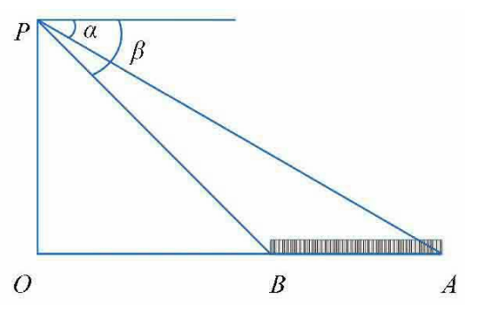

# scratch_docs
1. [简介](#简介)
2. [环境配置](#环境配置)
3. [操作界面划分](#操作界面划分)
4. [舞台](#舞台)
    1. [舞台背景图片](#舞台背景图片)
    2. [舞台声音](#舞台声音)
    3. [案例](#案例)
5. [角色](#角色)
    1. [角色图片](#角色图片)
    2. [角色造型图片](#角色造型图片)
    3. [角色声音](#角色声音)
    4. [案例](#案例-1)
6. [脚本](#脚本)
    1. [脚本基础操作](#脚本基础操作)
    2. [脚本分类](#脚本分类)
    3. [变量和运算](#变量和运算)
        1. [变量和运算基础](#变量和运算基础)
        2. [变量积木](#变量积木)
        3. [运算积木](#运算积木)
        4. [案例](#案例-2)
            1. [变量案例](#变量案例)
            2. [运算案例](#运算案例)
            3. [列表案例](#列表案例)
    4. [控制](#控制)
        1. [控制积木](#控制积木)
        2. [案例](#案例-3)
    5. [角色状态](#角色状态)
        1. [角色状态基础](#角色状态基础)
        2. [角色状态-运动积木](#角色状态-运动积木)
        3. [角色状态-外观积木](#角色状态-外观积木)
        4. [角色状态-音乐积木](#角色状态-音乐积木)
    6. [舞台状态](#舞台状态)
        1. [舞台相关的积木](#舞台相关的积木)
        2. [案例](#案例-4)
    7. [事件](#事件)
        1. [事件基础](#事件基础)
        2. [事件类型](#事件类型)
    8. [侦测](#侦测)
        1. [侦测积木](#侦测积木)
        2. [案例](#案例-5)
    9. [自制积木](#自制积木)
7. [调试程序](#调试程序)
8. [扩展](#扩展)
    1. [画笔](#画笔)
9. [附录](#附录)
    1. [scratch编程流程](#scratch编程流程)
    2. [案例补充](#案例补充)
    3. [一星案例](#一星案例)
    4. [二星案例](#二星案例)
    5. [三星案例](#三星案例)
    6. [数据结构与算法](#数据结构与算法)
        1. [选择排序](#选择排序)
        2. [冒泡排序](#冒泡排序)
        3. [二分查找](#二分查找)


## 简介

1. 概念：是一款由麻省理工学院（MIT）设计开发的一款面向儿童的可视化、积木式的编程软件，把不同的指令积木按照某种逻辑关系
拼搭在一起，就能得到一个可运行的程序，从而创建出各种交互式具有文字，图片，动画，音乐的作品
2. 特点：不考虑语法，不用担心语法不熟悉，导致程序崩溃，更多关注到逻辑和任务的具体实现上


[回到顶部](#scratch_docs)<div style="text-align:center"><br><br>⭐⭐⭐⭐⭐⭐⭐<br><br><br></div>


## 环境配置

1. 注册scratch账户：Scratch 为教育工作者提供教师账户，该账户能让教育工作者管理学生在 Scratch 上的参与情况
2. 下载离线客户端：Microsoft store下载


[回到顶部](#scratch_docs)<div style="text-align:center"><br><br>⭐⭐⭐⭐⭐⭐⭐<br><br><br></div>


## 操作界面划分
1. 菜单栏（第一栏）
    * logo
    * 语言：选择语言
    * 文件：新建，打开，保存
    * 编辑：恢复
    * 教程：进入可以搜索教程，跟着教程来做
2. 显示区（舞台区）：
    * 概念：展示程序运行结果
    * 屏幕控制：缩小，扩大，全屏
    * 运行，停止按钮
    * 高360（y坐标范围-180到180），宽480（x坐标范围-240到240）
3. 操作对象
    * 舞台
    * 角色


[回到顶部](#scratch_docs)<div style="text-align:center"><br><br>⭐⭐⭐⭐⭐⭐⭐<br><br><br></div>


## 舞台


### 舞台背景图片


舞台背景图片：
1. 舞台：可以设置不同的背景，以营造出各种场景和氛围，为角色的活动提供背景环境
2. 背景图片支持的格式：支持png，svg格式照片；png是透明的，svg可以缩放无损
3. 舞台中背景图片的数量：一个舞台可以有多个背景图片，但同一时刻，舞台只有一个背景图片

4. 多个背景图片之间的操作
    * 通过拖拽移动背景图片编号
    * 添加背景图片：上传，随机，绘制，选择上传背景图片（两个地方都是这样）
    * 删除背景图片
    * 通过脚本实现舞台背景图片切换

5. 编辑单个背景图片的操作
    * 背景图片命名
    * 撤销和重做：撤销对应的操作（ctrl z 快捷键），重做是用于恢复之前撤销的操作
    * 背景图片内元素的图层改变（图层的顺序决定了图片的显示的前后关系，位于上层的图层会遮挡住下层的图层）：可以选中某些元素，然后通过 “往前放”“往后放”“放到最前面”“放到最后面” 等操作设置造型内元素的图层
    * 复制粘贴
    * 删除
    * 翻转：水平翻转，垂直翻转
    * 对于svg图片的操作
        * 选择，变形
        * 画笔，填充：可以设置填充的颜色和渐变颜色，可以用取色器取色    
        * 文本：可以设置填充的颜色和渐变颜色，可以用取色器取色；可以设置字体类型
        * 图形：
            * 线段：可以设置轮廓的颜色和渐变颜色，可以用取色器取色
            * 圆：可以设置填充的颜色和渐变颜色，可以用取色器取色；同样，可以设置轮廓
            * 正方形：可以设置填充的颜色和渐变颜色，可以用取色器取色；同样，可以设置轮廓
        * 擦除
    * 对于png图片的操作：
        * 不能直接修整体图片的形状或颜色等细节
        * 少了变形操作
        * 图形的轮廓一般只可以设置实心和空心


[回到顶部](#scratch_docs)<div style="text-align:center"><br><br>⭐⭐⭐⭐⭐⭐⭐<br><br><br></div>


### 舞台声音
1. 舞台声音：应用于整个舞台场景的声音
2. 舞台声音支持的格式：支持的声音格式包括wav 和mp3
3. 舞台声音的数量：一个舞台可以有多个舞台声音，但同一时刻，舞台只有舞台声音

4. 多个舞台声音之间的操作：
    * 通过拖拽移动舞台声音编号
    * 添加舞台声音：上传，随机，录制，选择上传背景声音
    * 删除舞台声音
    * 通过脚本实现舞台声音变化

6. 编辑单个舞台声音的操作 
    * 舞台声音命名
    * 复制粘贴新拷贝声音
    * 删除声音片段
    * 播放/停止舞台声音
    * 调整声音的速度：快一点，慢一点
    * 调整声音的音量：响一点，轻一点，渐强，渐弱
    * 反转声音：对声音进行反转处理
    * 机械化声音：使声音机械化


[回到顶部](#scratch_docs)<div style="text-align:center"><br><br>⭐⭐⭐⭐⭐⭐⭐<br><br><br></div>


### 案例
案例名称：四季更替
舞台背景：准备四张分别代表春、夏、秋、冬的背景图片


脚本：
1. 当绿旗被点击：
2. 初始显示春天的背景。
3. 等待 5 秒。
4. 切换为夏天的背景。
5. 等待 5 秒。
6. 切换为秋天的背景。
7. 等待 5 秒。
8. 切换为冬天的背景。
9. 等待 5 秒。
10. 回到春天的背景，如此循环

<br>
<br>
<br>

python实现思路：
1. 首先进行必要的初始化，包括 `pygame` 的初始化、设置屏幕大小和标题，以及加载四季的图片。
2. 定义一个主循环的标志 `running` 并初始化为 `True` ，同时设定初始季节为 `spring` 。
3. 在主循环中，通过遍历 `pygame.event.get()` 来获取和处理事件，如果获取到 `QUIT` 事件（即用户关闭窗口），则将 `running` 设为 `False` 以结束主循环。
4. 每次循环都用白色填充屏幕以清除之前的显示内容。
5. 根据当前季节显示对应的图片，并将当前季节切换为下一个季节。
6. 使用 `pygame.display.flip()` 更新显示，然后暂停 5 秒，以实现每个季节图片的持续显示。
7. 当主循环结束时，调用 `pygame.quit()` 退出 `pygame` 。


[回到顶部](#scratch_docs)<div style="text-align:center"><br><br>⭐⭐⭐⭐⭐⭐⭐<br><br><br></div>


## 角色


<div style="text-align:center"><br><br>⭐⭐⭐⭐⭐⭐⭐<br><br><br></div>


### 角色图片

1. 角色：角色是在舞台上进行各种动作和交互的对象
2. 角色图片支持的格式：支持png，svg格式照片；png是透明的，svg可以缩放无损
3. 角色数量：舞台上可以有多个角色
4. 角色初始状态：
    * 角色名称修改
    * 角色位置（x，y）
    * 显示/隐藏
    * 大小
    * 方向:
        * 角度范围：在 Scratch 中，默认的方向规定是：0 度指向上，90 度指向右，180 度指向下，270 度指向左（-90）
        * 旋转方式-任意旋转：可以任意旋转角度
        * 旋转方式-水平旋转：角色只能在水平方向（左右）进行翻转
        * 旋转方式-不旋转让角色保持固定的方向，不会发生旋转


### 角色造型图片

1. 角色造型：角色的不同外观形态
2. 角色造型图片支持格式：支持png，svg格式照片；png是透明的，svg可以缩放无损，所以一般选择svg格式
3. 角色造型数量：一个角色可以有多个造型，同一时刻，一个角色只能有一个造型

4. 多个角色造型图片之间的操作：
    * 通过拖拽移动角色造型图片编号
    * 添加角色造型图片：上传，随机，绘制，选择上传背景图片（两个地方都是这样）
    * 删除角色造型图片
    * 多个角色造型的图层移动方式（图层的顺序决定了图片的显示的前后关系，位于上层的图层会遮挡住下层的图层）：
        * 任何新创建的图片都会被默认移动到最顶层
        * 角色只要在舞台上被拖拽就会被移动到最上层
        * 通过脚本实现角色图层移动
    * 通过脚本实现角色造型图片切换


5. 编辑单个角色造型图片的操作
    * 角色造型图片命名
    * 撤销和重做：撤销对应的操作（ctrl z 快捷键），重做是用于恢复之前撤销的操作
    * 角色造型图内元素图层的改变：可以选中某些元素，然后通过 “往前放”“往后放”“放到最前面”“放到最后面” 等操作设置造型内元素的图层
    * 复制粘贴
    * 删除
    * 翻转：水平翻转，垂直翻转
    * 对于svg图片的操作
        * 选择，变形
        * 画笔，填充：可以设置填充的颜色和渐变颜色，可以用取色器取色    
        * 文本：可以设置填充的颜色和渐变颜色，可以用取色器取色；可以设置字体类型
        * 图形：
            * 线段：可以设置轮廓的颜色和渐变颜色，可以用取色器取色
            * 圆：可以设置填充的颜色和渐变颜色，可以用取色器取色；同样，可以设置轮廓
            * 正方形：可以设置填充的颜色和渐变颜色，可以用取色器取色；同样，可以设置轮廓
        * 擦除
    * 对于png图片的操作：
        * 不能直接修整体图片的形状或颜色等细节
        * 少了变形操作
        * 图形的轮廓一般只可以设置实心和空心


[回到顶部](#scratch_docs)<div style="text-align:center"><br><br>⭐⭐⭐⭐⭐⭐⭐<br><br><br></div>


### 角色声音

1. 角色声音：角色发出的声音
2. 角色声音支持格式：支持的声音格式包括wav 和mp3
3. 角色声音的数量：一个角色可以有多个角色声音，但同一时刻，舞台只有一个角色声音

4. 多个角色声音之间的操作：
    * 通过拖拽移动角色声音编号
    * 添加角色声音：上传，随机，录制，选择上传背景声音
    * 删除角色声音
    * 通过脚本实现角色声音变化
 

5. 编辑单个角色声音的操作 ：
    * 角色声音命名
    * 复制粘贴新拷贝声音
    * 删除声音片段
    * 播放/停止舞台声音
    * 调整声音的速度：快一点，慢一点
    * 调整声音的音量：响一点，轻一点，渐强，渐弱
    * 反转声音：对声音进行反转处理
    * 机械化声音：使声音机械化


[回到顶部](#scratch_docs)<div style="text-align:center"><br><br>⭐⭐⭐⭐⭐⭐⭐<br><br><br></div>


### 案例


[回到顶部](#scratch_docs)<div style="text-align:center"><br><br>⭐⭐⭐⭐⭐⭐⭐<br><br><br></div>

## 脚本


<div style="text-align:center"><br><br>⭐⭐⭐⭐⭐⭐⭐<br><br><br></div>

### 脚本基础操作
1. 脚本：用于控制各个角色和舞台的行为
2. 脚本视图按钮（右下角）：
    * 放大/缩小，同样的 alt+鼠标滚轮放大缩小
    * 回到代码中央`=`
3. 脚本添加/删除：移动脚本积木进入代码区域，或者拖拽到对应角色
4. 脚本删除
    * 移动脚本积木离开代码区域
    * 右击单个积木删除：可以删除单个积木之下的积木
    * 右击空白：删除全部积木
5. 复制/粘贴
    * ctrl c/v
    * 右击单个积木复制：可以复制单个积木之下的积木
6. 撤销/重做
    * 撤销：右击积木，右击空白地方或者ctrl z
    * 重做：右击空白，选择重做
7. 注释：
    * 选择单个脚本：可以注释单个脚本
    * 空白区域右击：选择注释，可以更自由移动注释框
8. 脚本执行：设置运行事件，点击运行


[回到顶部](#scratch_docs)<div style="text-align:center"><br><br>⭐⭐⭐⭐⭐⭐⭐<br><br><br></div>


### 脚本分类
脚本积木类型包括：
1. 运动积木：用于控制角色的移动，如移动步数、改变坐标、旋转角度等。
2. 外观积木：可以改变角色的造型、大小、颜色、显示 / 隐藏等。
3. 声音积木：实现声音的播放、停止、调整音量等操作。
4. 事件积木：例如 “当绿旗被点击”“当角色被点击” 等，用于触发程序的开始或特定的响应。
5. 控制积木：包含 “重复执行”“如果... 那么”“等待... 秒” 等，用于控制程序的流程和逻辑。
6. 侦测积木：用于检测角色与舞台的状态，如碰到边缘、鼠标指针的位置、按键是否按下等。
7. 运算积木：进行数学运算和逻辑判断，如加、减、乘、除、比较大小等。
8. 变量积木：创建和操作变量，存储和修改数据。
9. 自制积木：用户可以自定义新的积木功能，以实现更复杂的逻辑


<br>
<br>
<br>


按形状分，脚本积木类型
1. 帽子积木（Hat Blocks）：顶部是弧形的，通常是一个事件触发积木，比如 “当绿旗被点击”“当角色被点击” 等，这类积木一般作为脚本的起始。
2. 堆叠积木（Stack Blocks）：是顶部有一个凹口，表示这类积木可以拼接在其他积木的凸起位置，比如 “移动 10 步”“等待 1 秒” 等。；如果在一个积木的底部或是中间区域有一个或多个凸起，则表示可以把其他积木拼接在它的凸起位置；如果一个积木的底部是平直的，则表示它无法拼接其他积木，这e意味着一个脚本的结束或是整个项目的结束
3. 报告积木（Reporter Blocks）：顶部和底部都是平直的，左右两端是圆角或尖角。会返回一个值，通常用于运算和条件判断中，例如 “鼠标的 x 坐标”“角色的方向” 等


[回到顶部](#scratch_docs)<div style="text-align:center"><br><br>⭐⭐⭐⭐⭐⭐⭐<br><br><br></div>


### 变量和运算


<div style="text-align:center"><br><br>⭐⭐⭐⭐⭐⭐⭐<br><br><br></div>


#### 变量和运算基础

1. 字面值：存储特定数据类型的固定值
    * 数字字面值
    * 字符串字面值：
    * 布尔值字面值：只有true和false两个值
2. 变量（variable）：存储值（value）的标识符
3. 变量命名规则
    * 由大小写字母（A 至 Z）、数字（0 至 9）以及下划线 _ 组成
    * 严格区分大小写
    * 不能以数字开头，必须以字母或下划线开头
4. scratch变量的作用域分为两种：
    * “适用于所有角色”：所有角色都能访问修改
    * “仅适用于当前角色”：只有当前角色可以访问修改
5. 变量的值的数据类型：不同语言，有声明决定数据类型，也有赋值决定数据类型
    * 数字数据类型
    * 字符串数据类型
    * 布尔值数据类型
    * 复合数据类型：
        * 列表：包含多个元素的有序的序列，元素可以是任何基础数据类型
6. 运算：运算符和操作数（变量和字面值）组成的产生一个结果的代码片段
7. 运算顺序：scratch的运算顺序是从内层到外层
8. 运算转换规则：需要注意的是，为了避免意外的结果，在 Scratch 编程中，尽量保持参与运算的数据类型一致，以确保程序的逻辑清晰和结果的准确性
    * 数字和字符串：
        * 如果在需要数字的运算中使用了字符串，且字符串只包含数字字符（例如 "123"），Scratch 会尝试将其转换为数字进行运算。
        * 如果在字符串连接操作中使用了数字，数字会被自动转换为字符串并与其他字符串连接。
    * 布尔值和数字：
        * 布尔值 `true` 在某些运算中可能被视为 `1`，`false` 可能被视为 `0`。但这并不是所有运算都适用的通用规则，具体取决于运算的上下文。如`bool1 + bool2 == 1`这种
1. scratch产生值的方式：字面值，变量，运算


[回到顶部](#scratch_docs)<div style="text-align:center"><br><br>⭐⭐⭐⭐⭐⭐⭐<br><br><br></div>


#### 变量积木

1. 声明建立一个变量
2. 在舞台上显示/隐藏变量
    * 通过勾选对应积木显示隐藏
    * 舞台中点击对应项目可以在正常显示 大字显示 滑杆切换
    * 舞台中右击对应项目可以在正常显示 大字显示 滑杆切换 滑杆范围 hide隐藏进行选择
3. 删除变量：选中对应的变量删除
4. 变量赋值
    * 将变量赋值
    * 将变量进行加上相应的值
5. 声明建立一个列表
6. 舞台中列表的操作
    * 在舞台可以点击新增长度
    * 可以右下角拖拽改变列表显示范围
    * 舞台中点击相应的列表元素可以修改值和删除
    * 舞台中右击列表可以导入，导出列表，隐藏列表（通过导出列表可以看出导入列表的格式是怎么样的）
7. 在舞台上显示/隐藏列表
8. 删除列表：选中对应的列表删除
9. 列表操作
    * 增
        * 将元素（变量或者列表）加入列表
        * 将指定第n项前加入元素（变量或者列表）
    * 删
        * 删除列表指定的项/删除列表所有的项
    * 改
        * 将指定第n项替换为相应元素（变量或者列表）
    * 查（返回值）
        * 列表的第n项
        * 列表第一个值是第n项
        * 列表有多少项
        * 列表是否包含某个值


[回到顶部](#scratch_docs)<div style="text-align:center"><br><br>⭐⭐⭐⭐⭐⭐⭐<br><br><br></div>


#### 运算积木

1. 算术运算： + - * / 
2. 操作数字
    * 求余数
    * 求近似数
    * 求绝对值等（下拉列表选取对应操作，如三角函数，对数，平方根，10的n次方等）
    * 在n到m之间获得随机数：根据给定的参数是整数或是小数，这个积木将会随机生成并返回整数或小数。例如，使用“在1到10间随机选一个数”积木，返回的是整数类型的随机数；而使用“在1到10.0间随机选一个数”积木，返回的则是小数类型的随机数。这是因为后者的参数中有一个是小数，所以它生成的随机数的类型是小数
3. 比较运算：> = <
4. 逻辑运算：与 或 非
5. 字符串操作
    * 连接两个字符串
    * 字符串的第n个字符
    * 字符串的字符数
    * 字符串是否包含指定值


[回到顶部](#scratch_docs)<div style="text-align:center"><br><br>⭐⭐⭐⭐⭐⭐⭐<br><br><br></div>


#### 案例 


1. 小猫背诗
    * 背静夜思，诗的题目作者，后面的四句诗句，分别说出来
2. 小猫思考
    * 思考我是谁
    * 思考我从哪里来
    * 思考我要到哪里去

3. 简单问答
    * 询问你叫什么名字
    * 说你好连接上名字
4. 说出字符串长度
    * 询问字符串
    * 说出字符串长度


[回到顶部](#scratch_docs)<div style="text-align:center"><br><br>⭐⭐⭐⭐⭐⭐⭐<br><br><br></div>


##### 变量案例
4. 变量：小猫动态变大变小（变量滑竿实现）
    * 重复执行，将角色大小设置为一个变量
    * 舞台中通过变量滑竿实现变量变化，控制小猫大小变化
5. 变量：求两数之和（问答形式）
    * 问答形式，输入两个数字，求两数之和
    * 输出a+b的和

6. 运算：鸡兔同笼
    * 变量设定鸡和兔的脚数94,头的数量是35
    * 用假设法（假设全是鸡）：
        * 如果全是鸡，脚的总数为 35×2 = 70 只。
        * 实际脚的总数是 94 只，差值为 94 - 70 = 24 只。
        * 每只兔比每只鸡多 2 只脚，所以兔的数量是 24÷2 = 12 只。
        * 鸡的数量为 35 - 12 = 23 只
    * 分别计算鸡和兔，然后输出结果    


[回到顶部](#scratch_docs)<div style="text-align:center"><br><br>⭐⭐⭐⭐⭐⭐⭐<br><br><br></div>

##### 运算案例
7. 运算：计算大桥长度（三角函数）

    

    * APO的角度是60度，po*tan60 = ao
    * bo = po * tan45
    * ao - b0 = ab
    * 输出大桥长度
8. 运算：小鱼逍遥游（随机数）
    * 设置小鱼角色大小
    * 重复执行
        * 移动2步
        * 设置旋转角度为随机值（如左转-20到20的角度）
        * 碰到边缘就反弹
9.  运算：随机投点画圈（随机数，平方根），在一个以舞台中心为圆心、半径为100个单位的圆内，随机生成10万个点的坐标（x，y）
    * 扩展中的画笔工具先全部擦除
    * 重复执行10万次
        * 圆位于舞台中心（0，0），半径是100，所以落点的x坐标和y坐标的取值都应该在-100到100之间选择随机数
        * 计算点到圆心的距离d = √(x^2 + y^2)
        * 加入距离少于100，则进行落笔，然后抬笔

10. 字符串操作：成语接龙
    * 清空之前的列表
    * 将千千万万作为第一项加入列表
    * 成语变量设置为列表第一项
    * err_str设置为空：设置错误提示信息
    * n设置为5：设置错误限制次数
    * str1和str2：提示信息太长，分割成两部分
    * 先说“我先说一个成语，你来接龙”，然后说出列表第一个成语
    * 重复执行直到 n<1
        * 询问：err_str + 你还有 + n + 次错误机会，请以 + 成语 + 开头接一个四字成语
        * 交给add_item_to_list处理
        * if err_str不为空: n -= 1
    * 说游戏结束
    * add_item_to_list
        * 如果回答的字符数不等于4，那么err_str = 你输入的不是四字成语，
        * 否则回答的第一个字符不是成语的第四个字符，那么err_str = 你输入的成语必须以 + 【成语的第四个字符】 + 开头
        * 否则回答已经包含在列表内，那么err_str = 你输入的成语已经说过了，
        * 否则
            * 将成语设置为回答
            * err_str设置为空
            * 成语添加到列表中

11. 字符串操作：回文诗
以下是将上述内容改成 Scratch 题目描述的版本：

在宋代，回文诗创作极为兴盛，苏轼的《记梦回文二首并序》中就有一首精彩的回文诗：

空花落尽酒倾缸，日上山融雪涨江。红焙浅瓯新火活，龙团小碾斗晴窗。

倒着读则是：

窗晴斗碾小团龙，活火新瓯浅焙红。江涨雪融山上日，缸倾酒尽落花空。

现在，使用 Scratch 设计一个程序脚本。要求能够让用户输入一首七言回文诗，然后程序可以将这首诗倒着读出来呈现给用户。 

* poem 保存回文诗回答，初始化为空
* reverse_poem 保存反转的回文诗，初始化为空
* 询问输入“请输入一首七言回文诗：”
* 将回答保存为poem
* i设置为poem的字符数
* 如果poem的最后一个字符（第i个字符）为“。”， i -= 1
* 重复执行直到，i < 0
    * reverse_poem = reverse + poem[i]
    * i -= 1
* reverse_poem += "."
* 说出reverse_poem


```python
poem = input("请输入一首七言回文诗：")
reversed_poem = poem[::-1]
print(reversed_poem)
```

##### 列表案例

1. 求平均温度：某个气象小组连续一周测得每天早上8时的气温分别为：13℃、13℃、13℃、14℃、15℃、14℃、16℃，通过列表求平均气温

2. 设计一个简单的银行叫号系统，该系统包含申请排队和处理排队两个子系统。

在申请排队子系统中，当用户按下空格键，就会有一个排队编号被添加到排队队列里。

处理排队子系统会每隔一段时间从排队队列中取出一个编号，并显示类似“请 A1 到 1 号窗口”的提示信息。

请使用 Scratch 实现这个银行叫号系统。 


* 首先进队系统
    * 如果按下空格键，就将 A + i + random(1, 6)加入到排队队列
    * 然后设置i += 1
* 处理排队系统（按开始运行）
    * 初始化bank_queue列表，window1,window2,window3列表为空
    * 重复执行
        * 等待randow(1, 6)秒
        * 如果排队队列不为空
            * rank_winwow = random(1, 4)
            * 说：请编号为bank_queue[0] + 到 + random_window + 窗口办理业务
            * 说太长可以用变量分割
            * 删除bank_queue[0]
            * 进行window_business_process
* window_business_process
    * 如果rank_window == 1，将排队队列第一个元素加入到window1
    * 如果rank_window == 2，将排队队列第一个元素加入到window2
    * 如果rank_window == 3，将排队队列第一个元素加入到window3

3. 评委打分：有一个列表，保存了9.3, 9.7, 9.5, 9.8, 9.2, 9.6，9.9，9.5八个元素，手动去掉一个最高分，一个最低分，然后将六个放到列表中，求它们的平均数

4. 约瑟夫问题是一个经典的数学和计算机科学问题。通常的描述是：有 n 个人围成一圈，从第一个人开始报数，报到 m 的人出局，然后从下一个人重新开始从 1 报数，如此反复，直到只剩下最后一个人，求最后剩下的人的初始位置编号


约瑟夫环问题描述如下，有41个人围成一圈，开始报数，报到3的人出局，然后重新开始报数，问最后出局的人是谁
* 建立一个报数列表（初次）
* 建立一个移除列表（初次）
* 清空报数列表
* 清空移除列表
* 使用解决约瑟夫问题的自定义积木，传递n=41，m=3
* 说出报数列表的第一项

约瑟夫问题的自定义积木
* i = 1
* 重复执行直到i>n，将i添加到报数列表 
* 设置remove_people_order = 1
* 重复执行直到报数列表只有一个项
    * remove_people_order = (remove_people_order + m -1) % m
    * 因为scratch是1开始的，当remove_people_order等于0的时候，修正remove_people_order为当前报数列表的长度
    * 删除报数列表指定的remove_people_order
    * 如果当前报数%3 != 0，将当前报数的变量重新加回到报数列表中


```python
def josephus(n, m):
    people = list(range(1, n + 1))
    index = 0
    while len(people) > 1:
        # index + m -1:计算从当前位置开始，报了 m 个数后的位置索引
        # 由于这是一个环形的报数过程（即当到达列表末尾时会回到开头继续）
        # 使用取模运算 % len(people) 来确保计算得到的索引不会超出当前人员列表的范围
        index = (index + m - 1) % len(people)
        people.pop(index)
    return people[0]

# 假设有 41 个人，报到 3 出局
print(josephus(41, 3))
```

<br>
<br>
<br>

```c++
#include <iostream>
#include <vector>

// 约瑟夫问题函数
int josephus(int n, int m) {
    std::vector<int> people;
    for (int i = 1; i <= n; i++) {
        people.push_back(i);
    }

    int index = 0;
    while (people.size() > 1) {
        index = (index + m - 1) % people.size();
        people.erase(people.begin() + index);
    }

    return people[0];
}

int main() {
    int n = 41;  // 总人数
    int m = 3;   // 报数出局值

    int lastPerson = josephus(n, m);
    std::cout << "最后剩下的人的编号是: " << lastPerson << std::endl;

    return 0;
}
```


[回到顶部](#scratch_docs)<div style="text-align:center"><br><br>⭐⭐⭐⭐⭐⭐⭐<br><br><br></div>


### 控制

<div style="text-align:center"><br><br>⭐⭐⭐⭐⭐⭐⭐<br><br><br></div>


#### 控制积木

1. 条件结构
    * 如果：if 比较运算和逻辑运算 
    * 如果否则：if 比较运算和逻辑运算  else 
    * 条件结构嵌套：if elif ... else
2. 循环结构
    * 重复执行
    * 重复执行，直到（比较运算和逻辑运算）
    * 重复执行指定值次数
3. 等待
    * 等待指定值的秒数
    * 等待条件运算
4. 克隆体
    * 当作为克隆体启动
    * 克隆指定角色
    * 删除此克隆体
5. 停止所有脚本


[回到顶部](#scratch_docs)<div style="text-align:center"><br><br>⭐⭐⭐⭐⭐⭐⭐<br><br><br></div>


#### 案例


1. 顺序结构-根据海伦公式求三角形面积
    * 输入三角形三边边长
    * 海伦公式：假设三角形的三条边长分别为`a b c`，先计算半周长p = (a + b + c)/2，则三角形的面积S = sqrt(p(p-a)(p-b)(p-c))

2. 顺序结构-求梯形面积
    * 输入a、b、h的值
    * 计算梯形的面积 S=(a+b)*h/2

3. 顺序结构-求圆锥体积
    * 输入圆锥体的底面半径r和圆锥的高h
    * 计算圆锥体底面积S=πr^2
    * 计算圆锥体体积V=1/3S*h

4. 分支结构-不通过函数求绝对值
    * 输入一个数
    * 如果a>0，则输出a；否则输出-a

5. 分支结构-判断三角形是否成立
数学中，对于给定的三条边，如果任意两条边的长度之和大于第三条边的长度，那么这三条边就可以构成一个三角形。使用 Scratch 设计一个程序。程序能够让用户分别输入三个正实数作为三条边的边长，然后程序判断这三条边能否构成一个三角形。如果可以构成三角形，程序给出 “可以构成三角形” 的提示；如果不能构成三角形，程序给出 “不能构成三角形” 的提示

新建三个变量 “边长 1”“边长 2”“边长 3”。
使用 “询问” 积木获取用户输入的三个边长值，并分别存储到这三个变量中。
判断 “边长 1 + 边长 2> 边长 3 且 边长 1 + 边长 3 > 边长 2 且 边长 2 + 边长 3 > 边长 1”。
如果满足上述条件，就说 “可以构成三角形”，否则说 “不能构成三角形”

6. 分支结构-判断奇偶数
    * 输入一个数
    * 除以2取余数，余数为0则输出偶数，否则输出奇数 
   
7. 循环结构：“冰雹猜想”是一种有趣的数字黑洞，它的规则描述如下。
任意取一个正整数n。如果n是奇数，则把n变为3n+1；如果n是偶
数，则把n变为n÷2。按此规则不断重复操作，最终一定会得到1，用一个列表记录下来这个得到1的过程

8. 循环结构：1加到100的和

9. 以下是为您重新设计的题目描述：

富家少女鲍西娅美丽聪慧，引得众多贵族子弟、公子王孙竞相求婚。依照其父亲的遗嘱，求婚者需通过猜盒来订婚。鲍西娅准备了金、银、铅三个盒子，每个盒子上都刻有一句话，并且只有一个盒子里放置了她的肖像。这三句话分别是：

金盒子：肖像不在此盒子中。

银盒子：肖像在铅盒子中。

铅盒子：肖像不在此盒子中。

鲍西娅告知求婚者，上述三句话中仅有一句为真。分析这个问题，使用编程的方式找出鲍西娅的肖像究竟放在了哪个盒子里


解题：假设用变量n代表盒子编号，金、银、铅3个盒子的编号分别为1、2、3，个逻辑推理问题的思路是，在一个循环结构中，使代表盒子编号的变量n从1到3变化。在循环体中，将变量n的值代入3个表达式中运算，再判断如果3个表达式的运算结果相加等于1，就能找到该问题的解。


scratch中bool值true相当于1，false相当于0


<div style="text-align:center"><br><br>⭐⭐⭐⭐⭐⭐⭐<br><br><br></div>


### 角色状态


#### 角色状态基础
1. 角色状态相关积木：运动（位置和角度），外观，声音

2. 角色状态初始化
    * 可以通过角色面板设置
    * 也可以通过角色状态相关积木设置


[回到顶部](#scratch_docs)<div style="text-align:center"><br><br>⭐⭐⭐⭐⭐⭐⭐<br><br><br></div>


#### 角色状态-运动积木

位置：角色在舞台上的坐标位置（x 坐标和 y 坐标）
1. 移动坐标相关
    * 将x，y坐标分别设置为指定值
    * 移动到x，y位置，为x，y指定坐标值
    * 在指定值的秒数内移动到x，y，为x，y指定坐标值
2. 移动步数相关
    * 移动指定值的步数
    * 移动到指定位置（随机位置，指针，角色）
    * 在指定值的秒数内移动到指定位置（随机位置，指针，角色）
3. 其他
    * 碰到边缘就反弹
    * 舞台中，x，y坐标的显示隐藏
        * 通过勾选对应积木显示隐藏
        * 舞台中点击对应项目可以在正常显示 大字显示
        * 舞台中右击对应项目可以在正常显示 大字显示 hide隐藏进行选择

<br>
<br>
<br>


方向：角色面向的方向，通常用角度表示
1. 旋转方式
    * 设定旋转方式：左右翻转，不可旋转，任意旋转
2. 旋转角度
    * 面相指定值方向
    * 左/右转至指定值方向
3. 面相对象
    * 面相指定对象（指针，角色）
4. 其他
    * 舞台中显示/隐藏方向
        * 通过勾选对应积木显示隐藏
        * 舞台中点击对应项目可以在正常显示 大字显示
        * 舞台中右击对应项目可以在正常显示 大字显示 hide隐藏进行选择


[回到顶部](#scratch_docs)<div style="text-align:center"><br><br>⭐⭐⭐⭐⭐⭐⭐<br><br><br></div>


#### 角色状态-外观积木
1. 说和思考
    * 说指定值
    * 说指定值，设置说话用到的指定值的秒数
    * 思考指定值
    * 思考指定值，设置思考用到的指定值的秒数
2. 角色的显示隐藏：角色是否在舞台上可见
        * 显示
        * 隐藏
3. 角色大小：角色的尺寸大小
    * 设置角色大小为指定值大小
    * 设置角色大小增加减少指定值
4. 角色造型：角色当前显示的外观形态
    * 换成指定名称的造型
    * 下一个造型
5. 背景
    * 设置为指定背景
    * 下一个背景
6. 角色特效
    * 各种特效设置为指定值
    * 各种特效增加减少指定值
    * 清除图形特效
    * 各种特效类型：颜色，鱼眼，漩涡，像素化，马赛克，亮度，虚像
6. 角色图层
    * 移动最前面/最后面
    * 前移/后移 指定值的层数
7. 造型，背景，大小在舞台中的显示隐藏
    * 通过勾选对应积木显示隐藏
    * 舞台中点击对应项目可以在正常显示 大字显示
    * 舞台中右击对应项目可以在正常显示 大字显示 hide隐藏进行选择


[回到顶部](#scratch_docs)<div style="text-align:center"><br><br>⭐⭐⭐⭐⭐⭐⭐<br><br><br></div>


#### 角色状态-音乐积木

1. 播放暂停
    * 播放指定声音
    * 播放指定声音等待播放完
    * 停止所有声音
2. 音效
    * 音调/左右平衡 音效设定为指定值
    * 音调/左右平衡 音效增加减少为指定值
    * 清除音效
3. 音量
    * 音量设定为指定值的百分比
    * 音量增加/减少为指定值的百分比
4. 舞台中显示/隐藏音量
        * 通过勾选对应积木显示隐藏
        * 舞台中点击对应项目可以在正常显示 大字显示
        * 舞台中右击对应项目可以在正常显示 大字显示 hide隐藏进行选择


[回到顶部](#scratch_docs)<div style="text-align:center"><br><br>⭐⭐⭐⭐⭐⭐⭐<br><br><br></div>


### 舞台状态


#### 舞台相关的积木

1. 与角色积木对比，没有运动积木
2. 与角色积木对比，外观就只有
    * 背景
        * 设置为指定背景（角色积木有）
        * 下一个背景（角色积木有）
        * 设置为指定背景并等待：是将舞台的背景切换为指定的背景图像，并且会暂停当前脚本的执行，直到完成背景切换后，再继续执行后续的脚本；如果只是直接换成背景图片而不等待，可能会导致后续的操作在背景还未完全切换好时就开始执行，从而可能出现不符合预期的结果
    * 特效：和角色积木一样，只不过控制的对象不一样
    * 显示隐藏舞台背景编号：角色中的外观积木也有这个
3. 声音积木和角色声音积木一样，只不过控制的对象不同


[回到顶部](#scratch_docs)<div style="text-align:center"><br><br>⭐⭐⭐⭐⭐⭐⭐<br><br><br></div>


#### 案例


[回到顶部](#scratch_docs)<div style="text-align:center"><br><br>⭐⭐⭐⭐⭐⭐⭐<br><br><br></div>


### 事件


<div style="text-align:center"><br><br>⭐⭐⭐⭐⭐⭐⭐<br><br><br></div>


#### 事件基础

1. 事件：程序运行时发生的某种特定情况或动作
2. 事件对象：事件触发的对象
3. 事件处理程序（或者叫事件监听器，event listener）：一些编程语言中，对事件进行监听处理，事件触发时候哦iu，事件处理程序可以把事件对象的相关属性（attribute）作为一个事件对象（event object）作为参数（argument）传递给事件处理程序


[回到顶部](#scratch_docs)<div style="text-align:center"><br><br>⭐⭐⭐⭐⭐⭐⭐<br><br><br></div>


#### 事件类型

1. 当绿旗被点击：这是最常用的启动事件，用于开始整个程序的执行。
2. 当角色被点击：当鼠标点击特定角色时触发相应动作。
3. 当舞台被点击：鼠标点击舞台区域时触发。（选中舞台才能设置）
4. 当按下空格（或其他指定按键）：可以指定特定的按键，按下时触发。
5. 当背景切换为（指定背景）：当舞台的背景切换到指定的背景时触发。
6. 当响度/计时器大于（指定值）：利用电脑的麦克风检测环境声音响度，大于设定值时触发。
7. 当作为克隆体启动时：针对克隆体，在克隆体创建并启动时触（这个在控制积木中）
8. 自定义消息的处理
    * 当接收到消息：用于角色之间的通信，接收到特定消息时触发
    * 广播指定消息：当执行这个积木时，会向所有角色广播一个指定的消息，然后立即继续执行后续的脚本，不会等待其他角色对这个消息的响应
    * 广播指定消息并等待：同样会广播指定的消息，但会暂停当前脚本的执行，等待所有接收到这个消息的角色完成对该消息的响应处理后，再继续执行后续的脚本


[回到顶部](#scratch_docs)<div style="text-align:center"><br><br>⭐⭐⭐⭐⭐⭐⭐<br><br><br></div>


### 侦测

<div style="text-align:center"><br><br>⭐⭐⭐⭐⭐⭐⭐<br><br><br></div>


#### 侦测积木

侦测：用于检测和获取各种状态和信息，这些状态和信息是不确定的，动态变化的
1. 询问和回答
    * 询问并等待
    * 回答
2. 键盘
    * 是否按下某个键
3. 鼠标
    * 是否按下鼠标
    * 鼠标的x，y坐标
4. 返回其他角色/舞台的各种状态
    * 对于舞台：可以返回舞台编号，舞台名称，音量，我的变量
    * 对于角色：返回x坐标，y坐标，方向，造型编号，造型名称，大小，音量
5. 响度
6. 计时器
    * 计时器归零
    * 显示隐藏计时器
        * 通过勾选对应积木显示隐藏
        * 舞台中点击对应项目可以在正常显示 大字显示
        * 舞台中右击对应项目可以在正常显示 大字显示 hide隐藏进行选择
7. 时间
    * 当前时间的年月日时分秒
    * 2000年至今的天数


<br>
<br>
<br>

属于角色特有的积木
1. 是否碰到
    * 是否碰到鼠标，角色，舞台边缘
    * 是否碰到指定颜色
    * 指定颜色1是否碰到指定颜色2
2. 距离：到鼠标，角色，舞台边缘的距离
3. 拖动模式设置：改为可拖动/不可拖动


#### 案例


[回到顶部](#scratch_docs)<div style="text-align:center"><br><br>⭐⭐⭐⭐⭐⭐⭐<br><br><br></div>


### 自制积木

1. 自制积木：将一系列的指令组合在一起，创建一个新的、可重复使用的积木块
2. 定义积木
    * 定义自制积木的名称
    * 定义自制积木接受的参数，参数类型可以说
        * 数字
        * 字符串
        * 布尔值
3. 自定义积木不能在角色间使用


[回到顶部](#scratch_docs)<div style="text-align:center"><br><br>⭐⭐⭐⭐⭐⭐⭐<br><br><br></div>


## 调试程序

常见错误：
1. 语法错误：scratch中没有严格的语法检查，所以不考虑语法错误
2. 边界情况错误：在处理特殊情况或边界值时出现错误，例如，一个列表中有10个元素，但是却试图去获取列表的第11个元素
3. 逻辑漏洞：程序的逻辑流程存在错误，导致结果不符合预期。例如条件判断错误、循环条件不正确或循环未正常结束
4. 无限循环：循环条件设置不当，导致循环无法正常结束，造成程序死锁。


减少错误
1. 清晰的设计和规划：在开始编写代码之前，充分理解问题，设计好算法和程序的整体结构
2. 遵循编程规范：保持良好的代码风格
3. 分模块开发：将复杂的程序分解为较小的模块或函数，每个模块专注于一个特定的功能，便于测试和维护
4. 充分的测试：包括单元测试、集成测试、边界值测试等，覆盖各种可能的情况
5. 调试技巧：
    * 观察变量的变化（scratch中变量显示器）
    * 使用变量存储变化值（scratch用列表存储变化值）
    * 断点（scratch中如设置，按空格之前一直等待）


[回到顶部](#scratch_docs)<div style="text-align:center"><br><br>⭐⭐⭐⭐⭐⭐⭐<br><br><br></div>


## 扩展


<div style="text-align:center"><br><br>⭐⭐⭐⭐⭐⭐⭐<br><br><br></div>

### 画笔
* 落笔
* 画笔特效
    * 设置颜色
    * 设置画笔 颜色/亮度/饱和度/透明度 值
    * 增加/减少画笔 颜色/亮度/饱和度/透明度 值
    * 画笔粗细 设置/增加/减少
* 落笔：处于落笔状态
* 抬笔：处于不画的状态（例如过度，抬笔，移动到其他位置，然后落笔）
* 图章
* 全部擦除 


## 附录


### scratch编程流程


1. 题目描述：阐述要通过 Scratch 编程实现的具体任务
2. 分析思路
    * 角色分析（对象）
        * 运动（位置，方向）
        * 外观
        * 声音
    * 舞台分析
        * 外观
        * 声音
    * 事件以及事件的处理
3. 分析工具：
    * 自然语言描述：用清晰的文字详细描述程序的逻辑和流程
    * 伪代码：使用类似代码的结构，但更简化和接近自然语言，来表达程序的主要步骤和逻辑
    * 流程图：通过图形符号和连接线条来表示流程中各个步骤  
        * 开始/结束框：用圆角框表示程序的开始和结束。
        * 输入 / 输出框：平行四边形，用于表示数据的输入或输出
        * 处理框：简要描述要执行的操作或任务
        * 判断框：用菱形框表示。框内写明判断条件
        * 流程线：用带箭头的直线或曲线，用于连接各个图形符号，表示流程的顺序和方向
    * 流程图结构：
        * 顺序结构：流程按照从上到下、从左到右的顺序依次执行各个操作，没有分支和循环
        * 选择结构（分支结构）：
            * 根据给定的条件进行判断
            * 如果条件成立，执行一个分支的操作；如果条件不成立，执行另一个分支的操作
        * 循环结构：
            * 当型循环：先判断条件，若条件成立则执行循环体，然后再次判断条件，如此反复，直到条件不成立退出循环
            * 直到型循环：先执行循环体，然后判断条件，若条件不成立则再次执行循环体，直到条件成立退出循环

4. 调试


[回到顶部](#scratch_docs)<div style="text-align:center"><br><br>⭐⭐⭐⭐⭐⭐⭐<br><br><br></div>


### 案例补充
1. 计算圆的面积：
    * PI设置为3.14

2. 计算阶乘（递归）:斐波那契数列

3. 判断质数（素数）

4. 辗转相除法，亦称欧几里得算法，是用于求两个自然数最大公约数的一种算法。其具体步骤为：
* 以较大数除以较小数，得出余数；
* 接着用上一步的除数除以该余数，得到新余数。
* 如此不断相除，直至最后的余数为 0 
* 此时最后的除数即为这两个数的最大公约数。 


### 一星案例


### 二星案例


### 三星案例


### 数据结构与算法


#### 选择排序
基本过程：
* 用i指示每次迭代需要确定最后排序正确的位置
* 用min指向i位置
* 对i位置后的n-i个元素分别与min位置元素比较，过程中，如果元素比min位置元素要小，则min位置改为该位置
* 如果min指示的位置不是i，那么就交换两个位置的值
* 依次类推，直到i到达序列末端前，排序完成

```python
def select_sort(list):
    for i in range(len(list) - 1):
        min = i
        for j in range(i+1,len(list)):
            if list[j]<list[min]:
                 min =j
        if i != min:
            list[i],list[min] = list[min],list[i]

list = [3,5,1,9,7]
print(list)
select_sort(list)
print(list)

```


#### 冒泡排序
* 用end指示未排序元素末端
* 从第一个元素到未排序的元素末端（end）之间进行两两相邻交换，如果反序就进行交换，一趟下来，未排序元素末端（end）是排好序的，所以end-1
* 依次类推，直到end指向第一个元素前完全排好序

评价：
* 每次的迭代中，都有可能将元素放到更接近最后排序的位置

冒泡排序的优化： 有时候，当确定了一个位置是有序后，其实序列已经是有序的，但是仍然不知道序列已经有序，所以可以设置一个`flag`用于判断序列是否有序，**如果在比较过程中没有发生交换，就是有序的**。

```python
def bubble_sort(list):
    for end in range(len(list) -1 , 0, -1):
        flag = 0
        for i in range(0, end):
            if list[i] > list[i+1]:
                list[i],list[i+1] = list[i+1],list[i]
                flag = 1
        if flag == 0:
            return

list = [3,5,1,9,7]
print(list)
bubble_sort(list)
print(list)
```


#### 二分查找


