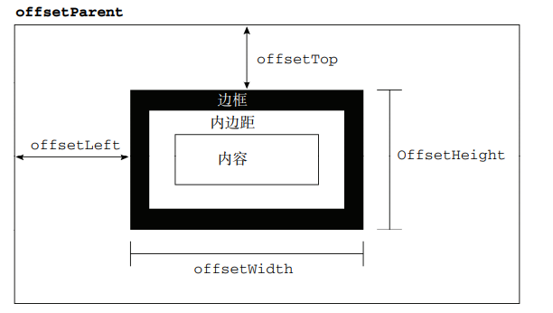

## 使用偏移属性计算元素宽高
1. HTMLElement.offsetWidth：是一个只读属性，返回一个元素的布局宽度。典型的offsetWidth是测量包含元素的边框(border)、水平线上的内边距(padding)、竖直方向滚动条(scrollbar)（如果存在的话）、以及CSS设置的宽度(width)的值
2. HTMLElement.offsetHeight：只读属性，它返回该元素的像素高度，高度包含该元素的垂直内边距和边框，且是一个整数。通常，元素的offsetHeight是一种元素CSS高度的衡量标准，包括元素的边框、内边距和元素的水平滚动条（如果存在且渲染的话），不包含:before或:after等伪类元素的高度。

```js
// 得到的都是四舍五入后返回的整数值
let offsetWidth =element.offsetWidth;
let offsetWidth =element.offsetHeight;
```

## 使用偏移属性计算元素与最近定位元素距离
1. HTMLElement.offsetParent:一个只读属性，返回一个指向最近的（指包含层级上的最近）包含该元素的定位元素。offsetParent 很有用，因为 offsetTop 和 offsetLeft 都是相对于其内边距边界的。Webkit 中，如果元素为隐藏的（该元素或其祖先元素的 style.display 为 "none"），或者该元素的 style.position 被设为 "fixed"，则该属性返回 null。
2. HTMLElement.offsetTop 为只读属性，它返回当前元素相对于其 offsetParent 元素的顶部内边距的距离
3. HTMLElement.offsetLeft只读属性，返回当前元素左上角相对于  HTMLElement.offsetParent 节点的左边界偏移的像素值


## 偏移量(offset dimension)



```js
// 将这个元素的 offsetLeft 或offsetTop 与其 offsetParent
// 的相同属性相加，如此循环直至根元素，就可以得到元素相应的偏移量
function getElementLeft(element){
 var actualLeft = element.offsetLeft;
 var current = element.offsetParent;
 while (current !== null){
 actualLeft += current.offsetLeft;
 current = current.offsetParent;
 }
 return actualLeft;
} 
```