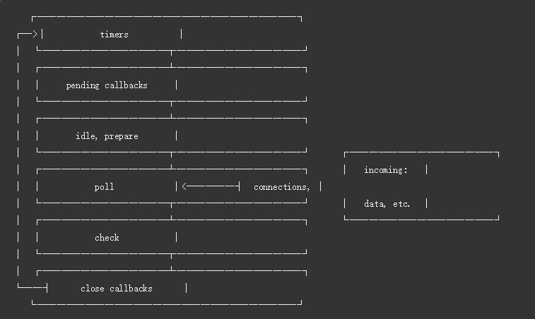

## Node.js的事件循环模型（libuv引擎中的事件循环的模型）

libuv引擎中的事件循环分为 6 个阶段，它们会按照顺序反复运行（当队列为空或者执行的回调函数数量到达系统设定的阈值，就会进入下一阶段）：
* timers 阶段：这个阶段执行timer（setTimeout、setInterval）的回调
* I/O callbacks 阶段：处理一些上一轮循环中的少数未执行的 I/O 回调
* idle, prepare 阶段：仅node内部使用
* poll 阶段：获取新的I/O事件, 适当的条件下node将阻塞在这里
* check 阶段：执行 setImmediate() 的回调
* close callbacks 阶段：执行 socket 的 close 事件回调

##  timer
timer 阶段执行timer（setTimeout、setInterval）的回调，并且是由 poll 阶段控制的。同样，在 Node 中定时器指定的时间也不是准确时间，只能是尽快执行。

## poll 阶段
这一阶段中，系统会做两件事情：
1. 回到 timer 阶段执行回调
2. 执行 I/O 回调

进入该阶段时如果没有设定了 timer 的话，会发生以下两件事情
1. 如果 poll 队列不为空，会遍历回调队列并同步执行，直到队列为空或者达到系统限制

2. 如果 poll 队列为空时，会有两件事发生：
  * 如果有 setImmediate 回调需要执行，poll 阶段会停止并且进入到 check 阶段执行回调
  * 如果没有 setImmediate 回调需要执行，会等待回调被加入到队列中并立即执行回调，这里同样会有个超时时间设置防止一直等待下去
  
设定了 timer 的话且 poll 队列为空，则会判断是否有 timer 超时，如果有的话会回到 timer 阶段执行回调。
  
## check阶段
check阶段：setImmediate()的回调会被加入check队列中