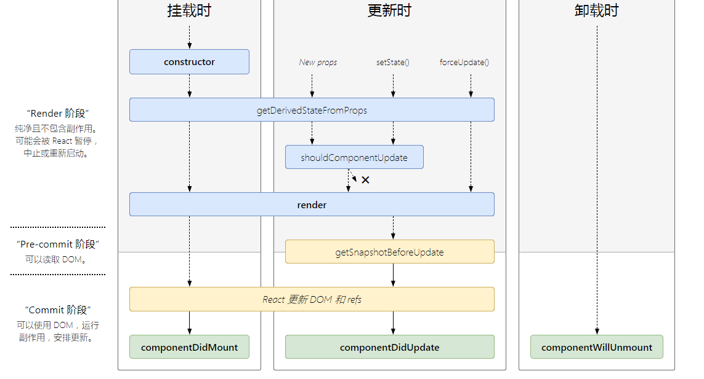

## 组件生命周期
* 组件实例被创建，插入到DOM中的过程：
    * 调用组件的constructor方法
    * static getDerivedStateFromProps()
    * render()
    * componentDidMount()
    * 即将过时的生命周期方法：UNSAFE_componentWillMount()

* 更新：组件的 props 或 state 发生变化时会触发更新。组件更新的生命周期调用过程：
    * static getDerivedStateFromProps()
    * shouldComponentUpdate()
    * render()
    * getSnapshotBeforeUpdate()
    * componentDidUpdate()
    * 即将过时的生命周期方法：
        * UNSAFE_componentWillUpdate()
        * UNSAFE_componentWillReceiveProps()

* 卸载：componentWillUnmount()

* 错误处理:渲染过程，生命周期，或子组件的构造函数中抛出错误时，会调用如下方法:
    * static getDerivedStateFromError()
    * componentDidCatch()

## 生命周期图
