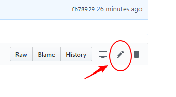

[0.0]: #Github-Tutorial
[1.0]: #GitHub是什么？
[2.0]: #创建repository
[3.0]: #创建Branch
[4.0]: #提交变化
[5.0]: #打开pull-request

# Github-Tutorial
1. [GitHub是什么？][1.0]
2. [创建repository][2.0]
3. [创建Branch][3.0]
4. [提交变化][4.0]
5. [打开pull-request][5.0]
## GitHub是什么？ 
GitHub是一个可以进行版本控制和合作的代码托管平台，在平台上可以与其他人一起完成项目。

#### [返回顶部][0.0]
---
## 创建repository
repository用来组织项目，里面可以包含文件夹，文件，图像，音频等。建议项目添加一个文件README.md描述你的项目信息

1. 右上角 "+" 号选择 "New repository"
    
    

2. 依次填入repository名称，描述， 选择用README初始化，最后提交

    

#### [返回顶部][0.0]

---

## 创建Branch
Branch是一种在同一时间在不同版本工作的一个机制。默认repository是master, 我们一般将master作为最终的分支，我们在最后的修改完成后才提交到master。
当从master创建branch, 相当于制作了一个master的快照，如果master被人修改了，你正在工作的branch可以接受更新。

1. 进入上面新建的repository， 点击branch, 输入branch名称，确认

    

    对比可以知道，branch是当前master的快照

Note: 一般来说，branch的命名是可描述当前branch任务。

#### [返回顶部][0.0]

---
## 提交变化
在GitHub上，存储变化需要提交，提交一般需要写上commiit message, 这是对项目修改的描述，方便其他人知道你做了什么。

1. 在上面新建的branch上，进入README.md文件，点击右边的铅笔图标进行修改

    

1. 修改README.md文件，增加作者名称

    

1. 编辑完后，拉到页面下方，填写提交描述(描述修改内容),点击提交

    

    现在你已经完成了新分支的修改提交

#### [返回顶部][0.0]

---
## 打开pull-request
当你打开pull request， 你提出你的变化，然后其他人可以决定是否将你的变化合并到它们的branch中

1. 进入pull-request

    

2. 点击已作出修改分支，做出对比

    

3. 如果对修改的内容满意，就点击创建pull request

    

4. 编写变化的描述，然后点击创建pull request

    

---
## 合并pull-request
将你新建的branch更新的内容合并到master

1. 创建完pull-request之后，可以在相应的pull-requst点击合并pull request

    

2. 点击"confirm merge"

    

3. 因为这个分支已经完成了它的任务了，所以可以删除

    

#### [返回顶部][0.0]

---
## fork-repository
当你看到别人创建的的repository, 你想复制到你的账号，可以使用fork repository功能

1. 进入别人创建的，你喜欢的repository中，点击右上角的fork，将该repository复制到你的账号中。
    
    
